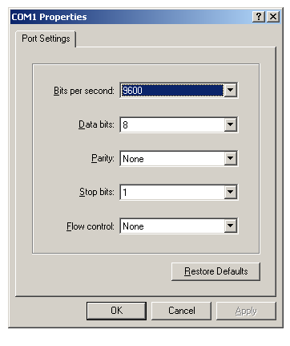

[ Home ](https://github.com/VFPX/Win32API)  

# How to display the port-configuration dialog box for a port on the specified server

## Before you begin:
  
[Another example](sample_334.md) shows how to enumerate ports available for printing. Run it to determine valid port names.
  
***  


## Code:
```foxpro  
DO decl

* Null means local computer
*= ConfigurePort(Null, GetActiveWindow(), "LPT1:")
*= ConfigurePort(Null, GetActiveWindow(), "FILE:")

* as well you can use an existing server name
*= ConfigurePort("\\MYSERV", GetActiveWindow(), "USB001:")

IF ConfigurePort(Null, GetActiveWindow(), "COM1:") = 0
*  5 - ERROR_ACCESS_DENIED
* 50 - ERROR_NOT_SUPPORTED
	? "Error:", GetLastError()
ELSE
* here you have the dialog box displayed (modal)
ENDIF
* end of main

PROCEDURE decl
	DECLARE INTEGER GetLastError IN kernel32
	DECLARE INTEGER GetActiveWindow IN user32

	DECLARE INTEGER ConfigurePort IN winspool.drv;
		STRING pName, INTEGER hWnd, STRING pPortName  
```  
***  


## Listed functions:
[ConfigurePort](../libraries/winspool.drv/ConfigurePort.md)  
[GetActiveWindow](../libraries/user32/GetActiveWindow.md)  
[GetLastError](../libraries/kernel32/GetLastError.md)  
