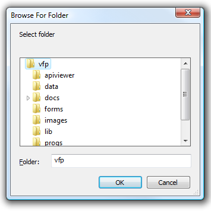

[ Home ](https://github.com/VFPX/Win32API)  

# Displaying system dialog that selects a folder

## Before you begin:
  
Starting with VFP7 the original GETDIR function is changed to be a wrapper around the SHBrowseForFolder function.  


See also:
* [How to position the GETPRINTER() dialog](sample_482.md)
* [Using Extended MessageBox() Class](sample_424.md)  
* [Extended MessageBox Class](sample_418.md)  
* [How to change font name and size in the MessageBox dialog](sample_434.md)  
* [Creating an Open dialog box to specify the drive, directory, and name of a file to open (Shell32 version)](sample_365.md)  
* [Creating the Open dialog box to specify the drive, directory, and name of a file to open](sample_363.md)  
* [Creating the Save dialog box to specify the drive, directory, and name of a file to save](sample_265.md)  
  
***  


## Code:
```foxpro  
#DEFINE MAX_PATH 260
DO decl

*|typedef struct _browseinfo {
*|    HWND hwndOwner;           0:4
*|    LPCITEMIDLIST pidlRoot;   4:4
*|    LPTSTR pszDisplayName;    8:4
*|    LPCTSTR lpszTitle;       12:4
*|    UINT ulFlags;            16:4
*|    BFFCALLBACK lpfn;        20:4
*|    LPARAM lParam;           24:4
*|    int iImage;              28:4
*|} BROWSEINFO, *PBROWSEINFO, *LPBROWSEINFO; 32 bytes
#DEFINE BROWSEINFO_SIZE 32

LOCAL cBuffer, loReturnedName, loDlgTitle, nFlags,;
	nItemId, nRootPIDL

* root folder for the dialog
nRootPIDL = GetPIDL(SYS(5)+SYS(2003))

loReturnedName = CreateObject("PChar", Repl(Chr(0),MAX_PATH))
loDlgTitle = CreateObject("PChar", "Select folder")

#DEFINE BIF_RETURNONLYFSDIRS   1
#DEFINE BIF_DONTGOBELOWDOMAIN  2
#DEFINE BIF_STATUSTEXT         4
#DEFINE BIF_RETURNFSANCESTORS  8
#DEFINE BIF_EDITBOX            16
#DEFINE BIF_VALIDATE           32
#DEFINE BIF_NEWDIALOGSTYLE     64
#DEFINE BIF_NONEWFOLDERBUTTON  0x200
#DEFINE BIF_BROWSEFORCOMPUTER  0x1000
#DEFINE BIF_BROWSEFORPRINTER   0x2000
#DEFINE BIF_BROWSEINCLUDEFILES 0x4000
#DEFINE BIF_SHAREABLE          0x8000

nFlags = BIF_NEWDIALOGSTYLE + BIF_EDITBOX +;
	BIF_NONEWFOLDERBUTTON

cBuffer = num2dword(GetActiveWindow()) +;
	num2dword(m.nRootPIDL) +;
	num2dword(loReturnedName.GetAddr()) +;
	num2dword(loDlgTitle.GetAddr()) +;
	num2dword(nFlags)
cBuffer = PADR(cBuffer, BROWSEINFO_SIZE, CHR(0))

nItemId = SHBrowseForFolder(@cBuffer)
IF nItemId <> 0
	LOCAL lcFolder, lcFullPath

	lcFolder = loReturnedName.GetValue()
	lcFolder = SUBSTR(lcFolder, 1, AT(Chr(0),lcFolder)-1)

	lcFullPath = Space(512)
	= SHGetPathFromIDList(nItemId, @lcFullPath)

	lcFullPath = SUBSTR(lcFullPath, 1, AT(Chr(0),lcFullPath)-1)
	? "Folder:", lcFolder
	? "Full path:", lcFullPath
	
	* The calling application is responsible for freeing the returned PIDL
	= GlobalFree(nItemId)
ENDIF

* PIDL of the root folder has to be released as well
= GlobalFree(nRootPIDL)
* end of main

FUNCTION GetPIDL(cPath)
* returns PIDL for a given path
	LOCAL cBuffer, nResult
	cPath = STRCONV(m.cPath+CHR(0), 5)
	cBuffer = REPLICATE(CHR(0), 4)
	nResult = SHParseDisplayName(m.cPath, 0, @cBuffer, 0,0)
RETURN IIF(nResult=0, buf2dword(m.cBuffer), 0)

PROCEDURE decl
	DECLARE INTEGER GlobalSize IN kernel32 INTEGER hMem
	DECLARE INTEGER GlobalFree IN kernel32 INTEGER hMem
	DECLARE INTEGER GetActiveWindow IN user32
	DECLARE INTEGER SHBrowseForFolder IN shell32 STRING @lpbi

	DECLARE INTEGER SHGetPathFromIDList IN shell32;
		INTEGER pidl, STRING @pszPath

	DECLARE INTEGER SHParseDisplayName IN shell32;
		STRING pszName, INTEGER pbc, STRING @ppidl,;
		INTEGER sfgaoIn, INTEGER psfgaoOut

* * *
DEFINE CLASS PChar As Custom
	hMem=0

PROCEDURE  Init (lcString)
	THIS.SetValue (lcString)

PROCEDURE Destroy
	THIS.ReleaseString

FUNCTION GetAddr  && returns a pointer to the string
RETURN THIS.hMem

FUNCTION GetValue && returns string value
	LOCAL lnSize, cBuffer
	lnSize = THIS.GetAllocSize()
	cBuffer = SPACE(lnSize)
	IF THIS.hMem <> 0
		DECLARE RtlMoveMemory IN kernel32 As Heap2Str;
			STRING @, INTEGER, INTEGER
		= Heap2Str (@cBuffer, THIS.hMem, lnSize)
	ENDIF
RETURN cBuffer

FUNCTION GetAllocSize  && returns allocated memory size (string length)
	DECLARE INTEGER GlobalSize IN kernel32 INTEGER hMem
RETURN Iif(THIS.hMem=0, 0, GlobalSize(THIS.hMem))

PROCEDURE SetValue(lcString) && assigns new string value
#DEFINE GMEM_FIXED   0
	THIS.ReleaseString

	DECLARE INTEGER GlobalAlloc IN kernel32 INTEGER, INTEGER
	DECLARE RtlMoveMemory IN kernel32 As Str2Heap;
		INTEGER, STRING @, INTEGER

	LOCAL lnSize
	lcString = lcString + Chr(0)
	lnSize = Len(lcString)
	THIS.hMem = GlobalAlloc (GMEM_FIXED, lnSize)
	IF THIS.hMem <> 0
		= Str2Heap (THIS.hMem, @lcString, lnSize)
	ENDIF

PROCEDURE ReleaseString  && releases allocated memory
	IF THIS.hMem <> 0
		DECLARE INTEGER GlobalFree IN kernel32 INTEGER
		= GlobalFree (THIS.hMem)
		THIS.hMem = 0
	ENDIF
ENDDEFINE

FUNCTION num2dword(lnValue)
#DEFINE m0       256
#DEFINE m1     65536
#DEFINE m2  16777216
	LOCAL b0, b1, b2, b3
	b3 = Int(lnValue/m2)
	b2 = Int((lnValue - b3*m2)/m1)
	b1 = Int((lnValue - b3*m2 - b2*m1)/m0)
	b0 = Mod(lnValue, m0)
RETURN Chr(b0)+Chr(b1)+Chr(b2)+Chr(b3)

FUNCTION buf2dword(lcBuffer)
RETURN Asc(SUBSTR(lcBuffer, 1,1)) + ;
	BitLShift(Asc(SUBSTR(lcBuffer, 2,1)),  8) +;
	BitLShift(Asc(SUBSTR(lcBuffer, 3,1)), 16) +;
	BitLShift(Asc(SUBSTR(lcBuffer, 4,1)), 24)  
```  
***  


## Listed functions:
[GetActiveWindow](../libraries/user32/GetActiveWindow.md)  
[GlobalAlloc](../libraries/kernel32/GlobalAlloc.md)  
[GlobalFree](../libraries/kernel32/GlobalFree.md)  
[GlobalSize](../libraries/kernel32/GlobalSize.md)  
[SHBrowseForFolder](../libraries/shell32/SHBrowseForFolder.md)  
[SHGetPathFromIDList](../libraries/shell32/SHGetPathFromIDList.md)  
[SHParseDisplayName](../libraries/shell32/SHParseDisplayName.md)  

## Comment:
I use the GlobalFree function to release the allocated memory.  
  
In Andrew Coates code this is `= CoTaskMemFree(lpIDList)` which is probably a better way.  
  
The SHParseDisplayName translates the initial path to the pointer to an item identifier list (PIDL).  
  
* * *  
Windows Shell script:  

```foxpro
oShell = CREATEOBJECT("Shell.Application")  
  
oFolder = oShell.Application.BrowseForFolder(_screen.HWnd,;  
	"Select Folder", 1, "c:\Program Files")  
  
IF NOT ISNULL(oFolder)  
	? oFolder.self.Path  
ENDIF
```

***  

