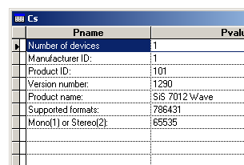

[ Home ](https://github.com/VFPX/Win32API)  

# Quering a waveform-audio input device

## Before you begin:
This code retrieves the capabilities of an available waveform-audio input device in WAVEINCAPS structure.  
  
  
***  


## Code:
```foxpro  
#DEFINE WAVE_FORMAT_1M08  0x00000001
#DEFINE WAVE_FORMAT_1M16  0x00000004
#DEFINE WAVE_FORMAT_1S08  0x00000002
#DEFINE WAVE_FORMAT_1S16  0x00000008
#DEFINE WAVE_FORMAT_2M08  0x00000010
#DEFINE WAVE_FORMAT_2M16  0x00000040
#DEFINE WAVE_FORMAT_2S08  0x00000020
#DEFINE WAVE_FORMAT_2S16  0x00000080
#DEFINE WAVE_FORMAT_4M08  0x00000100
#DEFINE WAVE_FORMAT_4M16  0x00000400
#DEFINE WAVE_FORMAT_4S08  0x00000200
#DEFINE WAVE_FORMAT_4S16  0x00000800

DO decl

PRIVATE lnDevCount
lnDevCount = waveInGetNumDevs()

IF lnDevCount <> 0
	DO QueringDevice
*	DO OpenAndClose
ENDIF
* end of main

PROCEDURE OpenAndClose
*|typedef struct {
*|    WORD  wFormatTag;       0:2
*|    WORD  nChannels;        2:2
*|    DWORD nSamplesPerSec;   4:4
*|    DWORD nAvgBytesPerSec;  8:4
*|    WORD  nBlockAlign;     12:2
*|    WORD  wBitsPerSample;  14:2
*|    WORD  cbSize;          16:2
*|} WAVEFORMATEX; total 18 bytes

#DEFINE WAVEFORMATEX_SIZE    18
#DEFINE WAVE_FORMAT_QUERY    1
#DEFINE MMSYSERR_NOERROR     0
#DEFINE MMSYSERR_INVALHANDLE 5
#DEFINE WAVE_FORMAT_PCM      1
	LOCAL lnDeviceID, hDevice, lcBuf, lnResult, lnDevice
	STORE 0 TO lnDeviceID, hDevice
	
	* format of waveform-audio data
	LOCAL nChannels, nSamplesPerSec, wBitsPerSample,;
		nAvgBytesPerSec, nBlockAlign

	nChannels = 1
	nSamplesPerSec = 8000
	wBitsPerSample = 8
	nBlockAlign = nChannels * wBitsPerSample/8
	nAvgBytesPerSec = nSamplesPerSec * nBlockAlign
	
	* assembling data into WAVEFORMATEX structure
	lcBuf = num2word(WAVE_FORMAT_PCM) +;
		num2word(nChannels) + num2dword(nSamplesPerSec) +;
		num2dword(nAvgBytesPerSec) + num2word(nBlockAlign) +;
		num2word(wBitsPerSample) + num2word(0)

	lnResult = waveInOpen(@hDevice, lnDeviceID, @lcBuf, 0,0,0)
	IF lnResult <> MMSYSERR_NOERROR
		? "Error opening device: ", lnResult
		? GetWaveError(lnResult)
		RETURN
	ENDIF
	
	= MessageB("Device handle: " +;
		LTRIM(STR(hDevice)) + Chr(13)+Chr(13) +;
		"Use this handle to identify the device    " + Chr(13) +;
		"when calling other waveform-audio input functions.   ",;
		64, " Waveform-audio input device")

	= waveInReset(hDevice)
	= waveInClose(hDevice)

PROCEDURE QueringDevice
*|typedef struct {
*|    WORD      wMid;                  0:2
*|    WORD      wPid;                  2:2
*|    MMVERSION vDriverVersion;        4:4
*|    TCHAR     szPname[MAXPNAMELEN];  8:32
*|    DWORD     dwFormats;            40:4
*|    WORD      wChannels;            44:2
*|    WORD      wReserved1;           46:2
*|} WAVEINCAPS;

#DEFINE MMSYSERR_NOERROR  0
#DEFINE MAXPNAMELEN       32

	* quering first available device
	LOCAL lcBuf, lnResult, lcName, lnCount
	lcBuf = Repli(Chr(0), 128)
	lnResult = waveInGetDevCaps(0, @lcBuf, Len(lcBuf))

	IF lnResult <> MMSYSERR_NOERROR
		? "Error:", lnResult  && MMSYSERR_ value
		RETURN
	ENDIF

	CREATE CURSOR cs (pname C(30), pvalue C(50))

	= AddParam("Number of devices", LTRIM(STR(lnDevCount)))
	= AddParam("Manufacturer ID:", LTRIM(STR(buf2word(SUBSTR(lcBuf, 1,2)))))
	= AddParam("Product ID:", LTRIM(STR(buf2word(SUBSTR(lcBuf, 3,2)))))
	= AddParam("Version number:", LTRIM(STR(buf2dword(SUBSTR(lcBuf, 5,4)))))

	lcName = SUBSTR(lcBuf, 9, MAXPNAMELEN)
	lcName = SUBSTR(lcName, 1, AT(Chr(0),lcName)-1)
	= AddParam("Product name:", lcName)

	= AddParam("Mono(1) or Stereo(2):", LTRIM(STR(buf2word(SUBSTR(lcBuf, 45,2)))))

	* a combination of WAVE_FORMAT_ constants
	nFormats = buf2dword(SUBSTR(lcBuf, 41,4))
	= AddParam("Supported formats:", LTRIM(STR(nFormats)))

	= TestFmt(nFormats, "WAVE_FORMAT_1M08", WAVE_FORMAT_1M08)
	= TestFmt(nFormats, "WAVE_FORMAT_1M16", WAVE_FORMAT_1M16)
	= TestFmt(nFormats, "WAVE_FORMAT_1S08", WAVE_FORMAT_1S08)
	= TestFmt(nFormats, "WAVE_FORMAT_1S16", WAVE_FORMAT_1S16)
	= TestFmt(nFormats, "WAVE_FORMAT_2M08", WAVE_FORMAT_2M08)
	= TestFmt(nFormats, "WAVE_FORMAT_2M16", WAVE_FORMAT_2M16)
	= TestFmt(nFormats, "WAVE_FORMAT_2S08", WAVE_FORMAT_2S08)
	= TestFmt(nFormats, "WAVE_FORMAT_2S16", WAVE_FORMAT_2S16)
	= TestFmt(nFormats, "WAVE_FORMAT_4M08", WAVE_FORMAT_4M08)
	= TestFmt(nFormats, "WAVE_FORMAT_4M16", WAVE_FORMAT_4M16)
	= TestFmt(nFormats, "WAVE_FORMAT_4S08", WAVE_FORMAT_4S08)
	= TestFmt(nFormats, "WAVE_FORMAT_4S16", WAVE_FORMAT_4S16)

	GO TOP
	BROW NORMAL NOWAIT
RETURN

FUNCTION GetWaveError(lnError)
	LOCAL lcBuf
	lcBuf = Repli(Chr(0), 250)
	= waveInGetErrorText(lnError, @lcBuf, Len(lcBuf))
RETURN STRTRAN(lcBuf, Chr(0),"")

PROCEDURE AddParam(cName, cValue)
	INSERT INTO cs VALUES (cName, cValue)

FUNCTION TestFmt(nFormats, cFmtName, nFormat)
	= AddParam(cFmtName, Iif(BitAnd(nFormats, nFormat)=nFormat, "1",""))

PROCEDURE decl
	DECLARE INTEGER waveInGetNumDevs IN winmm
	DECLARE INTEGER waveInGetDevCaps IN winmm;
		INTEGER uDeviceID, STRING @pwic, LONG cbwic

	DECLARE INTEGER waveInOpen IN winmm;
		INTEGER @phwi, INTEGER uDeviceID, STRING @pwfx,;
		INTEGER dwCallback, INTEGER dwCallbackInstance,;
		LONG fdwOpen

	DECLARE INTEGER waveInGetErrorText IN winmm;
		INTEGER mmrError, STRING @pszText, LONG cchText

	DECLARE INTEGER waveInReset IN winmm INTEGER hwi
	DECLARE INTEGER waveInClose IN winmm INTEGER hwi

FUNCTION  buf2dword (lcBuffer)
RETURN Asc(SUBSTR(lcBuffer, 1,1)) + ;
	BitLShift(Asc(SUBSTR(lcBuffer, 2,1)),  8) +;
	BitLShift(Asc(SUBSTR(lcBuffer, 3,1)), 16) +;
	BitLShift(Asc(SUBSTR(lcBuffer, 4,1)), 24)

FUNCTION buf2word (lcBuffer)
RETURN Asc(SUBSTR(lcBuffer, 1,1)) + ;
       Asc(SUBSTR(lcBuffer, 2,1)) * 256

FUNCTION  num2dword (lnValue)
#DEFINE m0       256
#DEFINE m1     65536
#DEFINE m2  16777216
	LOCAL b0, b1, b2, b3
	b3 = Int(lnValue/m2)
	b2 = Int((lnValue - b3*m2)/m1)
	b1 = Int((lnValue - b3*m2 - b2*m1)/m0)
	b0 = Mod(lnValue, m0)
RETURN Chr(b0)+Chr(b1)+Chr(b2)+Chr(b3)

FUNCTION num2word (lnValue)
RETURN Chr(MOD(m.lnValue,256)) + CHR(INT(m.lnValue/256))  
```  
***  


## Listed functions:
[waveInClose](../libraries/winmm/waveInClose.md)  
[waveInGetDevCaps](../libraries/winmm/waveInGetDevCaps.md)  
[waveInGetErrorText](../libraries/winmm/waveInGetErrorText.md)  
[waveInGetNumDevs](../libraries/winmm/waveInGetNumDevs.md)  
[waveInOpen](../libraries/winmm/waveInOpen.md)  
[waveInReset](../libraries/winmm/waveInReset.md)  
