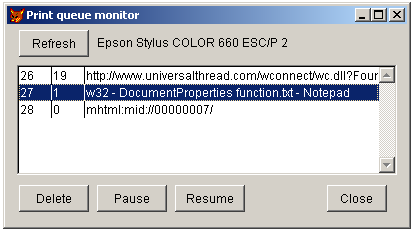

[ Home ](https://github.com/VFPX/Win32API)  

# Simple printer queue monitor: deletes, pauses, resumes print jobs for local printer

## Before you begin:
  
Job ID, status, and document name are on the list, retrieved with the EnumJobs function (JOB_INFO_1 structure is used).  

* * *  
See also:

* [Using Change Notification Objects to monitor changes to the printer or print server](sample_485.md)  

* [How to delete all print jobs for a printer](sample_370.md)  
* [Retrieving default spooling directory name](sample_358.md)  
* [How to retrieve the number of print jobs queued for the printer](sample_367.md)  

  
***  


## Code:
```foxpro  
PUBLIC objForm
objForm = CreateObject("Tform")
objForm.Visible = .T.

DEFINE CLASS Tform As Form
	Width=400
	Height=200
	Autocenter=.T.
	Caption="Print queue monitor"
	printername=""
	hPrinter=0
	
	ADD OBJECT cmdRefresh As CommandButton WITH;
		Left=12, Top=5, Height=27, Width=70, Caption="Refresh"

	ADD OBJECT lblPrinter As Label WITH;
		Left=90, Top=10, Autosize=.T.

	ADD OBJECT lst As ListBox WITH;
		Left=10, Top=40, Width=380, Height=110,;
		BoundTo=.T., BoundColumn=1, ColumnCount=3,;
		ColumnWidths="30,30,520"

	ADD OBJECT cmdDelete As CommandButton WITH;
		Left=12, Top=160, Height=27, Width=70, Caption="Delete"

	ADD OBJECT cmdPause As CommandButton WITH;
		Left=90, Top=160, Height=27, Width=70, Caption="Pause"

	ADD OBJECT cmdResume As CommandButton WITH;
		Left=168, Top=160, Height=27, Width=70, Caption="Resume"

	ADD OBJECT cmdClose As CommandButton WITH;
		Left=320, Top=160, Height=27, Width=60,;
		Caption="Close", Cancel=.T.

PROCEDURE Init
	THIS.GetJobs

PROCEDURE cmdClose.Click
	ThisForm.Release

PROCEDURE cmdRefresh.Click
	ThisForm.GetJobs

PROCEDURE cmdDelete.Click
	ThisForm.SetJob(1)

PROCEDURE cmdPause.Click
	ThisForm.SetJob(2)

PROCEDURE cmdResume.Click
	ThisForm.SetJob(3)

PROCEDURE SetJob(cmdmode)
#DEFINE JOB_CONTROL_PAUSE   1
#DEFINE JOB_CONTROL_RESUME  2
#DEFINE JOB_CONTROL_CANCEL  3  && Win98/Me
#DEFINE JOB_CONTROL_DELETE  5  && WinNT/XP
	IF Not THIS.OpenPrinter()
		RETURN
	ENDIF

	LOCAL cVersion, cmd, JobId, nResult
	cVersion = GetWinVersion()
	JobId = VAL(THIS.lst.Value)
	
	DO CASE
	CASE cmdmode = 1  && delete
		cmd = Iif(cVersion $ "4050",;
			JOB_CONTROL_DELETE, JOB_CONTROL_CANCEL)
	CASE cmdmode = 2  && pause
		cmd = JOB_CONTROL_PAUSE
	CASE cmdmode = 3  && resume
		cmd = JOB_CONTROL_RESUME
	ENDCASE
	
	DECLARE INTEGER SetJob IN winspool.drv;
		INTEGER hPrinter, INTEGER JobId, INTEGER lvl,;
		INTEGER pJob, INTEGER cmd

	nResult = SetJob(THIS.hPrinter, JobId, 0, 0, cmd)
	THIS.ClosePrinter
	
	IF nResult = 0
		DECLARE INTEGER GetLastError IN kernel32
		= MessageB("Error setting a printer job.   " + Chr(13) +;
			"Error code:" + LTRIM(STR(GetLastError())) + "     ",;
			48, "Error")
	ELSE
		THIS.GetJobs
	ENDIF

PROCEDURE GetJobs
#DEFINE JOB_INFO_SIZE  64
	STORE GetPrnName() TO THIS.printername,;
		THIS.lblPrinter.Caption

	LOCAL OldValue
	OldValue = ThisForm.lst.Value
	ThisForm.lst.Clear
	STORE .F. TO ThisForm.cmdDelete.Enabled,;
		ThisForm.cmdPause.Enabled, ThisForm.cmdResume.Enabled

	IF Not THIS.OpenPrinter()
		RETURN
	ENDIF
	
	DECLARE INTEGER GlobalAlloc IN kernel32 INTEGER wFlags, INTEGER dwBytes
	DECLARE INTEGER GlobalFree IN kernel32 INTEGER hMem

	DECLARE INTEGER EnumJobs IN winspool.drv;
		INTEGER hPrinter, INTEGER FirstJob, INTEGER NoJobs,;
		INTEGER Lvl, INTEGER pJob, INTEGER cbBuf,;
		INTEGER @pcbNeeded, INTEGER @pcReturned

	DECLARE RtlMoveMemory IN kernel32 As Mem2Str;
		STRING @Dest, INTEGER Src, INTEGER nLength

	LOCAL hBuffer, cBuffer, nBufsize, nCount, nMinsize,;
		lnResult, nIndex, cInfo
	nBufsize = 65535
	hBuffer = GlobalAlloc(0, nBufsize)
	STORE 0 TO nCount, nMinsize

	* enumerating up to 100 jobs
	lnResult = EnumJobs(THIS.hPrinter, 0, 100, 1,;
		hBuffer, nBufsize, @nMinsize, @nCount)

	THIS.ClosePrinter
	
	IF lnResult = 0
		DECLARE INTEGER GetLastError IN kernel32
		= MessageB("Error calling EnumJobs function.   " + Chr(13) +;
			"Error code:" + LTRIM(STR(GetLastError())) + "     ",;
			48, "Error")
		= GlobalFree(hBuffer)
		RETURN
	ENDIF
	IF nCount = 0  && no jobs for this printer
		= GlobalFree(hBuffer)
		RETURN
	ENDIF

	cBuffer = Repli(Chr(0), nBufsize)
	= Mem2Str(@cBuffer, hBuffer, nBufsize)
	
	LOCAL JobId, JStat, lnOffs, DocName
	FOR nIndex=0 TO nCount-1
		cInfo = SUBSTR(cBuffer, nIndex*JOB_INFO_SIZE+1, JOB_INFO_SIZE)
		JobId = buf2dword(SUBSTR(cInfo, 1,4))
		JStat = buf2dword(SUBSTR(cInfo, 29,4))
		lnOffs = buf2dword(SUBSTR(cInfo, 17,4)) - hBuffer + 1
		DocName = GetMemStr(cBuffer, lnOffs)
		WITH THIS.lst
			.AddItem(PADR(LTRIM(STR(JobId)), 5))
			.List(.ListCount, 2) = PADR(LTRIM(STR(JStat)), 5)
			.List(.ListCount, 3) = DocName
		ENDWITH
	ENDFOR
	= GlobalFree(hBuffer)

	WITH THIS.lst
		.Value = OldValue
		.ListIndex = MAX(.ListIndex, 1)
		.InteractiveChange
	ENDWITH
ENDPROC  && getjobs

PROCEDURE lst.InteractiveChange
#DEFINE JOB_STATUS_PAUSED             1
#DEFINE JOB_STATUS_DELETING           4
#DEFINE JOB_STATUS_DELETED            256
	LOCAL JStat
	JStat = VAL(THIS.List(THIS.ListIndex, 2))

	ThisForm.cmdDelete.Enabled = Not (;
		BitAnd(JStat, JOB_STATUS_DELETING) = JOB_STATUS_DELETING Or;
		BitAnd(JStat, JOB_STATUS_DELETED) = JOB_STATUS_DELETED)

	ThisForm.cmdPause.Enabled = ThisForm.cmdDelete.Enabled

	ThisForm.cmdResume.Enabled =;
		BitAnd(JStat, JOB_STATUS_PAUSED) = JOB_STATUS_PAUSED

FUNCTION OpenPrinter
	THIS.ClosePrinter

	DECLARE INTEGER OpenPrinter IN winspool.drv;
		STRING pPrinterName, INTEGER @phPrinter, INTEGER pDefault

	LOCAL hPrinter
	hPrinter = 0
	= OpenPrinter(THIS.printername, @hPrinter, 0)

	THIS.hPrinter = hPrinter
	IF THIS.hPrinter = 0
		= MessageB("Unable to open printer [" +;
		THIS.printername + "].   ", 48, "Error")
	ENDIF
RETURN (THIS.hPrinter <> 0)

PROCEDURE ClosePrinter
	IF THIS.hPrinter <> 0
		DECLARE INTEGER ClosePrinter IN winspool.drv;
			INTEGER hPrinter
		= ClosePrinter(THIS.hPrinter)
		THIS.hPrinter = 0
	ENDIF
ENDDEFINE

FUNCTION GetPrnName
* returns default printer name from registry
	DECLARE INTEGER GetProfileString IN kernel32;
		STRING lpApp, STRING lpKey, STRING lpDefault,;
		STRING @lpReturnedString, INTEGER nSize
	LOCAL lcBuffer, lnPos
	lcBuffer = Repli(Chr(0), 120)
	= GetProfileString("Windows", "Device", ",,,",;
		@lcBuffer, Len(lcBuffer))
	lcBuffer = STRTRAN(lcBuffer, Chr(0), "")
	lnPos = AT(",", lcBuffer, 1)
RETURN SUBSTR(lcBuffer, 1, lnPos-1)

FUNCTION GetMemStr(cBuffer, lnOffs)
	IF lnOffs <= 0
		RETURN ""
	ENDIF
	LOCAL lcResult, ch
	lcResult = ""
	DO WHILE lnOffs < Len(cBuffer)
		ch = SUBSTR(cBuffer, lnOffs,1)
		IF ch = Chr(0)
			EXIT
		ENDIF
		lcResult = lcResult + ch
		lnOffs = lnOffs + 1
	ENDDO
RETURN lcResult

FUNCTION  buf2dword (lcBuffer)
RETURN Asc(SUBSTR(lcBuffer, 1,1)) + ;
	BitLShift(Asc(SUBSTR(lcBuffer, 2,1)),  8) +;
	BitLShift(Asc(SUBSTR(lcBuffer, 3,1)), 16) +;
	BitLShift(Asc(SUBSTR(lcBuffer, 4,1)), 24)

FUNCTION GetWinVersion
	DECLARE INTEGER GetVersion IN kernel32
	LOCAL lnVer, nLo, nHi
	lnVer = GetVersion()
	nLo = BitAnd(lnVer, 255)  && 3,4,5
	nHi = BitRShift(BitAnd(lnVer, 65280), 16) && 0,1
RETURN STR(nLo,1)+STR(nHi,1)  
```  
***  


## Listed functions:
[ClosePrinter](../libraries/winspool.drv/ClosePrinter.md)  
[EnumJobs](../libraries/winspool.drv/EnumJobs.md)  
[GetLastError](../libraries/kernel32/GetLastError.md)  
[GetProfileString](../libraries/kernel32/GetProfileString.md)  
[GetVersion](../libraries/kernel32/GetVersion.md)  
[GlobalAlloc](../libraries/kernel32/GlobalAlloc.md)  
[GlobalFree](../libraries/kernel32/GlobalFree.md)  
[OpenPrinter](../libraries/winspool.drv/OpenPrinter.md)  
[SetJob](../libraries/winspool.drv/SetJob.md)  
