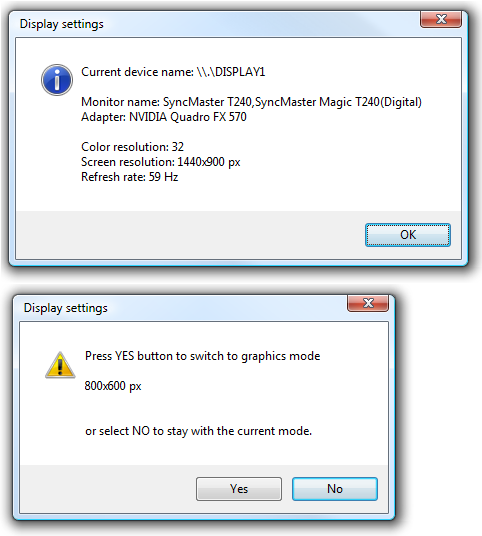
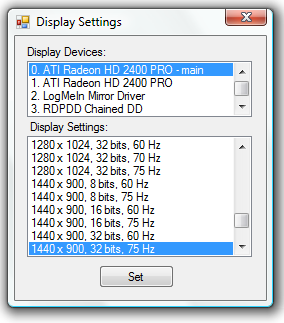

[ Home ](https://github.com/VFPX/Win32API)  

# How to change display settings: screen resolution, screen refresh rate

## Short description:
Even if it is not always bright idea to change display resolution from your application, still it is comfortable to know that there is a way to do it.  
***  


## Before you begin:
This code sample shows how to switch the monitor resolution to 800x600 pixels and back, keeping the existing refresh rate.   

Before changing the resolution the code verifies if the hardware supports the requested graphics mode.   

  

See also:

* [How to adjust monitor brightness (Vista, monitor with DDC support)](sample_543.md)  
* [How to detect if additional monitor is connected and active](sample_542.md)  
  
***  


## Code:
```foxpro  
DO declare

PRIVATE cDevice, cMonitor, cAdapter, nBPP,;
	nScrWidth, nScrHeight, nScrRRate

STORE 0 TO nBPP, nScrWidth, nScrHeight, nScrRRate

cMonitor = GetMonitorName()
cAdapter = GetAdapterName()
cDevice = GetDeviceName()
*cDevice = GetDeviceName1()

IF EMPTY(cDevice)
	= MESSAGEBOX("Failed to retrieve the name " +;
		"of the primary device.   ",;
		48, " Display settings")
	RETURN
ENDIF

IF Not GetDisplaySettings()
	= MESSAGEBOX("Failed to retrieve " +;
		"the default display settings.   ",;
		48, " Display settings")
	RETURN
ENDIF

* changing the screen resolution to 800 x 600,
* while keeping the refresh rate
IF SetDisplay(800, 600, nScrRRate)
	DO GetDisplaySettings
	DO SetDisplayDefault
ENDIF
* end of main

PROCEDURE SetDisplayDefault
	= ChangeDisplaySettings(NULL, 0)

FUNCTION SetDisplay(nWidth, nHeight, nRate)
#DEFINE DM_PELSWIDTH 0x80000
#DEFINE DM_PELSHEIGHT 0x100000
#DEFINE DM_DISPLAYFREQUENCY 0x400000
#DEFINE CDS_TEST 2

	IF MESSAGEBOX("Press YES button to switch " +;
		"to the following graphics mode" +;
		SPACE(10) + Chr(13)+Chr(13) +;
		LTRIM(STR(nWidth)) + " x " + LTRIM(STR(nHeight)) + " px" +;
		Chr(13)+Chr(13)+Chr(13) +;
		"or press NO to keep the current mode.",;
		4+48+256, " Display settings") <> 6
		RETURN .F.
	ENDIF

	LOCAL nFields, cBuffer
	nFields = DM_PELSWIDTH + DM_PELSHEIGHT +;
		DM_DISPLAYFREQUENCY

	* retrieving valid DEVMODE structure
	* from current display settings
	cBuffer = Repli(Chr(0), 1024)
	= EnumDisplaySettings(cDevice, -1, @cBuffer)
	
	* modifying structure members
	cBuffer = STUFF(cBuffer, 109, 4, num2dword(nWidth))
	cBuffer = STUFF(cBuffer, 113, 4, num2dword(nHeight))
	cBuffer = STUFF(cBuffer, 121, 4, num2dword(nRate))

	* specifying which members to be modified
	nFields = DM_PELSWIDTH + DM_PELSHEIGHT +;
		DM_DISPLAYFREQUENCY
	cBuffer = STUFF(cBuffer, 41, 4, num2dword(nFields))
	
	IF ChangeDisplaySettings(@cBuffer, CDS_TEST) = 0
		RETURN (ChangeDisplaySettings(@cBuffer, 0)=0)
	ELSE
		= MESSAGEBOX("This graphics mode cannot be set " +;
			"for your display.", 64, " Display settings")
		RETURN .F.
	ENDIF

FUNCTION GetDisplaySettings
	LOCAL nIndex, cBuffer
	nIndex = -1  && current settings

	* DEVMODE structure populated
*	cBuffer = Repli(Chr(0), 36) +;
*		num2word(156) + num2word(1024-156) +;
*		Repli(Chr(0), 1024-40)

	* a simpler way is used
	cBuffer = Repli(Chr(0), 1024)

	IF EnumDisplaySettings(cDevice, nIndex, @cBuffer) <> 0
		nBPP = buf2dword(SUBSTR(cBuffer, 105,4))
		nScrWidth = buf2dword(SUBSTR(cBuffer, 109,4))
		nScrHeight = buf2dword(SUBSTR(cBuffer, 113,4))
		nScrRRate = buf2dword(SUBSTR(cBuffer, 121,4))

		= MESSAGEBOX("Current device: " +;
			cDevice + SPACE(20) + Chr(13)+Chr(13) +;
			"Monitor name: " + cMonitor + Chr(13) +;
			"Adapter: " + cAdapter + Chr(13)+Chr(13) +;
			"Color resolution: " + LTRIM(STR(nBPP)) + Chr(13) +;
			"Screen resolution: " + LTRIM(STR(nScrWidth)) +;
			" x " + LTRIM(STR(nScrHeight)) + " px    " + Chr(13) +;
			"Refresh rate: " + LTRIM(STR(nScrRRate)) + " Hz ",;
			64, " Display settings")
		RETURN .T.
	ELSE
		= MESSAGEBOX("Unable to retrieve the device settings " +;
			"for the primary device.   ",;
			48, " Display settings")
		RETURN .F.
	ENDIF

FUNCTION GetDeviceName
#DEFINE DISPLAY_DEVICE_PRIMARY_DEVICE 4
#DEFINE DISPLAY_DEVICE_SIZE  424
	LOCAL cBuffer, nIndex, nFlags, cResult
	cBuffer = num2dword(DISPLAY_DEVICE_SIZE) +;
		Repli(Chr(0), DISPLAY_DEVICE_SIZE-4)

	nIndex = 0
	DO WHILE .T.
		IF EnumDisplayDevices(NULL, nIndex, @cBuffer, 0)=0
			RETURN ""
		ENDIF
		nFlags = buf2word(SUBSTR(cBuffer, 165,2))
		IF BitAnd(nFlags, 4) = 4  && primary device
			cResult= SUBSTR(cBuffer, 5,32)
			RETURN SUBSTR(cResult, 1,AT(Chr(0),cResult)-1)
		ENDIF
		nIndex = nIndex + 1
	ENDDO

FUNCTION GetDeviceName1
#DEFINE MONITOR_DEFAULTTONEAREST 2
#DEFINE MONITORINFOEX_SIZE 72
	LOCAL hMonitor, cBuffer
	hMonitor = MonitorFromWindow(GetDesktopWindow(),;
		MONITOR_DEFAULTTONEAREST)
	cBuffer = PADR(CHR(MONITORINFOEX_SIZE),;
		MONITORINFOEX_SIZE, CHR(0))
	IF hMonitor <> 0 AND GetMonitorInfo(hMonitor, @cBuffer) <> 0
		RETURN STRTRAN(SUBSTR(cBuffer,41), CHR(0),"")
	ELSE
	* 1461=ERROR_INVALID_MONITOR_HANDLE
		RETURN ""
	ENDIF

FUNCTION GetMonitorName
	LOCAL cBuffer, cName, cResult
	cBuffer = num2dword(DISPLAY_DEVICE_SIZE) +;
		Repli(Chr(0), DISPLAY_DEVICE_SIZE-4)

	= EnumDisplayDevices(NULL, 0, @cBuffer, 0)
	cName = SUBSTR(cBuffer, 5,32) + Chr(0)
	cName = SUBSTR(cName, 1, AT(Chr(0),cName)-1)

	= EnumDisplayDevices(cName, 0, @cBuffer, 0)
	cResult = SUBSTR(cBuffer, 37,128) + Chr(0)
RETURN SUBSTR(cResult, 1, AT(Chr(0),cResult)-1)

FUNCTION GetAdapterName
	LOCAL cBuffer, cResult
	cBuffer = num2dword(DISPLAY_DEVICE_SIZE) +;
		Repli(Chr(0), DISPLAY_DEVICE_SIZE-4)

	= EnumDisplayDevices(NULL, 0, @cBuffer, 0)
	cResult = SUBSTR(cBuffer, 37,128) + Chr(0)
RETURN SUBSTR(cResult, 1, AT(Chr(0),cResult)-1)

PROCEDURE declare
	DECLARE INTEGER GetDesktopWindow IN user32

	DECLARE INTEGER GetMonitorInfo IN user32;
		INTEGER hMonitor, STRING @lpmi

	DECLARE INTEGER MonitorFromWindow IN user32;
		INTEGER hWindow, INTEGER dwFlags

	DECLARE INTEGER ChangeDisplaySettings IN user32;
		STRING @lpDevMode, INTEGER dwflags

	DECLARE INTEGER EnumDisplaySettings IN user32;
		STRING lpszDeviceName, INTEGER iModeNum, STRING @lpDevMode

	DECLARE INTEGER EnumDisplayDevices IN user32;
		STRING lpDevice, INTEGER iDevNum,;
		STRING @lpDisplayDevice, INTEGER dwFlags

FUNCTION num2dword(lnValue)
#DEFINE m0 0x0000100
#DEFINE m1 0x0010000
#DEFINE m2 0x1000000
	IF lnValue < 0
		lnValue = 0x100000000 + lnValue
	ENDIF
	LOCAL b0, b1, b2, b3
	b3 = Int(lnValue/m2)
	b2 = Int((lnValue - b3*m2)/m1)
	b1 = Int((lnValue - b3*m2 - b2*m1)/m0)
	b0 = Mod(lnValue, m0)
RETURN Chr(b0)+Chr(b1)+Chr(b2)+Chr(b3)

FUNCTION buf2dword(lcBuffer)
RETURN Asc(SUBSTR(lcBuffer, 1,1)) + ;
	BitLShift(Asc(SUBSTR(lcBuffer, 2,1)),  8) +;
	BitLShift(Asc(SUBSTR(lcBuffer, 3,1)), 16) +;
	BitLShift(Asc(SUBSTR(lcBuffer, 4,1)), 24)

FUNCTION buf2word(lcBuffer)
RETURN Asc(SUBSTR(lcBuffer, 1,1)) + ;
       Asc(SUBSTR(lcBuffer, 2,1)) * 256

FUNCTION num2word(lnValue)
RETURN Chr(MOD(m.lnValue,256)) + CHR(INT(m.lnValue/256))  
```  
***  


## Listed functions:
[ChangeDisplaySettings](../libraries/user32/ChangeDisplaySettings.md)  
[EnumDisplayDevices](../libraries/user32/EnumDisplayDevices.md)  
[EnumDisplaySettings](../libraries/user32/EnumDisplaySettings.md)  
[GetDesktopWindow](../libraries/user32/GetDesktopWindow.md)  
[GetMonitorInfo](../libraries/user32/GetMonitorInfo.md)  
[MonitorFromWindow](../libraries/user32/MonitorFromWindow.md)  

## Comment:
A screenshot of C# version of this code sample.  


* * *  
Five ways of obtaining current monitor resolution:  
  
* The SYSMETRIC(1 | 2) is the simplest one. Very likely it is a wrapper around either GetSystemMetrics (SM_CXFULLSCREEN | SM_CYFULLSCREEN) call or SystemParametersInfo call. Each of three reports data for the primary monitor only.  
  
* Presented in the code sample above, the EnumDisplaySettings populates the DEVMODE structure. Members *dmPelsWidth* and *dmPelsHeight* of this structure contain the width and the height for enumerated monitor.   
  
* The GetMonitorInfo populates the MONITORINFO structure. The *rcMonitor member* in this structure is the RECT structure itself. It contains the display monitor rectangle expressed in virtual-screen coordinates.  
  
* The GetWindowPlacement populates a rectangle -- RECT rcNormalPosition. Call this function with the handle to the desktop window. For multiple monitor configuration, such desktop rectanlge is a combination of all active monitor rectangles.  
  
* Normally the mouse cursor is confined inside the desktop window. The GetClipCursor copies the desktop window dimensions into the RECT structure.  
  
***  

