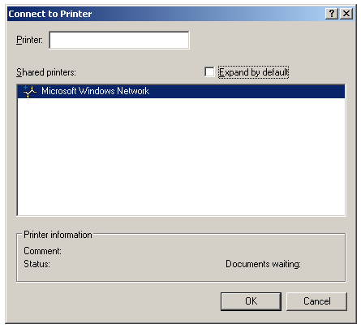

[ Home ](https://github.com/VFPX/Win32API)  

# How to browse and connect to printers on a network (WinNT)

## Before you begin:
The ConnectToPrinterDlg function -- on which this example is based -- displays a dialog box that lets users browse and connect to printers on a network.   

  
If the user selects a printer, the function attempts to create a connection to it; if a suitable driver is not installed on the server, the user is given the option of creating a printer locally.   
  
***  


## Code:
```foxpro  
DO decl

LOCAL hPrinter
hPrinter = ConnectToPrinterDlg(GetActiveWindow(), 0)
IF hPrinter = 0
	RETURN
ENDIF

PRIVATE hBuffer, cBuffer, nBufsize
nBufsize = 4096
hBuffer = GlobalAlloc(0, nBufsize)
cBuffer = Repli(Chr(0), nBufsize)

LOCAL cPrinter, cShare, cPort, cDriver, nNeeded
nNeeded = 0
IF GetPrinterA(hPrinter, 1, hBuffer, nBufsize, @nNeeded) = 1
	= Mem2Str(@cBuffer, hBuffer, nBufsize)

	cPrinter = ms(5)
	cShare = ms(9)
	cPort = ms(13)
	cDriver = ms(17)
	
	? "Selected printer:"
	? cPrinter
	? cShare
	? cPort
	? cDriver
	? "Status:", mw(73)
	? "Jobs:", mw(77)
ENDIF

= ClosePrinter(hPrinter)
= GlobalFree(hBuffer)
* end of main

FUNCTION mw(lnOffs)
RETURN buf2dword(SUBSTR(cBuffer, lnOffs,4))

FUNCTION ms(lnOffs)
RETURN GetMemStr(buf2dword(SUBSTR(cBuffer, lnOffs,4)))

FUNCTION GetMemStr(lnAddr)
	IF lnAddr = 0
		RETURN ""
	ENDIF

	LOCAL lnOffs, lcResult, ch
	lnOffs = lnAddr - hBuffer + 1
	lcResult = ""

	DO WHILE lnOffs < nBufsize
		ch = SUBSTR(cBuffer, lnOffs,1)
		IF ch = Chr(0)
			EXIT
		ELSE
			lcResult = lcResult + ch
		ENDIF
		lnOffs = lnOffs + 1
	ENDDO
RETURN lcResult

FUNCTION  buf2dword (lcBuffer)
RETURN Asc(SUBSTR(lcBuffer, 1,1)) + ;
	BitLShift(Asc(SUBSTR(lcBuffer, 2,1)),  8) +;
	BitLShift(Asc(SUBSTR(lcBuffer, 3,1)), 16) +;
	BitLShift(Asc(SUBSTR(lcBuffer, 4,1)), 24)

PROCEDURE decl
	DECLARE INTEGER GetPrinter IN winspool.drv AS GetPrinterA;
		INTEGER hPrinter, INTEGER lvl, INTEGER pPrinter,;
		INTEGER cbBuf, INTEGER @pcbNeeded

	DECLARE INTEGER ClosePrinter IN winspool.drv INTEGER hPrinter
	DECLARE INTEGER GetActiveWindow IN user32
	DECLARE INTEGER GlobalAlloc IN kernel32 INTEGER wFlags, INTEGER dwBytes
	DECLARE INTEGER GlobalFree IN kernel32 INTEGER hMem

	DECLARE RtlMoveMemory IN kernel32 As Mem2Str;
		STRING @Dest, INTEGER Src, INTEGER nLength

	DECLARE INTEGER ConnectToPrinterDlg IN winspool.drv;
		INTEGER hwnd, INTEGER Flags  
```  
***  


## Listed functions:
[ClosePrinter](../libraries/winspool.drv/ClosePrinter.md)  
[ConnectToPrinterDlg](../libraries/winspool.drv/ConnectToPrinterDlg.md)  
[GetActiveWindow](../libraries/user32/GetActiveWindow.md)  
[GetPrinter](../libraries/winspool.drv/GetPrinter.md)  
[GlobalAlloc](../libraries/kernel32/GlobalAlloc.md)  
[GlobalFree](../libraries/kernel32/GlobalFree.md)  

## Comment:
A calling application can determine whether the function has created a printer locally by calling GetPrinter with a PRINTER_INFO_2 structure, then examining that structure"s Attributes member.   
  
An application should call DeletePrinter to delete a local printer. An application should call DeletePrinterConnection to delete a connection to a printer.   
  
***  

