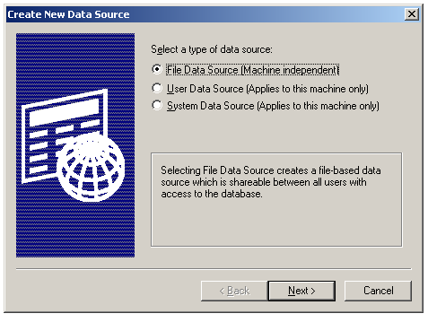
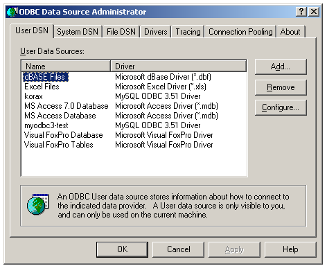

[ Home ](https://github.com/VFPX/Win32API)  

# How to display a dialog box with which the user can add a data source (DSN)

## Before you begin:
This is a dialog allowing you to create a new data source:  
  

And later if you decide to modify existing data sources:  
  
  
***  


## Code:
```foxpro  
DO decl

IF Not CreateDSN("NewDSN")
* 16 = cancelled by the user
* 18 = Could not create a DSN in the registry
* ...
	= MessageB(GetErr(), 64, " Creating New Data Source")
ENDIF

* if you decide to manage data sources
= SQLManageDataSources(GetActiveWindow())

* end of main

FUNCTION CreateDSN(cDSN)
RETURN (SQLCreateDataSource(GetActiveWindow(), cDSN) <> 0)

FUNCTION GetErr
* returns error info for the ODBC installer functions
#DEFINE SQL_SUCCESS  0
#DEFINE SQL_SUCCESS_WITH_INFO 1

	LOCAL nIndex, cMsg, nBufsize, nErrCode,;
		cResult, nResult
	
	cResult = ""
	FOR nIndex = 1 TO 8
		nBufsize = 512
		cMsg = Repli(Chr(0), nBufsize)
		nErrCode = 0

		nResult = SQLInstallerError(nIndex, @nErrCode,;
			@cMsg, nBufsize, @nBufsize)

		IF INLIST(nResult, SQL_SUCCESS, SQL_SUCCESS_WITH_INFO)
			cMsg = SUBSTR(cMsg, 1, AT(Chr(0), cMsg)-1)

			cResult = cResult + Iif(nIndex=1, "", Chr(13)+Chr(13)) +;
				"Error code: " + LTRIM(STR(nErrCode)) + Chr(13) +;
				cMsg + ".     "
		ELSE
			EXIT
		ENDIF
	ENDFOR
RETURN cResult

PROCEDURE decl
	DECLARE INTEGER GetActiveWindow IN user32
	DECLARE INTEGER SQLManageDataSources IN odbccp32 INTEGER hwnd

	DECLARE INTEGER SQLCreateDataSource IN odbccp32;
		INTEGER hwnd, STRING lpszDS

	DECLARE INTEGER SQLInstallerError IN odbccp32;
		INTEGER iError, INTEGER @pfErrorCode, STRING @lpszErrorMsg,;
		INTEGER cbErrorMsgMax, INTEGER @pcbErrorMsg  
```  
***  


## Listed functions:
[GetActiveWindow](../libraries/user32/GetActiveWindow.md)  
[SQLCreateDataSource](../libraries/odbc32/SQLCreateDataSource.md)  
[SQLInstallerError](../libraries/odbccp32/SQLInstallerError.md)  
[SQLManageDataSources](../libraries/odbc32/SQLManageDataSources.md)  

## Comment:
ODBC Data Source Administrator  
  
***  

