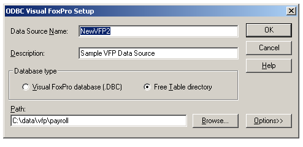

[ Home ](https://github.com/VFPX/Win32API)  

# Adding an ODBC data source with the SQLConfigDataSource; use automatic or interactive mode

## Before you begin:
  
The dialog box is displayed only if you provide a valid window handle to the SQLConfigDataSource. If this parameter is zero, all changes are done automatically, with no user interaction.  
  
***  


## Code:
```foxpro  
#DEFINE ODBC_ADD_DSN        1
#DEFINE ODBC_CONFIG_DSN     2
#DEFINE ODBC_REMOVE_DSN     3
#DEFINE ODBC_ADD_SYS_DSN    4
#DEFINE ODBC_CONFIG_SYS_DSN 5
#DEFINE ODBC_REMOVE_SYS_DSN 6

DO decl

LOCAL hWindow, cDriver, cAttributes

* sample connection strings
* use one at a time :)

cDriver = "Microsoft Excel Driver (*.xls)"
cAttributes =;
	"DSN=NewXls" + Chr(0) +;
	"Description=Sample Excel Data Source" + Chr(0) +;
	"FileType=Excel" + Chr(0) +;
	"DataDirectory=C:\ExcelData" + Chr(0) +;
	"MaxScanRows=20" + Chr(0) + Chr(0)

cDriver = "Microsoft Access Driver (*.mdb)"
cAttributes =;
	"DSN=NewAccess" + Chr(0) +;
	"Description=Sample Data Source" + Chr(0) +;
	"Dbq=c:\db\test.mdb" + Chr(0) +;
	"Uid=sa" + Chr(0) +;
	"Pwd=" + Chr(0)
				
* accessing VFP database
cDriver = "Microsoft Visual FoxPro Driver"
cAttributes =;
	"DSN=NewVFP1" + Chr(0) +;
	"Description=Sample VFP Data Source" + Chr(0) +;
	"SourceDB=C:\data\vfp\receivable\prod.dbc" + Chr(0) +;
	"SourceType=DBC" + Chr(0) +;
	"Collate=Machine" + Chr(0) +;
	"BackgroundFetch=Yes" + Chr(0) +;
	"Exclusive=No" + Chr(0)

* accessign VFP free tables in a directory
cDriver = "Microsoft Visual FoxPro Driver"
cAttributes =;
	"DSN=NewVFP2" + Chr(0) +;
	"Description=Sample VFP Data Source" + Chr(0) +;
	"SourceDB=C:\data\vfp\payroll" + Chr(0) +;
	"SourceType=DBF" + Chr(0) +;
	"Collate=Machine" + Chr(0) +;
	"BackgroundFetch=Yes" + Chr(0) +;
	"Exclusive=No" + Chr(0)

* depending on window handle passed to the SQLConfigDataSource
* it either shows a dialog box on the screen (valid hWindow),
* or not when hWindow=0

hWindow = GetActiveWindow()
*hWindow = 0

IF SQLConfigDataSource(hWindow,;
	ODBC_ADD_DSN, cDriver, cAttributes) = 0
	= MessageBox(GetErr(), 48, " Error")
ENDIF
* end of main

FUNCTION GetErr
* returns error info for the ODBC installer functions
#DEFINE SQL_SUCCESS  0
#DEFINE SQL_SUCCESS_WITH_INFO 1

	LOCAL nIndex, cMsg, nBufsize, nErrCode,;
		cResult, nResult
	
	cResult = ""
	FOR nIndex = 1 TO 8
		nBufsize = 512
		cMsg = Repli(Chr(0), nBufsize)
		nErrCode = 0

		nResult = SQLInstallerError(nIndex, @nErrCode,;
			@cMsg, nBufsize, @nBufsize)

		IF INLIST(nResult, SQL_SUCCESS, SQL_SUCCESS_WITH_INFO)
			cMsg = SUBSTR(cMsg, 1, AT(Chr(0), cMsg)-1)
			cResult = cResult + Iif(nIndex=1, "", Chr(13)+Chr(13)) +;
				"Error: " + LTRIM(STR(nErrCode)) + Chr(13) + cMsg + ".     "
		ELSE
			EXIT
		ENDIF
	ENDFOR
RETURN cResult

PROCEDURE decl
	DECLARE INTEGER GetActiveWindow IN user32

	DECLARE INTEGER SQLConfigDataSource IN odbccp32;
		INTEGER hwndParent, INTEGER fRequest,;
		STRING lpszDriver, STRING lpszAttributes

	DECLARE INTEGER SQLInstallerError IN odbccp32;
		INTEGER iError, INTEGER @pfErrorCode, STRING @lpszErrorMsg,;
		INTEGER cbErrorMsgMax, INTEGER @pcbErrorMsg  
```  
***  


## Listed functions:
[GetActiveWindow](../libraries/user32/GetActiveWindow.md)  
[SQLConfigDataSource](../libraries/odbc32/SQLConfigDataSource.md)  
[SQLInstallerError](../libraries/odbccp32/SQLInstallerError.md)  

## Comment:
As you can try sometimes (or every time) the automatic mode creates a data source without testing a validity of its path, file names or other parameters.  
  
There is an alternative way, when you directly change Windows Registry records. I would not recommend it for two reasons: increased amount of code, and a certain risk of missing important details. Though I have been testing this option -- it worked more or less Ok.  
  
Using this way you have to add or modify records in   
**HKEY_LOCAL_MACHINE\SOFTWARE\ODBC\ODBC.INI** and   
**HKEY_LOCAL_MACHINE\SOFTWARE\ODBC\ODBC.INI\ODBC Data Sources** sections.  
  
***  

