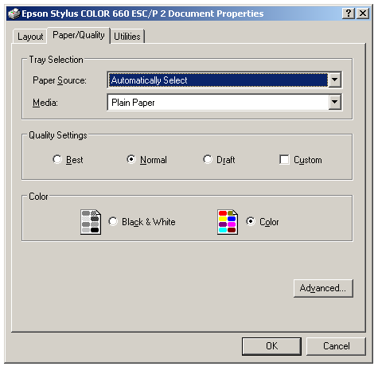

[ Home ](https://github.com/VFPX/Win32API)  

# Configuring DEVMODE structure for a printer

## Before you begin:
  

See also:

* [Printing Image File, programmatically set print page orientation to landscape](sample_555.md)  
* [How to display the Print property sheet](sample_531.md)  
  
***  


## Code:
```foxpro  
#DEFINE IDOK     1
#DEFINE IDCANCEL 2

#DEFINE DM_OUT_BUFFER 2
#DEFINE DM_IN_BUFFER  8
#DEFINE DM_IN_PROMPT  4

#DEFINE DM_ORIENTATION  1
#DEFINE DM_PAPERSIZE    2
#DEFINE DM_PAPERLENGTH  4
#DEFINE DM_PAPERWIDTH   8

#DEFINE DMORIENT_PORTRAIT  1
#DEFINE DMORIENT_LANDSCAPE 2
#DEFINE OFFS_ORIENT_FLAG   41  && offset to Orientation flag
#DEFINE OFFS_ORIENT_VALUE  45  && offset to Orientation value

DO decl

PRIVATE hWindow, cPrinter, cDriver, cPort, hPrinter, nBufsize, cDevmode
hWindow = GetActiveWindow()
STORE "" TO cPrinter, cDriver, cPort
DO GetPrnName

hPrinter = 0
= OpenPrinter(cPrinter, @hPrinter, 0)
IF hPrinter = 0
	= MessageB("Could not open default printer.     ", 48, "Error")
	RETURN
ENDIF

* being called this way the function returns DEVMODE buffer required size
nBufsize = DocumentProperties(hWindow, hPrinter, cPrinter,0,0,0)
cDevmode = Repli(Chr(0), nBufsize)

DO SetOrient WITH DMORIENT_LANDSCAPE
DO OpenDialog

= ClosePrinter(hPrinter)
* end of main

PROCEDURE SetOrient(nOrient)
* DEVMODE is adjusted programmatically
* DM_IN_PROMPT not used -- the dialog window is not shown
	LOCAL dmFlags

	* reading printer configuration
	= DocumentProperties(hWindow, hPrinter, cPrinter,;
		@cDevmode, 0, DM_OUT_BUFFER)

	* setting ORIENTATION flag and value
	dmFlags = buf2word(SUBSTR(cDevmode, OFFS_ORIENT_FLAG, 4))
	dmFlags = BitOr(dmFlags, DM_ORIENTATION)
	cDevmode = STUFF(cDevmode, OFFS_ORIENT_FLAG, 4, num2dword(dmFlags))
	cDevmode = STUFF(cDevmode, OFFS_ORIENT_VALUE, 2, num2word(nOrient))

	* using modified DEVMODE structure in the next call
	= DocumentProperties(hWindow, hPrinter, cPrinter,;
		@cDevmode, @cDevmode, DM_IN_BUFFER+DM_OUT_BUFFER)

PROCEDURE OpenDialog
* showing printer settings dialog
	= DocumentProperties(hWindow, hPrinter, cPrinter,;
		@cDevmode, @cDevmode, DM_IN_PROMPT+DM_IN_BUFFER+DM_OUT_BUFFER)

PROCEDURE GetPrnName
* retrieves default printer name from the Registry
	LOCAL lcBuffer, lcPrinter, lcDriver, lcPort

	lcBuffer = Repli(Chr(0), 120)
	= GetProfileString("Windows", "Device", ",,,",;
		@lcBuffer, Len(lcBuffer))

	lcBuffer = STRTRAN(lcBuffer, Chr(0), "")

	DIMEN arrPos[3]
	arrPos[1] = AT(",", lcBuffer, 1)
	arrPos[2] = AT(",", lcBuffer, 2)
	arrPos[3] = Len(lcBuffer)

	cPrinter = SUBSTR(lcBuffer, 1, arrPos[1]-1)
	cDriver = SUBSTR(lcBuffer, arrPos[1]+1, arrPos[2]-arrPos[1]-1)
	cPort = SUBSTR(lcBuffer, arrPos[2]+1, arrPos[3]-arrPos[2])
	RELEASE arrPos

FUNCTION buf2dword (lcBuffer)
RETURN Asc(SUBSTR(lcBuffer, 1,1)) + ;
	BitLShift(Asc(SUBSTR(lcBuffer, 2,1)),  8) +;
	BitLShift(Asc(SUBSTR(lcBuffer, 3,1)), 16) +;
	BitLShift(Asc(SUBSTR(lcBuffer, 4,1)), 24)

FUNCTION buf2word (lcBuffer)
RETURN Asc(SUBSTR(lcBuffer, 1,1)) + ;
       Asc(SUBSTR(lcBuffer, 2,1)) * 256

FUNCTION num2dword (lnValue)
#DEFINE m0       256
#DEFINE m1     65536
#DEFINE m2  16777216
	LOCAL b0, b1, b2, b3
	b3 = Int(lnValue/m2)
	b2 = Int((lnValue - b3*m2)/m1)
	b1 = Int((lnValue - b3*m2 - b2*m1)/m0)
	b0 = Mod(lnValue, m0)
RETURN Chr(b0)+Chr(b1)+Chr(b2)+Chr(b3)

FUNCTION num2word(lnValue)
RETURN Chr(MOD(m.lnValue,256)) + CHR(INT(m.lnValue/256))

PROCEDURE decl
	DECLARE INTEGER OpenPrinter IN winspool.drv;
		STRING pPrinterName, INTEGER @phPrinter, INTEGER pDefault

	DECLARE INTEGER GetProfileString IN kernel32;
		STRING lpApp, STRING lpKey, STRING lpDefault,;
		STRING @lpReturnedString, INTEGER nSize

	DECLARE INTEGER ClosePrinter IN winspool.drv INTEGER hPrinter
	DECLARE INTEGER GetActiveWindow IN user32
	DECLARE INTEGER DeleteDC IN gdi32 INTEGER hdc

	DECLARE INTEGER DocumentProperties IN winspool.drv;
		INTEGER hWnd, INTEGER hPrinter, STRING pDeviceName,;
		STRING @pDevModeOutput, STRING @pDevModeInput, INTEGER fMode  
```  
***  


## Listed functions:
[ClosePrinter](../libraries/winspool.drv/ClosePrinter.md)  
[DeleteDC](../libraries/gdi32/DeleteDC.md)  
[DocumentProperties](../libraries/winspool.drv/DocumentProperties.md)  
[GetActiveWindow](../libraries/user32/GetActiveWindow.md)  
[GetProfileString](../libraries/kernel32/GetProfileString.md)  
[OpenPrinter](../libraries/winspool.drv/OpenPrinter.md)  
