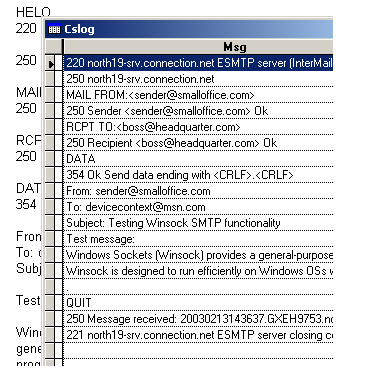

[ Home ](https://github.com/VFPX/Win32API)  

# Winsock: sending email messages (SMTP, port 25)

## Note that this document contains some links to the old news2news website which does not work at the moment. This material will be available sometime in the future.

## Before you begin:
To initialize the TSmtp object, provide valid SMTP server name and email addresses for both the sender and the recipient.  
  

See also:

* [Winsock: reading email messages (POP3, port 110)](sample_388.md)  
* [MAPI example (file attachments enabled)](sample_343.md)  
* [MAPI: sending email messages](sample_193.md)  
* [MAPI: reading email messages](sample_270.md)  
* [Function MAPISendDocuments](../libraries/mapi32/MAPISendDocuments.md)   

<!-- Anatoliy -->
FoxTalk articles:  
* [Sending SMTP Messages in Visual FoxPro Applications, Part 1](?article=10)  
* [Sending SMTP Messages in Visual FoxPro Applications, Part 2](?article=11)  
* [Accessing Hotmail and MSN Accounts in Visual FoxPro](?article=9)  
  
***  


## Code:
```foxpro  
#DEFINE CRLF CHR(13)+CHR(10)
LOCAL cServer, cSender, cRecipient, obj

* provide valid Host name and email addresses
cServer = "smtp.smtpserver.com"
cSender = "sender@smalloffice.com"
cRecipient = "postbox@headquarter.com"

obj = CREATEOBJECT("Tsmtp", cServer, cSender, cRecipient)
IF VARTYPE(obj) <> "O"
	= MESSAGEBOX("Tsmtp object INIT failed.   " + CHR(13) +;
		"Check if Host, Sender, and Recipient parameters are valid.     ",;
		48, " Error")
	RETURN
ENDIF

WITH obj
	.subject = "Testing Winsock SMTP functionality"

	* just a plain text; some program code can be added
	* to support multipart messages with attachments
	.body = "Test message:" + CRLF + CRLF +;
	"Windows Sockets (Winsock) provides a general-purpose " +;
	"networking application programming interface (API) " +;
	"based on the socket interface from the University " +;
	"of California at Berkeley. " + CRLF + CRLF +;
	"Winsock is designed to run efficiently on Windows OSs " +;
	"while maintaining compatibility with the Berkeley " +;
	"Software Distribution (BSD) standard, known " +;
	"as Berkeley Sockets."

	.SendMail()
ENDWITH

IF USED("csLog")
	SELECT csLog
	GO TOP
	BROWSE NORMAL NOWAIT
ENDIF
* end of main

DEFINE CLASS Tsmtp As Session
#DEFINE SMTP_PORT 25  && default SMTP port
#DEFINE AF_INET 2
#DEFINE SOCK_STREAM 1
#DEFINE IPPROTO_TCP 6
#DEFINE SOCKET_ERROR  -1
#DEFINE FD_READ 1
	host=""
	IP=""
	sender=""
	recipient=""
	subject=""
	body=""
	hSocket=0

PROCEDURE Init(cServer, cSender, cRecipient)
	DO declare
	IF WSAStartup(0x202, REPLICATE(CHR(0),512)) <> 0
	* unable to initialize Winsock on this computer
		RETURN .F.
	ENDIF

	THIS.host = cServer
	THIS.sender = cSender
	THIS.recipient = cRecipient

	IF Not THIS.InitCheck()
		= WSACleanup()
		RETURN .F.
	ENDIF

FUNCTION InitCheck
	IF EMPTY(THIS.host) Or EMPTY(THIS.recipient);
		Or EMPTY(THIS.sender)
	* invalid Host or sender/recipient email address
		RETURN .F.
	ENDIF
	THIS.IP = THIS.GetIP()
	IF EMPTY(THIS.IP)
	* can not resolve Host name to IP address
		RETURN .F.
	ENDIF
RETURN .T.

PROCEDURE Destroy
	= WSACleanup()

PROTECTED FUNCTION IsMailValid  && just a minimal check
RETURN Not (EMPTY(THIS.sender) Or EMPTY(THIS.recipient);
	Or EMPTY(THIS.subject+THIS.body))

PROTECTED FUNCTION GetIP
#DEFINE HOSTENT_SIZE 16
	LOCAL nStruct, nSize, cBuffer, nAddr, cIP
	nStruct = gethostbyname(THIS.host)
	IF nStruct = 0
		RETURN ""
	ENDIF

	cBuffer = REPLICATE(CHR(0), HOSTENT_SIZE)
	cIP = REPLICATE(CHR(0), 4)

	= CopyMemory(@cBuffer, nStruct, HOSTENT_SIZE)
	= CopyMemory(@cIP, buf2dword(SUBS(cBuffer,13,4)),4)
	= CopyMemory(@cIP, buf2dword(m.cIP),4)
RETURN inet_ntoa(buf2dword(m.cIP))

PROTECTED FUNCTION ConnectTo
	LOCAL cBuffer, cPort, cHost, lResult
	cPort = num2word(htons(SMTP_PORT))
	nHost = inet_addr(THIS.IP)
	cHost = num2dword(nHost)
	cBuffer = num2word(AF_INET) + cPort + cHost + REPLICATE(CHR(0),8)
	lResult = (ws_connect(THIS.hSocket, @cBuffer, Len(cBuffer))=0)
RETURN m.lResult

FUNCTION SendMail
	IF Not THIS.IsMailValid()
		RETURN .F.
	ENDIF

	THIS.hSocket = socket(AF_INET, SOCK_STREAM, IPPROTO_TCP)
	IF THIS.hSocket = SOCKET_ERROR
		RETURN .F.
	ENDIF

	LOCAL lResult
	IF THIS.ConnectTo()
		THIS.snd("HELO", .T.)
		THIS.snd("MAIL FROM:<" + THIS.sender + ">", .T.)
		THIS.snd("RCPT TO:<" + THIS.recipient + ">", .T.)
		THIS.snd("DATA", .T.)
*		THIS.snd("Date: " + THIS.GetInetTime())
		THIS.snd("From: " + THIS.sender)
		THIS.snd("To: " + THIS.recipient)
		THIS.snd("Subject: " + THIS.subject)
		THIS.snd("")
		THIS.snd(THIS.body)
		THIS.snd(".", .T.)
		THIS.snd("QUIT", .T.)
		lResult = .T.
	ELSE
		= MESSAGEBOX("Unable to connect to " +;
			"[" + THIS.host + "] " +;
			"on port " + LTRIM(STR(SMTP_PORT)) + ".   ",;
			48, " Connection error")
		lResult = .F.
	ENDIF
	= closesocket(THIS.hSocket)
RETURN lResult
ENDFUNC

PROTECTED FUNCTION snd(cData, lResponse)
	THIS.writelog(1, cData)

	LOCAL cBuffer, nResult, cResponse
	cBuffer = cData + CRLF
	nResult = send(THIS.hSocket, @cBuffer, Len(cBuffer), 0)
	IF nResult = SOCKET_ERROR
		RETURN .F.
	ENDIF
	IF Not lResponse
		RETURN .T.
	ENDIF

	LOCAL hEventRead, nWait, cRead
	DO WHILE .T.
		* create event, link it to the socket and wait
		hEventRead = WSACreateEvent()
		= WSAEventSelect(THIS.hSocket, hEventRead, FD_READ)

		* 1000 milliseconds can be not enough
		nWait = WSAWaitForMultipleEvents(1, @hEventRead,;
			0, 1000, 0)

		= WSACloseEvent(hEventRead)

		IF nWait <> 0  && error or timeout
			EXIT
		ENDIF
		
		* read data from connected socket
		cRead = THIS.rd()
		IF Not EMPTY(cRead)
			THIS.writelog(0, cRead)
		ENDIF
	ENDDO
RETURN .T.

PROTECTED FUNCTION rd
#DEFINE READ_SIZE 16384
	LOCAL cRecv, nRecv, nFlags
	cRecv = REPLICATE(CHR(0), READ_SIZE)
	nFlags = 0
	nRecv = recv(THIS.hSocket, @cRecv, READ_SIZE, nFlags)
RETURN Iif(nRecv<=0, "", LEFT(cRecv, nRecv))

PROTECTED PROCEDURE writelog(nMode, cMsg)
	IF Not USED("csLog")
		CREATE CURSOR csLog(dir I, msg C(250))
	ENDIF

	? cMsg
	cMsg = CRLF + cMsg + CRLF

	LOCAL nIndex, nPos0, nPos1
	nIndex = 1
	DO WHILE .T.
		nPos0 = AT(CRLF, cMsg, nIndex)
		nPos1 = AT(CRLF, cMsg, nIndex+1)
		IF nPos1 = 0
			EXIT
		ENDIF
		cLog = SUBSTR(cMsg, nPos0, nPos1-nPos0)
		cLog = STRTRAN(STRTRAN(cLog, CHR(13),""),CHR(10),"")
		IF Not EMPTY(cLog)
			INSERT INTO csLog VALUES (m.nMode, m.cLog)
		ENDIF
		nIndex = nIndex + 1
	ENDDO
ENDDEFINE

PROCEDURE declare
	DECLARE INTEGER gethostbyname IN ws2_32 STRING host
	DECLARE STRING inet_ntoa IN ws2_32 INTEGER in_addr
	DECLARE INTEGER socket IN ws2_32 INTEGER af, INTEGER tp, INTEGER pt
	DECLARE INTEGER closesocket IN ws2_32 INTEGER s
	DECLARE INTEGER WSACreateEvent IN ws2_32
	DECLARE INTEGER WSACloseEvent IN ws2_32 INTEGER hEvent
	DECLARE GetSystemTime IN kernel32 STRING @lpSystemTime
	DECLARE INTEGER inet_addr IN ws2_32 STRING cp
	DECLARE INTEGER htons IN ws2_32 INTEGER hostshort
	DECLARE INTEGER WSAStartup IN ws2_32 INTEGER wVerRq, STRING lpWSAData
	DECLARE INTEGER WSACleanup IN ws2_32

	DECLARE INTEGER connect IN ws2_32 AS ws_connect ;
		INTEGER s, STRING @sname, INTEGER namelen

	DECLARE INTEGER send IN ws2_32;
		INTEGER s, STRING @buf, INTEGER buflen, INTEGER flags

	DECLARE INTEGER recv IN ws2_32;
		INTEGER s, STRING @buf, INTEGER buflen, INTEGER flags

	DECLARE INTEGER WSAEventSelect IN ws2_32;
		INTEGER s, INTEGER hEventObject, INTEGER lNetworkEvents

	DECLARE INTEGER WSAWaitForMultipleEvents IN ws2_32;
		INTEGER cEvents, INTEGER @lphEvents, INTEGER fWaitAll,;
		INTEGER dwTimeout, INTEGER fAlertable

	DECLARE RtlMoveMemory IN kernel32 As CopyMemory;
		STRING @Dest, INTEGER Src, INTEGER nLength

FUNCTION buf2dword(cBuffer)
RETURN Asc(SUBSTR(cBuffer, 1,1)) + ;
	BitLShift(Asc(SUBSTR(cBuffer, 2,1)),  8) +;
	BitLShift(Asc(SUBSTR(cBuffer, 3,1)), 16) +;
	BitLShift(Asc(SUBSTR(cBuffer, 4,1)), 24)

FUNCTION num2dword(lnValue)
#DEFINE m0 0x0000100
#DEFINE m1 0x0010000
#DEFINE m2 0x1000000
	IF lnValue < 0
		lnValue = 0x100000000 + lnValue
	ENDIF
	LOCAL b0, b1, b2, b3
	b3 = Int(lnValue/m2)
	b2 = Int((lnValue - b3*m2)/m1)
	b1 = Int((lnValue - b3*m2 - b2*m1)/m0)
	b0 = Mod(lnValue, m0)
RETURN CHR(b0)+CHR(b1)+CHR(b2)+CHR(b3)

FUNCTION num2word(lnValue)
RETURN CHR(MOD(m.lnValue,256)) + CHR(INT(m.lnValue/256))  
```  
***  


## Listed functions:
[GetSystemTime](../libraries/kernel32/GetSystemTime.md)  
[WSACleanup](../libraries/ws2_32/WSACleanup.md)  
[WSACloseEvent](../libraries/ws2_32/WSACloseEvent.md)  
[WSACreateEvent](../libraries/ws2_32/WSACreateEvent.md)  
[WSAEventSelect](../libraries/ws2_32/WSAEventSelect.md)  
[WSAStartup](../libraries/ws2_32/WSAStartup.md)  
[WSAWaitForMultipleEvents](../libraries/ws2_32/WSAWaitForMultipleEvents.md)  
[closesocket](../libraries/ws2_32/closesocket.md)  
[gethostbyname](../libraries/ws2_32/gethostbyname.md)  
[htons](../libraries/ws2_32/htons.md)  
[inet_addr](../libraries/ws2_32/inet_addr.md)  
[inet_ntoa](../libraries/ws2_32/inet_ntoa.md)  
[recv](../libraries/ws2_32/recv.md)  
[send](../libraries/ws2_32/send.md)  
[socket](../libraries/ws2_32/socket.md)  

## Comment:
The sender email address can be anything. This approach somehow hides the sender`s identity. Of course, the actual ip address stays and can not be forged. By any means I do not encourage you to cheat on your recipients. Myself, I really hate spammers and unsolicited messages.  
  
This class can be easily modified for sending messages to multiple recipients.  
  
The message body in this example is just a plain text. Additional program code is required to enable multipart messages and messages with attachments.  
  
* * *  
Some SMTP headers can be quite important as, for example, Message-ID header containing unique identifier for the message. Without this one your "Hi dude!" has more chances to be rejected by the recipient POP3 server.  
  
If you are adding your own non-standard headers make sure their names start with "X-". It prevents them from possibly interfering with regular ones.  
  
For each TO: recipient issue RCPT TO: command and include this email address in "To:" SMTP header.  
  
For each CC: recipient issue RCPT TO: command and include this email address in "Cc:" SMTP header.  
  
For each BCC: recipient issue RCPT TO: command only, <U>not include</U> this email address in "Cc:" SMTP header.  
  
* * *  
Consider using the setsockopt function to adjust the buffer space used for the sending (the default value is 8192 bytes). Because of this, the large message bodies must be chopped and sent by chunks.  

***  

