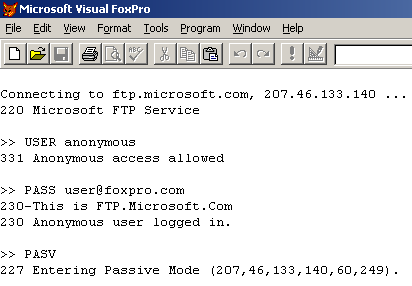

[ Home ](https://github.com/VFPX/Win32API)  

# Winsock: retrieving directory listing from an FTP server using passive data connection (FTP, port 21)

## Note that this document contains some links to the old news2news website which does not work at the moment. This material will be available sometime in the future.

## Before you begin:
This example shows how to connect to an FTP server using the anonymous access, and then establishing passive mode data connection to retrieve a directory listing.  

  

Related exampleSee also:  
* [Wininet: custom FTP class](sample_344.md)  
* [Using FTPCommand](sample_059.md)  

<!-- Anatoliy --> 
Complete FTP solution:  
<a href="http://www.news2news.com/vfp/?solution=1&src=x386"></a> 
  
***  


## Code:
```foxpro  
LOCAL obj
obj = CreateObject("Tftp", "ftp.microsoft.com")

IF VARTYPE(obj) = "O"
	IF obj.Authorize("anonymous", "user@foxpro.com")
		obj.SendCmd("STAT")
		obj.GetRespAll(1000)
		obj.ListFiles("products/frontpage/fp40.s*.Z")
	ELSE
		? "User not authorized."
	ENDIF
ELSE
	? "Unable to connect"
ENDIF
* end of main

DEFINE CLASS Tftp As Custom
#DEFINE CrLf  Chr(13)+Chr(10)
#DEFINE CTRL_PORT     21
#DEFINE AF_INET        2
#DEFINE SOCK_STREAM    1
#DEFINE IPPROTO_TCP    6
#DEFINE SOCKET_ERROR  -1
#DEFINE READ_SIZE      16384
	HostIP=""
	CtrlSocket=0
	DataSocket=0
	LastResp=""
	LastValidResp=""

PROCEDURE Init(cHost)
	THIS.decl
	IF (WSAStartup(0x202, Repli(Chr(0),512)) <> 0) Or;
		Not THIS.OpenConnect(cHost)
		RETURN .F.
	ENDIF
	SET MEMOWIDTH TO 250

PROCEDURE Destroy
	THIS.CloseData
	THIS.CloseConnect
	= WSACleanup()

PROCEDURE CloseConnect
	IF THIS.CtrlSocket > 0
		THIS.SendCmd("QUIT")
		THIS.GetRespCode(221, 2000)
		= closesocket(THIS.CtrlSocket)
		THIS.CtrlSocket = 0
	ENDIF

PROCEDURE CloseData
	IF THIS.DataSocket > 0
		= closesocket(THIS.DataSocket)
		THIS.DataSocket = 0
	ENDIF

PROTECTED FUNCTION OpenConnect(cHost)
	LOCAL lResult
	THIS.CloseConnect
	IF Not THIS.CheckHost(cHost)
		RETURN .F.
	ENDIF
	THIS.CtrlSocket = socket(AF_INET, SOCK_STREAM, IPPROTO_TCP)
	? "Connecting to " + cHost + ", " + THIS.HostIP + " ..."
	lResult = THIS.cn(THIS.CtrlSocket, THIS.HostIP, CTRL_PORT)
	IF lResult
		THIS.GetResp(5000)
		lResult = THIS.IsCode(220, THIS.LastResp)
	ENDIF
	IF Not lResult
		= closesocket(THIS.CtrlSocket)
		THIS.CtrlSocket = 0
		?? " failed"
	ENDIF
RETURN lResult

PROTECTED FUNCTION cn(hSocket, cIP, nPort)
	LOCAL cBuffer, nResult
	cBuffer = num2word(AF_INET) +;
		num2word(BitClear(htons(nPort),16)) +;
		num2dword(inet_addr(cIP)) + Repli(Chr(0),8)
	nResult = ws_connect(hSocket, @cBuffer, Len(cBuffer))
RETURN (nResult = 0)

FUNCTION Authorize(cUser, cPwd)
	LOCAL nCode
	THIS.SendCmd("USER " + cUser)
	IF THIS.GetRespCode(331, 5000)
		THIS.SendCmd("PASS " + cPwd)
		nCode = THIS.GetRespSet("230 421 332 500 501", 5000)
		THIS.GetRespAll(500)
		RETURN (nCode = 230)
	ENDIF
RETURN .F.

PROCEDURE SendCmd(cmd)
	? CrLf + ">> " + cmd
	LOCAL cBuffer, nResult, cResponse
	cBuffer = cmd + CrLf
	nResult = send(THIS.CtrlSocket, @cBuffer, Len(cBuffer), 0)
RETURN (nResult <> SOCKET_ERROR)

PROCEDURE EnterPassiveMode
	LOCAL cReturn, cIP, nPort
	THIS.CloseData
	THIS.SendCmd("PASV")
	IF Not THIS.GetRespCode(227, 5000)
		RETURN .F.
	ENDIF

	cReturn = SUBSTR(THIS.LastValidResp,;
		AT("(",THIS.LastValidResp)+1)

	nPort = VAL(GetSubstr(cReturn,5,",")) * 256 +;
		VAL(GetSubstr(cReturn,6,","))
	THIS.DataSocket = socket(AF_INET, SOCK_STREAM, IPPROTO_TCP)
RETURN THIS.cn(THIS.DataSocket, THIS.HostIP, nPort)

PROCEDURE ListFiles(cPath)
* list files in a given remote directory
	IF THIS.EnterPassiveMode()
*		THIS.SendCmd("NLST " + cPath)
		THIS.SendCmd("LIST " + cPath)
		THIS.GetRespAll(1000)
		THIS.RecvData(1000)
		THIS.CloseData
	ENDIF

PROCEDURE RecvData(nWait)
* receive all available data from the data socket
	LOCAL hEventRead, cRead, nBytesRead
	DO WHILE .T.
		hEventRead = WSACreateEvent()
		= WSAEventSelect(THIS.DataSocket, hEventRead, 1)
		nEventResult = WSAWaitForMultipleEvents(1, @hEventRead, 0, nWait, 0)
		= WSACloseEvent(hEventRead)

		IF nEventResult = 0
			cRead = Repli(Chr(0), READ_SIZE)
			nBytesRead = recv(THIS.DataSocket, @cRead, READ_SIZE, 0)
			cRead = LEFT(cRead, nBytesRead)
			IF EMPTY(cRead)
				EXIT
			ELSE
				? cRead
			ENDIF
		ELSE
			EXIT
		ENDIF
	ENDDO

FUNCTION GetRespAll(nWait)
* receive all available data from the control socket
	LOCAL cLine
	DO WHILE .T.
		cLine = THIS.GetResp(nWait)
		IF EMPTY(cLine)
			RETURN .F.
		ENDIF
	ENDDO

FUNCTION GetRespCode(nCode, nWait)
* receive portions of data from the control socket
* until a specified code detected
	LOCAL cLine
	DO WHILE .T.
		cLine = THIS.GetResp(nWait)
		IF EMPTY(cLine)
			RETURN .F.
		ELSE
			IF THIS.IsCode(nCode, cLine)
				RETURN .T.
			ENDIF
		ENDIF
	ENDDO

FUNCTION GetRespSet(cCodeSet, nWait)
* receive portions of data from the control socket
* until one of the specified codes detected
	LOCAL cLine, cCode
	DO WHILE .T.
		cLine = THIS.GetResp(nWait)
		IF LEN(cLine) < 3
			RETURN 0
		ELSE
			IF LEFT(cLine,3) $ cCodeSet
				RETURN VAL(LEFT(cLine,3))
			ENDIF
		ENDIF
	ENDDO

FUNCTION GetResp(nWait)
* receive a portion of data from the control socket
	LOCAL hEventRead, cRead, nBytesRead

	hEventRead = WSACreateEvent()
	= WSAEventSelect(THIS.CtrlSocket, hEventRead, 1)
	nEventResult = WSAWaitForMultipleEvents(1, @hEventRead, 0, nWait, 0)
	= WSACloseEvent(hEventRead)

	IF nEventResult = 0
		cRead = Repli(Chr(0), READ_SIZE)
		nBytesRead = recv(THIS.CtrlSocket, @cRead, READ_SIZE, 0)
		cRead = LEFT(cRead, nBytesRead)
		? STRTRAN(cRead, CrLf,"")
	ELSE
		cRead = ""
	ENDIF
	THIS.LastResp = cRead
	IF Not EMPTY(cRead)
		THIS.LastValidResp = cRead
	ENDIF
RETURN cRead

PROTECTED FUNCTION IsCode(nCode, cLine)
RETURN (AT(LTRIM(STR(nCode)),cLine)=1)

PROTECTED FUNCTION CheckHost(cHost)
	LOCAL nStruct, nSize, cBuffer, nAddr, cIP
	nStruct = gethostbyname(cHost)
	IF nStruct = 0
		THIS.HostIP = ""
		RETURN .F.
	ENDIF
	cBuffer = Repli(Chr(0), 16)  && HOSTENT_SIZE
	cIP = Repli(Chr(0), 4)
	= CopyMemory(@cBuffer, nStruct, Len(cBuffer))
	= CopyMemory(@cIP, buf2dword(SUBS(cBuffer,13,4)),4)
	= CopyMemory(@cIP, buf2dword(cIP),4)
	THIS.HostIP = inet_ntoa(buf2dword(cIP))
RETURN Not EMPTY(THIS.HostIP)

PROTECTED PROCEDURE decl
	DECLARE INTEGER WSACleanup IN ws2_32
	DECLARE INTEGER WSAStartup IN ws2_32 INTEGER wVerRq, STRING lpWSAData
	DECLARE INTEGER socket IN ws2_32 INTEGER af, INTEGER tp, INTEGER pt
	DECLARE INTEGER closesocket IN ws2_32 INTEGER s
	DECLARE STRING inet_ntoa IN ws2_32 INTEGER in_addr
	DECLARE INTEGER gethostbyname IN ws2_32 STRING host
	DECLARE INTEGER inet_addr IN ws2_32 STRING cp
	DECLARE INTEGER htons IN ws2_32 INTEGER hostshort
	DECLARE INTEGER WSAGetLastError IN ws2_32
	DECLARE INTEGER WSACreateEvent IN ws2_32
	DECLARE INTEGER WSACloseEvent IN ws2_32 INTEGER hEvent
	DECLARE INTEGER WSASetEvent IN ws2_32 INTEGER hEvent

	DECLARE INTEGER send IN ws2_32;
		INTEGER s, STRING @buf, INTEGER buflen, INTEGER flags

	DECLARE INTEGER recv IN ws2_32;
		INTEGER s, STRING @buf, INTEGER buflen, INTEGER flags

	DECLARE INTEGER connect IN ws2_32 AS ws_connect;
		INTEGER s, STRING @sname, INTEGER namelen

	DECLARE INTEGER WSAEventSelect IN ws2_32;
		INTEGER s, INTEGER hEventObject, INTEGER lNetworkEvents

	DECLARE INTEGER WSAWaitForMultipleEvents IN ws2_32;
		INTEGER cEvents, INTEGER @lphEvents, INTEGER fWaitAll,;
		INTEGER dwTimeout, INTEGER fAlertable

	DECLARE RtlMoveMemory IN kernel32 As CopyMemory;
		STRING @Dest, INTEGER Src, INTEGER nLength
ENDDEFINE

FUNCTION GetSubstr(cLine, nIndex, cDelimiter)
	nCount = ALINES(arrAline, STRTRAN(cLine, cDelimiter, Chr(13)))
RETURN Iif(nIndex <= nCount, arrAline[nIndex], "")

FUNCTION buf2dword(lcBuffer)
RETURN Asc(SUBSTR(lcBuffer, 1,1)) + ;
	BitLShift(Asc(SUBSTR(lcBuffer, 2,1)),  8) +;
	BitLShift(Asc(SUBSTR(lcBuffer, 3,1)), 16) +;
	BitLShift(Asc(SUBSTR(lcBuffer, 4,1)), 24)

FUNCTION num2dword(lnValue)
#DEFINE m0  256
#DEFINE m1  65536
#DEFINE m2  16777216
	IF lnValue < 0
		lnValue = 0x100000000 + lnValue
	ENDIF
	LOCAL b0, b1, b2, b3
	b3 = Int(lnValue/m2)
	b2 = Int((lnValue - b3*m2)/m1)
	b1 = Int((lnValue - b3*m2 - b2*m1)/m0)
	b0 = Mod(lnValue, m0)
RETURN Chr(b0)+Chr(b1)+Chr(b2)+Chr(b3)

FUNCTION num2word(lnValue)
RETURN Chr(MOD(m.lnValue,256)) + CHR(INT(m.lnValue/256))  
```  
***  


## Listed functions:
[WSACleanup](../libraries/ws2_32/WSACleanup.md)  
[WSACloseEvent](../libraries/ws2_32/WSACloseEvent.md)  
[WSACreateEvent](../libraries/ws2_32/WSACreateEvent.md)  
[WSAEventSelect](../libraries/ws2_32/WSAEventSelect.md)  
[WSAGetLastError](../libraries/ws2_32/WSAGetLastError.md)  
[WSAStartup](../libraries/ws2_32/WSAStartup.md)  
[WSAWaitForMultipleEvents](../libraries/ws2_32/WSAWaitForMultipleEvents.md)  
[closesocket](../libraries/ws2_32/closesocket.md)  
[gethostbyname](../libraries/ws2_32/gethostbyname.md)  
[htons](../libraries/ws2_32/htons.md)  
[inet_addr](../libraries/ws2_32/inet_addr.md)  
[inet_ntoa](../libraries/ws2_32/inet_ntoa.md)  
[recv](../libraries/ws2_32/recv.md)  
[send](../libraries/ws2_32/send.md)  
[socket](../libraries/ws2_32/socket.md)  

## Comment:

FTP is an unusual service in that it utilizes two ports, a "data" port and a "command" port (also known as the control port). Another article I want to recommend is [Active FTP vs. Passive FTP, a Definitive Explanation](http://slacksite.com/other/ftp.html) by Jay Ribak.  
  
* * *  
To create a passive data connection to an FTP server with WinINet, use INTERNET_FLAG_PASSIVE for *dwFlags* parameter in the InternetConnect call:  
  
```foxpro
#DEFINE INTERNET_INVALID_PORT_NUMBER 0  
#DEFINE INTERNET_SERVICE_FTP         1  
#DEFINE INTERNET_FLAG_PASSIVE 0x08000000  
  
nFlags = INTERNET_FLAG_PASSIVE  && use 0 for the active mode  
  
hConnection = InternetConnect(m.hInternet, m.host,;  
	INTERNET_INVALID_PORT_NUMBER,;  
	m.usr, m.cPsw, INTERNET_SERVICE_FTP, m.nFlags, 0)
```

***  

