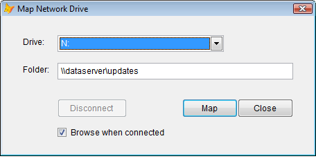

[ Home ](https://github.com/VFPX/Win32API)  

# Mapping and disconnecting network drives

## Before you begin:
  
Similar examples:  
* [Connecting a local device to a network resource](sample_318.md)  
* [Starting a dialog box for connecting to network resources (mapping network drive)](sample_309.md)  
* [Enumerating Network Resources](sample_313.md)  
* [Retrieving list of available disk drives](sample_013.md)  
* [How to detect when a removable drive gets connected or disconnected](sample_573.md)  
  
***  


## Code:
```foxpro  
LOCAL oForm
oForm = CreateObject("Tform")
oForm.Show(1)
* end of main

DEFINE CLASS Tform As Form
#DEFINE DRIVE_NO_ROOT_DIR 1
#DEFINE DRIVE_REMOTE 4

PROTECTED drives
	Width=450
	Height=200
	Caption="Map Network Drive"
	BorderStyle=2
	MaxButton=.F.
	MinButton=.F.
	Autocenter=.T.

	pwd=""
	username=ALLTRIM(SUBSTR(SYS(0), AT("#",SYS(0))+1))
	
	ADD OBJECT lbl1 As Label WITH;
		Left=30, Top=30, Auto=.T., Caption="Drive:"
	ADD OBJECT lbl2 As Label WITH;
		Left=30, Top=70, Auto=.T., Caption="Folder:"
	ADD OBJECT cmbDrive As ComboBox WITH Left=80, Top=28,;
		Width=240, Style=2, ColumnCount=2, ColumnWidths="30, 300",;
		BoundTo=.T., BoundColumn=3
	ADD OBJECT txtFolder As TextBox WITH;
		Left=80, Top=68, Width=340, Height=24
	ADD OBJECT cmdDisconnect As CommandButton WITH Left=80,;
		Top=120, Height=27, Width=100, Caption="Disconnect"
	ADD OBJECT cmdMap As CommandButton WITH;
		Left=260, Top=120, Height=27, Width=80, Caption="Map",;
		Default=.T., Enabled=.F.
	ADD OBJECT cmdClose As CommandButton WITH Left=340,;
		Top=120, Height=27, Width=80, Caption="Close", Cancel=.T.
	ADD OBJECT chBrowse As CheckBox WITH;
		Left=80, Top=160, Autosize=.T., Value=.T.,;
		Caption=" Browse when connected"

PROCEDURE Init
	THIS.EnumDrives

PROCEDURE cmdClose.Click
	ThisForm.Release

PROCEDURE cmdMap.Click
	IF ThisForm.ConnectDrive() And ThisForm.chBrowse.Value
		ThisForm.BrowseFolder
	ENDIF

PROCEDURE cmdDisconnect.Click
	ThisForm.DisconnectDrive

PROCEDURE txtFolder.InteractiveChange
	ThisForm.cmdMap.Enabled = Not EMPTY(THIS.Value)

PROCEDURE chBrowse.InteractiveChange
	IF THIS.Value
		ThisForm.BrowseFolder
	ENDIF

PROCEDURE cmbDrive.InteractiveChange
	ThisForm.OnDriveChanged

PROCEDURE DisconnectDrive
	LOCAL oDrive As LogicalDrive
	oDrive = THIS.drives.Item(THIS.cmbDrive.Value)
	IF oDrive.DisconnectDrive() <> 0
		THIS.ErrMsg(oDrive.errorcode,;
			"Method DisconnectDrive failed.")
	ENDIF
	THIS.OnDriveChanged

PROCEDURE ConnectDrive
#DEFINE ERROR_LOGON_FAILURE 1326
	LOCAL oDrive As LogicalDrive, cRemoteName
	oDrive = THIS.drives.Item(THIS.cmbDrive.Value)

	oDrive.Refresh
	IF oDrive.mapped()
		IF oDrive.DisconnectDrive() <> 0
			THIS.ErrMsg(oDrive.errorcode,;
				"Method DisconnectDrive failed.")
			THIS.OnDriveChanged()
			RETURN
		ENDIF
	ENDIF

	cRemoteName = ALLTRIM(ThisForm.txtFolder.Value)
	oDrive.ConnectDrive(m.cRemoteName, THIS.pwd, THIS.username)

	IF oDrive.errorcode = ERROR_LOGON_FAILURE
		* request user name and password
		* through a custom dialog (omitted)
		* and try to connect again
		oDrive.ConnectDrive(m.cRemoteName, THIS.pwd, THIS.username)
	ENDIF

	IF oDrive.errorcode <> 0
		THIS.ErrMsg(oDrive.errorcode, "Method ConnectDrive failed.")
	ENDIF

	THIS.OnDriveChanged()

PROCEDURE OnDriveChanged
	LOCAL oDrive As LogicalDrive, cRemoteName
	oDrive = THIS.drives.Item(THIS.cmbDrive.Value)
	oDrive.Refresh

	IF oDrive.mapped()
		THIS.cmdDisconnect.Enabled = .T.
		WITH THIS.txtFolder
			.Value = oDrive.GetRemoteName()
			.InteractiveChange
		ENDWITH
	ELSE
		THIS.cmdDisconnect.Enabled = .F.
	ENDIF
	
	cRemoteName = oDrive.GetRemoteName()
	WITH THIS.cmbDrive
		.List(.ListIndex, 2) = IIF(EMPTY(m.cRemoteName),;
			SPACE(64), m.cRemoteName)
	ENDWITH

PROTECTED PROCEDURE EnumDrives
	THIS.cmbDrive.Clear
	THIS.drives = CREATEOBJECT("LogicalDrives")

	LOCAL oDrive As LogicalDrive, cLocalName, cRemoteName

	THIS.drives.KeySort=3
	FOR EACH oDrive IN THIS.drives
		IF INLIST(oDrive.GetDrvType(),;
			DRIVE_NO_ROOT_DIR, DRIVE_REMOTE)
			
			cLocalName = oDrive.GetLocalName()
			cRemoteName = oDrive.GetRemoteName()

			WITH THIS.cmbDrive
				.AddItem(m.cLocalName+":")
				.List(.ListCount, 2) = IIF(EMPTY(m.cRemoteName),;
					SPACE(64), m.cRemoteName)
				.List(.ListCount, 3) = m.cLocalName
			ENDWITH
		ENDIF
	NEXT

	WITH THIS.cmbDrive
		.ListIndex=1
		.InteractiveChange
	ENDWITH

FUNCTION BrowseFolder
	LOCAL oDrive As LogicalDrive, cLocalName
	oDrive = THIS.drives.Item(THIS.cmbDrive.Value)
	oDrive.Refresh
	THIS.OnDriveChanged
	
	IF oDrive.mapped()
	    DECLARE INTEGER ShellExecute IN shell32;
	    	INTEGER hwnd, STRING lpOperation, STRING lpFile,;
	    	STRING lpParam, STRING lpDir, INTEGER nShowCmd

	    cLocalName = oDrive.GetLocalName() + ":"
	    = ShellExecute(0, "explore", m.cLocalName, "", "", 1)
	ENDIF

PROCEDURE ErrMsg(nErrorCode, cMsg)
	= MESSAGEBOX("Error: " + TRANSFORM(m.nErrorCode) +;
		CHR(13) + CHR(13) +;
		m.cMsg + "     ", 48, "Error")
ENDDEFINE

********************* nonvisual classes *********************
DEFINE CLASS LogicalDrives As Collection

PROCEDURE Init
	THIS.EnumDrives

PROCEDURE EnumDrives
	DO WHILE THIS.Count > 0
		THIS.Remove(1)
	ENDDO

	LOCAL nIndex, cLocalPath
	FOR nIndex=0 TO 25  && A..Z
		LOCAL oDrive As LogicalDrive

		cLocalPath = CHR(nIndex+65)
		oDrive = CREATEOBJECT("LogicalDrive", cLocalPath)

		THIS.Add(oDrive, cLocalPath)
		oDrive=Null
	NEXT
ENDDEFINE

DEFINE CLASS LogicalDrive As Session
#DEFINE DRIVE_UNKNOWN 0
#DEFINE DRIVE_NO_ROOT_DIR 1
#DEFINE DRIVE_REMOVABLE 2
#DEFINE DRIVE_FIXED 3
#DEFINE DRIVE_REMOTE 4
#DEFINE DRIVE_CDROM 5
#DEFINE DRIVE_RAMDISK 6
#DEFINE RESOURCETYPE_DISK 1

PROTECTED localname, remotename, drvtype
	localname=""
	remotename=""
	drvtype=0
	errorcode=0

PROCEDURE Init(cDriveLetter)
	THIS.localname = cDriveLetter
	THIS.Refresh()

PROCEDURE Refresh
	DECLARE INTEGER GetDriveType IN kernel32 STRING RootPath
	THIS.remotename=""
	THIS.drvtype = GetDriveType(THIS.localname + ":\")

	IF THIS.drvtype = DRIVE_REMOTE
		DECLARE INTEGER WNetGetConnection IN mpr;
			STRING lpLocalName, STRING @lpRemoteName,;
			INTEGER @lpnLen

		LOCAL cBuffer, nBufsize
		nBufsize = 260
		cBuffer = REPLICATE(Chr(0), m.nBufsize)

		THIS.errorcode = WNetGetConnection(THIS.localname+":",;
			@cBuffer, @nBufsize)

		IF THIS.errorcode=0
			THIS.remotename = LEFT(m.cBuffer, m.nBufsize)
		ENDIF
	ENDIF

FUNCTION ConnectDrive(cUnc, cPwd, cUser)
	THIS.Refresh
	IF THIS.drvtype <> DRIVE_NO_ROOT_DIR
		RETURN -2
	ENDIF
	IF NOT EMPTY(THIS.remotename)
		RETURN -1
	ENDIF

	DECLARE INTEGER WNetAddConnection2 IN mpr;
		STRING @lpNetResource, STRING lpPassword,;
		STRING lpUsername, INTEGER dwFlags

	LOCAL oLocalName As PChar, oRemoteName As PChar
	oLocalName = CREATEOBJECT("PChar", THIS.localname+":")
	oRemoteName = CREATEOBJECT("PChar", m.cUnc)
	
	cNR = num2dword(0) + num2dword(RESOURCETYPE_DISK) +;
		num2dword(0) + num2dword(0) + num2dword(oLocalName.GetAddr()) +;
		num2dword(oRemoteName.GetAddr()) +;
		num2dword(0) + num2dword(0)

	THIS.errorcode = WNetAddConnection2(@cNR, cPwd, cUser, 0)
	IF THIS.errorcode = 0
		THIS.refresh
	ENDIF
RETURN THIS.errorcode

FUNCTION DisconnectDrive
	THIS.Refresh
	IF THIS.mapped()
		DECLARE INTEGER WNetCancelConnection2 IN mpr;
			STRING lpName, INTEGER dwFlags, INTEGER fForce

		THIS.errorcode = WNetCancelConnection2(;
			THIS.localname + ":", 0,0)
	ELSE
		THIS.errorcode = 0
	ENDIF
RETURN THIS.errorcode

FUNCTION mapped
RETURN THIS.drvtype=DRIVE_REMOTE AND NOT EMPTY(THIS.remotename)

FUNCTION GetLocalName
RETURN THIS.localname

FUNCTION GetRemoteName
RETURN THIS.remotename

FUNCTION GetDrvType
RETURN THIS.drvtype

ENDDEFINE

****************** static procedures ********************
DEFINE CLASS PChar As Session
	PROTECTED hMem

PROCEDURE  Init (lcString)
	THIS.hMem = 0
	THIS.setValue (lcString)

PROCEDURE Destroy
	THIS.ReleaseString

FUNCTION GetAddr  && returns a pointer to the string
RETURN THIS.hMem

FUNCTION GetValue && returns string value
	LOCAL lnSize, lcBuffer
	lnSize = THIS.GetAllocSize()
	lcBuffer = SPACE(lnSize)
	IF THIS.hMem <> 0
		DECLARE RtlMoveMemory IN kernel32 As MemToStr;
			STRING @, INTEGER, INTEGER
		= MemToStr(@lcBuffer, THIS.hMem, lnSize)
	ENDIF
RETURN lcBuffer

FUNCTION GetAllocSize  && returns allocated memory size (string length)
	DECLARE INTEGER GlobalSize IN kernel32 INTEGER hMem
RETURN Iif(THIS.hMem=0, 0, GlobalSize(THIS.hMem))

PROCEDURE SetValue (lcString) && assigns new string value
#DEFINE GMEM_FIXED   0
	THIS.ReleaseString

	DECLARE INTEGER GlobalAlloc IN kernel32 INTEGER, INTEGER
	DECLARE RtlMoveMemory IN kernel32 As StrToMem;
		INTEGER, STRING @, INTEGER
	LOCAL lnSize
	lcString = lcString + Chr(0)
	lnSize = Len(lcString)
	THIS.hMem = GlobalAlloc(GMEM_FIXED, lnSize)
	IF THIS.hMem <> 0
		= StrToMem(THIS.hMem, @lcString, lnSize)
	ENDIF

PROCEDURE ReleaseString  && releases allocated memory
	IF THIS.hMem <> 0
		DECLARE INTEGER GlobalFree IN kernel32 INTEGER
		= GlobalFree(THIS.hMem)
		THIS.hMem = 0
	ENDIF
ENDDEFINE  && pchar

FUNCTION num2dword(lnValue)
#DEFINE m0  0x100
#DEFINE m1  0x10000
#DEFINE m2  0x1000000
	IF lnValue < 0
		lnValue = 0x100000000 + lnValue
	ENDIF
	LOCAL b0, b1, b2, b3
	b3 = Int(lnValue/m2)
	b2 = Int((lnValue - b3*m2)/m1)
	b1 = Int((lnValue - b3*m2 - b2*m1)/m0)
	b0 = Mod(lnValue, m0)
RETURN Chr(b0)+Chr(b1)+Chr(b2)+Chr(b3)  
```  
***  


## Listed functions:
[GetDriveType](../libraries/kernel32/GetDriveType.md)  
[GlobalAlloc](../libraries/kernel32/GlobalAlloc.md)  
[GlobalFree](../libraries/kernel32/GlobalFree.md)  
[GlobalSize](../libraries/kernel32/GlobalSize.md)  
[ShellExecute](../libraries/shell32/ShellExecute.md)  
[WNetAddConnection2](../libraries/mpr/WNetAddConnection2.md)  
[WNetCancelConnection2](../libraries/mpr/WNetCancelConnection2.md)  
[WNetGetConnection](../libraries/mpr/WNetGetConnection.md)  

## Comment:
Jan.30, 2005: The FoxPro code has been rewritten with API functionality moved to non-visual LogicalDrive class.   
  
* * *  
Use Windows Script to map a network drive as follows:  

```foxpro
oNet = CreateObject("WScript.Network")  
oNet.MapNetworkDrive("Z:", "\\MyServer\Data")
```

***  

