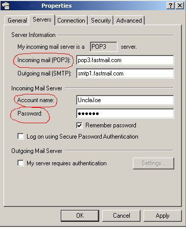

[ Home ](https://github.com/VFPX/Win32API)  

# Winsock: reading email messages (POP3, port 110)

## Note that this document contains some links to the old news2news website which does not work at the moment. This material will be available sometime in the future.

## Before you begin:
This code returns number of incoming email messages waiting on a POP3 server without opening your default email client (Outlook Express, GoupWise, Eudora etc.).  

Also it contains basic GetMsg and GetMsgTop methods being good enough for reading those messages.   

Note that even after being read all messages stay on your server (unless you decide to issue the DELE command), so they will be available for retrieving in your regular email program.  

In the beginning part of the code replace connection attributes with valid ones from your email account. This is where you can find them in Microsoft Outlook Express:  

  

See also:

* [Winsock: sending email messages (SMTP, port 25)](sample_385.md)  
* [MAPI example (file attachments enabled)](sample_343.md)  
* [MAPI: sending email messages](sample_193.md)  
* [MAPI: reading email messages](sample_270.md)  
* [Function MAPISendDocuments](../libraries/mapi32/MAPISendDocuments.md)   

<!-- Anatoliy --> 
FoxTalk articles:  
* [Sending SMTP Messages in Visual FoxPro Applications, Part 1](?article=10)  
* [Sending SMTP Messages in Visual FoxPro Applications, Part 2](?article=11)  
* [Accessing Hotmail and MSN Accounts in Visual FoxPro](?article=9)   
  
***  


## Code:
```foxpro  
LOCAL cServer, cUser, cPwd, obj

* provide connection attributes from your email account:
* Incoming mail (POP3)
* Account name
* Password
cServer = "pop3.fastmail.com"
cUser = "UncleJoe"
cPwd = "checkmail"

obj = CreateObject("Tpop3", cServer)
IF VARTYPE(obj) = "O"
	IF obj.Authorize(cUser, cPwd)
		obj.SendCmd("STAT")
		obj.GetResp(5000)
*		obj.GetMsg(1)
*		obj.GetMsgTop(1,0)
	ENDIF
ELSE
	? "Not connected"
ENDIF
* end of main

DEFINE CLASS Tpop3 As Custom
#DEFINE CrLf  Chr(13)+Chr(10)
#DEFINE POP3_PORT  110
#DEFINE AF_INET        2
#DEFINE SOCK_STREAM    1
#DEFINE IPPROTO_TCP    6
#DEFINE SOCKET_ERROR  -1
#DEFINE READ_SIZE      16384

	HostIP=""
	Pop3Socket=0
	DataSocket=0
	LastResp=""
	LastValidResp=""
	CrLfTrim=.T.

PROCEDURE Init(cHost)
	THIS.decl
	IF WSAStartup(0x202, Repli(Chr(0),512)) <> 0
	* unable to initialize Winsock on this computer
		RETURN .F.
	ENDIF
	IF Not THIS.OpenConnect(cHost)
		= WSACleanup()
		RETURN .F.
	ENDIF
	SET MEMOWIDTH TO 250

PROCEDURE Destroy
	THIS.CloseConnect
	= WSACleanup()

PROCEDURE CloseConnect
	IF THIS.Pop3Socket > 0
		THIS.SendCmd("QUIT")
		THIS.GetResp(5000)
		THIS.GetRespAll(500)
		= closesocket(THIS.Pop3Socket)
		THIS.Pop3Socket = 0
	ENDIF

PROTECTED FUNCTION OpenConnect(cHost)
	LOCAL lResult
	THIS.CloseConnect
	IF Not THIS.CheckHost(cHost)
		RETURN .F.
	ENDIF
	THIS.Pop3Socket = socket(AF_INET, SOCK_STREAM, IPPROTO_TCP)
	? "Connecting to " + cHost + ", " + THIS.HostIP + " ..."
	lResult = THIS.cn(THIS.Pop3Socket, THIS.HostIP, POP3_PORT)
	IF lResult
		THIS.GetResp(5000)
		lResult = LEFT(THIS.LastValidResp,1) = "+"
		THIS.GetRespAll(500)
	ENDIF
	IF Not lResult
		= closesocket(THIS.Pop3Socket)
		THIS.Pop3Socket = 0
		?? " failed"
	ENDIF
RETURN lResult

PROTECTED FUNCTION cn(hSocket, cIP, nPort)
	LOCAL cBuffer, nResult
	cBuffer = num2word(AF_INET) +;
		num2word(htons(nPort)) +;
		num2dword(inet_addr(cIP)) + Repli(Chr(0),8)
	nResult = ws_connect(hSocket, @cBuffer, Len(cBuffer))
RETURN (nResult = 0)

FUNCTION GetMsg(nIndex)
	THIS.SendCmd("RETR " + LTRIM(STR(nIndex)))
	IF Not THIS.GetRespOk(5000)
		RETURN .F.
	ENDIF

	LOCAL lResult
	THIS.CrLfTrim = .F.
	lResult = THIS.GetRespDot(5000)
	THIS.CrLfTrim = .T.
RETURN lResult

FUNCTION GetMsgTop(nIndex, nLines)
	THIS.SendCmd("TOP " + LTRIM(STR(nIndex)) + " " + LTRIM(STR(nLines)))
	IF Not THIS.GetRespOk(5000)
		RETURN .F.
	ENDIF

	LOCAL lResult
	THIS.CrLfTrim = .F.
	lResult = THIS.GetRespDot(5000)
	THIS.CrLfTrim = .T.
RETURN lResult

FUNCTION GetRespAll(nWait)
* receive all available data from the control socket
	LOCAL cLine
	DO WHILE .T.
		cLine = THIS.GetResp(nWait)
		IF EMPTY(cLine)
			RETURN .F.
		ENDIF
	ENDDO

FUNCTION GetRespDot(nWait)
* reads response lines until single dot (termination char)
	LOCAL cLine
	DO WHILE .T.
		cLine = THIS.GetResp(nWait)
		IF cLine = "."
			RETURN .T.
		ENDIF
		IF EMPTY(cLine)
			RETURN .F.
		ENDIF
	ENDDO

FUNCTION GetRespOk(nWait)
* reads one line; return true on a positive response
	LOCAL cLine
	cLine = THIS.GetResp(nWait)
RETURN (LEFT(cLine,1) = "+")

FUNCTION GetResp(nWait)
* receive a portion of data from the control socket
	LOCAL hEventRead, cRead, nBytesRead

	hEventRead = WSACreateEvent()
	= WSAEventSelect(THIS.Pop3Socket, hEventRead, 1)
	nEventResult = WSAWaitForMultipleEvents(1, @hEventRead, 0, nWait, 0)
	= WSACloseEvent(hEventRead)

	IF nEventResult = 0
		cRead = Repli(Chr(0), READ_SIZE)
		nBytesRead = recv(THIS.Pop3Socket, @cRead, READ_SIZE, 0)
		cRead = LEFT(cRead, nBytesRead)
		IF THIS.CrLfTrim
			cRead = STRTRAN(cRead, CrLf,"")
		ENDIF
		? cRead
	ELSE
		cRead = ""
	ENDIF
	THIS.LastResp = cRead
	IF Not EMPTY(cRead)
		THIS.LastValidResp = cRead
	ENDIF
RETURN cRead

PROCEDURE SendCmd(cmd)
	? CrLf + ">> " + cmd
	LOCAL cBuffer, nResult, cResponse
	cBuffer = cmd + CrLf
	nResult = send(THIS.Pop3Socket, @cBuffer, Len(cBuffer), 0)
RETURN (nResult <> SOCKET_ERROR)

FUNCTION Authorize(cUser, cPwd)
	LOCAL lReturn
	THIS.SendCmd("USER " + cUser)
	IF THIS.GetRespOk(5000)
		THIS.SendCmd("PASS " + cPwd)
		lReturn = THIS.GetRespOk(5000)
		THIS.GetRespAll(500)
		RETURN lReturn
	ENDIF
RETURN .F.

PROTECTED FUNCTION CheckHost(cHost)
	LOCAL nStruct, nSize, cBuffer, nAddr, cIP
	nStruct = gethostbyname(cHost)
	IF nStruct = 0
		THIS.HostIP = ""
		RETURN .F.
	ENDIF
	cBuffer = Repli(Chr(0), 16)  && HOSTENT_SIZE
	cIP = Repli(Chr(0), 4)
	= CopyMemory(@cBuffer, nStruct, Len(cBuffer))
	= CopyMemory(@cIP, buf2dword(SUBS(cBuffer,13,4)),4)
	= CopyMemory(@cIP, buf2dword(cIP),4)
	THIS.HostIP = inet_ntoa(buf2dword(cIP))
RETURN Not EMPTY(THIS.HostIP)

PROCEDURE decl
	DECLARE INTEGER WSACleanup IN ws2_32
	DECLARE INTEGER WSAStartup IN ws2_32 INTEGER wVerRq, STRING lpWSAData
	DECLARE INTEGER socket IN ws2_32 INTEGER af, INTEGER tp, INTEGER pt
	DECLARE INTEGER closesocket IN ws2_32 INTEGER s
	DECLARE STRING inet_ntoa IN ws2_32 INTEGER in_addr
	DECLARE INTEGER gethostbyname IN ws2_32 STRING host
	DECLARE INTEGER inet_addr IN ws2_32 STRING cp
	DECLARE INTEGER htons IN ws2_32 INTEGER hostshort
	DECLARE INTEGER WSACreateEvent IN ws2_32
	DECLARE INTEGER WSACloseEvent IN ws2_32 INTEGER hEvent
	DECLARE INTEGER WSASetEvent IN ws2_32 INTEGER hEvent

	DECLARE INTEGER send IN ws2_32;
		INTEGER s, STRING @buf, INTEGER buflen, INTEGER flags

	DECLARE INTEGER recv IN ws2_32;
		INTEGER s, STRING @buf, INTEGER buflen, INTEGER flags

	DECLARE INTEGER connect IN ws2_32 AS ws_connect;
		INTEGER s, STRING @sname, INTEGER namelen

	DECLARE INTEGER WSAEventSelect IN ws2_32;
		INTEGER s, INTEGER hEventObject, INTEGER lNetworkEvents

	DECLARE INTEGER WSAWaitForMultipleEvents IN ws2_32;
		INTEGER cEvents, INTEGER @lphEvents, INTEGER fWaitAll,;
		INTEGER dwTimeout, INTEGER fAlertable

	DECLARE RtlMoveMemory IN kernel32 As CopyMemory;
		STRING @Dest, INTEGER Src, INTEGER nLength
ENDDEFINE

FUNCTION buf2dword(lcBuffer)
RETURN Asc(SUBSTR(lcBuffer, 1,1)) + ;
	BitLShift(Asc(SUBSTR(lcBuffer, 2,1)),  8) +;
	BitLShift(Asc(SUBSTR(lcBuffer, 3,1)), 16) +;
	BitLShift(Asc(SUBSTR(lcBuffer, 4,1)), 24)

FUNCTION num2dword(lnValue)
#DEFINE m0  256
#DEFINE m1  65536
#DEFINE m2  16777216
	IF lnValue < 0
		lnValue = 0x100000000 + lnValue
	ENDIF
	LOCAL b0, b1, b2, b3
	b3 = Int(lnValue/m2)
	b2 = Int((lnValue - b3*m2)/m1)
	b1 = Int((lnValue - b3*m2 - b2*m1)/m0)
	b0 = Mod(lnValue, m0)
RETURN Chr(b0)+Chr(b1)+Chr(b2)+Chr(b3)

FUNCTION num2word(lnValue)
RETURN Chr(MOD(m.lnValue,256)) + CHR(INT(m.lnValue/256))  
```  
***  


## Listed functions:
[WSACleanup](../libraries/ws2_32/WSACleanup.md)  
[WSACloseEvent](../libraries/ws2_32/WSACloseEvent.md)  
[WSACreateEvent](../libraries/ws2_32/WSACreateEvent.md)  
[WSAEventSelect](../libraries/ws2_32/WSAEventSelect.md)  
[WSAStartup](../libraries/ws2_32/WSAStartup.md)  
[WSAWaitForMultipleEvents](../libraries/ws2_32/WSAWaitForMultipleEvents.md)  
[closesocket](../libraries/ws2_32/closesocket.md)  
[gethostbyname](../libraries/ws2_32/gethostbyname.md)  
[htons](../libraries/ws2_32/htons.md)  
[inet_addr](../libraries/ws2_32/inet_addr.md)  
[inet_ntoa](../libraries/ws2_32/inet_ntoa.md)  
[recv](../libraries/ws2_32/recv.md)  
[send](../libraries/ws2_32/send.md)  
[socket](../libraries/ws2_32/socket.md)  

## Comment:
A screen output will be similar to the following:  

```txt
Connecting to pop3.fastmail.com, 192.168.0.1 ...  
+OK POP3 server ready.  
  
>> USER UncleJoe  
+OK Password required.  
  
>> PASS checkmail  
+OK logged in.  
  
>> STAT 5 67312  
  
>> QUIT  
+OK POP3 server signing off.
```
  
"STAT 5" means that there is 5 messages waiting.  
  

***  

