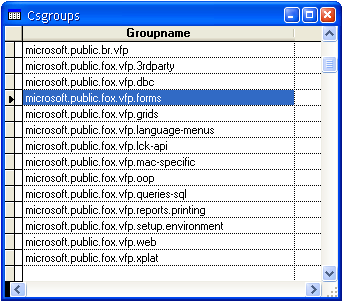

[ Home ](https://github.com/VFPX/Win32API)  

# Winsock: connecting to a news server (NNTP, port 119)

## Before you begin:
This sample shows how to retrieve a list of newsgroups stored on a news server. The base class contains practically all methods to extend this code for reading and posting messages to a newsgroup.  

  

The code connects to NNTP server news.microsoft.com. Any other NNTP server can be used.  
  
***  


## Code:
```foxpro  
LOCAL cServer, obj
cServer = "news.microsoft.com"

obj = CreateObject("Tnntp", cServer)
IF VARTYPE(obj) = "O"
*	obj.SendCmd("HELP")
*	obj.GetRespAll(2000, .T.)
	obj.ListGroups(date()-365) && one year back from now
ELSE
	? "Not connected"
ENDIF
RELEASE obj

IF USED("csGroups")
	= MESSAGEBOX("News groups retrieved: " +;
		LTRIM(STR(RECCOUNT("csGroups"))) + ".     ",;
		64, " " + cServer)
	SELECT csGroups
	GO TOP
	BROWSE NORMAL NOWAIT
ENDIF
* end of main

DEFINE CLASS Tnntp As Custom
#DEFINE CRLF CHR(13)+CHR(10)
#DEFINE NNTP_PORT 119
#DEFINE AF_INET 2
#DEFINE SOCK_STREAM 1
#DEFINE IPPROTO_TCP 6
#DEFINE SOCKET_ERROR -1
#DEFINE READ_SIZE 1024
	hostip=""
	CtrlSocket=0
	DataSocket=0
	LastResp=""
	LastValidResp=""

PROCEDURE Init(cHost)
	THIS.declare
	IF WSAStartup(0x202, Repli(CHR(0),512)) <> 0
	* unable to initialize Winsock on this computer
		RETURN .F.
	ENDIF
	IF Not THIS.OpenConnect(m.cHost)
		= WSACleanup()
		RETURN .F.
	ENDIF
	SET MEMOWIDTH TO 250

PROCEDURE Destroy
	THIS.CloseConnect
	= WSACleanup()

PROCEDURE CloseConnect
	IF THIS.CtrlSocket > 0
		THIS.SendCmd("QUIT")
		THIS.GetResp(5000, .T.)
		THIS.GetRespAll(500, .T.)
		= closesocket(THIS.CtrlSocket)
		THIS.CtrlSocket = 0
	ENDIF

PROTECTED FUNCTION OpenConnect(cHost)
	LOCAL lResult
	THIS.CloseConnect
	IF Not THIS.CheckHost(cHost)
		RETURN .F.
	ENDIF

	THIS.CtrlSocket = socket(AF_INET, SOCK_STREAM, IPPROTO_TCP)
	? "Connecting to " + cHost + ", " + THIS.hostip + " ..."
	lResult = THIS.cn(THIS.CtrlSocket, THIS.hostip, NNTP_PORT)

	IF lResult
		THIS.GetResp(5000,.T.)
		lResult = THIS.IsCode(200, THIS.LastResp);
			Or THIS.IsCode(201, THIS.LastResp)
		THIS.GetRespAll(500, .T.)
	ENDIF

	IF Not lResult
		= closesocket(THIS.CtrlSocket)
		THIS.CtrlSocket = 0
		?? " failed"
	ENDIF
RETURN lResult

PROTECTED FUNCTION cn(hSocket, cIP, nPort)
	LOCAL cBuffer, nResult
	cBuffer = num2word(AF_INET) +;
		num2word(BitClear(htons(nPort),16)) +;
		num2dword(inet_addr(cIP)) + Repli(CHR(0),8)

	nResult = WSAConnect(hSocket, @cBuffer, Len(cBuffer), 0, 0, 0, 0)
*	nResult = ws_connect(hSocket, @cBuffer, Len(cBuffer))
RETURN (nResult = 0)

PROCEDURE ListGroups(dStart)
	LOCAL cDate, cPrefix
	cDate = STRTRAN(RIGHT(STR(YEAR(dStart),4),2) +;
		STR(MONTH(dStart),2) +;
		STR(DAY(dStart),2), " ","0")
	THIS.SendCmd("newgroups " + cDate + " 000000")

	IF Not THIS.GetRespCode(231, 1000)
		RETURN
	ENDIF
	? SUBSTR(THIS.LastValidResp, 1,;
		AT(".",THIS.LastValidResp))
	
	* sometimes the list of news follows
	* after the 231 response without CRLF
	cPrefix = SUBSTR(THIS.LastValidResp,;
		AT(".",THIS.LastValidResp)+1)

	LOCAL cLine, nIndex, nCount, cName, ch
	CREATE CURSOR csGroups (groupname C(80))

	cName = ""
	nCount = 0
	DO WHILE .T.
		cLine = cPrefix + THIS.GetResp(2000)
		FOR nIndex=1 TO Len(cLine)
			ch = SUBSTR(cLine, nIndex,1)
			IF ch = CHR(13)
				cName = ALLTRIM(STRTRAN(cName, CHR(10),"")) + " "
				cName = SUBSTR(cName, 1, AT(" ",cName)-1)
				IF Len(cName) > 1
					INSERT INTO csGroups VALUES (m.cName)
				ENDIF
				nCount = nCount + 1
				cName = ""
				IF MOD(nCount,50) = 0
					WAIT WINDOW NOWAIT "Number of group names retrieved: " +;
					STR(nCount,6)
				ENDIF
			ELSE
				cName = cName + m.ch
			ENDIF
		ENDFOR
		cPrefix = ""
		IF (CRLF+"."+CRLF $ cLine) Or EMPTY(cLine)
			EXIT
		ENDIF
	ENDDO
	THIS.GetRespAll(500, .T.)
	WAIT CLEAR

FUNCTION GetRespAll(nWait, lDisplay)
* receive all available data from the control socket
	LOCAL cLine
	DO WHILE .T.
		cLine = THIS.GetResp(nWait, lDisplay)
		IF EMPTY(cLine)
			RETURN .F.
		ENDIF
	ENDDO

FUNCTION GetRespCode(nCode, nWait, lDisplay)
* receive portions of data from the control socket
* until a specified code detected
	LOCAL cLine
	DO WHILE .T.
		cLine = THIS.GetResp(nWait, lDisplay)
		IF EMPTY(cLine)
			RETURN .F.
		ELSE
			IF THIS.IsCode(nCode, cLine)
				RETURN .T.
			ENDIF
		ENDIF
	ENDDO

FUNCTION GetResp(nWait, lDisplay)
	LOCAL hEventRead, cRead, nBytesRead, oBuffer,;
		cWsabuf, nFlags

	hEventRead = WSACreateEvent()
	= WSAEventSelect(THIS.CtrlSocket, hEventRead, 1)
	nEventResult = WSAWaitForMultipleEvents(1, @hEventRead, 0, nWait, 0)
	= WSACloseEvent(hEventRead)

	IF nEventResult = 0
		cRead = Repli(CHR(0), READ_SIZE)

*		nBytesRead = recv(THIS.CtrlSocket, @cRead, READ_SIZE, 0)

		STORE 0 TO nBytesRead, nFlags
		oBuffer = CREATEOBJECT("PChar", m.cRead)
		cWsabuf = num2dword(LEN(m.cRead)) +;
			num2dword(oBuffer.GetAddr())

		IF WSARecv(THIS.CtrlSocket, @cWsabuf, 1, @nBytesRead,;
			@nFlags,0,0) <> 0
			? "WSARecv failed with error code", WSAGetLastError()
			RETURN ""
		ENDIF

		cRead = oBuffer.GetValue()
		cRead = LEFT(m.cRead, nBytesRead)

		IF lDisplay
			? cRead
		ENDIF
	ELSE
		cRead = ""
	ENDIF

	THIS.LastResp = m.cRead
	IF Not EMPTY(cRead)
		THIS.LastValidResp = m.cRead
	ENDIF
RETURN m.cRead

PROTECTED FUNCTION IsCode(nCode, cLine)
RETURN (AT(LTRIM(STR(nCode)),cLine)=1)

PROCEDURE SendCmd(cmd)
	? CRLF + ">> " + cmd
	
	LOCAL cBuffer, oBuffer, cWsabuf, nBytesSent

	cBuffer = m.cmd + CRLF
	nBytesSent=0
	oBuffer = CREATEOBJECT("PChar", m.cBuffer)
	cWsabuf = num2dword(LEN(m.cBuffer)) +;
		num2dword(oBuffer.GetAddr())
	
	nResult = WSASend(THIS.CtrlSocket, @cWsabuf, 1, @nBytesSent, 0,0,0)
*	nResult = send(THIS.CtrlSocket, @cBuffer, Len(cBuffer), 0)
RETURN (nResult <> SOCKET_ERROR)

PROTECTED FUNCTION CheckHost(cHost)
	LOCAL nStruct, nSize, cBuffer, nAddr, cIP
	nStruct = gethostbyname(cHost)
	IF nStruct = 0
		THIS.hostip = ""
		RETURN .F.
	ENDIF

	cBuffer = Repli(CHR(0), 16)  && HOSTENT_SIZE
	cIP = REPLICATE(CHR(0), 4)

	= CopyMemory(@cBuffer, nStruct, Len(cBuffer))
	= CopyMemory(@cIP, buf2dword(SUBS(cBuffer,13,4)),4)
	= CopyMemory(@cIP, buf2dword(cIP),4)
	THIS.hostip = inet_ntoa(buf2dword(cIP))
RETURN Not EMPTY(THIS.hostip)

PROTECTED PROCEDURE declare
	DECLARE INTEGER WSACleanup IN ws2_32
	DECLARE INTEGER closesocket IN ws2_32 INTEGER s
	DECLARE STRING inet_ntoa IN ws2_32 INTEGER in_addr
	DECLARE INTEGER gethostbyname IN ws2_32 STRING host
	DECLARE INTEGER inet_addr IN ws2_32 STRING cp
	DECLARE INTEGER htons IN ws2_32 INTEGER hostshort
	DECLARE INTEGER WSACreateEvent IN ws2_32
	DECLARE INTEGER WSACloseEvent IN ws2_32 INTEGER hEvent
	DECLARE INTEGER WSASetEvent IN ws2_32 INTEGER hEvent
	DECLARE INTEGER WSAGetLastError IN ws2_32

	DECLARE INTEGER WSAStartup IN ws2_32;
		INTEGER wVerRq, STRING lpWSAData

	DECLARE INTEGER socket IN ws2_32;
		INTEGER af, INTEGER tp, INTEGER pt

	DECLARE INTEGER send IN ws2_32;
		INTEGER s, STRING @buf, INTEGER buflen, INTEGER flags

	DECLARE INTEGER WSASend IN ws2_32;
		INTEGER s, STRING @lpBuffers, LONG dwBufferCount,;
		LONG @lpNumberOfBytesSent, LONG dwFlags,;
		INTEGER lpOverlapped, INTEGER lpCompletionRoutine

	DECLARE INTEGER recv IN ws2_32;
		INTEGER s, STRING @buf, INTEGER buflen, INTEGER flags

	DECLARE INTEGER WSARecv IN ws2_32;
		INTEGER s, STRING @lpBuffers, LONG dwBufferCount,;
		LONG @lpNumberOfBytesRecvd, LONG @lpFlags,;
		INTEGER lpOverlapped, INTEGER lpCompletionRoutine

	DECLARE INTEGER connect IN ws2_32 AS ws_connect;
		INTEGER s, STRING @sname, INTEGER namelen

	DECLARE INTEGER WSAConnect IN ws2_32;
		INTEGER s, STRING @sname, INTEGER namelen,;
		INTEGER lpCallerData, INTEGER lpCalleeData,;
		INTEGER lpSQOS, INTEGER lpGQOS

	DECLARE INTEGER WSAEventSelect IN ws2_32;
		INTEGER s, INTEGER hEventObject, INTEGER lNetworkEvents

	DECLARE INTEGER WSAWaitForMultipleEvents IN ws2_32;
		INTEGER cEvents, INTEGER @lphEvents, INTEGER fWaitAll,;
		INTEGER dwTimeout, INTEGER fAlertable

	DECLARE RtlMoveMemory IN kernel32 As CopyMemory;
		STRING @Dest, INTEGER Src, INTEGER nLength

	DECLARE INTEGER WSAConnect IN ws2_32;
		INTEGER s, STRING @sname, INTEGER namelen,;
		INTEGER lpCallerData, INTEGER lpCalleeData,;
		INTEGER lpSQOS, INTEGER lpGQOS

ENDDEFINE

DEFINE CLASS PChar As Session
PROTECTED hMem

PROCEDURE Init(lcString)
	THIS.hMem = 0
	THIS.setValue(lcString)

PROCEDURE Destroy
	THIS.ReleaseString

FUNCTION GetAddr
RETURN THIS.hMem

FUNCTION GetValue
	LOCAL lnSize, lcBuffer
	lnSize = THIS.getAllocSize()
	lcBuffer = SPACE(lnSize)

	IF THIS.hMem <> 0
		DECLARE RtlMoveMemory IN kernel32 As MemToStr;
			STRING @, INTEGER, INTEGER
		= MemToStr(@lcBuffer, THIS.hMem, lnSize)
	ENDIF
RETURN lcBuffer

FUNCTION GetAllocSize
	DECLARE INTEGER GlobalSize IN kernel32 INTEGER hMem
RETURN Iif(THIS.hMem=0, 0, GlobalSize(THIS.hMem))

PROCEDURE SetValue(lcString)
#DEFINE GMEM_FIXED 0
	THIS.ReleaseString

	DECLARE INTEGER GlobalAlloc IN kernel32 INTEGER, INTEGER
	DECLARE RtlMoveMemory IN kernel32 As StrToMem;
		INTEGER, STRING @, INTEGER

	LOCAL lnSize
	lcString = lcString + CHR(0)
	lnSize = Len(lcString)
	THIS.hMem = GlobalAlloc(GMEM_FIXED, lnSize)
	IF THIS.hMem <> 0
		= StrToMem(THIS.hMem, @lcString, lnSize)
	ENDIF

PROCEDURE ReleaseString
	IF THIS.hMem <> 0
		DECLARE INTEGER GlobalFree IN kernel32 INTEGER
		= GlobalFree (THIS.hMem)
		THIS.hMem = 0
	ENDIF
ENDDEFINE

FUNCTION buf2dword(cBuffer)
RETURN Asc(SUBSTR(cBuffer, 1,1)) + ;
	BitLShift(Asc(SUBSTR(cBuffer, 2,1)),  8) +;
	BitLShift(Asc(SUBSTR(cBuffer, 3,1)), 16) +;
	BitLShift(Asc(SUBSTR(cBuffer, 4,1)), 24)

FUNCTION num2dword(lnValue)
#DEFINE m0 0x0000100
#DEFINE m1 0x0010000
#DEFINE m2 0x1000000
	IF lnValue < 0
		lnValue = 0x100000000 + lnValue
	ENDIF
	LOCAL b0, b1, b2, b3
	b3 = Int(lnValue/m2)
	b2 = Int((lnValue - b3*m2)/m1)
	b1 = Int((lnValue - b3*m2 - b2*m1)/m0)
	b0 = Mod(lnValue, m0)
RETURN Chr(b0)+Chr(b1)+Chr(b2)+Chr(b3)

FUNCTION num2word(lnValue)
RETURN Chr(MOD(m.lnValue,256)) + CHR(INT(m.lnValue/256))  
```  
***  


## Listed functions:
[GlobalAlloc](../libraries/kernel32/GlobalAlloc.md)  
[GlobalFree](../libraries/kernel32/GlobalFree.md)  
[GlobalSize](../libraries/kernel32/GlobalSize.md)  
[WSACleanup](../libraries/ws2_32/WSACleanup.md)  
[WSACloseEvent](../libraries/ws2_32/WSACloseEvent.md)  
[WSAConnect](../libraries/ws2_32/WSAConnect.md)  
[WSACreateEvent](../libraries/ws2_32/WSACreateEvent.md)  
[WSAEventSelect](../libraries/ws2_32/WSAEventSelect.md)  
[WSAGetLastError](../libraries/ws2_32/WSAGetLastError.md)  
[WSARecv](../libraries/ws2_32/WSARecv.md)  
[WSASend](../libraries/ws2_32/WSASend.md)  
[WSAStartup](../libraries/ws2_32/WSAStartup.md)  
[WSAWaitForMultipleEvents](../libraries/ws2_32/WSAWaitForMultipleEvents.md)  
[closesocket](../libraries/ws2_32/closesocket.md)  
[gethostbyname](../libraries/ws2_32/gethostbyname.md)  
[htons](../libraries/ws2_32/htons.md)  
[inet_addr](../libraries/ws2_32/inet_addr.md)  
[inet_ntoa](../libraries/ws2_32/inet_ntoa.md)  
[recv](../libraries/ws2_32/recv.md)  
[send](../libraries/ws2_32/send.md)  
[socket](../libraries/ws2_32/socket.md)  

## Comment:
Some useful links:  
* [RFC977. Network News Transfer Protocol](http://www.faqs.org/rfcs/rfc977.html)  
* [Network News Transfer Protocol on freesoft.org](http://www.freesoft.org/CIE/RFC/977/)  
   

***  

