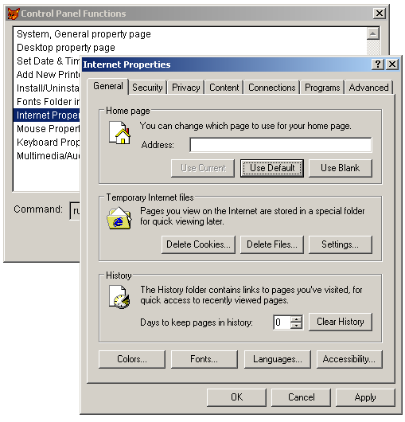

[ Home ](https://github.com/VFPX/Win32API)  

# Accessing Windows Control Panel from VFP Application

## Short description:
This code shows how to launch various control panel property pages (like Internet Options) and wizards (like Add New Printer) from a VFP application. Normally you reach the Control Panel through Windows main menu item Settings.  
***  


## Before you begin:
  
  
***  


## Code:
```foxpro  
LOCAL oForm
oForm = CreateObject("Tform")
oForm.Show(1)
* end of main

DEFINE CLASS Tform As Form
	Width=480
	Height=300
	BorderStyle=2
	MaxButton=.F.
	MinButton=.F.
	Caption="Control Panel Functions"
	Autocenter=.T.
	
	ADD OBJECT lst As ListBox WITH;
	Left=8, Top=5, Width=464, Height=210
	
	ADD OBJECT Label1 As Label WITH;
	Left=10, Top=228, Caption="Command:", Autosize=.T.
	
	ADD OBJECT txtCmd As TextBox WITH;
	Left=80, Top=226, Height=24, Width=384, ReadOnly=.T.
	
	ADD OBJECT cmdRun As CommandButton WITH;
	Left=382, Top=256, Height=27, Width=80, Caption="Run"

PROCEDURE Init
	THIS.lst.InteractiveChange

PROCEDURE lst.Init
	ThisForm.AddCmd("System, General property page", "shell32.dll,Control_RunDLL sysdm.cpl,,0")
	ThisForm.AddCmd("Desktop property page", "shell32.dll,Control_RunDLL desk.cpl,,0")
	ThisForm.AddCmd("Add New Printer wizard", "shell32.dll,SHHelpShortcuts_RunDLL AddPrinter")
	ThisForm.AddCmd("Add Hardware Wizard", "shell32.dll,Control_RunDLL hdwwiz.cpl")
	ThisForm.AddCmd("Install/Uninstall tab selected", "shell32.dll,Control_RunDLL appwiz.cpl,,1")
	ThisForm.AddCmd("Set Date & Time properties tab", "shell32.dll,Control_RunDLL timedate.cpl")
	ThisForm.AddCmd("Fonts Folder in Explorer view", "shell32.dll,SHHelpShortcuts_RunDLL FontsFolder")
	ThisForm.AddCmd("Internet Properties, General Tab", "shell32.dll,Control_RunDLL inetcpl.cpl")
	ThisForm.AddCmd("Mouse Properties", "shell32.dll,Control_RunDLL main.cpl @0")
	ThisForm.AddCmd("Keyboard Properties, Speed tab", "shell32.dll,Control_RunDLL main.cpl @1")
	ThisForm.AddCmd("Multimedia/Audio property page", "shell32.dll,Control_RunDLL mmsys.cpl,,0")

	WITH THIS
		.RowSourceType=2
		.RowSource="csCommands"
		.ListIndex=1
	ENDWITH

PROCEDURE lst.InteractiveChange
	ThisForm.txtCmd.Value = "rundll32.exe " +;
		ALLTRIM(csCommands.params)

PROCEDURE AddCmd(cName, cParams)
	IF Not USED("csCommands")
		CREATE CURSOR csCommands (cmdname C(50), params C(100))
	ENDIF
	INSERT INTO csCommands VALUES (" "+m.cName, m.cParams)

PROCEDURE cmdRun.Click
	ThisForm.RunCmd1("rundll32.exe", ALLTRIM(csCommands.params))

PROCEDURE RunCmd1(cApp, cParam)
    DECLARE INTEGER ShellExecute IN shell32;
    	INTEGER hwnd, STRING lpOperation,;
    	STRING lpFile, STRING lpParameters,;
    	STRING lpDirectory, INTEGER nShowCmd
	= ShellExecute(0, "open", cApp, cParam, "", 1)

PROCEDURE RunCmd2(cApp, cParam)
	DECLARE INTEGER WinExec IN kernel32;
		STRING lpCmdLine, INTEGER nCmdShow
	= WinExec(cApp + " " + cParam, 1)
ENDDEFINE  
```  
***  


## Listed functions:
[ShellExecute](../libraries/shell32/ShellExecute.md)  
[WinExec](../libraries/kernel32/WinExec.md)  

## Comment:
Source: <a href="http://www.mvps.org/vbnet/index.html?code/system/controlpnl3.htm">Adding Control Panel Functions to a VB Application</a>.  
  
***  

