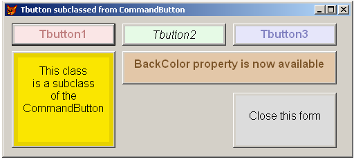

[ Home ](https://github.com/VFPX/Win32API)  

# Subclassing CommandButton control to create BackColor property

## Before you begin:
  
Each time the caption of a button is set -- use **Caption1** property and **SetCaption** method to do this -- the object generates a temporary bitmap file *printing the text on it* and pass this file to the **Picture** property.  
  
***  


## Code:
```foxpro  
PUBLIC obj
obj = CreateObject("Tform")
obj.Visible = .T.
* end of main

DEFINE CLASS TForm As Form
	Width=500
	Height=200
	Caption=" Tbutton subclassed from CommandButton"
	Autocenter=.T.

	ADD OBJECT Tbutton1 As Tbutton WITH;
	Left=10, Top=10, Width=150, Height=32, Caption1="Tbutton1",;
	BackColor=Rgb(250,230,230), ForeColor=Rgb(192,128,128), FontBold=.T.
	
	ADD OBJECT Tbutton2 As Tbutton WITH;
	Left=170, Top=10, Width=150, Height=32, Caption1="Tbutton2",;
	BackColor=Rgb(230,250,230), FontItalic=.T.

	ADD OBJECT Tbutton3 As Tbutton WITH;
	Left=330, Top=10, Width=150, Height=32, Caption1="Tbutton3",;
	BackColor=Rgb(230,230,250), ForeColor=Rgb(128,128,192), FontBold=.T.

	ADD OBJECT Tbutton4 As Tbutton WITH;
	Left=10, Top=50, Width=150, Height=140,;
	FrameColor=Rgb(230,210,0), BackColor=Rgb(250,230,0),;
	MarginTop=7, MarginBottom=7, MarginLeft=7, MarginRight=7,;
	PaddingTop=10, PaddingLeft=5, PaddingRight=5,;
	Caption1="This class"+Chr(13)+"is a subclass"+Chr(13)+"of the CommandButton"

	ADD OBJECT Tbutton5 As Tbutton WITH;
	Left=170, Top=50, Width=310, Height=48,;
	FrameColor=Rgb(227,199,168), BackColor=Rgb(227,199,168),;
	ForeColor=Rgb(123,84,40), FontBold=.T.,;
	MarginTop=5,;
	Caption1="BackColor property is now available"

	ADD OBJECT Tbutton6 As Tbutton WITH;
	Left=330, Top=110, Width=150, Height=80,;
	Caption1="Close this form",;
	FrameColor=THIS.BackColor, BackColor=Rgb(220,220,220),;
	PaddingTop=20, Cancel=.T.

PROCEDURE Tbutton6.Click
	ThisForm.Release
ENDDEFINE

DEFINE CLASS Tbutton As CommandButton
	FontSize=12
	Caption=""  && keep it empty
	Caption1="" && replaces regular Caption property
	Bitmapfile=""
	FrameColor=Rgb(192,192,192)  && long awaited property
	MarginLeft=2
	MarginTop=2
	MarginRight=2
	MarginBottom=2
	BackColor=Rgb(192,192,192)
	PaddingLeft=2
	PaddingTop=2
	PaddingRight=2
	PaddingBottom=2

PROCEDURE Init
	THIS.Bitmapfile=SUBSTR(SYS(2015), 3) + ".bmp"
	THIS.SetCaption

PROCEDURE Destroy
	IF FILE(THIS.Bitmapfile)
		DELETE FILE (THIS.Bitmapfile)
	ENDIF

PROCEDURE SetCaption(cCaption)
#DEFINE ANSI_CHARSET        0
#DEFINE OUT_OUTLINE_PRECIS  8
#DEFINE CLIP_STROKE_PRECIS  2
#DEFINE PROOF_QUALITY       2
#DEFINE ANTIALIASED_QUALITY 4
#DEFINE DEFAULT_PITCH       0
#DEFINE VARIABLE_PITCH      2
#DEFINE LOGPIXELSY          90
#DEFINE DT_CENTER           1
#DEFINE DT_WORDBREAK        16
	DECLARE INTEGER CreateCompatibleDC IN gdi32 INTEGER hdc
	DECLARE INTEGER GetDesktopWindow IN user32
	DECLARE INTEGER GetWindowDC IN user32 INTEGER hwnd
	DECLARE INTEGER ReleaseDC IN user32 INTEGER hwnd, INTEGER hdc
	DECLARE INTEGER SelectObject IN gdi32 INTEGER hdc, INTEGER hObject
	DECLARE INTEGER DeleteDC IN gdi32 INTEGER hdc
	DECLARE INTEGER DeleteObject IN gdi32 INTEGER hObject
	DECLARE INTEGER CreateSolidBrush IN gdi32 LONG crColor
	DECLARE INTEGER SetBkMode IN gdi32 INTEGER hdc, INTEGER iBkMode
	DECLARE INTEGER SetTextColor IN gdi32 INTEGER hdc, INTEGER crColor
	DECLARE INTEGER GetDeviceCaps IN gdi32 INTEGER hdc, INTEGER nIndex

	DECLARE INTEGER DrawText IN user32;
		INTEGER hDC, STRING lpString, INTEGER nCount,;
		STRING @lpRect, INTEGER uFormat

	DECLARE INTEGER CreateFont IN gdi32;
		INTEGER nHeight, INTEGER nWidth, INTEGER nEscapement,;
		INTEGER nOrientation, INTEGER fnWeight, INTEGER fdwItalic,;
		INTEGER fdwUnderline, INTEGER fdwStrikeOut, INTEGER fdwCharSet,;
		INTEGER fdwOutPrecis, INTEGER fdwClipPrecis, INTEGER fdwQuality,;
		INTEGER fdwPitchAndFamily, STRING lpszFace

	DECLARE INTEGER FillRect IN user32;
		INTEGER hDC, STRING @RECT, INTEGER hBrush

	DECLARE INTEGER CreateCompatibleBitmap IN gdi32;
		INTEGER hdc, INTEGER nWidth, INTEGER nHeight

	IF VARTYPE(m.cCaption) = "C"
		THIS.Caption1 = m.cCaption
	ENDIF
	LOCAL nBaseWidth, nBaseHeight, BaseRect, InnerRect, TextRect,;
		hDesktop, hDesktopDC, hMemDC, hMemBmp, hBrush, hFont
	nBaseWidth = THIS.Width-4
	nBaseHeight = THIS.Height-4
	BaseRect = num2dword(0) + num2dword(0) +;
		num2dword(nBaseWidth) + num2dword(nBaseHeight)
	InnerRect = num2dword(THIS.MarginLeft) +;
		num2dword(THIS.MarginTop) +;
		num2dword(nBaseWidth-THIS.MarginRight) +;
		num2dword(nBaseHeight-THIS.MarginBottom)
	TextRect = num2dword(THIS.MarginLeft+THIS.PaddingLeft) +;
		num2dword(THIS.MarginTop+THIS.PaddingTop) +;
		num2dword(nBaseWidth-THIS.MarginRight-THIS.PaddingRight) +;
		num2dword(nBaseHeight-THIS.MarginTop-THIS.PaddingTop)

	hDesktop = GetDesktopWindow()
	hDesktopDC = GetWindowDC(hDesktop)
	hMemDC = CreateCompatibleDC(hDesktopDC)
	hMemBmp = CreateCompatibleBitmap(hDesktopDC, nBaseWidth, nBaseHeight)
	= SelectObject(hMemDC, hMemBmp)
	= ReleaseDC(hDesktop, hDesktopDC)

	hBrush = CreateSolidBrush(THIS.FrameColor)
	= FillRect(hMemDC, @BaseRect, hBrush)
	= DeleteObject(hBrush)

	hBrush = CreateSolidBrush(THIS.BackColor)
	= FillRect(hMemDC, @InnerRect, hBrush)
	= DeleteObject(hBrush)

	= SetBkMode(hMemDC, 1)  && transparent
	= SetTextColor(hMemDC, THIS.ForeColor)
	hFont = CreateFont(-THIS.FontSize * GetDeviceCaps(hMemDC, LOGPIXELSY) / 72,;
		0,0,0, Iif(THIS.FontBold,700,400), Iif(THIS.FontItalic,1,0),0,0,;
		ANSI_CHARSET, OUT_OUTLINE_PRECIS, CLIP_STROKE_PRECIS,;
		PROOF_QUALITY, DEFAULT_PITCH, THIS.FontName)
	= SelectObject(hMemDC, hFont))
	= DrawText(hMemDC, THIS.Caption1, Len(THIS.Caption1),;
		@TextRect, DT_WORDBREAK+DT_CENTER)

	IF BitmapToFile(hMemDC, hMemBmp, nBaseWidth, nBaseHeight, THIS.Bitmapfile)
		THIS.Picture = THIS.Bitmapfile
	ENDIF
	= DeleteObject(hMemBmp)
	= DeleteDC(hMemDC)
ENDDEFINE

PROCEDURE BitmapToFile
PARAMETERS hMemDC, hMemBmp, nWidth, nHeight, cFilename
#DEFINE cnBitsPerPixel         24
#DEFINE BHDR_SIZE              40  && BITMAPINFOHEADER
#DEFINE BFHDR_SIZE             14  && BITMAPFILEHEADER
#DEFINE GENERIC_WRITE          0x40000000
#DEFINE FILE_SHARE_WRITE       2
#DEFINE CREATE_ALWAYS          2
#DEFINE FILE_ATTRIBUTE_NORMAL  128
	DECLARE INTEGER GlobalAlloc IN kernel32 INTEGER wFlags, INTEGER dwBytes
	DECLARE INTEGER GlobalFree IN kernel32 INTEGER hMem
	DECLARE INTEGER CloseHandle IN kernel32 INTEGER hObject
	DECLARE INTEGER GetDIBits IN gdi32;
		INTEGER hdc, INTEGER hbmp, INTEGER uStartScan,;
		INTEGER cScanLines, INTEGER lpvBits, STRING @lpbi,;
		INTEGER uUsage
	DECLARE RtlZeroMemory IN kernel32 As ZeroMemory;
		INTEGER dest, INTEGER numBytes
	DECLARE INTEGER CreateFile IN kernel32;
		STRING lpFileName, INTEGER dwDesiredAccess,;
		INTEGER dwShareMode, INTEGER lpSecurityAttr,;
		INTEGER dwCreationDisp, INTEGER dwFlagsAndAttrs,;
		INTEGER hTemplateFile

	PRIVATE nBytesPerScan, nBitsArray, nBitsSize, nRgbQuadSize, cBInfo
	STORE 0 TO nBytesPerScan, nRgbQuadSize, nBitsArray, nBitsSize
	STORE "" TO cBInfo
	DO InitBitmapData
	DO SaveBitmapFile
	= GlobalFree(nBitsArray)

PROCEDURE InitBitmapData
	nBytesPerScan = nWidth * 3
	IF Mod(nBytesPerScan, 4) <> 0
		nBytesPerScan = nBytesPerScan + 4 - Mod(nBytesPerScan, 4)
	ENDIF
	cBInfo = num2dword(BHDR_SIZE) + num2dword(nWidth) + num2dword(nHeight) +;
		num2word(1) + num2word(cnBitsPerPixel) + Repli(Chr(0),24)
	nBitsSize = nHeight * nBytesPerScan
	nBitsArray = GlobalAlloc(0, nBitsSize)
	= ZeroMemory(nBitsArray, nBitsSize)
	= GetDIBits(hMemDC, hMemBmp, 0, nHeight, nBitsArray, @cBInfo, 0)

PROCEDURE SaveBitmapFile
	LOCAL hFile, lnOffBits, lnFileSize, cBFileHdr
	lnFileSize = BFHDR_SIZE + BHDR_SIZE + nRgbQuadSize + nBitsSize
	lnOffBits = BFHDR_SIZE + BHDR_SIZE + nRgbQuadSize
	cBFileHdr = "BM" + num2dword(lnFileSize) + num2dword(0) + num2dword(lnOffBits)
	hFile = CreateFile(m.cFilename, GENERIC_WRITE, FILE_SHARE_WRITE, 0,;
				CREATE_ALWAYS, FILE_ATTRIBUTE_NORMAL, 0)
	IF hFile <> -1
		= String2File(hFile, @cBFileHdr)
		= String2File(hFile, @cBInfo)
		= Ptr2File(hFile, nBitsArray, nBitsSize)
		= CloseHandle (hFile)
	ENDIF
RETURN (hFile <> -1)

PROCEDURE String2File(hFile, lcBuffer)
* appends string buffer to a file
	DECLARE INTEGER WriteFile IN kernel32;
		INTEGER hFile, STRING @lpBuffer, INTEGER nBt2Write,;
		INTEGER @lpBtWritten, INTEGER lpOverlapped
	= WriteFile(hFile, @lcBuffer, Len(lcBuffer), 0, 0)

PROCEDURE Ptr2File(hFile, lnPointer, lnBt2Write)
* appends memory block to a file
	DECLARE INTEGER WriteFile IN kernel32;
		INTEGER hFile, INTEGER lpBuffer, INTEGER nBt2Write,;
		INTEGER @lpBtWritten, INTEGER lpOverlapped
	= WriteFile(hFile, lnPointer, lnBt2Write, 0, 0)

FUNCTION num2dword(lnValue)
#DEFINE m0  256
#DEFINE m1  65536
#DEFINE m2  16777216
	IF lnValue < 0
		lnValue = 0x100000000 + lnValue
	ENDIF
	LOCAL b0, b1, b2, b3
	b3 = Int(lnValue/m2)
	b2 = Int((lnValue - b3*m2)/m1)
	b1 = Int((lnValue - b3*m2 - b2*m1)/m0)
	b0 = Mod(lnValue, m0)
RETURN Chr(b0)+Chr(b1)+Chr(b2)+Chr(b3)

FUNCTION num2word(lnValue)
RETURN Chr(MOD(m.lnValue,256)) + CHR(INT(m.lnValue/256))  
```  
***  


## Listed functions:
[CloseHandle](../libraries/kernel32/CloseHandle.md)  
[CreateCompatibleBitmap](../libraries/gdi32/CreateCompatibleBitmap.md)  
[CreateCompatibleDC](../libraries/gdi32/CreateCompatibleDC.md)  
[CreateFile](../libraries/kernel32/CreateFile.md)  
[CreateFont](../libraries/gdi32/CreateFont.md)  
[CreateSolidBrush](../libraries/gdi32/CreateSolidBrush.md)  
[DeleteDC](../libraries/gdi32/DeleteDC.md)  
[DeleteObject](../libraries/gdi32/DeleteObject.md)  
[DrawText](../libraries/user32/DrawText.md)  
[FillRect](../libraries/gdi32/FillRect.md)  
[GetDIBits](../libraries/gdi32/GetDIBits.md)  
[GetDesktopWindow](../libraries/user32/GetDesktopWindow.md)  
[GetDeviceCaps](../libraries/gdi32/GetDeviceCaps.md)  
[GetWindowDC](../libraries/user32/GetWindowDC.md)  
[GlobalAlloc](../libraries/kernel32/GlobalAlloc.md)  
[GlobalFree](../libraries/kernel32/GlobalFree.md)  
[ReleaseDC](../libraries/user32/ReleaseDC.md)  
[SelectObject](../libraries/gdi32/SelectObject.md)  
[SetBkMode](../libraries/gdi32/SetBkMode.md)  
[SetTextColor](../libraries/gdi32/SetTextColor.md)  
[WriteFile](../libraries/kernel32/WriteFile.md)  

## Comment:
Bitmap file creation takes no time, and the file is deleted on **Destroy** event for the object.  
  
The **Caption** property is not used and should be empty every time. All font properties are available. **Padding** and **Margin** properties provide positioning the text inside the button.  
  
Unfortunately hot keys are not supported (there should be a trade anyway). The **WordWrap** property is ignored (practically it is on all the time). As for the rest the object behaves like an ordinary CommandButton.  
  
***  

