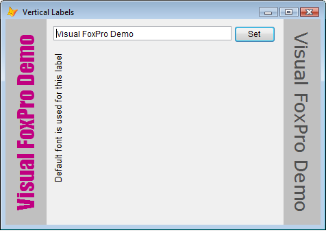

[ Home ](https://github.com/VFPX/Win32API)  

# Vertical Label control

## Before you begin:
  
It is not an extreme necessity, but sometimes you may need such control. Its main properties include font, V and H alignment, fore and back color, and direction (up and down).  
  
***  


## Code:
```foxpro  
LOCAL obj
obj = CreateObject("TForm")
obj.Show(1)

DEFINE CLASS Tform As Form
	Width=460
	Height=300
	Caption=" Vertical Labels"
	AutoCenter=.T.
	
	ADD OBJECT text1 As TextBox WITH;
	Top=10, Left=70, Width=260, Height=21, Value="Visual FoxPro Demo"
	
	ADD OBJECT button1 As CommandButton WITH Top=10, Left=334,;
	Width=60, Height=24, Caption="Set", Default=.T.
	
	ADD OBJECT vlabel1 As VLabel WITH Top=0, Height=300,;
	Left=0, Width=60, FontName="Impact",;
	FontSize=24, ForeColor=Rgb(192,0,128), BackColor=Rgb(192,192,192),;
	Direction=0, VAlignment=1, Alignment=1

	ADD OBJECT vlabel2 As VLabel WITH Top=0, Height=300,;
	Left=406, Width=54, FontName="Verdana", FontSize=20,;
	ForeColor=Rgb(80,80,80), BackColor=Rgb(192,192,192),;
	Direction=1, VAlignment=1, Alignment=1

	ADD OBJECT vlabel3 As VLabel WITH;
	Top=50, Height=250, Left=70, Width=54, VAlignment=0,;
	VCaption = "Default font is used for this label"

PROCEDURE Init
	THIS.SetLabel
	THIS.vlabel3.DrawCaption
PROCEDURE button1.Click
	ThisForm.SetLabel
PROCEDURE SetLabel
	STORE RTRIM(THIS.text1.Value) TO THIS.vlabel1.VCaption,;
		THIS.vlabel2.VCaption
ENDDEFINE

DEFINE CLASS VLabel As Image
	PROTECTED bitmapfile
	VCaption=""  && "Caption" does not work
	Direction=0
	Alignment=0
	VAlignment=2
	Autowidth=.F.
	BackColor=-1
	FontBold=.F.
	FontItalic=.F.
	FontName="Arial"
	FontSize=10
	FontStrikethru=.F.
	FontUnderline=.F.
	ForeColor=0

PROCEDURE Init
	THIS.bitmapfile=SUBSTR(SYS(2015), 3) + ".bmp"

PROCEDURE Destroy
	IF FILE(THIS.bitmapfile)  && deleting temporary bitmap file
		DELETE FILE (THIS.bitmapfile)
	ENDIF

PROCEDURE VCaption_ASSIGN(vParam)
	THIS.VCaption = m.vParam
	THIS.DrawCaption
PROCEDURE Alignment_ASSIGN(vParam)
	THIS.Alignment = m.vParam
	THIS.DrawCaption
PROCEDURE VAlignment_ASSIGN(vParam)
	THIS.VAlignment = m.vParam
	THIS.DrawCaption
PROCEDURE Direction_ASSIGN(vParam)
	THIS.Direction = m.vParam
	THIS.DrawCaption
PROCEDURE BackColor_ASSIGN(vParam)
	THIS.BackColor = m.vParam
	THIS.DrawCaption
PROCEDURE Autowidth_ASSIGN(vParam)
	THIS.Autowidth = m.vParam
	THIS.DrawCaption
PROCEDURE FontBold_ASSIGN(vParam)
	THIS.FontBold = m.vParam
	THIS.DrawCaption
PROCEDURE FontItalic_ASSIGN(vParam)
	THIS.FontItalic = m.vParam
	THIS.DrawCaption
PROCEDURE FontName_ASSIGN(vParam)
	THIS.FontName = m.vParam
	THIS.DrawCaption
PROCEDURE FontSize_ASSIGN(vParam)
	THIS.FontSize = m.vParam
	THIS.DrawCaption
PROCEDURE FontStrikethru_ASSIGN(vParam)
	THIS.FontStrikethru = m.vParam
	THIS.DrawCaption
PROCEDURE FontUnderline_ASSIGN(vParam)
	THIS.FontUnderline = m.vParam
	THIS.DrawCaption
PROCEDURE ForeColor_ASSIGN(vParam)
	THIS.ForeColor = m.vParam
	THIS.DrawCaption

PROCEDURE DrawCaption
#DEFINE OUT_OUTLINE_PRECIS  8
#DEFINE CLIP_STROKE_PRECIS  2
#DEFINE PROOF_QUALITY       2
#DEFINE LOGPIXELSY          90
	DECLARE INTEGER SelectObject IN gdi32 INTEGER hdc, INTEGER hObject
	DECLARE INTEGER SetTextColor IN gdi32 INTEGER hdc, INTEGER crColor
	DECLARE INTEGER GetDeviceCaps IN gdi32 INTEGER hdc, INTEGER nIndex
	DECLARE INTEGER SetBkMode IN gdi32 INTEGER hdc, INTEGER iBkMode
	DECLARE INTEGER CreateSolidBrush IN gdi32 LONG crColor
	DECLARE INTEGER DeleteObject IN gdi32 INTEGER hObject
	DECLARE INTEGER DeleteDC IN gdi32 INTEGER hdc
	DECLARE INTEGER GetDesktopWindow IN user32
	DECLARE INTEGER GetWindowDC IN user32 INTEGER hwnd
	DECLARE INTEGER CreateCompatibleDC IN gdi32 INTEGER hdc
	DECLARE INTEGER ReleaseDC IN user32 INTEGER hwnd, INTEGER hdc

	DECLARE INTEGER GetTextExtentPoint32 IN gdi32;
		INTEGER hdc, STRING lpString,;
		INTEGER cbString, STRING @lpSize

	DECLARE INTEGER CreateCompatibleBitmap IN gdi32;
		INTEGER hdc, INTEGER nWidth, INTEGER nHeight

	DECLARE INTEGER TextOut IN gdi32;
		INTEGER hdc, INTEGER x, INTEGER y,;
		STRING  lpString, INTEGER nCount

	DECLARE INTEGER CreateFont IN gdi32;
		INTEGER nHeight, INTEGER nWidth, INTEGER nEscapement,;
		INTEGER nOrientation, INTEGER fnWeight, INTEGER fdwItalic,;
		INTEGER fdwUnderline, INTEGER fdwStrikeOut, INTEGER fdwCharSet,;
		INTEGER fdwOutPrecis, INTEGER fdwClipPrecis, INTEGER fdwQuality,;
		INTEGER fdwPitchAndFamily, STRING lpszFace

	DECLARE INTEGER FillRect IN user32;
		INTEGER hDC, STRING @RECT, INTEGER hBrush

	LOCAL hDesktop, hDesktopDC, hMemDC, hMemBmp, hFont, hBrush, nBaseWidth,;
		nBaseHeight, BaseRect, nTextWidth, nTextHeight, nX, nY
	nBaseWidth = THIS.Width
	nBaseHeight = THIS.Height
	BaseRect = num2dword(0) + num2dword(0) +;
		num2dword(nBaseWidth) + num2dword(nBaseHeight)

	hDesktop = GetDesktopWindow()
	hDesktopDC = GetWindowDC(hDesktop)
	hMemDC = CreateCompatibleDC(hDesktopDC)
	hMemBmp = CreateCompatibleBitmap(hDesktopDC, nBaseWidth, nBaseHeight)
	= DeleteObject(SelectObject(hMemDC, hMemBmp))
	= ReleaseDC(hDesktop, hDesktopDC)

	hFont = CreateFont(-THIS.FontSize *;
		GetDeviceCaps(hMemDC, LOGPIXELSY) / 72,;
		0, Iif(THIS.Direction=0, 900, -900),0,;
		Iif(THIS.FontBold,700,400), Iif(THIS.FontItalic,1,0),0,0,;
		0, OUT_OUTLINE_PRECIS, CLIP_STROKE_PRECIS,;
		PROOF_QUALITY, 0, THIS.FontName)

	= DeleteObject(SelectObject(hMemDC, hFont)))
	
	STORE 0 TO nTextWidth, nTextHeight
	= GetTextRect(hMemDC, THIS.VCaption,;
		@nTextWidth, @nTextHeight)

	IF THIS.Autowidth
		STORE nTextHeight TO nBaseWidth, THIS.Width
	ENDIF

	DO CASE
	CASE THIS.Alignment = 0 && left
		nX = 0
	CASE THIS.Alignment = 1 && center
		nX = Int((nBaseWidth - nTextHeight)/2)
	CASE THIS.Alignment = 2 && right
		nX = nBaseWidth - nTextHeight
	ENDCASE

	DO CASE
	CASE THIS.VAlignment = 0 && top
		nY = nTextWidth
	CASE THIS.VAlignment = 1 && center
		nY = nTextWidth + Int((nBaseHeight - nTextWidth)/2)
	CASE THIS.VAlignment = 2 && bottom
		nY = nBaseHeight
	ENDCASE

	IF THIS.Direction <> 0
		nY = nY - nTextWidth
		nX = nX + nTextHeight
	ENDIF
	
	IF THIS.BackColor = -1
		hBrush = CreateSolidBrush(ThisForm.BackColor)
	ELSE
		hBrush = CreateSolidBrush(THIS.BackColor)
	ENDIF

	= FillRect(hMemDC, @BaseRect, hBrush)
	= DeleteObject(hBrush)
	= SetBkMode(hMemDC, 1)  && transparent
	= SetTextColor(hMemDC, THIS.ForeColor)
	= TextOut(hMemDC, nX, nY, THIS.VCaption, Len(THIS.VCaption))

	IF BmpToFile(hMemDC, hMemBmp,;
		nBaseWidth, nBaseHeight, THIS.bitmapfile)
		THIS.Picture = THIS.Bitmapfile
	ENDIF

	= DeleteDC(hMemDC)
	= DeleteObject(hMemBmp)
	= DeleteObject(hFont)
ENDDEFINE

PROCEDURE GetTextRect(hDC, cText, nTextWidth, nTextHeight)
	LOCAL cBuffer
	cBuffer = Repli(Chr(0), 8)
	= GetTextExtentPoint32(hDC, cText, Len(cText), @cBuffer)
	nTextWidth = buf2dword(SUBSTR(cBuffer, 1,4))
	nTextHeight = buf2dword(SUBSTR(cBuffer, 5,4))

PROCEDURE BmpToFile(hMemDC, hMemBmp, nWidth, nHeight, cFilename)
#DEFINE cnBitsPerPixel         24
#DEFINE BHDR_SIZE              40  && BITMAPINFOHEADER
#DEFINE BFHDR_SIZE             14  && BITMAPFILEHEADER
#DEFINE GENERIC_WRITE          0x40000000
#DEFINE FILE_SHARE_WRITE       2
#DEFINE CREATE_ALWAYS          2
#DEFINE FILE_ATTRIBUTE_NORMAL  128
	DECLARE INTEGER GlobalAlloc IN kernel32 INTEGER wFlags, INTEGER dwBytes
	DECLARE RtlZeroMemory IN kernel32 As ZeroMemory INTEGER dst, INTEGER nBytes
	DECLARE INTEGER GlobalFree IN kernel32 INTEGER hMem
	DECLARE INTEGER CloseHandle IN kernel32 INTEGER hObject
	DECLARE INTEGER GetDIBits IN gdi32;
		INTEGER hdc, INTEGER hbmp, INTEGER uStartScan,;
		INTEGER cScanLines, INTEGER lpvBits, STRING @lpbi, INTEGER uUsage
	DECLARE INTEGER CreateFile IN kernel32;
		STRING lpFileName, INTEGER dwDesAccess, INTEGER dwShareMode,;
		INTEGER lpSecurAttr, INTEGER dwCreatDisp, INTEGER dwFlagsAndAttrs,;
		INTEGER hTemplateFile

	LOCAL nBytesPerScan, nBitsArray, nBitsSize, nRgbQuadSize, cBInfo,;
		hFile, lnOffBits, lnFileSize, cBFileHdr
	STORE 0 TO nBytesPerScan, nRgbQuadSize, nBitsArray, nBitsSize
	STORE "" TO cBInfo

	nBytesPerScan = nWidth * 3  && initialising bitmap data
	IF Mod(nBytesPerScan, 4) <> 0
		nBytesPerScan = nBytesPerScan + 4 - Mod(nBytesPerScan, 4)
	ENDIF

	cBInfo = num2dword(BHDR_SIZE) + num2dword(nWidth) + num2dword(nHeight) +;
		num2word(1) + num2word(cnBitsPerPixel) + Repli(Chr(0),24)
	nBitsSize = nHeight * nBytesPerScan
	nBitsArray = GlobalAlloc(0, nBitsSize)
	= ZeroMemory(nBitsArray, nBitsSize)
	= GetDIBits(hMemDC, hMemBmp, 0, nHeight, nBitsArray, @cBInfo, 0)

	* copying created structures to bitmap file
	lnFileSize = BFHDR_SIZE + BHDR_SIZE + nRgbQuadSize + nBitsSize
	lnOffBits = BFHDR_SIZE + BHDR_SIZE + nRgbQuadSize
	cBFileHdr = "BM" + num2dword(lnFileSize) +;
		num2dword(0) + num2dword(lnOffBits)
	hFile = CreateFile(m.cFilename, GENERIC_WRITE, FILE_SHARE_WRITE, 0,;
				CREATE_ALWAYS, FILE_ATTRIBUTE_NORMAL, 0)
	IF hFile <> -1
		= Str2File(hFile, @cBFileHdr)
		= Str2File(hFile, @cBInfo)
		= Ptr2File(hFile, nBitsArray, nBitsSize)
		= CloseHandle (hFile)
	ENDIF
	= GlobalFree(nBitsArray)

PROCEDURE Str2File(hFile, cBuffer)  && appending string buffer to a file
	DECLARE INTEGER WriteFile IN kernel32;
		INTEGER hFile, STRING @lpBuffer, INTEGER nBt2Write,;
		INTEGER @lpBtWritten, INTEGER lpOverlapped
	= WriteFile(hFile, @cBuffer, Len(cBuffer), 0,0)

PROCEDURE Ptr2File(hFile, nPtr, nBytes)  && appending memory block to a file
	DECLARE INTEGER WriteFile IN kernel32;
		INTEGER hFile, INTEGER lpBuffer, INTEGER nBt2Write,;
		INTEGER @lpBtWritten, INTEGER lpOverlapped
	= WriteFile(hFile, nPtr, nBytes, 0,0)

FUNCTION buf2dword(lcBuffer)
RETURN Asc(SUBSTR(lcBuffer, 1,1)) + ;
	BitLShift(Asc(SUBSTR(lcBuffer, 2,1)),  8) +;
	BitLShift(Asc(SUBSTR(lcBuffer, 3,1)), 16) +;
	BitLShift(Asc(SUBSTR(lcBuffer, 4,1)), 24)

FUNCTION num2dword(lnValue)
#DEFINE m0  0x100
#DEFINE m1  0x10000
#DEFINE m2  0x1000000
	IF lnValue < 0
		lnValue = 0x100000000 + lnValue
	ENDIF
	LOCAL b0, b1, b2, b3
	b3 = Int(lnValue/m2)
	b2 = Int((lnValue - b3*m2)/m1)
	b1 = Int((lnValue - b3*m2 - b2*m1)/m0)
	b0 = Mod(lnValue, m0)
RETURN Chr(b0)+Chr(b1)+Chr(b2)+Chr(b3)

FUNCTION num2word(lnValue)
RETURN Chr(MOD(m.lnValue,256)) + CHR(INT(m.lnValue/256))  
```  
***  


## Listed functions:
[CloseHandle](../libraries/kernel32/CloseHandle.md)  
[CreateCompatibleBitmap](../libraries/gdi32/CreateCompatibleBitmap.md)  
[CreateCompatibleDC](../libraries/gdi32/CreateCompatibleDC.md)  
[CreateFile](../libraries/kernel32/CreateFile.md)  
[CreateFont](../libraries/gdi32/CreateFont.md)  
[CreateSolidBrush](../libraries/gdi32/CreateSolidBrush.md)  
[DeleteDC](../libraries/gdi32/DeleteDC.md)  
[DeleteObject](../libraries/gdi32/DeleteObject.md)  
[FillRect](../libraries/gdi32/FillRect.md)  
[GetDIBits](../libraries/gdi32/GetDIBits.md)  
[GetDesktopWindow](../libraries/user32/GetDesktopWindow.md)  
[GetDeviceCaps](../libraries/gdi32/GetDeviceCaps.md)  
[GetTextExtentPoint32](../libraries/gdi32/GetTextExtentPoint32.md)  
[GetWindowDC](../libraries/user32/GetWindowDC.md)  
[GlobalAlloc](../libraries/kernel32/GlobalAlloc.md)  
[GlobalFree](../libraries/kernel32/GlobalFree.md)  
[ReleaseDC](../libraries/user32/ReleaseDC.md)  
[SelectObject](../libraries/gdi32/SelectObject.md)  
[SetBkMode](../libraries/gdi32/SetBkMode.md)  
[SetTextColor](../libraries/gdi32/SetTextColor.md)  
[TextOut](../libraries/gdi32/TextOut.md)  
[WriteFile](../libraries/kernel32/WriteFile.md)  
[ZeroMemory](../libraries/kernel32/ZeroMemory.md)  

## Comment:
The VLabel class is subclassed from the *Image* Control.   
  
When invoked, the *DrawLabel* method creates a temporary bitmap file and passes its name to the *Picture* property of the control. On the *Destroy* event this temporary file is erased.  
  
Also the *Caption* property name is changed to *VCaption*, somehow the Caption is not accepted (VFP6).  
  

***  

