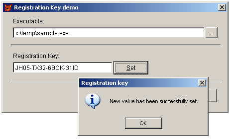

[ Home ](https://github.com/VFPX/Win32API)  

# Storing registration key in the resources of an executable file

## Short description:
This sample shows how to save a registration key -- actually it can be any binary data -- in the resources of any VFP application (executable file) any time after its compilation.

You know about "Other Files" section inside the Project Manager. I think, that would be handy to have a similar section named "Resources", where files like icons, bitmaps, sounds, strings and others could be added. And after the file compiled into an executable, they could be reached through the Resource API calls LoadResource, LoadString, LoadImage and so on.  
***  


## Before you begin:
This sample shows how to save a registration key -- *actually it can be any kind of data* -- in the resources of VFP executable file after its compilation.  

  

Choose an executable file to test this code with. Consider that its modification date and the file size may change due to the testing. Also note that Win32 process -- afaik -- cannot modify its executable file.  

See also:

* [How to display a user-defined icon in the MessageBox dialog](sample_500.md)  
  
***  


## Code:
```foxpro  
LOCAL oForm
oForm = CreateObject("Tform")
oForm.Show(1)
* end of main

DEFINE CLASS Tform As Form
#DEFINE RT_RCDATA 10  && Application-defined resource (raw data)

	Width=450
	Height=200
	BorderStyle=2
	Caption=" Registration Key demo"
	Autocenter=.T.
	MaxButton=.F.
	MinButton=.F.
	
	* recource type
	* should be either RT_RCDATA or any reasonable value
	* larger than any other standard resource type
	rctype=1000
	
	* resource identifier
	* MS suggests using resource identifiers instead of resource names
	rcindex=1  && could be anything in 1..0xffff range
	
	ADD OBJECT lbl1 As Label WITH Caption="Select EXE or DLL file:",;
	Left=20, Top=10, Autosize=.T.

	ADD OBJECT txtFile As TextBox WITH;
	Left=20, Top=30, Width=385, Height=22

	ADD OBJECT cmdFile As CommandButton WITH Caption="...",;
	Top=30, Left=407, Width=24, Height=22
	
	ADD OBJECT sh1 As Shape WITH Left=16, Width=422,;
	Top=64, Height=2, SpecialEffect=0

	ADD OBJECT lbl2 As Label WITH Caption="Registration Key:",;
	Left=20, Top=80, Autosize=.T.

	ADD OBJECT txtKey As TextBox WITH;
	Left=20, Top=100, Width=200, Height=22
	
	ADD OBJECT cmdSet As CommandButton WITH Caption="\<Set",;
	Left=222, Top=98, Width=70, Height=27, Enabled=.F.

	ADD OBJECT sh2 As Shape WITH Left=16, Width=422,;
	Top=140, Height=2, SpecialEffect=0

	ADD OBJECT cmdClose As CommandButton WITH Caption="\<Close",;
	Left=360, Top=154, Width=70, Height=27, Cancel=.T.
	
FUNCTION txtFile.When
RETURN .F.

FUNCTION txtKey.When
RETURN Len(ALLTRIM(ThisForm.txtFile.Value)) <> 0

PROCEDURE txtKey.InteractiveChange
	ThisForm.cmdSet.Enabled = .T.

PROCEDURE cmdClose.Click
	ThisForm.Release

PROCEDURE cmdSet.Click
	THIS.Enabled = ThisForm.SetRegKey()

PROCEDURE cmdFile.Click
	ThisForm.SelectFile

PROCEDURE SelectFile
	LOCAL cFile
	cFile = ThisForm.GetExeFile()
	IF Len(cFile) <> 0
		ThisForm.txtFile.Value = cFile
		IF Not ThisForm.GetRegKey()
			WAIT WINDOW NOWAIT "The registration key not found in this file. "
		ENDIF
		ThisForm.cmdSet.Enabled = .F.
	ENDIF

FUNCTION GetExeFile
	LOCAL cResult, cPath, cStoredPath
	cPath = SYS(5) + SYS(2003)
	cStoredPath = FULLPATH(THIS.txtFile.Value)
	cStoredPath = SUBSTR(cStoredPath, 1, RAT(Chr(92),cStoredPath)-1)
	SET DEFAULT TO (cStoredPath)
	cResult = GETFILE("Application:EXE;Library:DLL", "Get Executable:", "Open",0)
	SET DEFAULT TO (cPath)
RETURN LOWER(cResult)

FUNCTION SetRegKey
	LOCAL rc, lResult
	rc = CreateObject("Tresources", THIS.txtFile.Value)
	lResult = rc.SetResource(THIS.rctype, THIS.rcindex, THIS.txtKey.Value)
	IF lResult
		= MessageBox("New value has been successfully set.   ",;
			64, " Registration key")
	ELSE
		= MessageBox("An error occured when setting new value.   ",;
			48, " Registration key")
	ENDIF
RETURN lResult

FUNCTION GetRegKey
	LOCAL rc
	rc = CreateObject("Tresources", THIS.txtFile.Value)
	IF rc.GetResource(THIS.rctype, THIS.rcindex)
		THIS.txtKey.Value = rc.rcvalue
	ELSE
		THIS.txtKey.Value = ""
	ENDIF
RETURN (rc.errcode=0)
ENDDEFINE

DEFINE CLASS Tresources As Custom
PROTECTED preserved
	filename=""
	errcode=0
	syserrcode=0
	rcvalue=""
	preserved=""

PROCEDURE Init(cFilename)
	THIS.filename = m.cFilename

FUNCTION GetResource(nRcType, nRcIndex)
#DEFINE LOAD_LIBRARY_AS_DATAFILE  2
	DECLARE INTEGER FreeLibrary IN kernel32 INTEGER hLibModule
	DECLARE INTEGER LockResource IN kernel32 INTEGER hResData
	DECLARE INTEGER GetLastError IN kernel32

	DECLARE INTEGER LoadLibraryEx IN kernel32;
		STRING lpFileName, INTEGER hFile, INTEGER dwFlags

	DECLARE RtlMoveMemory IN kernel32 As CopyMemory;
		STRING @Dest, INTEGER Src, INTEGER nLen

	DECLARE INTEGER LoadResource IN kernel32;
		INTEGER hModule, INTEGER hResInfo

	DECLARE INTEGER SizeofResource IN kernel32;
		INTEGER hModule, INTEGER hResInfo

	DECLARE INTEGER FindResource IN kernel32;
		INTEGER hModule, INTEGER lpName, INTEGER lpType

	THIS.errcode = 0
	THIS.syserrcode = 0
	THIS.rcvalue=""

	LOCAL hModule, hInfo, nSize, hLoad, hLock, cBuffer
	hModule = LoadLibraryEx(THIS.filename, 0, LOAD_LIBRARY_AS_DATAFILE)

	IF hModule = 0
		THIS.syserrcode = GetLastError()
		THIS.errcode = 10
		RETURN ""
	ENDIF

	hInfo = FindResource(hModule, nRcIndex, nRcType)

	IF hInfo = 0
		THIS.syserrcode = GetLastError()
		THIS.errcode = 20
	ELSE
		nSize = SizeofResource(hModule, hInfo)
	   	hLoad = LoadResource(hModule, hInfo)
		hLock = LockResource(hLoad)
		cBuffer = Repli(Chr(0), nSize)
		= CopyMemory(@cBuffer, hLock, nSize)
		THIS.rcvalue = cBuffer
	ENDIF

	= FreeLibrary(hModule)
RETURN (THIS.errcode=0)

FUNCTION SetResource(nRcType, nRcIndex, cData)
	DECLARE INTEGER GetLastError IN kernel32

	DECLARE INTEGER BeginUpdateResource IN kernel32;
		STRING pFileName, INTEGER bDeleteExistingResources

	DECLARE INTEGER EndUpdateResource IN kernel32;
		INTEGER hUpdate, INTEGER fDiscard

	DECLARE INTEGER UpdateResource IN kernel32;
		INTEGER hUpdate, INTEGER lpType, INTEGER lpName,;
		INTEGER wLanguage, STRING lpData, INTEGER cbData

	THIS.errcode = 0
	THIS.rcvalue = m.cData

	LOCAL hUpdate, nResult
	THIS.PreserveLastTwoSections
	
	hUpdate = BeginUpdateResource(THIS.filename, 0)
	IF hUpdate = 0
		THIS.syserrcode = GetLastError()
		THIS.errcode = 110
		RETURN .F.
	ENDIF
	
	IF UpdateResource(hUpdate, nRcType, nRcIndex, 0, m.cData, Len(m.cData)) = 0
		THIS.syserrcode = GetLastError()
		THIS.errcode = 120
		RETURN .F.
	ENDIF

	IF EndUpdateResource(hUpdate, 0)=0
		THIS.errcode = 130
	ELSE
		THIS.RestoreLastTwoSections
	ENDIF
RETURN (THIS.errcode=0)

PROTECTED PROCEDURE PreserveLastTwoSections
* preserve two last sections of the executable
#DEFINE INVALID_HANDLE -1
	THIS.preserved=""

	LOCAL hFile, nOffset, nFileSize

	hFile = FOPEN(THIS.filename)
	IF hFile = INVALID_HANDLE
		THIS.errorcode=-1
		RETURN .F.
	ENDIF
	
	nFileSize = FSEEK(hFile, -4, 2) + 4
	nOffset = buf2dword(FREAD(hFile, 4))

	IF nOffset < nFileSize
		= FSEEK(hFile, -nOffset-4, 2)
		nOffset = nOffset + MAX(4,buf2dword(FREAD(hFile, 4)))

		IF nOffset < nFileSize
			= FSEEK(hFile, -nOffset, 2)
			THIS.preserved = FREAD(hFile, nOffset)
		ENDIF
	ENDIF
	
	= FCLOSE(hFile)

	IF EMPTY(STRTRAN(THIS.preserved,CHR(0),""))
		THIS.preserved=""
	ENDIF
RETURN .T.

PROTECTED PROCEDURE RestoreLastTwoSections
* restore two last sections of the executable
	IF NOT EMPTY(THIS.preserved)
		STRTOFILE(THIS.preserved, THIS.filename, 1)
	ENDIF

ENDDEFINE

FUNCTION buf2dword(cBuffer)
RETURN Asc(SUBSTR(cBuffer, 1,1)) + ;
	BitLShift(Asc(SUBSTR(cBuffer, 2,1)),  8) +;
	BitLShift(Asc(SUBSTR(cBuffer, 3,1)), 16) +;
	BitLShift(Asc(SUBSTR(cBuffer, 4,1)), 24)  
```  
***  


## Listed functions:
[BeginUpdateResource](../libraries/kernel32/BeginUpdateResource.md)  
[EndUpdateResource](../libraries/kernel32/EndUpdateResource.md)  
[FindResource](../libraries/kernel32/FindResource.md)  
[FreeLibrary](../libraries/kernel32/FreeLibrary.md)  
[GetLastError](../libraries/kernel32/GetLastError.md)  
[LoadLibraryEx](../libraries/kernel32/LoadLibraryEx.md)  
[LoadResource](../libraries/kernel32/LoadResource.md)  
[LockResource](../libraries/kernel32/LockResource.md)  
[SizeofResource](../libraries/kernel32/SizeofResource.md)  
[UpdateResource](../libraries/kernel32/UpdateResource.md)  

## Comment:
As the Win32 executable, the FoxPro application is able to access resources by their *types* and *identifiers* using API calls. There is a limitation: an executable can not modify its own resources. To add or modify resource data in an application a separate loader utility is required.  
  
You know about "Other Files" section inside the Project Manager. I think, that would be handy to have a similar section named "Resources", where files like icons, bitmaps, sounds, strings and others could be added. And after the file compiled into an executable, they could be reached through the Resource API calls LoadResource, LoadString, LoadImage and so on.  
  
* * *  
At first, this code truncated each and every VFP executable it was applied to, making the executables unusable. Everything in the code seemed to be correct, all API functions were called properly. The problem appeared to be with the VFP executable format itself.   
  
Good news came on Nov.23, 2005 with an article I spotted on Calvin Hsia's WebLog <a href="http://blogs.msdn.com/calvin_hsia/archive/2005/09/02/460206.aspx">Strongly typed methods and properties</a>.   
  
Calvin preserves two last sections of the executable before modifying its resources; and appends them back after the EndUpdateResource succeeds. Looks like it solves the truncation problem.  
  
From his code one may deduce that last DWORD in each section contains the size of this section. So far I have no idea whether it is a documented feature.  
  
* * *  
<a href="http://www.users.on.net/johnson/resourcehacker/">Resource Hacker</a> -- a freeware utility for viewing and modifying resources in 32bit Windows executables and resource files (*.res).   
  
<a href="http://www.smidgeonsoft.prohosting.com/pebrowse-pro-file-viewer.html">PEBrowse</a> is a browser and disassembler for Win32 executables and Microsoft .NET assemblies.  
  
  
***  

