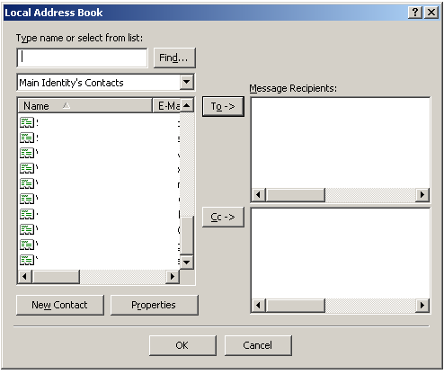

[ Home ](https://github.com/VFPX/Win32API)  

# Simple MAPI: how to pick an email recipient from Outlook Express address book

## Before you begin:
This sample code displays a standard address-list dialog box showing a list of email recipients:  
  
Selected address book entries will be stored in a cursor, including name and email address.  
  
***  


## Code:
```foxpro  
#DEFINE SUCCESS_SUCCESS 0
DO decl

PRIVATE nNewRecip, hNewRecip
LOCAL cPath, nResult, nColNum
cPath = SYS(5) + SYS(2003)
STORE 0 TO nNewRecip, hNewRecip
nColNum = 2  && valid range 0..4

nResult = MAPIAddress(0, GetActiveWindow(), "Local Address Book",;
	nColNum, Null, 0, Null, 0, 0, @nNewRecip, @hNewRecip)

DO CASE
CASE nResult = 1
* MAPI_E_USER_ABORT          1
	? "User abort."
CASE nResult <> SUCCESS_SUCCESS
* MAPI_E_LOGON_FAILURE       3
* MAPI_E_INSUFFICIENT_MEMORY 5
* MAPI_E_INVALID_SESSION     19
* MAPI_E_INVALID_EDITFIELDS  24
* MAPI_E_INVALID_RECIPS      25
* MAPI_E_NOT_SUPPORTED       26
	? "Error code:", nResult
CASE nNewRecip = 0
	? "No recipients chosen."
OTHER
	DO ShowRecip
ENDCASE

= MAPIFreeBuffer(hNewRecip)
SET DEFAULT TO (cPath)

IF USED("csResult")
	SELECT csResult
	GO TOP
	BROW NORMAL NOWAIT
ENDIF
* end of main

PROCEDURE ShowRecip
*|typedef struct {
*|     ULONG ulReserved      0:4
*|     ULONG ulRecipClass;   4:4
*|     LPTSTR lpszName;      8:4
*|     LPTSTR lpszAddress;  12:4
*|     ULONG ulEIDSize;     16:4
*|     LPVOID lpEntryID;    20:4
*|} MapiRecipDesc, FAR *lpMapiRecipDesc; total 24 bytes
#DEFINE MapiRecipDesc_SIZE  24
#DEFINE DefNameSize         64

	CREATE CURSOR csResult (RecipClass I, RecipID I,;
		RecipName C(DefNameSize), RecpiAddr C(DefNameSize))

	LOCAL cBuffer, nBufsize, nIndex, cRecip,;
		nClass, hNamePtr, hAddrPtr, nEIDSize,;
		hEntryIDPtr, nEntryID, cName, cAddress

	nBufsize =  nNewRecip * MapiRecipDesc_SIZE
	cBuffer = Repli(Chr(0), nBufsize)
	= CopyMemory(@cBuffer, hNewRecip, nBufsize)
	
	FOR nIndex=1 TO nNewRecip
		cRecip = SUBSTR(cBuffer, (nIndex-1)*MapiRecipDesc_SIZE+1,;
			MapiRecipDesc_SIZE)
		nClass = buf2dword(SUBSTR(cRecip, 5,4))

		nEIDSize = buf2dword(SUBSTR(cRecip, 17,4))
		hEntryIDPtr = buf2dword(SUBSTR(cRecip, 21,4))

		IF nEIDSize <> 0
			nEntryID = Repli(Chr(0), nEIDSize)
			= CopyMemory(@nEntryID, hEntryIDPtr, nEIDSize)
			nEntryId = buf2dword(nEntryID)
		ENDIF

		hNamePtr = buf2dword(SUBSTR(cRecip, 9,4))
		cName = Repli(Chr(0), DefNameSize)
		= CopyMemory(@cName, hNamePtr, DefNameSize)
		cName = SUBSTR(cName, 1,AT(Chr(0),cName)-1)

		hAddrPtr = buf2dword(SUBSTR(cRecip, 13,4))
		cAddress = Repli(Chr(0), DefNameSize)
		= CopyMemory(@cAddress, hAddrPtr, DefNameSize)
		cAddress = SUBSTR(cAddress, 1,AT(Chr(0),cAddress)-1)
		
		INSERT INTO csResult VALUES (;
			m.nClass, m.nEntryId, m.cName, m.cAddress)
	ENDFOR

PROCEDURE decl
	DECLARE INTEGER MAPIAddress IN mapi32;
		INTEGER lhSession, INTEGER ulUIParam, STRING lpszCaption,;
		INTEGER nEditFields, STRING lpszLabels, INTEGER nRecips,;
		STRING @lpRecips, INTEGER flFlags, INTEGER ulReserved,;
		INTEGER @lpnNewRecips, INTEGER @lppNewRecips

	DECLARE INTEGER MAPIFreeBuffer IN mapi32 INTEGER pv
	DECLARE INTEGER GetActiveWindow IN user32

	DECLARE RtlMoveMemory IN kernel32 As CopyMemory;
		STRING @Destination, INTEGER Source, INTEGER nLength

FUNCTION buf2dword(lcBuffer)
RETURN Asc(SUBSTR(lcBuffer, 1,1)) + ;
	BitLShift(Asc(SUBSTR(lcBuffer, 2,1)),  8) +;
	BitLShift(Asc(SUBSTR(lcBuffer, 3,1)), 16) +;
	BitLShift(Asc(SUBSTR(lcBuffer, 4,1)), 24)  
```  
***  


## Listed functions:
[GetActiveWindow](../libraries/user32/GetActiveWindow.md)  
[MAPIAddress](../libraries/mapi32/MAPIAddress.md)  
[MAPIFreeBuffer](../libraries/mapi32/MAPIFreeBuffer.md)  


***  

