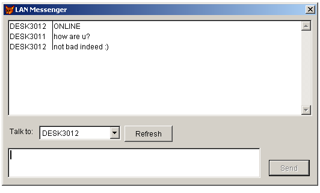

[ Home ](https://github.com/VFPX/Win32API)  

# Peer-to-peer LAN messenger built with Mailslot API functions

## Before you begin:
Run this example simultaneously on several computers on a network. All users will be able to exchange plain text messages.  
  
A light-weight solution with no central server, no file sharing, and no access violation, but with automatic user detection.   

Note that the communication may require ports 137 to 139 opened on each side. No further configuration is required except the setting a name for the mailslot. Same name have to be used by all participating applications.  

A timer control is set to check for inbound messages.  

See also:

* [Using mailslots to send messages on the network](sample_269.md)  
* [Using the NetMessageBufferSend to send messages on the network](sample_494.md)  
* [How to create non-blocking Winsock server](sample_412.md)  
* [A client for testing non-blocking Winsock server](sample_413.md)  
* [Using named pipes to pass data between processes](sample_522.md)  
* [Using WM_COPYDATA for interprocess communication](sample_536.md)  
  
***  


## Code:
```foxpro  
oForm = CreateObject("Tform")
oForm.Show(1)
* end of main

DEFINE CLASS Tform As Form
	Width=520
	Height=280
	Caption="LAN Messenger"
	BorderStyle=2
	MaxButton=.F.
	MinButton=.F.
	Autocenter=.T.
	ADD OBJECT msg As Tmsg WITH Left=5, Top=5

PROCEDURE Init
	* a mailslot name automatically keeps all LAN users together in a group;
	* currently "foxapp" name is used, in fact it might be any valid file name
	* except some reserved names like "Messngr" or "BROWSE"
	THIS.msg.TurnOn("foxapp")
ENDDEFINE

DEFINE CLASS Tmsg As Container
#DEFINE INVALID_HANDLE_VALUE -1
#DEFINE OPEN_EXISTING         3
#DEFINE GENERIC_WRITE         0x40000000
#DEFINE FILE_SHARE_READ       1
#DEFINE FILE_ATTRIBUTE_NORMAL 128
#DEFINE REFRESH_INTERVAL      1000  && timer interval
#DEFINE MAX_MESSAGE_SIZE      250
#DEFINE READ_TIMEOUT          500
#DEFINE NAME_SIZE             24
#DEFINE MSGID_SIZE            12
#DEFINE MSGHEADER_SIZE        NAME_SIZE+MSGID_SIZE+2

	Width=510
	Height=340
	BorderWidth=0
	csLog=""
	msHandle=INVALID_HANDLE_VALUE
	msName=""
	localname=""
	lastmessage=""
	msgID=0

	ADD OBJECT lstIn As ListBox WITH Left=2, Top=2, Width=506,;
		Height=160, ColumnCount=2, ColumnWidths="70, 630"
	ADD OBJECT lbl1 As Label WITH;
		Left=5, Top=180, Autosize=.T., Caption="Talk to:"
	ADD OBJECT cmbOnline As ComboBox WITH;
		Left=54, Top=178, Width=136, Style=2
	ADD OBJECT cmdRefresh As CommandButton WITH;
		Left=196, Top=178, Width=80, Height=27, Caption="Refresh"
	ADD OBJECT txtOut As EditBox WITH;
		Left=2, Top=215, Width=420, Height=50, Scrollbars=0
	ADD OBJECT cmdSend As CommandButton WITH Default=.T.,;
		Left=436, Top=235, Width=68, Height=27, Caption="Send", Enabled=.F.

	* timer is used to check for incoming messages
	ADD OBJECT tm As Timer WITH Interval=0

PROCEDURE Init
	THIS.decl
	THIS.csLog = "log" + SUBSTR(SYS(2015), 3,10) && log cursor
	THIS.localname = SUBS(SYS(0), 1,AT(" ",SYS(0))-1) && machine name
	THIS.msgID = GetTickCount() && initial message ID

PROCEDURE Destroy
	THIS.TurnOff

PROCEDURE tm.Timer
	IF THIS.Parent.msHandle <> INVALID_HANDLE_VALUE
		THIS.Parent.GetMessages  && checking for incoming messages
	ENDIF

PROCEDURE cmdRefresh.Click
	THIS.Parent.SendMessage("*", "DETECT", .T., .T.)

PROCEDURE cmdSend.Click
	THIS.Parent.OnSendMessage
	THIS.Enabled=.F.

PROCEDURE txtOut.InteractiveChange
	THIS.Parent.cmdSend.Enabled = THIS.Parent.ReadyToSend()

PROCEDURE ReadyToSend
RETURN THIS.msHandle <> INVALID_HANDLE_VALUE;
	And Not EMPTY(THIS.txtOut.Value);
	And Not EMPTY(THIS.cmbOnline.Value)

PROCEDURE OnUserStatus(cUsername, lActive)
	WITH THIS.cmbOnline
		.Value = m.cUsername
		IF m.lActive
			IF .ListIndex = 0
				.AddItem(m.cUsername)
				.ListIndex = .ListCount
			ENDIF
		ELSE
			IF .ListIndex <> 0
				.RemoveItem(.ListIndex)
				.ListIndex = 1
			ENDIF
		ENDIF
	ENDWITH	
	THIS.cmdSend.Enabled = THIS.ReadyToSend()

PROCEDURE OnSendMessage
	THIS.SendMessage(THIS.cmbOnline.Value,;
		ALLTRIM(THIS.txtOut.Value), .T., .F.)
	THIS.txtOut.Value = ""
	THIS.txtOut.SetFocus

PROCEDURE TurnOff
* disconnecting from the group
	THIS.tm.Interval = 0
	IF THIS.msHandle <> INVALID_HANDLE_VALUE
		THIS.SendMessage("*", "OFFLINE", .F., .T.)
		= CloseHandle(THIS.msHandle)
		THIS.msHandle = INVALID_HANDLE_VALUE
	ENDIF

PROCEDURE TurnOn(cMailslot)
* connecting to the group defined by cMailslot
	THIS.TurnOff

	cMailslot = UPPER(ALLTRIM(m.cMailslot))
	THIS.msHandle = CreateMailslot("\\.\mailslot\" + m.cMailslot,;
		MAX_MESSAGE_SIZE, READ_TIMEOUT, 0)

	IF THIS.msHandle <> INVALID_HANDLE_VALUE
		THIS.msName = cMailslot
		* sending ONLINE and DETECT messages to everyone -- *
		THIS.SendMessage("*", "DETECT", .T., .T.)
		THIS.SendMessage("*", "ONLINE", .F., .T.)
		THIS.tm.Interval = REFRESH_INTERVAL
	ENDIF
RETURN (THIS.msHandle <> INVALID_HANDLE_VALUE)

PROCEDURE CheckLog
	IF Not USED(THIS.csLog)
		CREATE CURSOR (THIS.csLog) (sender C(NAME_SIZE),;
			recipient C(NAME_SIZE), msgid I, dt T, confreq L, sysmsg L,;
			confirmed L, msgbody C(250))
	ENDIF
	SELECT (THIS.csLog)

PROCEDURE DisplayMessage(cSender, cMsgBody)
	WITH THIS.lstIn
		.AddItem(m.cSender)
		.List(.ListCount, 2) = m.cMsgBody
		.ListIndex = .ListCount
	ENDWITH

PROCEDURE SendMessage(cRecipient, cMsgBody, lConfReq, lSysMsg)
* params: recipient, message body, needs confirmation, system message
	LOCAL cTargetName, hFile, cMsg, nBytesWritten
	nBytesWritten = 0
	
	* mailslot name for the recipient
	cTargetName = "\\" + ALLTRIM(UPPER(cRecipient)) +;
		"\mailslot\" + THIS.msName

	* obtaining a handle to mailslot, same as for a regular file
	hFile = CreateFile(cTargetName, GENERIC_WRITE, FILE_SHARE_READ,;
		0, OPEN_EXISTING, FILE_ATTRIBUTE_NORMAL, 0)

	IF hFile <> INVALID_HANDLE_VALUE
		THIS.msgID = THIS.msgID + 1

		* assembling a message:
		* sender, message ID, body, needs to be confirmed, system message
		cMsg = PADR(THIS.localname, NAME_SIZE) +;
			STR(THIS.msgID, MSGID_SIZE) +;
			Iif(m.lConfReq, "1","0") + Iif(m.lSysMsg, "1","0") +;
			m.cMsgBody

		* writing to the mailslot using the handle obtained with CreateFile
		= WriteFile(hFile, m.cMsg, Len(m.cMsg), @nBytesWritten, 0)
		= CloseHandle(hFile)
		
		* saving sent message in a log
		THIS.CheckLog
		APPEND BLANK
		REPLACE sender WITH THIS.localname, recipient WITH m.cRecipient,;
			msgid WITH THIS.msgID, dt WITH datetime(),;
			confreq WITH m.lConfReq, sysmsg WITH m.lSysMsg,;
			msgbody WITH m.cMsgBody, confirmed WITH .F.

		IF Not m.lSysMsg
			THIS.DisplayMessage(THIS.localname, m.cMsgBody)
		ENDIF
	ENDIF

PROCEDURE GetMessages  && reads inbound messages from a buffer
	LOCAL nResult, nMsgSize, nNextSize, nMsgCount, nTimeout,;
		cBuffer, nBytesRead
	DO WHILE .T.
		STORE 0 TO nMsgSize, nNextSize, nMsgCount, nTimeout
		nResult = GetMailslotInfo(THIS.msHandle, @nMsgSize,;
			@nNextSize, @nMsgCount, @nTimeout)

		IF nResult <= 0 Or nMsgCount = 0
			EXIT
		ENDIF
		
		cBuffer = Repli(Chr(0), nNextSize)
		nBytesRead = 0
		nResult = ReadFile(THIS.msHandle, @cBuffer, nNextSize, @nBytesRead, 0)
		IF nResult <> 0 And Len(m.cBuffer) >= MSGHEADER_SIZE
			THIS.lastmessage = m.cBuffer
			THIS.OnInboundMsg
		ENDIF
	ENDDO

PROCEDURE OnInboundMsg
	LOCAL cSender, nMsgId, lConfReq, lSysMsg, cMsgBody, nConfId
	cSender = SUBSTR(THIS.lastmessage, 1, NAME_SIZE)
	IF m.cSender = THIS.localname
		RETURN
	ENDIF

	nMsgId = VAL(SUBSTR(THIS.lastmessage, NAME_SIZE+1, MSGID_SIZE))
	lConfReq = (SUBSTR(THIS.lastmessage, NAME_SIZE+MSGID_SIZE+1, 1) = "1")
	lSysMsg = (SUBSTR(THIS.lastmessage, NAME_SIZE+MSGID_SIZE+2, 1) = "1")
	cMsgBody = SUBSTR(THIS.lastmessage, MSGHEADER_SIZE+1)

	* storing inbound message in a log
	THIS.CheckLog
	LOCATE ALL FOR sender = m.cSender And msgid = m.nMsgId
	IF Not FOUND()
		APPEND BLANK
		REPLACE sender WITH m.cSender, recipient WITH THIS.localname,;
			msgid WITH m.nMsgId, dt WITH datetime(),;
			confreq WITH m.lConfReq, sysmsg WITH m.lSysMsg,;
			msgbody WITH m.cMsgBody

		DO CASE
		CASE Not m.lSysMsg
			THIS.SendMessage(m.cSender, "CONF "+LTRIM(STR(m.nMsgId)), .F., .T.)
			THIS.DisplayMessage(m.cSender, m.cMsgBody)

		CASE AT("CONF", m.cMsgBody) = 1
			nConfId = VAL(SUBSTR(m.cMsgBody, Len("CONF")+2))
			THIS.CheckLog
			LOCATE ALL FOR sender = THIS.localname;
				And msgid = m.nConfId And Not confirmed
			IF FOUND()
				REPLACE confirmed WITH .T.
			ENDIF

		CASE INLIST(m.cMsgBody, "ONLINE", "OFFLINE")
			THIS.DisplayMessage(m.cSender, m.cMsgBody)

		CASE m.cMsgBody = "DETECT"
			THIS.SendMessage(m.cSender, "ONLINE", .F., .T.)
		ENDCASE
		
		THIS.OnUserStatus(m.cSender, (m.cMsgBody <> "OFFLINE"))
	ENDIF

PROCEDURE decl
	DECLARE INTEGER CloseHandle IN kernel32 INTEGER
	DECLARE INTEGER GetTickCount IN kernel32
	DECLARE INTEGER GetLastError IN kernel32

	DECLARE INTEGER CreateMailslot IN kernel32;
		STRING lpName, INTEGER nMaxMessageSize,;
		INTEGER lReadTimeout, INTEGER lpSecurityAttributes

	DECLARE INTEGER GetMailslotInfo IN kernel32;
		INTEGER hMailslot, INTEGER @lpMaxMessageSize,;
		INTEGER @lpNextSize, INTEGER @lpMessageCount,;
		INTEGER @lpReadTimeout

	DECLARE INTEGER CreateFile IN kernel32;
		STRING lpFileName, INTEGER dwDesiredAccess,;
		INTEGER dwShareMode, INTEGER lpSecurityAttr,;
		INTEGER dwCreationDisp, INTEGER dwFlagsAndAttr, INTEGER hTplFile

	DECLARE INTEGER WriteFile IN kernel32;
		INTEGER hFile, STRING lpBuffer, INTEGER nBt2Write,;
		INTEGER @lpBtWritten, INTEGER lpOverlapped

	DECLARE INTEGER ReadFile IN kernel32;
		INTEGER hFile, STRING @lpBuffer, INTEGER nBytesToRead,;
		INTEGER @lpBytesRead, INTEGER lpOverlapped

ENDDEFINE  
```  
***  


## Listed functions:
[CloseHandle](../libraries/kernel32/CloseHandle.md)  
[CreateFile](../libraries/kernel32/CreateFile.md)  
[CreateMailslot](../libraries/kernel32/CreateMailslot.md)  
[GetLastError](../libraries/kernel32/GetLastError.md)  
[GetMailslotInfo](../libraries/kernel32/GetMailslotInfo.md)  
[GetTickCount](../libraries/kernel32/GetTickCount.md)  
[ReadFile](../libraries/kernel32/ReadFile.md)  
[WriteFile](../libraries/kernel32/WriteFile.md)  

## Comment:
Mailslot name -- in this sample code "foxapp" -- practically keeps all users together. Any other valid file name is appropriate, except some reserved names like "Messengr",  "BROWSER" etc.  
  
A mailslot with name **\\.\mailslot\foxapp** is created on each computer. That turns such a computer into server receiving messages sent to this mailslot from other computers.  
  
A computer name is obtained through **SYS(0)** function.   
  
* * *  
On start the Tmsg instance creates a mailslot with a name "foxapp", same name for all users in this group should be used: \\.\maislot\foxapp.   
  
Then Tmsg broadcasts ONLINE and DETECT messages to all available network computers, using wildcard character * as a destination mailslot name: \\*\mailslot\foxapp.  
  
On receiving DETECT message any existing Tmsg instance automatically sends ONLINE message back to the sender. That is how the new object gets know who else is online.  
  
On termination the Tmsg instance broadcasts OFFLINE message to all users -- again the wildcard character is used -- to let everyone know that this user is disconnected.  
  
Maislots provide no confirmation of receipt. For that reason the Tmsg object on receiving a message automatically sends a confirmation back to the sender.  
  
For sending a message to another computer -- say with DESK3011 name -- the Tmsg object creates file handle using mailslot name \\DESK3011\Maislot\foxapp, and writes message data to this handle using WriteFile function.  
  
A message has a simple format:  
* sender - 24 bytes -- local computer name  
* confirmation flag - 1 byte  
* system message flag - 1 byte  
* message body - the rest of the message  
  
The GetMessages method is invoked on each Timer event checking for incoming messages.  
  
***  

