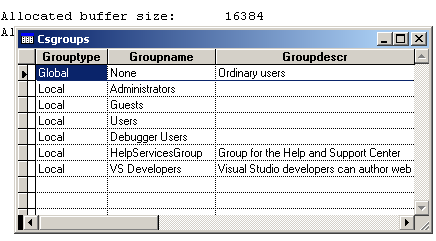

[ Home ](https://github.com/VFPX/Win32API)  

# Enumerating global and local group accounts on a server (WinNT/XP/2K)

## Before you begin:
  
See also:

* [Obtaining names of local and global groups for the current user (WinNT/XP/2K)](sample_431.md)  
* [Enumerating sessions established on a server](sample_505.md)  

  
***  


## Code:
```foxpro  
*cServer = "MyServer"
cServer = Null  && local computer
CREATE CURSOR cs (grouptype C(10), groupname C(32), groupdescr C(250))

gr = CreateObject("Tgroups", cServer, .T.)
FOR nIndex=1 TO gr.groupcount
	INSERT INTO cs VALUES ("Global", gr.g[nIndex,1], gr.g[nIndex,2])
ENDFOR

gr.SetMode(,.F.)
FOR nIndex=1 TO gr.groupcount
	INSERT INTO cs VALUES ("Local", gr.g[nIndex,1], gr.g[nIndex,2])
ENDFOR

SELECT cs
GO TOP
BROWSE NORMAL NOWAIT
* end of main

DEFINE CLASS Tgroups As Custom
	globalmode=.F.  && local
	server=""
	DIMEN g[64,2]
	groupcount=0
	errorcode=0

PROCEDURE Init(cServer, lMode)
	THIS.decl
	THIS.SetMode(cServer, lMode)

PROCEDURE SetMode(cServer, lMode)
	IF VARTYPE(cServer)="C" And Not EMPTY(cServer)
		THIS.server = cServer
	ENDIF
	THIS.globalmode=lMode
	THIS.GetGroups

PROCEDURE GetGroups
#DEFINE INFO_1_SIZE  8
#DEFINE MAX_PREFERRED_LENGTH -1
#DEFINE NERR_Success 0

	LOCAL nResult, nBuffer, nReadCnt, nTotalCnt, nBufsize,;
		cBuffer, nName, nComment, nIndex, cName, cComment

	STORE 0 TO THIS.groupcount, nBuffer, nReadCnt, nTotalCnt, THIS.errorcode

	IF THIS.globalmode
		nResult = NetGroupEnum(THIS.sconv(THIS.server), 1, @nBuffer,;
			MAX_PREFERRED_LENGTH, @nReadCnt, @nTotalCnt, 0)
	ELSE
		nResult = NetLocalGroupEnum(THIS.sconv(THIS.server), 1, @nBuffer,;
			MAX_PREFERRED_LENGTH, @nReadCnt, @nTotalCnt, 0)
	ENDIF

	IF nResult <> NERR_Success
		THIS.errorcode = nResult
		RETURN
	ENDIF

	nBufsize = 0
	= NetApiBufferSize(nBuffer, @nBufsize)

	nBufsize = nReadCnt * INFO_1_SIZE
	cBuffer = Repli(Chr(0), nBufsize)
	= CopyMemory(@cBuffer, nBuffer, nBufsize)

	FOR nIndex=1 TO nReadCnt
		nName = buf2dword(SUBSTR(cBuffer, (nIndex-1)*INFO_1_SIZE+1, 4))
		nComment = buf2dword(SUBSTR(cBuffer, (nIndex-1)*INFO_1_SIZE+5, 4))

		cName = Iif(nName=0, "", THIS.GetStrFromMem(nName))
		cComment = Iif(nComment=0, "", THIS.GetStrFromMem(nComment))
		
		THIS.groupcount=THIS.groupcount + 1
		THIS.g[THIS.groupcount,1]=cName
		THIS.g[THIS.groupcount,2]=cComment
	ENDFOR
	= NetApiBufferFree(nBuffer)

FUNCTION GetStrFromMem(nAddr)
#DEFINE BUF_SIZE  128
	LOCAL cBuffer
	cBuffer = Repli(Chr(0), BUF_SIZE)
	= CopyMemory(@cBuffer, nAddr, BUF_SIZE)
	cBuffer = SUBSTR(cBuffer, 1, AT(Chr(0)+Chr(0),cBuffer)-1)
RETURN STRTRAN(cBuffer, Chr(0),"")

FUNCTION sconv(cStr)
RETURN StrConv(cStr+Chr(0),5)

PROCEDURE decl
	DECLARE INTEGER NetApiBufferFree IN netapi32 INTEGER Buffer

	DECLARE INTEGER NetGroupEnum IN netapi32;
		STRING srvname, INTEGER lvl, INTEGER @bufptr,;
		INTEGER prefmaxlen, INTEGER @entriesread,;
		INTEGER @totalentries, INTEGER resume_handle

	DECLARE INTEGER NetLocalGroupEnum IN netapi32;
		STRING srvname, INTEGER lvl, INTEGER @bufptr,;
		INTEGER prefmaxlen, INTEGER @entriesread,;
		INTEGER @totalentries, INTEGER resume_handle

	DECLARE RtlMoveMemory IN kernel32 As CopyMemory;
		STRING @dst, INTEGER src, INTEGER nLen

	DECLARE INTEGER NetApiBufferSize IN netapi32;
		INTEGER Buffer, INTEGER @ByteCount
ENDDEFINE

FUNCTION buf2dword(lcBuffer)
RETURN Asc(SUBSTR(lcBuffer, 1,1)) + ;
	BitLShift(Asc(SUBSTR(lcBuffer, 2,1)),  8) +;
	BitLShift(Asc(SUBSTR(lcBuffer, 3,1)), 16) +;
	BitLShift(Asc(SUBSTR(lcBuffer, 4,1)), 24)  
```  
***  


## Listed functions:
[NetApiBufferFree](../libraries/netapi32/NetApiBufferFree.md)  
[NetApiBufferSize](../libraries/netapi32/NetApiBufferSize.md)  
[NetGroupEnum](../libraries/netapi32/NetGroupEnum.md)  
[NetLocalGroupEnum](../libraries/netapi32/NetLocalGroupEnum.md)  

## Comment:
See WinNT commands  
NET GROUP  
NET LOCALGROUP  
  
***  

