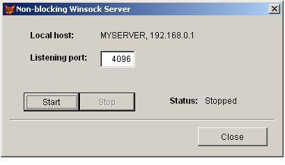

[ Home ](https://github.com/VFPX/Win32API)  

# How to create non-blocking Winsock server

## Before you begin:
  

When you press **Start** button the program creates a **s****ocket** binding to the selected port and places it in a state in which it is listening for an incoming connection.  

Detecting a client, the server permits incoming connection, obtains the handle to a new socket, and receives incoming data if any.  

After pressing the **Stop** button sometimes you have to wait 2-3 seconds for the server to stop. Several DOEVENT commands are inserted into server cycle.  

The server processes requests from clients. That means you need a Winsock client program to communicate with the server.  

Run the [client part for this server](sample_413.md) on any other computer connected to your network, or even on the same computer, which runs the Winsock server. A client program initiates a network connection using IP address and listening port of the server.  

See also:

* [A client for testing non-blocking Winsock server](sample_413.md)  
* [How to build UDP responder](sample_052.md)  
* [Using mailslots to send messages on the network](sample_269.md)  
* [Using the NetMessageBufferSend to send messages on the network](sample_494.md)  
* [Peer-to-peer LAN messenger built with Mailslot API functions](sample_410.md)  
* [Using WM_COPYDATA for interprocess communication](sample_536.md)  
  
***  


## Code:
```foxpro  
LOCAL oSrv
oSrv = CreateObject("Tform")
oSrv.Show(1)
* end of main

DEFINE CLASS Tform As Form
	Width=400
	Height=200
	BorderStyle=2
	MaxButton=.F.
	MinButton=.F.
	Autocenter=.T.
	Caption="Non-blocking Winsock Server"
	
	ListeningSocket=0
	LocalName=""
	LocalIP=""
	ServerOn=.F.
	
	ADD OBJECT cmdStart As CommandButton WITH Default=.T.,;
	LEFT=30, Top=110, Width=80, Height=27, Caption="Start"

	ADD OBJECT cmdStop As CommandButton WITH Default=.T.,;
	LEFT=110, Top=110, Width=80, Height=27, Caption="Stop"
	
	ADD OBJECT shape1 As Shape WITH SpecialEffect=0,;
	Left=10, Width=380, Top=148, Height=2

	ADD OBJECT cmdClose As CommandButton WITH Cancel=.T.,;
	LEFT=280, Top=160, Width=100, Height=27, Caption="Close"
	
	ADD OBJECT lbl1 As Label WITH FontBold=.T.,;
	Left=40, Top=20, Autosize=.T., Caption="Local host:"

	ADD OBJECT lblHost As Label WITH;
	Left=140, Top=20, Autosize=.T., Caption="not defined"

	ADD OBJECT lbl2 As Label WITH FontBold=.T.,;
	Left=40, Top=52, Autosize=.T., Caption="Listening port:"
	
	ADD OBJECT txtPort As TextBox WITH;
	Left=140, Top=50, Width=50, Height=24, Value=4096
	
	ADD OBJECT lbl3 As Label WITH FontBold=.T.,;
	Left=240, Top=114, Autosize=.T., Caption="Status:"

	ADD OBJECT lblStatus As Label WITH;
	Left=290, Top=114, Autosize=.T.

PROCEDURE Init
	THIS.decl
	IF Not THIS.InitWinsock()
		= MessageB("Could not init Winsock library.     ", 48, "Error")
		RETURN .F.
	ENDIF
	THIS.GetLocalIP
	THIS.lblHost.Caption = THIS.LocalName + ", " + THIS.LocalIP
	THIS.StopServer

PROCEDURE Destroy
	DECLARE INTEGER WSACleanup IN ws2_32
	= WSACleanup()

PROCEDURE cmdClose.Click
	ThisForm.ServerOn = .F.
	DOEVENTS
	ThisForm.Release

PROCEDURE cmdStart.Click
	WITH ThisForm
		IF .StartServer()
			.DoCycle
		ELSE
			.StopServer()
		ENDIF
	ENDWITH
	
PROCEDURE cmdStop.Click
	ThisForm.ServerOn = .F.

PROCEDURE StartServer
#DEFINE AF_INET         2
#DEFINE SOCK_STREAM     1
#DEFINE IPPROTO_TCP     6
#DEFINE SOCKET_ERROR   -1
#DEFINE INVALID_SOCKET  0
#DEFINE SOMAXCONN       0x7FFFFFFF

	ThisForm.lblStatus.Caption = "Starting..."

	DECLARE INTEGER socket IN ws2_32;
		INTEGER af, INTEGER socktype, INTEGER protocol

	DECLARE INTEGER bind IN ws2_32 As ws_bind;
		INTEGER s, STRING @sockaddr, INTEGER namelen

	DECLARE INTEGER listen IN ws2_32 INTEGER s, INTEGER backlog

	THIS.ListeningSocket = socket(AF_INET, SOCK_STREAM, IPPROTO_TCP)
	IF THIS.ListeningSocket = INVALID_SOCKET
		RETURN .F.
	ENDIF

	LOCAL cBuffer, nError
	cBuffer = THIS.GetBindBuf(THIS.LocalIP, THIS.txtPort.Value)
	IF ws_bind(THIS.ListeningSocket, @cBuffer, Len(cBuffer)) <> 0
		nError = WSAGetLastError()
		= MessageB("Could not bind a socket " +;
			"to the selected port.     " + Chr(13) +;
			"Winsock error code: " + LTRIM(STR(nError)), 48, "Error")
		RETURN .F.
	ENDIF

	= listen(THIS.ListeningSocket, SOMAXCONN)
	WITH ThisForm
		.cmdStart.Enabled=.F.
		.txtPort.Enabled=.F.
		.cmdStop.Enabled=.T.
		.lblStatus.Caption="Running"
	ENDWITH
RETURN .T.

PROCEDURE StopServer
	WITH ThisForm
		.cmdStart.Enabled=.T.
		.txtPort.Enabled=.T.
		.cmdStop.Enabled=.F.
		.lblStatus.Caption="Stopped"
	ENDWITH
	IF THIS.ListeningSocket <> 0
		= closesocket(THIS.ListeningSocket)
		THIS.ListeningSocket = 0
	ENDIF

PROCEDURE DoCycle
	THIS.ServerOn = .T.
	DO WHILE THIS.ServerOn
		DOEVENTS
		THIS.AcceptCall
		DOEVENTS
	ENDDO
	THIS.StopServer

PROCEDURE AcceptCall
#DEFINE READ_SIZE 0xffff

	IF Not THIS.IsDataAvailable()
		RETURN
	ENDIF
	
	IF Not USED("csRecv")
		CREATE CURSOR csRecv (dt T, IP C(15), port I, sz I, body M)
	ENDIF

	LOCAL hNewsock, cBuffer, nBufsize, nError, cRecv, nRecv,;
		nFlags, nClientPort, cClientIP
	nBufsize = 64
	cBuffer = Repli(Chr(0), nBufsize)
	hNewsock = accept(THIS.ListeningSocket, @cBuffer, @nBufsize)

	IF hNewsock <> INVALID_SOCKET
		nClientPort = Asc(SUBSTR(cBuffer, 3,1)) * 256 +;
			Asc(SUBSTR(cBuffer, 4,1))
		cClientIP = inet_ntoa(buf2dword(SUBSTR(cBuffer,5,4)))

		ACTI SCREEN
		? ">> conn accepted from " + cClientIP +;
			", remote port " + LTRIM(STR(nClientPort))

		cBuffer = ""
		DO WHILE .T.
			cRecv = Repli(Chr(0), READ_SIZE)
			nRecv = recv(hNewsock, @cRecv, READ_SIZE, 0)
			IF nRecv = 0
				EXIT
			ELSE
				ACTI SCREEN
				?? "."
				cBuffer = cBuffer + LEFT(cRecv, nRecv)
			ENDIF
		ENDDO

		IF Len(cBuffer) <> 0
			ACTI SCREEN
			?? " " + LTRIM(STR(Len(cBuffer))) + " bytes received."
			INSERT INTO csRecv VALUES (datetime(), cClientIP, nClientPort,;
				Len(cBuffer), cBuffer)
		ENDIF

		= closesocket(hNewsock)
	ENDIF
	DOEVENTS

FUNCTION IsDataAvailable
	LOCAL cRead, cWrite, cError, nCount, cTimeout
	STORE num2dword(1) + num2dword(THIS.ListeningSocket) TO;
		cRead, cWrite, cError
	cTimeout = num2dword(2) + num2dword(1)
	nCount = ws_select(0, @cRead, @cWrite, @cError, @cTimeout)
RETURN nCount <> 0 And (buf2dword(SUBSTR(cRead,1,4)) > 0)

FUNCTION GetBindBuf(cIP, nPort)
	LOCAL cBuffer, cPort, cHost
	cPort = num2word(BitClear(htons(nPort),16))
	cHost = num2dword(inet_addr(cIP))
RETURN num2word(AF_INET) + cPort + cHost + Repli(Chr(0),8)

PROCEDURE GetLocalIP
#DEFINE HOSTENT_SIZE  16
#DEFINE SOCKET_ERROR  -1
	DECLARE INTEGER gethostbyname IN ws2_32 STRING hostname
	DECLARE INTEGER gethostname IN ws2_32 STRING @hstname, INTEGER namlen
	DECLARE RtlMoveMemory IN kernel32 As CopyMemory;
		STRING @dst, INTEGER src, INTEGER nLen

	LOCAL cBuffer, nResult, nAddr
	cBuffer = Repli(Chr(0), 250)
	nResult = gethostname(@cBuffer, Len(cBuffer))
	THIS.LocalName = Iif(nResult=0, SUBSTR(cBuffer, 1,AT(Chr(0),cBuffer)-1), "")

	nAddr = gethostbyname(THIS.LocalName)
	IF nAddr <> 0
		cBuffer = Repli(Chr(0), HOSTENT_SIZE)
		= CopyMemory(@cBuffer, nAddr, HOSTENT_SIZE)
		nAddr = buf2dword(SUBSTR(cBuffer, 13,4)) && ptr to list of addresses
		cBuffer = Repli(Chr(0), 4)
		= CopyMemory(@cBuffer, nAddr, 4)
		nAddr = buf2dword(cBuffer)
		= CopyMemory(@cBuffer, nAddr, 4)
		nAddr = buf2dword(cBuffer)
		THIS.LocalIP = inet_ntoa(nAddr)
	ENDIF

FUNCTION InitWinsock
#DEFINE WSADATA_SIZE  398
#DEFINE WS_VERSION    0x0202  && in case of an error try 0x0101
	DECLARE INTEGER WSAStartup IN ws2_32 INTEGER wVerRq, STRING @lpWSAData
	LOCAL cWSADATAln, nInitResult
	cWSADATA = Repli(Chr(0), WSADATA_SIZE)
	nInitResult = WSAStartup(WS_VERSION, @cWSADATA)
RETURN (nInitResult=0)

PROCEDURE decl
	DECLARE INTEGER inet_addr IN ws2_32 STRING cp
	DECLARE STRING inet_ntoa IN ws2_32 INTEGER in_addr
	DECLARE INTEGER htons IN ws2_32 INTEGER hostshort
	DECLARE INTEGER WSAGetLastError IN ws2_32
	DECLARE INTEGER closesocket IN ws2_32 INTEGER s

	DECLARE INTEGER select IN ws2_32 AS ws_select;
		INTEGER nfds, STRING @readfds, STRING @writefds,;
		STRING @exceptfds, STRING @tmout

	DECLARE INTEGER connect IN ws2_32 AS ws_connect;
		INTEGER s, STRING @sname, INTEGER namelen

	DECLARE INTEGER recv IN ws2_32;
		INTEGER s, STRING @buf, INTEGER buflen, INTEGER flags

	DECLARE INTEGER accept IN ws2_32;
		INTEGER s, STRING @addr, INTEGER @addrlen

ENDDEFINE

FUNCTION buf2dword(lcBuffer)
RETURN Asc(SUBSTR(lcBuffer, 1,1)) + ;
	BitLShift(Asc(SUBSTR(lcBuffer, 2,1)),  8) +;
	BitLShift(Asc(SUBSTR(lcBuffer, 3,1)), 16) +;
	BitLShift(Asc(SUBSTR(lcBuffer, 4,1)), 24)

FUNCTION num2dword(lnValue)
#DEFINE m0  256
#DEFINE m1  65536
#DEFINE m2  16777216
	IF lnValue < 0
		lnValue = 0x100000000 + lnValue
	ENDIF
	LOCAL b0, b1, b2, b3
	b3 = Int(lnValue/m2)
	b2 = Int((lnValue - b3*m2)/m1)
	b1 = Int((lnValue - b3*m2 - b2*m1)/m0)
	b0 = Mod(lnValue, m0)
RETURN Chr(b0)+Chr(b1)+Chr(b2)+Chr(b3)

FUNCTION num2word(lnValue)
RETURN Chr(MOD(m.lnValue,256)) + CHR(INT(m.lnValue/256))  
```  
***  


## Listed functions:
[WSACleanup](../libraries/ws2_32/WSACleanup.md)  
[WSAGetLastError](../libraries/ws2_32/WSAGetLastError.md)  
[WSAStartup](../libraries/ws2_32/WSAStartup.md)  
[accept](../libraries/ws2_32/accept.md)  
[bind](../libraries/ws2_32/bind.md)  
[closesocket](../libraries/ws2_32/closesocket.md)  
[gethostbyname](../libraries/ws2_32/gethostbyname.md)  
[gethostname](../libraries/ws2_32/gethostname.md)  
[htons](../libraries/ws2_32/htons.md)  
[inet_addr](../libraries/ws2_32/inet_addr.md)  
[inet_ntoa](../libraries/ws2_32/inet_ntoa.md)  
[listen](../libraries/ws2_32/listen.md)  
[recv](../libraries/ws2_32/recv.md)  
[socket](../libraries/ws2_32/socket.md)  

## Comment:
In Visual FoxPro 8 declare bind function with an alias, because it may mix with BINDEVENT.  
  
Some local ports are already used by the system and other applications. So if you assign your Winsock server to such port, the server will not start.   
  
The Winsock error code returned is **10048** -- WSAEADDRINUSE *Only one usage of each socket address (protocol/network address/port) is normally permitted*.  
  
List of local ports already used can be obtained through the system **NETSTAT** command, or use example in this reference [Displaying all TCP connections for the local system](sample_222.md) to get the list.  
  
  
* * *  
You may even connect to the non-blocking Winsock server through the Internet. Make sure you connect to the *public* ip address of the server, not the one it has inside the local network. As well the port on the server has to be configured to accept external connections.  
  
To test a connection to the non-blocking server through the Internet, first I stopped the IIS running on a computer on our LAN (after working hours, of course :). So I could use for the testing ports 80 (HTTP) and 443 (SSL) on that computer, which for sure were properly configured for accepting external connections. Then I launched a VNC connection to start the client part on a remote computer. I was able to connect to the server on each of two ports.  
  
* * *  
Feb.28, 2005: Note that once the server connects to a remote client and processes a request, all other clients are not able to connect during that short time because nobody is listening.  
  
A robust Winsock server actually should create a thread for each new connection or use a pool of, say, 10 threads to serve connections. This kind of functionality can not be programmed using just FoxPro code.  

  
***  

