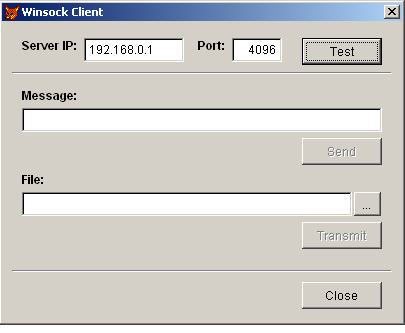

[ Home ](https://github.com/VFPX/Win32API)  

# A client for testing non-blocking Winsock server

## Before you begin:
  
This code is a client part created for testing the [non-blocking Winsock server](sample_412.md) sample code.  

First run server code on any computer on your network. Enter acting server IP and port values on the client form.  

**Test** button sends a short standard message.  
**Send** button sends a message entered in the text box.  
**Transmit** button sends a selected file.  

All sent messages are stored in a memo column of a cursor on the server side.  

* * *  
VB.Net version of this code works in a similar way. It can send text strings and files to the non-blocking Winsock server. So you may use both codes, FoxPro and VB.Net, for testing the server.  

See also:

* [How to create non-blocking Winsock server](sample_412.md)  
* [Using the NetMessageBufferSend to send messages on the network](sample_494.md)  
* [Using mailslots to send messages on the network](sample_269.md)  
* [Peer-to-peer LAN messenger built with Mailslot API functions](sample_410.md)  
* [Using WM_COPYDATA for interprocess communication](sample_536.md)  
  
***  


## Code:
```foxpro  
LOCAL oForm
oForm = CreateObject("ws_client")
oForm.Show(1)
* end of main

DEFINE CLASS ws_client As Form
#DEFINE AF_INET        2  && internetwork: UDP, TCP, etc.
#DEFINE SOCK_STREAM    1
#DEFINE IPPROTO_TCP    6
#DEFINE SOCKET_ERROR  -1
#DEFINE INVALID_SOCKET 0
#DEFINE SOMAXCONN      0x7FFFFFFF
#DEFINE SOL_SOCKET     65535  && socket level options
#DEFINE SO_LINGER      128  && Linger on close if data present

#DEFINE SD_RECEIVE 0
#DEFINE SD_SEND    1
#DEFINE SD_BOTH    2
	Width=400
	Height=300
	BorderStyle=2
	MaxButton=.F.
	MinButton=.F.
	Autocenter=.T.
	Caption="Winsock Client"
	
	ADD OBJECT shape1 As Shape WITH SpecialEffect=0,;
	Left=10, Width=380, Top=248, Height=2

	ADD OBJECT cmdClose As CommandButton WITH Cancel=.T.,;
	LEFT=300, Top=260, Width=80, Height=27, Caption="Close"

	ADD OBJECT lbl1 As Label WITH FontBold=.T.,;
	Left=20, Top=16, Autosize=.T., Caption="Server IP:"

	ADD OBJECT txtIP As TextBox WITH;
	Left=82, Top=16, Width=100, Height=24, Value="192.168.0.1"

	ADD OBJECT lbl2 As Label WITH FontBold=.T.,;
	Left=196, Top=16, Autosize=.T., Caption="Port:"
	
	ADD OBJECT txtPort As TextBox WITH;
	Left=230, Top=16, Width=50, Height=24, Value=4096

	ADD OBJECT cmdTest As CommandButton WITH;
	LEFT=300, Top=16, Width=80, Height=27, Caption="Test"

	ADD OBJECT shape2 As Shape WITH SpecialEffect=0,;
	Left=10, Width=380, Top=50, Height=2

	ADD OBJECT lbl3 As Label WITH FontBold=.T.,;
	Left=20, Top=66, Autosize=.T., Caption="Message:"

	ADD OBJECT txtMsg As TextBox WITH;
	Left=20, Top=86, Width=360, Height=24

	ADD OBJECT cmdSend As CommandButton WITH Enabled=.F.,;
	LEFT=300, Top=116, Width=80, Height=27, Caption="Send"

	ADD OBJECT lbl4 As Label WITH FontBold=.T.,;
	Left=20, Top=150, Autosize=.T., Caption="File:"

	ADD OBJECT txtFile As TextBox WITH;
	Left=20, Top=170, Width=330, Height=24

	ADD OBJECT cmdFile As CommandButton WITH;
	LEFT=352, Top=170, Width=27, Height=24, Caption="..."

	ADD OBJECT cmdTransmit As CommandButton WITH Enabled=.F.,;
	LEFT=300, Top=200, Width=80, Height=27, Caption="Transmit"

PROCEDURE Init
	IF Not THIS.InitWinsock()
		RETURN .F.
	ENDIF
	THIS.decl

PROCEDURE Destroy
	DECLARE INTEGER WSACleanup IN ws2_32
	= WSACleanup()

PROCEDURE cmdClose.Click
	ThisForm.Release
	
PROCEDURE cmdTest.Click
	ThisForm.SendMsg("test")

PROCEDURE cmdSend.Click
	ThisForm.SendMsg(SYS(0) + ", " + TTOC(datetime()) +;
		": " + ALLTRIM(ThisForm.txtMsg.Value))

PROCEDURE txtMsg.InteractiveChange
	ThisForm.cmdSend.Enabled = Not EMPTY(THIS.Value)

PROCEDURE cmdFile.Click
	ThisForm.GetLocalFile
	
PROCEDURE GetLocalFile
	LOCAL cPath, cFile
	cPath = SYS(5) + SYS(2003)
	cFile = GetFile()
	IF Not EMPTY(cFile)
		WITH ThisForm.txtFile
			.Value = LOWER(cFile)
			.InteractiveChange
		ENDWITH
	ENDIF
	SET DEFAULT TO (cPath)

PROCEDURE txtFile.InteractiveChange
	ThisForm.cmdTransmit.Enabled = Not EMPTY(THIS.Value)

PROCEDURE cmdTransmit.Click
	LOCAL cMsg
	cMsg = FileToStr(ThisForm.txtFile.Value)
	ThisForm.SendMsg(cMsg)
	
PROCEDURE SendMsg(cMsg)
	LOCAL hSocket, cTargetIP, nTargetPort, cBuffer, nResult
	cTargetIP = ALLTRIM(THIS.txtIP.Value)
	nTargetPort = THIS.txtPort.Value
	
	hSocket = socket(AF_INET, SOCK_STREAM, IPPROTO_TCP)

	WAIT WINDOW NOWAIT "Connecting..."
	cBuffer = THIS.GetBindBuf(cTargetIP, nTargetPort)
	nResult = ws_connect(hSocket, @cBuffer, Len(cBuffer))
	WAIT CLEAR

	IF nResult <> 0
		= closesocket(hSocket)
		= MessageB("Could not connect to the server.   ", 48, "Error")
		RETURN .F.
	ENDIF

	WAIT WINDOW NOWAIT "Sending..."
	cBuffer = m.cMsg
	nResult = send(hSocket, @cBuffer, Len(cBuffer), 0)

	ACTI SCREEN
	? "Bytes sent:", nResult

	WAIT WINDOW NOWAIT "Closing connection..."
	= shutdown(hSocket, SD_BOTH)
	= closesocket(hSocket)
	WAIT CLEAR
	
FUNCTION decl
	DECLARE INTEGER closesocket IN ws2_32 INTEGER s
	DECLARE INTEGER htons IN ws2_32 INTEGER hostshort
	DECLARE INTEGER inet_addr IN ws2_32 STRING cp

	DECLARE INTEGER socket IN ws2_32;
		INTEGER af, INTEGER socktype, INTEGER protocol

	DECLARE INTEGER connect IN ws2_32 AS ws_connect;
		INTEGER s, STRING @sname, INTEGER namelen

	DECLARE INTEGER send IN ws2_32;
		INTEGER s, STRING @buf, INTEGER buflen, INTEGER flags

	DECLARE INTEGER shutdown IN ws2_32;
		INTEGER s, INTEGER how

FUNCTION InitWinsock
* Initializing the Winsock service for the application
#DEFINE WSADATA_SIZE  398
#DEFINE WS_VERSION    0x0202
	DECLARE INTEGER WSAStartup IN ws2_32 INTEGER wVerRq, STRING @lpWSAData
	LOCAL lcWSADATA, lnInitResult
	lcWSADATA = Repli(Chr(0), WSADATA_SIZE)
	lnInitResult = WSAStartup(WS_VERSION, @lcWSADATA)
RETURN (lnInitResult = 0)

FUNCTION GetBindBuf(cIP, nPort)
	LOCAL cBuffer, cPort, cHost
	cPort = num2word(BitClear(htons(nPort),16))
	cHost = num2dword(inet_addr(cIP))
RETURN num2word(AF_INET) + cPort + cHost + Repli(Chr(0),8)

ENDDEFINE

FUNCTION num2dword(lnValue)
#DEFINE m0  256
#DEFINE m1  65536
#DEFINE m2  16777216
	IF lnValue < 0
		lnValue = 0x100000000 + lnValue
	ENDIF
	LOCAL b0, b1, b2, b3
	b3 = Int(lnValue/m2)
	b2 = Int((lnValue - b3*m2)/m1)
	b1 = Int((lnValue - b3*m2 - b2*m1)/m0)
	b0 = Mod(lnValue, m0)
RETURN Chr(b0)+Chr(b1)+Chr(b2)+Chr(b3)

FUNCTION num2word(lnValue)
RETURN Chr(MOD(m.lnValue,256)) + CHR(INT(m.lnValue/256))  
```  
***  


## Listed functions:
[WSACleanup](../libraries/ws2_32/WSACleanup.md)  
[WSAStartup](../libraries/ws2_32/WSAStartup.md)  
[closesocket](../libraries/ws2_32/closesocket.md)  
[htons](../libraries/ws2_32/htons.md)  
[inet_addr](../libraries/ws2_32/inet_addr.md)  
[send](../libraries/ws2_32/send.md)  
[socket](../libraries/ws2_32/socket.md)  

## Comment:
After establishing a connection and sending messages the client program usually keeps several local ports in the **TIME_WAIT** state for a short time.  
  
List of local ports in use can be obtained through the system **NETSTAT** command, or use example in this reference [Displaying all TCP connections for the local system](sample_222.md) to get the list.  
  

***  

