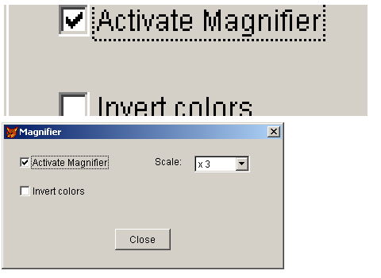

[ Home ](https://github.com/VFPX/Win32API)  

# Form Magnifier

## Before you begin:
  
After you activate the magnifier the form's part under the mouse cursor will be constantly redrawn on the main FoxPro window.  

See also:

* [Scrolling text on the form horizontally (a newsreel)](sample_352.md)  
* [Scrolling text on the form vertically (a movie cast)](sample_354.md)  
* [Shaking VFP form controls](sample_526.md)  
* [Playing AVI on _screen](sample_430.md)  
* [Displaying animated images](sample_355.md)  

  
***  


## Code:
```foxpro  
LOCAL oForm
oForm = CREATEOBJECT("Tform")
oForm.Show(1)
* end of main

DEFINE CLASS Tform As Form
	Width=350
	Height=160
	BorderStyle=2
	MaxButton=.F.
	MinButton=.F.
	Autocenter=.T.
	Caption="Magnifier"
	hForm=0
	hDC=0
	
	ADD OBJECT chMagnify As CheckBox WITH Value=.F.,;
	Left=20, Top=20, Autosize=.T., Caption="Activate Magnifier"

	ADD OBJECT chInvert As CheckBox WITH Value=.F.,;
	Left=20, Top=56, Autosize=.T., Caption="Invert colors"
	
	ADD OBJECT lbl1 As Label WITH;
	Left=190, Top=20, Autosize=.T., Caption="Scale:"
	
	ADD OBJECT cmbScale As ComboBox WITH Style=2,;
	Left=240, Top=20, Width=70, Height=21
	
	ADD OBJECT cmdClose As CommandButton WITH Cancel=.T.,;
	Left=140, Top=112, Width=70, Height=27, Caption="Close"

PROCEDURE Init
	THIS.declare

PROCEDURE Activate
	IF THIS.hForm = 0
		THIS.hForm = GetFocus()
		THIS.hDC = GetDC(THIS.hForm)
	ENDIF

PROCEDURE Destroy
	IF THIS.hDC <> 0
		= ReleaseDC(THIS.hForm, THIS.hDC)
	ENDIF

PROCEDURE cmdClose.Click
	ThisForm.Release

PROCEDURE cmbScale.Init
	WITH THIS
		.AddItem("Normal")
		.AddItem("x 2")
		.AddItem("x 3")
		.AddItem("x 4")
		.ListIndex=3
	ENDWITH

PROCEDURE MouseMove
LPARAMETERS nButton, nShift, nXCoord, nYCoord
	THIS.Magnify

PROCEDURE chMagnify.MouseMove
LPARAMETERS nButton, nShift, nXCoord, nYCoord
	ThisForm.Magnify

PROCEDURE chInvert.MouseMove
LPARAMETERS nButton, nShift, nXCoord, nYCoord
	ThisForm.Magnify

PROCEDURE lbl1.MouseMove
LPARAMETERS nButton, nShift, nXCoord, nYCoord
	ThisForm.Magnify

PROCEDURE cmbScale.MouseMove
LPARAMETERS nButton, nShift, nXCoord, nYCoord
	ThisForm.Magnify

PROCEDURE cmdClose.MouseMove
LPARAMETERS nButton, nShift, nXCoord, nYCoord
	ThisForm.Magnify

PROCEDURE Magnify
#DEFINE SRCCOPY 0xCC0020
#DEFINE NOTSRCCOPY 0x00330008
#DEFINE cnDstWidth 600
#DEFINE cnDstHeight 140

	IF THIS.chMagnify.Value
		LOCAL cBuffer, nX, nY, hDstWin, hDstDC,;
			nMode, nSrcWidth, nSrcHeight, nScale

		hDstWin = GetActiveWindow()
		hDstDC = GetWindowDC(hDstWin)

		cBuffer = REPLICATE(Chr(0), 8)
		= GetCursorPos(@cBuffer)
		= ScreenToClient(THIS.hForm, @cBuffer)

		nX = buf2dword(SUBSTR(cBuffer, 1,4))
		nY = buf2dword(SUBSTR(cBuffer, 5,4))
		
		nScale = THIS.cmbScale.ListIndex
		nSrcWidth = INT(cnDstWidth/nScale)
		nSrcHeight = INT(cnDstHeight/nScale)

		nMode = IIF(THIS.chInvert.Value,;
			NOTSRCCOPY, SRCCOPY)

		= StretchBlt(hDstDC, 10, 100,;
			cnDstWidth, cnDstHeight, THIS.hDC,;
			nX-nSrcWidth/2, nY-nSrcHeight/2,;
			nSrcWidth, nSrcHeight, nMode)
		
		= ReleaseDC(hDstWin, hDstDC)
	ENDIF

PROCEDURE declare
	DECLARE INTEGER GetActiveWindow IN user32
	DECLARE INTEGER GetCursorPos IN user32 STRING @lpPoint
	DECLARE INTEGER GetWindowDC IN user32 INTEGER hwnd
	DECLARE INTEGER GetDC IN user32 INTEGER hwnd
	DECLARE INTEGER GetFocus IN user32

	DECLARE INTEGER ReleaseDC IN user32;
		INTEGER hWindow, INTEGER hdc

	DECLARE INTEGER ScreenToClient IN user32;
		INTEGER hWindow, STRING @lpPoint

	DECLARE INTEGER StretchBlt IN gdi32;
		INTEGER hdcDest, INTEGER nXOriginDest,;
		INTEGER nYOriginDest, INTEGER nWidthDest,;
		INTEGER nHeightDest, INTEGER hdcSrc,;
		INTEGER nXOriginSrc, INTEGER nYOriginSrc,;
		INTEGER nWidthSrc, INTEGER nHeightSrc,;
		INTEGER dwRop

ENDDEFINE

FUNCTION buf2dword(lcBuffer)
RETURN Asc(SUBSTR(lcBuffer, 1,1)) + ;
	BitLShift(Asc(SUBSTR(lcBuffer, 2,1)), 8) +;
	BitLShift(Asc(SUBSTR(lcBuffer, 3,1)), 16) +;
	BitLShift(Asc(SUBSTR(lcBuffer, 4,1)), 24)  
```  
***  


## Listed functions:
[GetActiveWindow](../libraries/user32/GetActiveWindow.md)  
[GetCursorPos](../libraries/user32/GetCursorPos.md)  
[GetDC](../libraries/user32/GetDC.md)  
[GetFocus](../libraries/user32/GetFocus.md)  
[GetWindowDC](../libraries/user32/GetWindowDC.md)  
[ReleaseDC](../libraries/user32/ReleaseDC.md)  
[ScreenToClient](../libraries/user32/ScreenToClient.md)  
[StretchBlt](../libraries/gdi32/StretchBlt.md)  

## Comment:
StretchBlt function copies a rectangle area of the form to the main FoxPro window.  
  
***  

