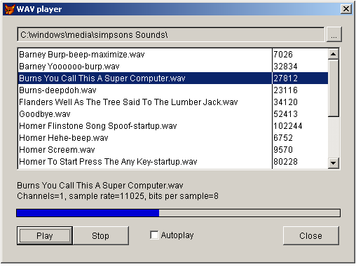

[ Home ](https://github.com/VFPX/Win32API)  

# WAV file player

## Before you begin:
  
Very often sndPlaySound function is all you need to play a waveform sound. The following code gives you additional control over the process in exchange for more complexity.  

See also:

* [Playing WAV sounds simultaneously](sample_523.md)  
* [Controlling master audio volume by sending WM_APPCOMMAND messages](sample_592.md)  
* [WAV file recorder](sample_421.md)  
* [How to play MIDI notes](sample_537.md)  
  
***  


## Code:
```foxpro  
LOCAL oForm
oForm = CreateObject("Tform")
oForm.Show(1)
* end of main

DEFINE CLASS Tform As Form
#DEFINE WAVEHDR_SIZE  32
	Width=500
	Height=350
	BorderStyle=2
	MaxButton=.F.
	MinButton=.F.
	Autocenter=.T.
	Caption="WAVE player"
	hDevice=0
	hMem=0
	hWaveHdr=0
	DataSize=0
	FmtData=""
	
	ADD OBJECT txtFolder As TextBox WITH;
	Left=20, Top=15, Width=440, Height=22, ReadOnly=.T., TabStop=.F.

	ADD OBJECT cmdFolder As CommandButton WITH;
	Left=462, Top=15, Width=22, Height=22, Caption="..."

	ADD OBJECT lst As ListBox WITH Left=20, Top=44,;
	Width=462, Height=176, ColumnCount=2, ColumnWidths="360,100"
	
	ADD OBJECT lblInfo As Label WITH;
	Left=20, Top=234, Width=462, Height=40, Wrap=.T.
	
	ADD OBJECT cmdPlay As CommandButton WITH Enabled=.F.,;
	Left=20, Top=300, Width=60, Height=27, Caption="Play"

	ADD OBJECT cmdStop As CommandButton WITH Enabled=.F.,;
	Left=80, Top=300, Width=60, Height=27, Caption="Stop"
	
	ADD OBJECT lbl2 As Label WITH Left=160, Top=304,;
	Autosize=.T., Caption="Volume:"
	
	ADD OBJECT cmbVolume As ComboBox WITH Style=2,;
	Left=216, Top=300, Width=50
	
	ADD OBJECT chAutoPlay As CheckBox WITH Caption="Autoplay",;
	Autosize=.T., Left=290, Top=302, Value=.F.

	ADD OBJECT cmdClose As CommandButton WITH Cancel=.T.,;
	Left=400, Top=300, Width=80, Height=27, Caption="Close"
	
	ADD OBJECT progress0 As Shape WITH;
	Left=19, Top=275, Width=463, Height=12
	
	ADD OBJECT progress As Shape WITH Visible=.F., BorderStyle=0,;
	Left=20, Top=276, Width=461, Height=11, BackColor=Rgb(0,0,212)

	ADD OBJECT tm As Timer WITH Interval=0

PROCEDURE Init
	THIS.decl
	THIS.hWaveHdr = GlobalAlloc(0, WAVEHDR_SIZE)
	THIS.txtFolder.Value = GetEnv("windir")

PROCEDURE Destroy
	THIS.CloseDevice
	THIS.ReleaseData
	= GlobalFree(THIS.hWaveHdr)

PROCEDURE cmbVolume.Init
	FOR nIndex=1 TO 10
		THIS.AddItem(LTRIM(STR(nIndex)))
		THIS.ListIndex=7
	ENDFOR

PROCEDURE cmdClose.Click
	ThisForm.Release

PROCEDURE cmdFolder.Click
	ThisForm.GetFolder

PROCEDURE cmdPlay.Click
	ThisForm.StartPlay

PROCEDURE cmdStop.Click
	ThisForm.CloseDevice

PROCEDURE txtFolder.ProgrammaticChange
	ThisForm.ScanFiles

PROCEDURE lst.InteractiveChange
	ThisForm.ShowFileInfo(THIS.Value)

PROCEDURE tm.Timer
	ThisForm.ShowProgress

PROCEDURE chAutoPlay.Click
	IF THIS.Value And ThisForm.cmdPlay.Enabled
		ThisForm.StartPlay
	ENDIF

PROCEDURE GetVolume
	LOCAL nVolume
	nVolume = 0
	IF THIS.hDevice <> 0
		= waveOutGetVolume(THIS.hDevice, @nVolume)
	ENDIF
	nVolume = Int(BitAnd(0x0000ffff, nVolume)/0xffff) * 10
	nVolume = Min(10, Max(1, nVolume))
	THIS.cmbVolume.ListIndex = nVolume

PROCEDURE SetVolume(nVolume)
	LOCAL nLeft, nRight
	nVolume = MIN(MAX(nVolume, 1), 10)
	nLeft = Int(nVolume * 0xffff / 10)
	nRight = BitLShift(nLeft, 16)
	nVolume = nLeft + nRight
	= waveOutSetVolume(THIS.hDevice, nLeft + nRight)

PROCEDURE ShowProgress  && a progress bar
#DEFINE TIME_MS    1
#DEFINE TIME_BYTES 4
	LOCAL cBuffer, nDone
	cBuffer = num2dword(TIME_BYTES) + Repli(Chr(0), 32)
	= waveOutGetPosition(THIS.hDevice, @cBuffer, Len(cBuffer))
	nDone = buf2dword(SUBSTR(cBuffer, 5,4))
	IF nDone >= (THIS.DataSize-16)  && needs a small margin
		THIS.progress.Width = THIS.progress0.Width
		DOEVENTS
		THIS.CloseDevice
	ELSE
		THIS.progress.Width = INT(THIS.progress0.Width *;
			nDone/THIS.DataSize)
	ENDIF

PROCEDURE CloseDevice
* closes the waveform-audio output device
	THIS.tm.Interval = 0
	THIS.progress.Visible = .F.
	THIS.progress.Width = 0
	IF THIS.hDevice <> 0
		= waveOutReset(THIS.hDevice)
		= waveOutUnprepareHeader(THIS.hDevice, THIS.hWaveHdr, WAVEHDR_SIZE)
		= waveOutClose(THIS.hDevice)
		THIS.hDevice = 0
		THIS.cmdStop.Enabled = .F.
	ENDIF

PROCEDURE ReleaseData
* releases memory block allocated for WAVE data
	IF THIS.hMem <> 0
		= GlobalFree(THIS.hMem)
		THIS.hMem = 0
		THIS.cmdPlay.Enabled = .F.
	ENDIF

PROCEDURE StartPlay
* this procedure opens a waveform-audio output device
* and passes WAVE data, read in LoadWaveFile method, to the waveOutWrite
#DEFINE WAVE_MAPPER     -1
	THIS.CloseDevice

	LOCAL hDevice, cWaveHdr, cFmtData
	hDevice = 0
	cFmtData = THIS.FmtData
	IF waveOutOpen(@hDevice, WAVE_MAPPER, @cFmtData, 0,0,0) = 0
		THIS.hDevice = hDevice
		THIS.SetVolume(THIS.cmbVolume.ListIndex)

		cWaveHdr = num2dword(THIS.hMem) +;
			num2dword(THIS.DataSize) + Repli(Chr(0),24)
		= CopyMemory(THIS.hWaveHdr, cWaveHdr, WAVEHDR_SIZE)

		= waveOutReset(hDevice)
		= waveOutPrepareHeader(hDevice, THIS.hWaveHdr, WAVEHDR_SIZE)

		IF waveOutWrite(hDevice, THIS.hWaveHdr, WAVEHDR_SIZE) = 0
		* playback begins
			THIS.cmdStop.Enabled = .T.
			THIS.tm.Interval = 100  && to enable a proress bar
			THIS.progress.Visible = .T.
		ELSE
		* playback failed to start
			THIS.CloseDevice
		ENDIF
	ENDIF

PROCEDURE ShowFileInfo(cFile)
	THIS.CloseDevice
	THIS.ReleaseData
	THIS.lblInfo.Caption=""

	IF Not EMPTY(cFile)
		LOCAL cFolder, cFileInfo, lResult
		cFolder = FULLPATH(THIS.txtFolder.Value)
		IF RIGHT(cFolder,1) <> "\"
			cFolder = cFolder + "\"
		ENDIF
		WITH ThisForm
			lResult = .LoadWaveFile(cFolder + cFile, @cFileInfo)
			.lblInfo.Caption = cFile + Chr(13) + cFileInfo
			.cmdPlay.Enabled = lResult
			IF lResult And .chAutoPlay.Value
				.StartPlay
			ENDIF
		ENDWITH
	ENDIF

FUNCTION LoadWaveFile(cFile, cFileInfo)
#DEFINE MMIO_READ  0
#DEFINE MMIO_FINDRIFF   0x0020
#DEFINE MMIO_FINDCHUNK  0x0010
#DEFINE MMIO_ALLOCBUF   0x00010000
	LOCAL hFile, cRiffInfo, cRiffType, cFmtInfo, nFmtSize, cFmtData,;
		cDataInfo, nDataSize, cMMIOINFO

	* opening WAVE file
	cMMIOINFO = Repli(Chr(0), 64)
	hFile = mmioOpen(cFile, @cMMIOINFO, MMIO_READ+MMIO_ALLOCBUF)
	IF hFile = 0
		cFileInfo="Could not open file"
		RETURN .F.
	ENDIF

	* reading RIFF chunk
	cRiffInfo = Repli(Chr(0), 20)
	IF mmioDescend(hFile, @cRiffInfo, Null, MMIO_FINDRIFF) <> 0
		cFileInfo="RIFF chunk not found"
		= mmioClose(hFile, 0)
		RETURN .F.
	ENDIF

	cRiffType = SUBSTR(cRiffInfo, 9,4)
	IF cRiffType <> "WAVE"
		cFileInfo = "Not a WAVE file"
		= mmioClose(hFile, 0)
		RETURN .F.
	ENDIF

	* reading FMT chunk
	cFmtInfo = PADR("fmt ", 20, Chr(0))
	= mmioDescend(hFile, @cFmtInfo, @cRiffInfo, MMIO_FINDCHUNK)

	* saving format information for waveOutOpen call
	nFmtSize = buf2dword(SUBSTR(cFmtInfo, 5,4))
	cFmtData = Repli(Chr(0), nFmtSize)

	DECLARE LONG mmioRead IN winmm;
		INTEGER hmmio, STRING @pch, INTEGER cch

	= mmioRead(hFile, @cFmtData, nFmtSize)
	THIS.FmtData = cFmtData
	
	LOCAL nChannels, nSamples, nBPS, nAllocSize
	nChannels = buf2word(SUBSTR(cFmtData,3,2))
	nSamples = buf2dword(SUBSTR(cFmtData,5,4))
	nBPS = buf2word(SUBSTR(cFmtData,15,2))

	cFileInfo = "Channels=" + LTRIM(STR(nChannels)) + ", " +;
		"sample rate=" + LTRIM(STR(nSamples)) + ", " +;
		"bits per sample=" + LTRIM(STR(nBPS))
	= mmioAscend(hFile, @cFmtInfo, 0)

	* reading data for waveOutWrite call
	cDataInfo = PADR("data", 20, Chr(0))
	= mmioDescend(hFile, @cDataInfo, @cRiffInfo, MMIO_FINDCHUNK)

	* allocating memory for WAVE data
	nDataSize = buf2dword(SUBSTR(cDataInfo, 5,4))
	THIS.DataSize = nDataSize
	nAllocSize = (Int(nDataSize/1024) + 1) * 1024

	THIS.hMem = GlobalAlloc(0, nAllocSize)
	= ZeroMemory(THIS.hMem, nAllocSize)

	* mmioRead is redeclared
	DECLARE LONG mmioRead IN winmm;
		INTEGER hmmio, INTEGER pch, INTEGER cch

	= mmioRead(hFile, THIS.hMem, nDataSize)
	= mmioAscend(hFile, @cDataInfo, 0)
	= mmioClose(hFile, 0)
RETURN .T.

PROCEDURE GetFolder
	LOCAL cDefault, cFolder
	cDefault = SYS(5) + SYS(2003)
	SET DEFAULT TO (THIS.txtFolder.Value)
	cFolder = GetDir()
	IF Not EMPTY(cFolder)
		THIS.txtFolder.Value = Proper(cFolder)
	ENDIF
	SET DEFAULT TO (cDefault)

PROCEDURE ScanFiles
	THIS.ShowFileInfo("")
	LOCAL cFolder, nCount, nIndex
	THIS.lst.Clear
	cFolder = FULLPATH(THIS.txtFolder.Value)
	IF RIGHT(cFolder,1) <> "\"
		cFolder = cFolder + "\"
	ENDIF

	nCount = ADIR(arrFiles, cFolder + "*.wav")
	FOR nIndex=1 TO nCount
		WITH THIS.lst
			.AddItem(Proper(arrFiles[nIndex,1]))
			.List(.ListCount, 2) = LTRIM(STR(arrFiles[nIndex,2]))
		ENDWITH
	ENDFOR
	RELEASE arrFiles
	WITH THIS.lst
		IF .ListCount <> 0
			.ListIndex = 1
			.InteractiveChange
		ENDIF
	ENDWITH

PROCEDURE decl
	DECLARE INTEGER waveOutReset IN winmm INTEGER hwo
	DECLARE INTEGER waveOutClose IN winmm INTEGER hwo
	DECLARE INTEGER mmioClose IN winmm INTEGER hmmio, INTEGER wFlags
	DECLARE INTEGER GlobalAlloc IN kernel32 INTEGER wFlags, INTEGER dwBytes
	DECLARE INTEGER GlobalFree IN kernel32 INTEGER hMem

	DECLARE RtlZeroMemory IN kernel32 As ZeroMemory;
		INTEGER dest, INTEGER numBytes

	DECLARE RtlMoveMemory IN kernel32 As CopyMemory;
		INTEGER Dest, STRING Source, INTEGER nLen

	DECLARE INTEGER mmioOpen IN winmm;
		STRING szFilename, STRING @lpmmioinfo, INTEGER dwOpenFlags

	DECLARE INTEGER mmioAscend IN winmm;
		INTEGER hmmio, STRING @lpck, INTEGER wFlags

	DECLARE INTEGER mmioDescend IN winmm;
		INTEGER hmmio, STRING @lpck,;
		STRING @lpckParent, INTEGER wFlags

	DECLARE INTEGER waveOutOpen IN winmm;
		INTEGER @phwo, INTEGER uDeviceID, STRING @pwfx,;
		INTEGER dwCallback, INTEGER dwCallbackInst, INTEGER fdwOpen

	DECLARE INTEGER waveOutWrite IN winmm;
		INTEGER hwo, INTEGER pwh, INTEGER cbwh

	DECLARE INTEGER waveOutPrepareHeader IN winmm;
		INTEGER hwo, INTEGER pwh, INTEGER cbwh

	DECLARE INTEGER waveOutUnprepareHeader IN winmm;
		INTEGER hwi, INTEGER pwh, INTEGER cbwh

	DECLARE INTEGER waveOutGetPosition IN winmm;
		INTEGER hwi, STRING @pmmt, INTEGER cbmmt

	DECLARE INTEGER waveOutGetVolume IN winmm;
		INTEGER hwo, INTEGER @pdwVolume

	DECLARE INTEGER waveOutSetVolume IN winmm;
		INTEGER hwo, INTEGER dwVolume
ENDDEFINE

FUNCTION buf2dword(cBuf)
RETURN Asc(SUBSTR(cBuf, 1,1)) + BitLS(Asc(SUBS(cBuf,2,1)),8) +;
	BitLS(Asc(SUBS(cBuf,3,1)),16) + BitLS(Asc(SUBS(cBuf,4,1)),24)

FUNCTION buf2word(cBuf)
RETURN Asc(SUBS(cBuf,1,1)) + Asc(SUBS(cBuf,2,1)) * 256

FUNCTION num2dword(lnValue)
#DEFINE m0  256
#DEFINE m1  65536
#DEFINE m2  16777216
	IF lnValue < 0
		lnValue = 0x100000000 + lnValue
	ENDIF
	LOCAL b0, b1, b2, b3
	b3 = Int(lnValue/m2)
	b2 = Int((lnValue - b3*m2)/m1)
	b1 = Int((lnValue - b3*m2 - b2*m1)/m0)
	b0 = Mod(lnValue, m0)
RETURN Chr(b0)+Chr(b1)+Chr(b2)+Chr(b3)  
```  
***  


## Listed functions:
[GlobalAlloc](../libraries/kernel32/GlobalAlloc.md)  
[GlobalFree](../libraries/kernel32/GlobalFree.md)  
[mmioAscend](../libraries/winmm/mmioAscend.md)  
[mmioClose](../libraries/winmm/mmioClose.md)  
[mmioDescend](../libraries/winmm/mmioDescend.md)  
[mmioOpen](../libraries/winmm/mmioOpen.md)  
[mmioRead](../libraries/winmm/mmioRead.md)  
[waveOutClose](../libraries/winmm/waveOutClose.md)  
[waveOutGetPosition](../libraries/winmm/waveOutGetPosition.md)  
[waveOutGetVolume](../libraries/winmm/waveOutGetVolume.md)  
[waveOutOpen](../libraries/winmm/waveOutOpen.md)  
[waveOutPrepareHeader](../libraries/winmm/waveOutPrepareHeader.md)  
[waveOutReset](../libraries/winmm/waveOutReset.md)  
[waveOutSetVolume](../libraries/winmm/waveOutSetVolume.md)  
[waveOutUnprepareHeader](../libraries/winmm/waveOutUnprepareHeader.md)  
[waveOutWrite](../libraries/winmm/waveOutWrite.md)  
