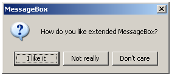
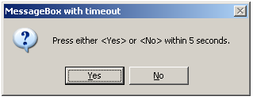
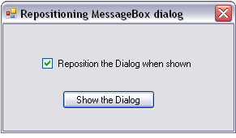
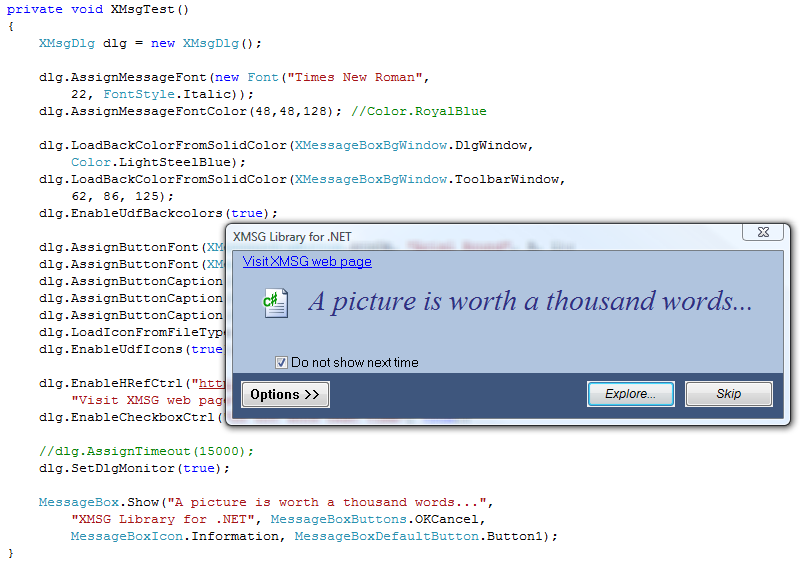

[ Home ](https://github.com/VFPX/Win32API)  

# Extended MessageBox Class

## Note that this document contains some links to the old news2news website which does not work at the moment. This material will be available sometime in the future.

## Before you begin:
<!-- Anatoliy  -->
<a href="?solution=3&src=x418" target=_blank></a>  
There is more advanced version of this code.   
Click to open the [Extended MessageBox Library (FLL)](?solution=3&src=x418) web page.  

<a href="http://www.news2news.com/vfp/?solution=5&src=x418"></a>

Click to open the [Extended MessageBox .NET Assembly](?solution=5&src=x418) web page.  

* * *  
For all VFP versions this class extends regular MessageBox() function with:*  
- dialog timeout interval  
- adjustable button captions  
- dialog window positioning on start*  

MessageBox() with changed button captions:  
  

MessageBox() with timeout:  
  

Here is a [sample code](sample_424.md) showing how to use this class.  

See also:
* [How to position the GETPRINTER() dialog](sample_482.md)
* [Using Extended MessageBox() Class](sample_424.md)  
* [How to change font name and size in the MessageBox dialog](sample_434.md)  
* [How to display a user-defined icon in the MessageBox dialog](sample_500.md)  
* [Creating an Open dialog box to specify the drive, directory, and name of a file to open (Shell32 version)](sample_365.md)  
* [Creating the Open dialog box to specify the drive, directory, and name of a file to open](sample_363.md)  
* [Creating the Save dialog box to specify the drive, directory, and name of a file to save](sample_265.md)  
* [How to display a dialog box that enables the user to select a folder (an alternative to the GETDIR)](sample_364.md)  
* [How to display advanced Task Dialog (Vista)](sample_558.md)  
  
***  


## Code:
```foxpro  
DEFINE CLASS Tmsgbox As Timer
#DEFINE GW_HWNDFIRST    0
#DEFINE GW_HWNDLAST     1
#DEFINE GW_HWNDNEXT     2
#DEFINE GW_CHILD        5
#DEFINE GWL_ID         -12
#DEFINE WM_LBUTTONDOWN  0x0201
#DEFINE WM_LBUTTONUP    0x0202
#DEFINE cnTimerInterval 100
	Interval=0
	hDialog=0      && dialog window handle
	DlgMessage=""
	DlgTitle=""
	DlgType=0
	DlgTimeout=0
	DlgDefault=0
	DlgResult=0
	OnTimeout=.F.  && is set when a timeout occurs
	X=0  && set X and Y to position the dialog on start
	Y=0
	DIMENSION captions[7] && seven types of buttons

PROCEDURE Init
	DECLARE INTEGER IsWindow IN user32 INTEGER hwnd
	DECLARE INTEGER GetActiveWindow IN user32
	DECLARE INTEGER GetWindow IN user32 INTEGER hwnd, INTEGER wFlag
	DECLARE INTEGER GetWindowLong IN user32 INTEGER hWnd, INTEGER nIndex

	DECLARE INTEGER GetWindowText IN user32;
		INTEGER hwnd, STRING @lpString, INTEGER cch

	DECLARE INTEGER SetDlgItemText IN user32;
		INTEGER hDlg, INTEGER nIDDlgItem, STRING lpString

	DECLARE INTEGER SetWindowPos IN user32;
		INTEGER hwnd, INTEGER hWndInsertAfter,;
		INTEGER x, INTEGER y, INTEGER cx, INTEGER cy,;
		INTEGER wFlags

	DECLARE INTEGER SendMessage IN user32;
		INTEGER hWnd, INTEGER Msg, INTEGER wParam, INTEGER lParam

PROCEDURE MsgBox(cMsg, nType, cTitle, nTimeout, nDefault)
	THIS.DlgMessage = cMsg
	THIS.DlgTimeout = Iif(VARTYPE(nTimeout)="N", m.nTimeout, 0)
	THIS.DlgDefault = Iif(VARTYPE(nDefault)="N", nDefault, 0)
	THIS.OnTimeout=.F.

	* similar to smart parameters in VFP 7
	DO CASE
	CASE VARTYPE(nType) = "N"
		THIS.DlgType = m.nType
		THIS.DlgTitle = Iif(VARTYPE(cTitle)="C", m.cTitle, VERSION())
	CASE VARTYPE(nType) = "C"
		THIS.DlgTitle = m.nType
		THIS.DlgType = Iif(VARTYPE(cTitle)="N", m.cTitle, 0)
	ENDCASE

	THIS.Interval = cnTimerInterval
	THIS.DlgResult = MessageB(THIS.DlgMessage, THIS.DlgType, THIS.DlgTitle)
	THIS.hDialog = 0
RETURN THIS.DlgResult

PROCEDURE Timer
	IF THIS.hDialog = 0
	* the dialog is not detected yet
		IF THIS.DialogFound()
			THIS.SetCaptions
			THIS.SetPosition
		ENDIF
		IF THIS.DlgTimeout = 0
			THIS.Interval = 0
		ENDIF
	ELSE
	* dialog has been detected
		IF IsWindow(THIS.hDialog) = 0
		* possibly the dialog has been closed manually
			THIS.hDialog = 0
			THIS.Interval = 0
		ELSE
		* the dialog is still around, checking timeout
			THIS.DlgTimeout = THIS.DlgTimeout - cnTimerInterval
			IF THIS.DlgTimeout <= 0
				THIS.CloseDialog
				THIS.OnTimeout=.T.
			ENDIF
		ENDIF
	ENDIF

PROTECTED FUNCTION DialogFound
	LOCAL hWindow, cTitle
	hWindow = GetActiveWindow()
	cTitle = THIS.GetWinText(hWindow)
	THIS.hDialog = IIF(cTitle=THIS.DlgTitle, hWindow, 0)
RETURN (THIS.hDialog <> 0)

PROTECTED FUNCTION GetWinText(hWindow)
* returns window"s title for a given handle
	LOCAL nBufsize, cBuffer
	nBufsize = 128
	cBuffer = Repli(Chr(0), nBufsize)
	nBufsize = GetWindowText(hWindow, @cBuffer, nBufsize)
RETURN Iif(nBufsize=0, "", Left(cBuffer, nBufsize))

PROTECTED FUNCTION SetCaptions
	LOCAL nIndex
	FOR nIndex=1 TO 7  && seven types of buttons
		IF NOT EMPTY(THIS.captions[nIndex])
			= SetDlgItemText(THIS.hDialog, nIndex, THIS.captions[nIndex])
		ENDIF
	ENDFOR

PROTECTED PROCEDURE SetPosition
#DEFINE HWND_TOP         0
#DEFINE SWP_NOSIZE       1
#DEFINE SWP_SHOWWINDOW   0x40
	IF THIS.X<>0 Or THIS.Y<>0
		= SetWindowPos(THIS.hDialog, HWND_TOP,;
			THIS.X, THIS.Y, 0,0, SWP_SHOWWINDOW+SWP_NOSIZE)
	ENDIF

PROTECTED PROCEDURE CloseDialog
* scans child windows for the dialog
* searching a command button to be virtually pressed
	LOCAL hFirst, hWindow, hLast, hTarget, nId
	hFirst = GetWindow(THIS.hDialog, GW_CHILD)
	hWindow = GetWindow(hFirst, GW_HWNDFIRST)
	hLast = GetWindow(hFirst, GW_HWNDLAST)

	DO WHILE .T.
		nId = GetWindowLong(m.hWindow, GWL_ID)

		DO CASE
		CASE nId = THIS.DlgDefault
			hTarget = m.hWindow
			EXIT
		CASE hWindow = m.hLast
			hTarget = m.hFirst
			EXIT
		ENDCASE
		hWindow = GetWindow(m.hWindow, GW_HWNDNEXT)
	ENDDO

	* simulates mouse click on the target button
	= SendMessage(hTarget, WM_LBUTTONDOWN, 0, 0)
	DOEVENTS  && just in case
	= SendMessage(hTarget, WM_LBUTTONUP, 0, 0)
ENDDEFINE  
```  
***  


## Listed functions:
[GetActiveWindow](../libraries/user32/GetActiveWindow.md)  
[GetWindow](../libraries/user32/GetWindow.md)  
[GetWindowLong](../libraries/user32/GetWindowLong.md)  
[GetWindowText](../libraries/user32/GetWindowText.md)  
[IsWindow](../libraries/user32/IsWindow.md)  
[SendMessage](../libraries/user32/SendMessage.md)  
[SetDlgItemText](../libraries/user32/SetDlgItemText.md)  
[SetWindowPos](../libraries/user32/SetWindowPos.md)  

## Comment:
Even better MessageBox customization can be achieved by creating an external library (ActiveX, DLL or FLL) and calling it from VFP application.   
<a href="http://www.news2news.com/vfp/?solution=3"></a>  
The background color, the message text font & color, button fonts and captions, not to mention other customizable parameters, can be controlled by the calling application.  
  
* * *  
C# and C++ versions of this code use the SetWindowsHookEx API function to monitor either window messages or CBT notifications within the thread. Upon detecting the WM_INITDIALOG message the code moves the recipient window -- a MessageBox dialog.  
  



  
* * *  
To close the dialog through virtually pressing a button, consider also sending BM_CLICK message.  This message causes the button to receive the WM_LBUTTONDOWN and WM_LBUTTONUP messages, and the button"s parent window to receive a BN_CLICKED notification message.  
  
More common way of closing the dialog is calling the EndDialog function.  
  
* * *  
The MessageBox dialog consists of several windows.  
  


The *Dialog Window* is the parent window, and all others are its children.   
  
All *Button Windows* and three *Static Windows* (the Icon Window, the Message Window and the window surrounding the buttons) have very specific window identifiers (control ids). These values appear to be undocumented though stay unchanged through the all Windows versions since Windows 95.  
  
The Tool window  (its Control ID 0x0000CAFE always makes me feel good) is an addition to the MessageBox child windows that came with the Vista.  
  
* * *  
CodeProject links:  
<a href="http://www.codeproject.com/KB/cpp/dMsgBox.aspx">How to change the MessageBox window (Add controls and change texts)</a> by dSolariuM  
<a href="http://www.codeproject.com/KB/dialog/donotaskagainmsgbox.aspx">"Do not ask again" Message Boxes</a> by Nicolas Bonamy  
  
* * *  
Starting with the FVP version 8, the MESSAGEBOX() function can accept the *Timeout* parameter.   
  
When the MESSAGEBOX() is called without the Timeout parameter, it runs on VFP default thread. When the Timeout parameter is passed, VFP creates a separate thread for the MESSAGEBOX().   
  
No mater how subtle this difference may appear, it renders the GetActiveWindow useless for finding the dialog window. Calling the SetWindowsHookEx should also be performed with the consideration for the separate thread.  
  
* * *  


***  

