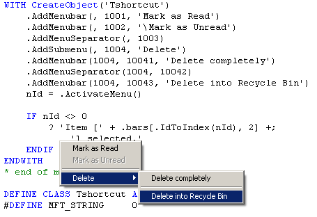

[ Home ](https://github.com/VFPX/Win32API)  

# Shortcut Menu Class

## Before you begin:
This class creates shortcut popup menu object, which is easier to operate comparing to standard DEFINE POPUP SHORTCUT command.  

  
  
***  


## Code:
```foxpro  
WITH CREATEOBJECT("Tshortcut")
	.AddMenubar(, 1001, "Mark as Read")
	.AddMenubar(, 1002, "\Mark as Unread")

	.AddMenuSeparator(, 1003)

	.AddSubmenu(, 1004, "Delete")
	.AddMenubar(1004, 10041, "Delete permanently")
	.AddMenuSeparator(1004, 10042)
	.AddMenubar(1004, 10043, "Delete into Recycle Bin")

	nId = .ActivateMenu()
	
	IF nId <> 0
		= MESSAGEBOX("Item [" + .bars[.IdToIndex(nId), 2] +;
			"] has been selected.     ", 64, "Menu selection")
	ELSE
		= MESSAGEBOX("Escape pressed or no selection made.   ",;
			64, "Menu selection")
	ENDIF
ENDWITH
* end of main

DEFINE CLASS Tshortcut As Custom
#DEFINE MFT_STRING     0
#DEFINE MFT_SEPARATOR  0x00000800
#DEFINE MIIM_STATE     1
#DEFINE MIIM_ID        2
#DEFINE MIIM_SUBMENU   4
#DEFINE MIIM_TYPE      16
#DEFINE MFS_ENABLED    0
#DEFINE MFS_GRAYED     0x0003
#DEFINE MFS_HILITE     0x0080
#DEFINE TPM_RETURNCMD  0x0100
#DEFINE MAX_BARCOUNT 64
#DEFINE MENUITEMINFO_SIZE  48
	menubarcount=0
	DIMEN bars[MAX_BARCOUNT, 7]

PROCEDURE ClearMenu
	THIS.menubarcount=0

PROCEDURE AddMenubar(nParentId, nId, cCaption, lSubmenu)
	THIS.menubarcount = THIS.menubarcount + 1
	IF THIS.menubarcount > MAX_BARCOUNT
		RETURN .F.
	ENDIF
	
	THIS.bars[THIS.menubarcount, 1] = nId

	DO CASE
	CASE LEFT(cCaption,1) = "\"  && disabled
		THIS.bars[THIS.menubarcount, 2] = SUBSTR(m.cCaption, 2)
		THIS.bars[THIS.menubarcount, 3] = .F.
	OTHER  && enabled
		THIS.bars[THIS.menubarcount, 2] = m.cCaption
		THIS.bars[THIS.menubarcount, 3] = .T.
	ENDCASE

	THIS.bars[THIS.menubarcount, 4] = .T.  && visible
	THIS.bars[THIS.menubarcount, 5] = Iif(VARTYPE(nParentId)="N", nParentId, 0)
	THIS.bars[THIS.menubarcount, 6] = m.lSubmenu  && submenu flag
	THIS.bars[THIS.menubarcount, 7] = 0  && submenu handle

PROCEDURE AddSubmenu(nParentId, nId, cCaption)
	THIS.AddMenubar(nParentId, nId, cCaption, .T.)

PROCEDURE AddMenuSeparator(nParentId, nId)
	THIS.AddMenuBar(nParentId, nId, "-")

PROCEDURE EnableBar(nId, lEnabled)
	LOCAL nIndex
	nIndex = THIS.IdToIndex(nId)
	IF nIndex <> 0
		THIS.bars[m.nIndex, 3] = lEnabled
	ENDIF
	
FUNCTION IdToIndex(nId)
	LOCAL nIndex
	FOR nIndex=1 TO THIS.menubarcount
		IF THIS.bars[m.nIndex, 1] = m.nId
			RETURN m.nIndex
		ENDIF
	ENDFOR
RETURN 0

FUNCTION ActivateMenu(nX, nY)
	DECLARE INTEGER CreatePopupMenu IN user32
	DECLARE INTEGER CreateMenu IN user32
	DECLARE INTEGER DestroyMenu IN user32 INTEGER hMenu
	DECLARE INTEGER GetFocus IN user32
	DECLARE INTEGER GetCursorPos IN user32 STRING @ lpPoint

	DECLARE INTEGER InsertMenuItem IN user32;
		INTEGER hMenu, INTEGER uItem,;
		INTEGER fByPosition, STRING @lpmii

	DECLARE INTEGER TrackPopupMenuEx IN user32;
		LONG hmenu, LONG fuFlags, INTEGER x, INTEGER y,;
		LONG hwnd, INTEGER lptpm

	LOCAL hMenu, nReturn
	hMenu = THIS.RenderMenu(0)

	IF VARTYPE(nX) <> "N" Or VARTYPE(nY) <> "N"
		LOCAL cBuffer
		cBuffer = Repli(Chr(0), 8)
		= GetCursorPos (@cBuffer)
		nX = buf2dword(SUBSTR(cBuffer, 1,4))
		nY = buf2dword(SUBSTR(cBuffer, 5,4))
	ENDIF

	nReturn = TrackPopupMenuEx(m.hMenu, TPM_RETURNCMD,;
		m.nX, m.nY, GetFocus(), 0)
	= DestroyMenu(hMenu)
RETURN nReturn

PROTECTED FUNCTION RenderMenu(nParentId)
#DEFINE ccMask MIIM_STATE + MIIM_ID + MIIM_TYPE + MIIM_SUBMENU
	LOCAL nParentIndex, nIndex, hMenu, cCaption, oCaption,;
		cType, cState, cItemInfo
	
	IF nParentId = 0
		hMenu = CreatePopupMenu()  && toplevel menu
	ELSE
		nParentIndex = THIS.IdToIndex(nParentId)
		hMenu = THIS.bars[nParentIndex, 7]
	ENDIF
	
	FOR nIndex=1 TO THIS.menubarcount
		IF THIS.bars[nIndex, 5] <> nParentId Or Not THIS.bars[nIndex, 4]
			LOOP
		ENDIF
		
		IF THIS.bars[nIndex, 6]  && submenu
			THIS.bars[nIndex, 7] = CreateMenu()
			THIS.RenderMenu(THIS.bars[nIndex, 1])  && recursive call
		ENDIF

		cCaption = THIS.bars[nIndex, 2]
		oCaption = CreateObject ("PChar", cCaption)
		cType = Iif(cCaption="-", MFT_SEPARATOR, MFT_STRING)
		cState = Iif(THIS.bars[nIndex, 3], MFS_ENABLED, MFS_GRAYED)
		
		cItemInfo = num2dword(MENUITEMINFO_SIZE) +;
			num2dword(ccMask) + num2dword(m.cType) + num2dword(m.cState) +;
			num2dword(THIS.bars[m.nIndex,1]) +;
			num2dword(THIS.bars[nIndex, 7]) +;
			num2dword(0) + num2dword(0) + num2dword(0) +;
			num2dword(oCaption.hMem) +;
			num2dword(Len(m.cCaption)) + num2dword(0)

		= InsertMenuItem (hMenu, nIndex, 1, @cItemInfo)
	ENDFOR
RETURN hMenu
ENDDEFINE

DEFINE CLASS PChar As Custom  && pointer to string
	hMem=0

PROCEDURE  Init (lcString)
	THIS.hMem = 0
	THIS.setValue (lcString)

PROCEDURE Destroy
	THIS.ReleaseString

FUNCTION GetValue && returns string value
	LOCAL lnSize, lcBuffer
	lnSize = THIS.getAllocSize()
	lcBuffer = SPACE(lnSize)

	IF THIS.hMem <> 0
		DECLARE RtlMoveMemory IN kernel32 As Ptr2Str;
			STRING @, INTEGER, INTEGER
		= Ptr2Str (@lcBuffer, THIS.hMem, lnSize)
	ENDIF
RETURN lcBuffer

FUNCTION GetAllocSize  && returns allocated memory size (string length)
	DECLARE INTEGER GlobalSize IN kernel32 INTEGER hMem
RETURN Iif(THIS.hMem=0, 0, GlobalSize(THIS.hMem))

PROCEDURE SetValue (lcString) && assigns new string value
#DEFINE GMEM_FIXED   0
	THIS.ReleaseString

	DECLARE INTEGER GlobalAlloc IN kernel32 INTEGER, INTEGER
	DECLARE RtlMoveMemory IN kernel32 As Str2Ptr;
		INTEGER, STRING @, INTEGER

	LOCAL lnSize
	lcString = lcString + Chr(0)
	lnSize = Len(lcString)
	THIS.hMem = GlobalAlloc(GMEM_FIXED, lnSize)
	IF THIS.hMem <> 0
		= Str2Ptr(THIS.hMem, @lcString, lnSize)
	ENDIF

PROCEDURE ReleaseString  && releases allocated memory
	IF THIS.hMem <> 0
		DECLARE INTEGER GlobalFree IN kernel32 INTEGER
		= GlobalFree (THIS.hMem)
		THIS.hMem = 0
	ENDIF
ENDDEFINE  && pchar

FUNCTION buf2dword(lcBuffer)
RETURN Asc(SUBSTR(lcBuffer, 1,1)) + ;
	BitLShift(Asc(SUBSTR(lcBuffer, 2,1)),  8) +;
	BitLShift(Asc(SUBSTR(lcBuffer, 3,1)), 16) +;
	BitLShift(Asc(SUBSTR(lcBuffer, 4,1)), 24)

FUNCTION num2dword(lnValue)
#DEFINE m0  256
#DEFINE m1  65536
#DEFINE m2  16777216
	IF lnValue < 0
		lnValue = 0x100000000 + lnValue
	ENDIF
	LOCAL b0, b1, b2, b3
	b3 = Int(lnValue/m2)
	b2 = Int((lnValue - b3*m2)/m1)
	b1 = Int((lnValue - b3*m2 - b2*m1)/m0)
	b0 = Mod(lnValue, m0)
RETURN Chr(b0)+Chr(b1)+Chr(b2)+Chr(b3)  
```  
***  


## Listed functions:
[CreateMenu](../libraries/user32/CreateMenu.md)  
[CreatePopupMenu](../libraries/user32/CreatePopupMenu.md)  
[DestroyMenu](../libraries/user32/DestroyMenu.md)  
[GetCursorPos](../libraries/user32/GetCursorPos.md)  
[GetFocus](../libraries/user32/GetFocus.md)  
[GlobalAlloc](../libraries/kernel32/GlobalAlloc.md)  
[GlobalFree](../libraries/kernel32/GlobalFree.md)  
[GlobalSize](../libraries/kernel32/GlobalSize.md)  
[InsertMenuItem](../libraries/user32/InsertMenuItem.md)  
[TrackPopupMenuEx](../libraries/user32/TrackPopupMenuEx.md)  
