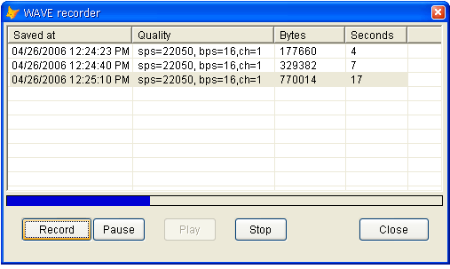

[ Home ](https://github.com/VFPX/Win32API)  

# Class for sound recording

## Before you begin:
This class is able to record audio input from playback devices like Wave, Microphone etc. It implements methods  
```txt
OpenDevice  
CloseDevice  
StartRecording  
StopRecording  
CreateWaveFile(cFilename)
```

Some parameters are hard-coded: max recording time, *bits per sample*, *samples per second* and *channels*. Though it is easy to make this basic class more flexible.  

Click to open an example based on this class: [WAV file recorder](sample_421.md):  

[](sample_421.md)

***  


## Code:
```foxpro  
DEFINE CLASS TWaveRecorder As Session
#DEFINE WAVEHDR_SIZE 32
#DEFINE WAVE_MAPPER -1
#DEFINE MMSYSERR_NOERROR 0
#DEFINE WAVE_FORMAT_PCM 1
#DEFINE MMSYSERR_NOERROR 0
PROTECTED hDevice, hWaveHdr, hMem, fmtdata, datablocks,;
	channels, bitspersample, samplespersec, avgbytespersec,;
	maxrecordtime, datasize, bytesrecorded, devicestatus
	hDevice=0
	hWaveHdr=0
	hMem=0
	fmtdata=""
	datablocks=NULL
	channels=1           && 1, 2
	bitspersample=16     && 4, 8, 16
	samplespersec=22050  && 8000, 11025, 22050, 44100
	avgbytespersec=0
	maxrecordtime=5  && seconds
	datasize=0
	bytesrecorded=0
	devicestatus=0
	errormessage=""
	errorno=0

PROCEDURE Init
	THIS.declare
	THIS.datablocks = CREATEOBJECT("MemoryBlocks")
	THIS.OpenDevice

PROCEDURE Destroy
	THIS.StopRecording
	THIS.CloseDevice
	THIS.datablocks=NULL

PROCEDURE channels_ASSIGN(vValue)
	IF INLIST(m.vValue, 1,2)
		THIS.channels = m.vValue
		THIS.OpenDevice()
	ELSE
		THIS.SetError(-1, "Invalid channels value; must be 1 or 2")
	ENDIF

PROCEDURE bitspersample_ASSIGN(vValue)
	IF INLIST(m.vValue, 4,8,16)
		THIS.bitspersample = m.vValue
		THIS.OpenDevice()
	ELSE
		THIS.SetError(-1, "Invalid bitspersample value; must be: 4, 8, 16")
	ENDIF

PROCEDURE samplespersec_ASSIGN(vValue)
	IF INLIST(m.vValue, 8000, 11025, 22050, 44100)
		THIS.samplespersec = m.vValue
		THIS.OpenDevice()
	ELSE
		THIS.SetError(-1, "Invalid samplespersec value; " +;
			"must be: 8000, 11025, 22050, 44100")
	ENDIF

PROCEDURE maxrecordtime_ASSIGN(vValue)
	IF BETWEEN(m.vValue, 5, 300)
		THIS.maxrecordtime = m.vValue
		THIS.OpenDevice()
	ELSE
		THIS.SetError(-1, "Invalid maxrecordtime value; " +;
			"must be within 5..300 seconds")
	ENDIF

PROCEDURE OpenDevice
	THIS.StopRecording
	THIS.CloseDevice
	THIS.ClearError

	LOCAL nBlockAlign, hDevice, cFmtData, nResult

	nBlockAlign = THIS.channels * THIS.bitspersample / 8
	THIS.avgbytespersec = THIS.samplespersec * m.nBlockAlign
	THIS.datasize = THIS.avgbytespersec * THIS.maxrecordtime
	THIS.datasize = (THIS.datasize/1024 + 1) * 1024

	cFmtData = num2word(WAVE_FORMAT_PCM) +;
		num2word(THIS.channels) + num2dword(THIS.samplespersec) +;
		num2dword(THIS.avgbytespersec) + num2word(nBlockAlign) +;
		num2word(THIS.bitspersample) + num2word(0)

	hDevice=0
	nResult = waveInOpen(@hDevice, WAVE_MAPPER, @cFmtData, 0,0,0)

	IF nResult <> MMSYSERR_NOERROR
		THIS.SetError(m.nResult, THIS.GetWaveError())
		THIS.hDevice = -1
		THIS.fmtdata = ""
		RETURN .F.
	ENDIF

	THIS.hDevice=m.hDevice
	THIS.fmtdata = m.cFmtData
	THIS.hWaveHdr= GlobalAlloc(0, WAVEHDR_SIZE)
RETURN .T.

PROCEDURE StartRecording(lContinue)
	IF THIS.hDevice = -1
		THIS.SetError(-1, "Input device not open.")
		RETURN .F.
	ENDIF

	IF NOT lContinue
		THIS.datablocks.ClearObject
	ENDIF

	THIS.hMem = GlobalAlloc(0, THIS.datasize+THIS.avgbytespersec)
	= ZeroMemory(THIS.hMem, THIS.datasize)

	LOCAL cWaveHdr
	cWaveHdr = num2dword(THIS.hMem) +;
		num2dword(THIS.datasize) + REPLICATE(Chr(0),24)
	= StrToMem(THIS.hWaveHdr, cWaveHdr, WAVEHDR_SIZE)
	
	THIS.bytesrecorded=0
	THIS.devicestatus = 1
	= waveInReset(THIS.hDevice)
	= waveInPrepareHeader(THIS.hDevice, THIS.hWaveHdr, WAVEHDR_SIZE)
	= waveInAddBuffer(THIS.hDevice, THIS.hWaveHdr, WAVEHDR_SIZE)
	
	IF waveInStart(THIS.hDevice) <> MMSYSERR_NOERROR
		THIS.SetError(m.nResult, THIS.GetWaveError())
		THIS.StopRecording
		RETURN .F.
	ENDIF
RETURN .T.
	
PROCEDURE StopRecording
	IF THIS.devicestatus <> 0
		THIS.devicestatus = 0
		= waveInReset(THIS.hDevice)
		= waveInUnprepareHeader(THIS.hDevice, THIS.hWaveHdr, WAVEHDR_SIZE)
		THIS.SaveDataBlock
	ENDIF

PROCEDURE SaveDataBlock
	IF THIS.hMem <> 0
	
		LOCAL hMem
		IF THIS.datasize > THIS.bytesrecorded
		* decrease allocated memory to store only bytes recorded
			hMem = GlobalReAlloc(THIS.hMem, THIS.bytesrecorded, 0)
			IF m.hMem = 0
				hMem = THIS.hMem
			ENDIF
		ELSE
			hMem = THIS.hMem
		ENDIF
		
		LOCAL oDatablock As MemoryBlock
		oDatablock = CREATEOBJECT("MemoryBlock", m.hMem, THIS.bytesrecorded)
		THIS.datablocks.Add(m.oDatablock)
		oDatablock=NULL
	ENDIF

PROCEDURE GetPosition() As Number
#DEFINE TIME_MS 1
#DEFINE TIME_BYTES 4
	LOCAL cBuffer
	cBuffer = num2dword(TIME_BYTES) + REPLICATE(Chr(0), 32)
	= waveInGetPosition(THIS.hDevice, @cBuffer, Len(cBuffer))
	THIS.bytesrecorded = buf2dword(SUBSTR(cBuffer, 5,4))
	IF THIS.bytesrecorded >= (THIS.datasize)
		THIS.StopRecording
		THIS.StartRecording(.T.)
	ENDIF
RETURN THIS.bytesrecorded

PROCEDURE CloseDevice
	IF THIS.hDevice <> -1
		= waveInStop(THIS.hDevice)
		= waveInReset(THIS.hDevice)
		= waveInClose(THIS.hDevice)
		THIS.hDevice = -1
	ENDIF
	DOEVENTS
	IF THIS.hWaveHdr <> 0
		= GlobalFree(THIS.hWaveHdr)
		THIS.hWaveHdr = 0
	ENDIF

PROTECTED FUNCTION GetWaveError(nError)
	LOCAL cBuffer
	cBuffer = REPLICATE(Chr(0), 250)
	= waveInGetErrorText(nError, @cBuffer, Len(cBuffer))
RETURN STRTRAN(cBuffer, Chr(0),"")

PROCEDURE CreateWaveFile(cFilename)
#DEFINE MMIO_READWRITE 2
#DEFINE MMIO_CREATE 0x00001000
#DEFINE MMIO_ALLOCBUF 0x00010000
#DEFINE MMIO_CREATERIFF 0x0020
	THIS.ClearError

	LOCAL hFile, cBuffer, cRiffInfo, cFmtInfo, cDataInfo
	* creating new multimedia file
	cBuffer = REPLICATE(Chr(0), 64)
	
	hFile = mmioOpen(cFilename, @cBuffer,;
		BITOR(MMIO_CREATE, MMIO_READWRITE, MMIO_ALLOCBUF))

	IF m.hFile = 0
		THIS.SetError(-1, "mmioOpen failed.")
	ELSE
		* open RIFF chunk
		cRiffInfo = REPLICATE(Chr(0), 8) + "WAVE" + REPLICATE(Chr(0), 8)
		= mmioCreateChunk(hFile, @cRiffInfo, MMIO_CREATERIFF)

		* open format chunk
		cFmtInfo = PADR("fmt " + num2dword(Len(THIS.fmtdata)), 20)
		= mmioCreateChunk(hFile, @cFmtInfo, 0)
		= mmioWriteString(hFile, THIS.fmtdata, Len(THIS.fmtdata))
		= mmioAscend(hFile, @cFmtInfo, 0)  && exit format chunk

		* open data chunk
		LOCAL oDatablock As MemoryBlock
		cDataInfo = PADR("data" + num2dword(THIS.bytesrecorded), 20)
		= mmioCreateChunk(hFile, @cDataInfo, 0)
		FOR EACH oDatablock IN THIS.datablocks
			WITH oDatablock
				= mmioWriteMemoryblock(hFile, .hMem, .datasize)
			ENDWITH
		NEXT
		= mmioAscend(hFile, @cDataInfo, 0)  && exit data chunk

		= mmioAscend(hFile, @cRiffInfo, 0)  && exit RIFF chunk
		= mmioFlush(hFile, 0)  && write I/O buffer to disk
		= mmioClose(hFile, 0)  && close the file opened with mmioOpen
	ENDIF
RETURN (m.hFile <> 0)

FUNCTION GetDeviceStatus() As Number
RETURN THIS.devicestatus

FUNCTION GetAvgBytesPerSecond() As Number
RETURN THIS.avgbytespersec

FUNCTION GetDataSize() As Number
RETURN THIS.datasize

FUNCTION GetQuality
RETURN "sps=" + LTRIM(STR(THIS.samplespersec)) +;
	", bps=" + LTRIM(STR(THIS.bitspersample)) +;
	",ch=" + LTRIM(STR(THIS.channels))

PROTECTED PROCEDURE ClearError
	THIS.SetError(0, "")
	
PROTECTED PROCEDURE SetError(nErrorno, cMessage)
	THIS.errorno = m.nErrorno
	THIS.errormessage = m.cMessage

PROTECTED PROCEDURE declare
	DECLARE INTEGER mmioClose IN winmm INTEGER hmmio, INTEGER wFlags
	DECLARE INTEGER mmioFlush IN winmm INTEGER hmmio, INTEGER fuFlush
	DECLARE INTEGER waveInReset IN winmm INTEGER hwi
	DECLARE INTEGER waveInClose IN winmm INTEGER hwi
	DECLARE INTEGER waveInStart IN winmm INTEGER hwi
	DECLARE INTEGER waveInStop IN winmm INTEGER hwi
	DECLARE INTEGER GlobalFree IN kernel32 INTEGER hMem

	DECLARE INTEGER GlobalAlloc IN kernel32;
		INTEGER wFlags, INTEGER dwBytes

	DECLARE INTEGER GlobalReAlloc IN kernel32;
		INTEGER hMem, LONG dwBytes, LONG uFlags

	DECLARE RtlMoveMemory IN kernel32 As StrToMem;
		INTEGER Dest, STRING Source, INTEGER nLen

	DECLARE RtlMoveMemory IN kernel32 As MemToStr;
		STRING @Dest, INTEGER Source, INTEGER nLen

	DECLARE RtlZeroMemory IN kernel32 As ZeroMemory;
		INTEGER dest, INTEGER numBytes

	DECLARE INTEGER waveInOpen IN winmm;
		INTEGER @phwi, INTEGER uDeviceID, STRING @pwfx,;
		INTEGER dwCallback, INTEGER dwCallbackInst, LONG fdwOpen

	DECLARE INTEGER waveInGetPosition IN winmm;
		INTEGER hwi, STRING @pmmt, LONG cbmmt

	DECLARE INTEGER waveInGetErrorText IN winmm;
		INTEGER mmrError, STRING @pszText, LONG cchText

	DECLARE INTEGER waveInPrepareHeader IN winmm;
		INTEGER hwi, INTEGER pwh, LONG cbwh

	DECLARE INTEGER waveInUnprepareHeader IN winmm;
		INTEGER hwi, INTEGER pwh, LONG cbwh

	DECLARE INTEGER waveInAddBuffer IN winmm;
		INTEGER hwi, INTEGER pwh, LONG cbwh

	DECLARE INTEGER mmioOpen IN winmm;
		STRING szFilename, STRING @lpmmioinfo, INTEGER dwOpenFlags

	DECLARE INTEGER mmioCreateChunk IN winmm;
		INTEGER hmmio, STRING @lpck, INTEGER wFlags

	DECLARE INTEGER mmioAscend IN winmm;
		INTEGER hmmio, STRING @lpck, INTEGER wFlags

	DECLARE INTEGER mmioDescend IN winmm;
		INTEGER hmmio, STRING @lpck,;
		STRING @lpckParent, INTEGER wFlags

	DECLARE LONG mmioWrite IN winmm As mmioWriteString;
		INTEGER hmmio, STRING pch, LONG cch

	DECLARE LONG mmioWrite IN winmm As mmioWriteMemoryblock;
		INTEGER hmmio, INTEGER pch, LONG cch

ENDDEFINE

DEFINE CLASS MemoryBlocks As Collection

PROCEDURE Destroy
	THIS.ClearObject

PROCEDURE ClearObject
	DO WHILE THIS.Count >= 1
		LOCAL oDatablock As MemoryBlock
		oDatablock = THIS.Item(1)
		= GlobalFree(oDatablock.hMem)
		oDatablock=NULL
		THIS.Remove(1)
	ENDDO

ENDDEFINE

DEFINE CLASS MemoryBlock As Session
	hMem=0
	datasize=0

PROCEDURE Init(hMem, nDatasize)
	THIS.hMem=m.hMem
	THIS.datasize=m.nDatasize

ENDDEFINE

FUNCTION buf2dword(lcBuffer)
RETURN Asc(SUBSTR(lcBuffer, 1,1)) + ;
	BITLSHIFT(ASC(SUBSTR(lcBuffer, 2,1)),  8) +;
	BITLSHIFT(ASC(SUBSTR(lcBuffer, 3,1)), 16) +;
	BITLSHIFT(ASC(SUBSTR(lcBuffer, 4,1)), 24)

FUNCTION num2dword(lnValue)
#DEFINE m0  0x0000100
#DEFINE m1  0x0010000
#DEFINE m2  0x1000000
	IF lnValue < 0
		lnValue = 0x100000000 + lnValue
	ENDIF
	LOCAL b0, b1, b2, b3
	b3 = Int(lnValue/m2)
	b2 = Int((lnValue - b3*m2)/m1)
	b1 = Int((lnValue - b3*m2 - b2*m1)/m0)
	b0 = Mod(lnValue, m0)
RETURN Chr(b0)+Chr(b1)+Chr(b2)+Chr(b3)

FUNCTION num2word(lnValue)
RETURN CHR(MOD(m.lnValue,256)) + CHR(INT(m.lnValue/256))  
```  
***  


## Listed functions:
[GlobalAlloc](../libraries/kernel32/GlobalAlloc.md)  
[GlobalFree](../libraries/kernel32/GlobalFree.md)  
[GlobalReAlloc](../libraries/kernel32/GlobalReAlloc.md)  
[mmioAscend](../libraries/winmm/mmioAscend.md)  
[mmioClose](../libraries/winmm/mmioClose.md)  
[mmioCreateChunk](../libraries/winmm/mmioCreateChunk.md)  
[mmioDescend](../libraries/winmm/mmioDescend.md)  
[mmioFlush](../libraries/winmm/mmioFlush.md)  
[mmioOpen](../libraries/winmm/mmioOpen.md)  
[mmioWrite](../libraries/winmm/mmioWrite.md)  
[waveInAddBuffer](../libraries/winmm/waveInAddBuffer.md)  
[waveInClose](../libraries/winmm/waveInClose.md)  
[waveInGetErrorText](../libraries/winmm/waveInGetErrorText.md)  
[waveInGetPosition](../libraries/winmm/waveInGetPosition.md)  
[waveInOpen](../libraries/winmm/waveInOpen.md)  
[waveInPrepareHeader](../libraries/winmm/waveInPrepareHeader.md)  
[waveInReset](../libraries/winmm/waveInReset.md)  
[waveInStart](../libraries/winmm/waveInStart.md)  
[waveInStop](../libraries/winmm/waveInStop.md)  
[waveInUnprepareHeader](../libraries/winmm/waveInUnprepareHeader.md)  

## Comment:
Yet another reason to wish threads and callback functions to be supported in VFP -- the waveInProc callback function can provide a smooth transition to the next memory block while the previous one being written to a file and released.  
  
***  

