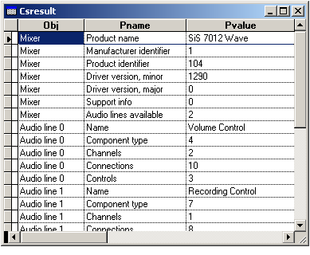

[ Home ](https://github.com/VFPX/Win32API)  

# Quering Audio Mixer Device

## Before you begin:
  
  
***  


## Code:
```foxpro  
#DEFINE MMSYSERR_NOERROR                 0
#DEFINE MAXPNAMELEN                      32
#DEFINE MIXER_SHORT_NAME_CHARS           16
#DEFINE MIXER_LONG_NAME_CHARS            64
#DEFINE MIXERCAPS_SIZE                   48
#DEFINE MIXERLINE_SIZE                   168
#DEFINE MIXERCONTROL_SIZE                148
#DEFINE MIXERLINECONTROLS_SIZE           24
#DEFINE MIXER_GETLINECONTROLSF_ALL       0
#DEFINE MIXER_GETLINECONTROLSF_ONEBYID   1
#DEFINE MIXER_GETLINECONTROLSF_ONEBYTYPE 2
#DEFINE MIXER_OBJECTF_WAVEOUT            0x10000000
#DEFINE MIXER_OBJECTF_WAVEIN             0x20000000
#DEFINE MIXERCONTROL_CONTROLTYPE_VOLUME  0x50030001
#DEFINE MIXER_GETLINEINFOF_DESTINATION   0

DO decl

PRIVATE hMixer, nLinecount, nIndex
STORE 0 TO hMixer, nLinecount

IF mixerGetNumDevs() = 0
	? "No mixer devices found."
	RETURN
ENDIF

IF mixerOpen(@hMixer, 0,0,0, MIXER_OBJECTF_WAVEOUT) <> MMSYSERR_NOERROR
	? "Could not open specified mixer device."
	RETURN
ENDIF

CREATE CURSOR csResult (obj C(20), pname C(30), pvalue C(100))

IF Not GetDevCaps()
	? "Unable to query specified mixer device."
ELSE
	FOR nIndex=0 TO nLinecount-1
		= GetLineCaps(nIndex)
	ENDFOR
	= GetControl(0, MIXERCONTROL_CONTROLTYPE_VOLUME)
	= GetControl(1, MIXERCONTROL_CONTROLTYPE_VOLUME)
ENDIF

= mixerClose(hMixer)
GO TOP
BROWSE NORMAL NOWAIT
* end of main

PROCEDURE GetDevCaps
* The MIXERCAPS structure describes the capabilities of a mixer device
*|typedef struct {
*|    WORD    wMid;                  0:2
*|    WORD    wPid;                  2:2
*|    MMVERSION vDriverVersion;      4:4
*|    CHAR    szPname[MAXPNAMELEN];  8:32
*|    DWORD   fdwSupport;           40:4
*|    DWORD   cDestinations;        44:4
*|} MIXERCAPS; total bytes=48

	LOCAL cBuffer
	cBuffer = Repli(Chr(0), MIXERCAPS_SIZE)

	IF mixerGetDevCaps(hMixer, @cBuffer, MIXERCAPS_SIZE);
		<> MMSYSERR_NOERROR
		RETURN .F.
	ENDIF

	DO addCap WITH "Mixer", "Product name",;
		SUBSTR(cBuffer,9,MAXPNAMELEN)

	DO addCap WITH "Mixer", "Manufacturer identifier",;
		buf2word(SUBSTR(cBuffer,1,2))

	DO addCap WITH "Mixer", "Product identifier",;
		buf2word(SUBSTR(cBuffer,3,2))

	DO addCap WITH "Mixer", "Driver version, minor",;
		buf2word(SUBSTR(cBuffer,5,2))

	DO addCap WITH "Mixer", "Driver version, major",;
		buf2word(SUBSTR(cBuffer,7,2))

	DO addCap WITH "Mixer", "Support info",;
		buf2dword(SUBSTR(cBuffer,41,4))

	nLinecount = buf2dword(SUBSTR(cBuffer,45,4))
	= addCap("Mixer", "Audio lines available", nLinecount)

PROCEDURE GetLineCaps(nLineIndex)
* The MIXERLINE structure describes
* the state and metrics of an audio line
*|typedef struct {
*|    DWORD cbStruct;                             0:4
*|    DWORD dwDestination;                        4:4
*|    DWORD dwSource;                             8:4
*|    DWORD dwLineID;                             12:4
*|    DWORD fdwLine;                              16:4
*|    DWORD dwUser;                               20:4
*|    DWORD dwComponentType;                      24:4
*|    DWORD cChannels;                            28:4
*|    DWORD cConnections;                         32:4
*|    DWORD cControls;                            36:4
*|    CHAR  szShortName[MIXER_SHORT_NAME_CHARS];  40:16
*|    CHAR  szName[MIXER_LONG_NAME_CHARS];        56:64
*|    struct {
*|        DWORD     dwType;                       120:4
*|        DWORD     dwDeviceID;                   124:4
*|        WORD      wMid;                         128:2
*|        WORD      wPid;                         130:2
*|        MMVERSION vDriverVersion;               132:4
*|        CHAR      szPname[MAXPNAMELEN];         136:32
*|    } Target;
*|} MIXERLINE; total bytes=168

	LOCAL cLineName, cBuffer, nResult, nCtlCount
	cLineName = "Audio line " + LTRIM(STR(nLineIndex))
	cBuffer = num2dword(MIXERLINE_SIZE) + num2dword(nLineIndex)
	cBuffer = PADR(cBuffer, MIXERLINE_SIZE, Chr(0))

	nResult = mixerGetLineInfo(hMixer, @cBuffer,;
		MIXER_GETLINEINFOF_DESTINATION)

	IF nResult <> MMSYSERR_NOERROR
		? "Failed to get information about the specified audio line."
		RETURN
	ENDIF
	
	= addCap(cLineName, "Name",;
		SUBSTR(cBuffer, 57, MIXER_LONG_NAME_CHARS))

	= addCap(cLineName, "Component type",;
		buf2dword(SUBSTR(cBuffer,25,4)))

	= addCap(cLineName, "Channels",;
		buf2dword(SUBSTR(cBuffer,29,4)))

	= addCap(cLineName, "Connections",;
		buf2dword(SUBSTR(cBuffer,33,4)))

	nCtlCount = buf2dword(SUBSTR(cBuffer,37,4))
	= addCap(cLineName, "Controls", nCtlCount)
	
PROCEDURE GetControl(nLineIndex, nCtlType)
* The MIXERCONTROL structure describes the state and metrics
* of a single control for an audio line
*|typedef struct {
*|    DWORD cbStruct;                             0:4
*|    DWORD dwControlID;                          4:4
*|    DWORD dwControlType;                        8:4
*|    DWORD fdwControl;                           12:4
*|    DWORD cMultipleItems;                       16:4
*|    CHAR  szShortName[MIXER_SHORT_NAME_CHARS];  20:16
*|    CHAR  szName[MIXER_LONG_NAME_CHARS];        36:64
*|    union {
*|        struct {
*|            LONG lMinimum;                      100:4
*|            LONG lMaximum;                      104:4
*|        };
*|        struct {
*|            DWORD dwMinimum;
*|            DWORD dwMaximum;
*|        };
*|        DWORD dwReserved[6];                    100:24
*|    } Bounds;
*|    union {
*|        DWORD cSteps;                           124:4
*|        DWORD cbCustomData;
*|        DWORD dwReserved[6];                    124:24
*|    } Metrics;
*|} MIXERCONTROL, *PMIXERCONTROL, FAR *LPMIXERCONTROL; 148 bytes

* The MIXERLINECONTROLS structure contains information
* about the controls of an audio line
*|typedef struct {
*|    DWORD cbStruct;            0:4
*|    DWORD dwLineID;            4:4
*|    union {
*|        DWORD dwControlID;     8:4
*|        DWORD dwControlType;
*|    };
*|    DWORD          cControls;  12:4
*|    DWORD          cbmxctrl;   16:4
*|    LPMIXERCONTROL pamxctrl;   20:4
*|} MIXERLINECONTROLS; 168 bytes

	LOCAL nBufsize, cBuffer, hBuffer, cControl
	nBufsize = MIXERCONTROL_SIZE
	hBuffer = GlobalAlloc(0, nBufsize)

	cBuffer = num2dword(MIXERLINECONTROLS_SIZE) +;
		num2dword(nLineIndex) +;
		num2dword(nCtlType) + num2dword(1) +;
		num2dword(MIXERCONTROL_SIZE) +;
		num2dword(hBuffer)

	IF mixerGetLineControls(hMixer, @cBuffer,;
		MIXER_GETLINECONTROLSF_ONEBYTYPE) = MMSYSERR_NOERROR

		cControl = Repli(Chr(0), nBufsize)
		= MemToStr(@cControl, hBuffer, nBufsize)
		
		= addCap("control", "Name",;
			SUBSTR(cControl,37,64))

		= addCap("control", "ID",;
			buf2dword(SUBSTR(cControl,5,4)))

		= addCap("control", "Type",;
			buf2dword(SUBSTR(cControl,9,4)))

		= addCap("control", "Status/flags",;
			buf2dword(SUBSTR(cControl,13,4)))

		= addCap("control", "Min",;
			buf2dword(SUBSTR(cControl,101,4)))

		= addCap("control", "Max",;
			buf2dword(SUBSTR(cControl,105,4)))

		= addCap("control", "Steps",;
			buf2dword(SUBSTR(cControl,125,4)))
	ENDIF
	= GlobalFree(hBuffer)

PROCEDURE addCap(cObj, cName, vValue)
	IF VARTYPE(vValue) = "N"
		vValue = LTRIM(STR(vValue))
	ENDIF
	IF Chr(0) $ vValue
		vValue = SUBSTR(vValue, 1, AT(Chr(0),vValue)-1)
	ENDIF
	INSERT INTO csResult VALUES (cObj, cName, vValue)

PROCEDURE decl
	DECLARE INTEGER mixerGetNumDevs IN winmm
	DECLARE INTEGER mixerClose IN winmm INTEGER hmx
	DECLARE INTEGER GlobalAlloc IN kernel32 INTEGER, INTEGER
	DECLARE INTEGER GlobalFree IN kernel32 INTEGER

	DECLARE RtlMoveMemory IN kernel32 As MemToStr;
		STRING @dest, INTEGER src, INTEGER buflen

	DECLARE INTEGER mixerOpen IN winmm;
		INTEGER @phmx, INTEGER uMxId, INTEGER dwCallback,;
		INTEGER dwInstance, INTEGER fdwOpen

	DECLARE INTEGER mixerGetDevCaps IN winmm;
		INTEGER uMxId, STRING @pmxcaps, INTEGER cbmxcaps

	DECLARE INTEGER mixerGetLineInfo IN winmm;
		INTEGER hmxobj, STRING @pmxl, INTEGER fdwInfo

	DECLARE INTEGER mixerGetLineControls IN winmm;
		INTEGER hmxobj, STRING @pmxlc, INTEGER fdwControls

FUNCTION buf2dword(lcBuffer)
RETURN Asc(SUBSTR(lcBuffer, 1,1)) + ;
	BitLShift(Asc(SUBSTR(lcBuffer, 2,1)),  8) +;
	BitLShift(Asc(SUBSTR(lcBuffer, 3,1)), 16) +;
	BitLShift(Asc(SUBSTR(lcBuffer, 4,1)), 24)

FUNCTION buf2word(lcBuffer)
RETURN Asc(SUBSTR(lcBuffer, 1,1)) + ;
       Asc(SUBSTR(lcBuffer, 2,1)) * 256

FUNCTION num2dword(lnValue)
#DEFINE m0  256
#DEFINE m1  65536
#DEFINE m2  16777216
	IF lnValue < 0
		lnValue = 0x100000000 + lnValue
	ENDIF
	LOCAL b0, b1, b2, b3
	b3 = Int(lnValue/m2)
	b2 = Int((lnValue - b3*m2)/m1)
	b1 = Int((lnValue - b3*m2 - b2*m1)/m0)
	b0 = Mod(lnValue, m0)
RETURN Chr(b0)+Chr(b1)+Chr(b2)+Chr(b3)  
```  
***  


## Listed functions:
[GlobalAlloc](../libraries/kernel32/GlobalAlloc.md)  
[GlobalFree](../libraries/kernel32/GlobalFree.md)  
[mixerClose](../libraries/winmm/mixerClose.md)  
[mixerGetDevCaps](../libraries/winmm/mixerGetDevCaps.md)  
[mixerGetLineControls](../libraries/winmm/mixerGetLineControls.md)  
[mixerGetLineInfo](../libraries/winmm/mixerGetLineInfo.md)  
[mixerGetNumDevs](../libraries/winmm/mixerGetNumDevs.md)  
[mixerOpen](../libraries/winmm/mixerOpen.md)  


***  

