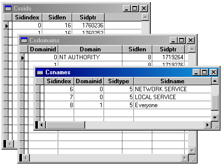

[ Home ](https://github.com/VFPX/Win32API)  

# Accessing LSA Policy object (Local Security Authority)

## Before you begin:
  
  
***  


## Code:
```foxpro  
#DEFINE STATUS_SUCCESS 0
#DEFINE POLICY_GET_PRIVATE_INFORMATION  4
#DEFINE POLICY_VIEW_LOCAL_INFORMATION   1
#DEFINE POLICY_VIEW_AUDIT_INFORMATION   2
#DEFINE POLICY_LOOKUP_NAMES             0x00000800

DO decl

*|typedef struct _LSA_OBJECT_ATTRIBUTES {
*|  ULONG Length;
*|  HANDLE RootDirectory;
*|  PLSA_UNICODE_STRING ObjectName;
*|  ULONG Attributes;
*|  PVOID SecurityDescriptor;
*|  PVOID SecurityQualityOfService;
*|} LSA_OBJECT_ATTRIBUTES, *PLSA_OBJECT_ATTRIBUTES; 24 bytes

LOCAL hPolicy, cAttributes, nResult, nFlag,;
	hSids, nSidCount, hDomains, hNames
hPolicy = 0
cAttributes = PADR(CHR(24), 24, Chr(0))

nFlag = POLICY_GET_PRIVATE_INFORMATION +;
	POLICY_VIEW_LOCAL_INFORMATION +;
	POLICY_VIEW_AUDIT_INFORMATION + POLICY_LOOKUP_NAMES

nResult = LsaOpenPolicy(Null, @cAttributes, nFlag, @hPolicy)

IF nResult <> STATUS_SUCCESS
	? "LsaOpenPolicy Error code:", LsaNtStatusToWinError(nResult)
	RETURN
ENDIF

STORE 0 TO hSids, nSidCount
nResult = LsaEnumerateAccountsWithUserRight(hPolicy,;
	Null, @hSids, @nSidCount)

IF nResult <> STATUS_SUCCESS
	? "Account Enumeration error:", LsaNtStatusToWinError(nResult)
	= LsaClose(hPolicy)
	RETURN
ENDIF

= ParseSids(hSids, nSidCount)

STORE 0 TO hDomains, hNames
nResult = LsaLookupSids(hPolicy, nSidCount, hSids, @hDomains, @hNames)

IF nResult <> STATUS_SUCCESS
	? "Names Lookup error:", LsaNtStatusToWinError(nResult)
ELSE
	= ParseDomains(hDomains)
	= ParseNames(hNames, nSidCount)
	= LsaFreeMemory(hDomains)
	= LsaFreeMemory(hNames)
ENDIF

= LsaFreeMemory(hSids)
= LsaClose(hPolicy)
* end of main

PROCEDURE ParseSids(hMem, nCount)
	LOCAL cBuffer, nBufsize, nIndex, hSid, nSidLen
	nBufsize = nCount * 4
	cBuffer = Repli(Chr(0), nBufsize)
	CopyMemory(@cBuffer, hMem, nBufsize)

	CREATE CURSOR csSids (sidindex I, sidlen I, sidptr N(12))
	FOR nIndex=0 TO nCount-1
		hSid = buf2dword(SUBSTR(cBuffer, nIndex*4+1, 4))
		cMem = MemToStr(hSid, 4)
		? buf2dword(cMem)
		nSidLen = GetLengthSid(hSid)
		INSERT INTO csSids VALUES (nIndex, nSidLen, hSid)
	ENDFOR
	GO TOP
	BROWSE NORMAL NOWAIT
	PosWindow("csSids", 1,1, 30, 60)

PROCEDURE ParseDomains(hMem)
#DEFINE TRUST_INFO_SIZE 12  && LSA_TRUST_INFORMATION
	LOCAL cBuffer, nCount, hArr, nArrSize, cTrustInfo,;
		nIndex, nOffs, nLen, nMaxlen, hName, hSid, cDomain

	cBuffer = MemToStr(hMem)
	nCount = buf2dword(SUBSTR(cBuffer, 1,4))

	hArr = buf2dword(SUBSTR(cBuffer, 5,4))
	nArrSize = nCount * TRUST_INFO_SIZE
	cTrustInfo = Repli(Chr(0), nArrSize)
	CopyMemory(@cTrustInfo, hArr, nArrSize)
	
	CREATE CURSOR csDomains (domainid I, domain C(32), sidlen I, sidptr N(12))
	FOR nIndex=0 TO nCount-1
		nOffs = nIndex * TRUST_INFO_SIZE + 1
		nLen = buf2word(SUBSTR(cTrustInfo, nOffs,2))
		nMaxlen = buf2word(SUBSTR(cTrustInfo, nOffs+2,2))
		hName = buf2dword(SUBSTR(cTrustInfo, nOffs+4,4))
		hSid = buf2dword(SUBSTR(cTrustInfo, nOffs+8,4))
		cDomain = Iif(nLen>0, STRCONV(MemToStr(hName, nLen), 6), "")
		nSidLen = GetLengthSid(hSid)
		INSERT INTO csDomains VALUES (nIndex, cDomain, nSidLen, hSid)
	ENDFOR
	GO TOP
	BROWSE NORMAL NOWAIT
	PosWindow("csDomains", 5,5, 20, 150)

PROCEDURE ParseNames(hMem, nCount)
#DEFINE TRANSL_NAME_SIZE 16  && LSA_TRANSLATED_NAME
	LOCAL cBuffer, nIndex, nOffs, nSidType, nLen, nMaxlen,;
		hName, cName, nDomainId
	cBuffer = MemToStr(hMem)
	
	CREATE CURSOR csNames (sidindex I, domainid I, sidtype I, sidname C(64))
	FOR nIndex=0 TO nCount-1
		nOffs = nIndex * TRANSL_NAME_SIZE + 1
		nSidType = buf2dword(SUBSTR(cBuffer, nOffs,4))
		nLen = buf2word(SUBSTR(cBuffer, nOffs+4,2))
		nMaxlen = buf2word(SUBSTR(cBuffer, nOffs+6,2))
		hName = buf2dword(SUBSTR(cBuffer, nOffs+8,4))
		nDomainId = buf2dword(SUBSTR(cBuffer, nOffs+12,4))
		cName = Iif(nLen>0, STRCONV(MemToStr(hName, nLen), 6), "")
		INSERT INTO csNames VALUES (nIndex, nDomainId, nSidType, cName)
	ENDFOR
	GO TOP
	BROWSE NORMAL NOWAIT
	PosWindow("csNames", 9, 9, 10, 170)

FUNCTION MemToStr(hMem, nBufsize)
	LOCAL cBuffer
	IF VARTYPE(nBufsize) <> "N"
		nBufsize = GlobalSize(hMem)
	ENDIF
	cBuffer = Repli(Chr(0), nBufsize)
	CopyMemory(@cBuffer, hMem, nBufsize)
RETURN cBuffer

PROCEDURE decl
	DECLARE INTEGER LsaOpenPolicy IN advapi32;
		STRING SystemName, STRING @ObjectAttributes,;
		INTEGER DesiredAccess, INTEGER @PolicyHandle

	DECLARE INTEGER LsaClose IN advapi32 INTEGER ObjectHandle
	DECLARE INTEGER LsaNtStatusToWinError IN advapi32 INTEGER nStatus
	DECLARE INTEGER LsaFreeMemory IN advapi32 INTEGER Buffer

	DECLARE INTEGER LsaEnumerateAccountsWithUserRight IN advapi32;
		INTEGER PolicyHandle, STRING UserRights,;
		INTEGER @EnumerationBuffer, INTEGER @CountReturned

	DECLARE INTEGER LsaLookupSids IN advapi32;
		INTEGER PolicyHandle, INTEGER nCount, INTEGER Sids,;
		INTEGER @ReferencedDomains, INTEGER @Names

	DECLARE RtlMoveMemory IN kernel32 As CopyMemory;
		STRING @Dest, INTEGER Source, INTEGER nLength

	DECLARE INTEGER GlobalSize IN kernel32 INTEGER hMem
	DECLARE INTEGER IsValidSid IN advapi32 INTEGER pSid
	DECLARE INTEGER GetLengthSid IN advapi32 INTEGER pSid

FUNCTION buf2dword(lcBuffer)
RETURN Asc(SUBSTR(lcBuffer, 1,1)) + ;
	BitLShift(Asc(SUBSTR(lcBuffer, 2,1)),  8) +;
	BitLShift(Asc(SUBSTR(lcBuffer, 3,1)), 16) +;
	BitLShift(Asc(SUBSTR(lcBuffer, 4,1)), 24)

FUNCTION buf2word(lcBuffer)
RETURN Asc(SUBSTR(lcBuffer, 1,1)) + ;
       Asc(SUBSTR(lcBuffer, 2,1)) * 256

PROCEDURE PosWindow(cWindow, nRow1, nColumn1, nRow2, nColumn2)
	MOVE WINDOW (cWindow) TO nRow1, nColumn1
	SIZE WINDOW (cWindow) TO nRow2, nColumn2  
```  
***  


## Listed functions:
[GetLengthSid](../libraries/advapi32/GetLengthSid.md)  
[GlobalSize](../libraries/kernel32/GlobalSize.md)  
[IsValidSid](../libraries/advapi32/IsValidSid.md)  
[LsaClose](../libraries/advapi32/LsaClose.md)  
[LsaFreeMemory](../libraries/advapi32/LsaFreeMemory.md)  
[LsaLookupSids](../libraries/advapi32/LsaLookupSids.md)  
[LsaOpenPolicy](../libraries/advapi32/LsaOpenPolicy.md)  
