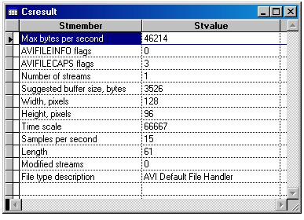

[ Home ](https://github.com/VFPX/Win32API)  

# Reading header information from AVI file

## Before you begin:
  
  
***  


## Code:
```foxpro  
#DEFINE OF_SHARE_DENY_WRITE        0x00000020
DO decl

PRIVATE cFilename, hFile, cBuffer, nResult

= AVIFileInit()  && init library

*cFilename = "c:\windows\clock.avi"
cFilename = "c:\Program Files\Microsoft Visual Studio\" +;
	"MSDN98\98VS\1033\SAMPLES\VFP98\Solution\Ole\Foxrain.Avi"

* opens an AVI file and returns the address of a file interface
hFile = 0
nResult = AVIFileOpen(@hFile, cFilename, OF_SHARE_DENY_WRITE, 0)

IF nResult <> 0
	? "Error opening AVI file:", nResult
ELSE
	DO GetFileInfo
	= AVIFileRelease(hFile)
ENDIF

= AVIFileExit()  && release library
* end of main

PROCEDURE GetFileInfo
*|typedef struct {
*|    DWORD dwMaxBytesPerSec;        0:4
*|    DWORD dwFlags;                 4:4
*|    DWORD dwCaps;                  8:4
*|    DWORD dwStreams;              12:4
*|    DWORD dwSuggestedBufferSize;  16:4
*|    DWORD dwWidth;                20:4
*|    DWORD dwHeight;               24:4
*|    DWORD dwScale;                28:4
*|    DWORD dwRate;                 32:4
*|    DWORD dwLength;               36:4
*|    DWORD dwEditCount;            40:4
*|    char  szFileType[64];         44:64
*|} AVIFILEINFO; total bytes: 108
#DEFINE AVIFILEINFO_SIZE 108
#DEFINE AVIFILECAPS_ALLKEYFRAMES   0x00000010
#DEFINE AVIFILECAPS_CANREAD        0x00000001
#DEFINE AVIFILECAPS_CANWRITE       0x00000002
#DEFINE AVIFILECAPS_NOCOMPRESSION  0x00000020

	LOCAL nScale, nRate

	* fills buffer with information about the AVI file
	cBuffer = Repli(Chr(0), AVIFILEINFO_SIZE)
	= AVIFileInfo(hFile, @cBuffer, AVIFILEINFO_SIZE)

	CREATE CURSOR csResult (stmember C(30), stvalue C(100))
	_add("Max bytes per second", buf2dword(SUBSTR(cBuffer, 1,4)))
	_add("AVIFILEINFO flags", buf2dword(SUBSTR(cBuffer, 5,4)))
	_add("AVIFILECAPS flags", buf2dword(SUBSTR(cBuffer, 9,4)))
	_add("Number of streams", buf2dword(SUBSTR(cBuffer, 13,4)))
	_add("Suggested buffer size, bytes", buf2dword(SUBSTR(cBuffer, 17,4)))
	_add("Width, pixels", buf2dword(SUBSTR(cBuffer, 21,4)))
	_add("Height, pixels", buf2dword(SUBSTR(cBuffer, 25,4)))

	nScale = buf2dword(SUBSTR(cBuffer, 29,4))
	nRate = buf2dword(SUBSTR(cBuffer, 33,4))

	_add("Time scale", nScale)
	_add("Samples per second", nRate/nScale)

	_add("Length", buf2dword(SUBSTR(cBuffer, 37,4)))
	_add("Modified streams", buf2dword(SUBSTR(cBuffer, 41,4)))
	_add("File type description", SUBSTR(cBuffer, 45,64))

	GO TOP
	BROW NORMAL NOWAIT

PROCEDURE _add(cName, vValue)
	IF VARTYPE(vValue) = "N"
		vValue = LTRIM(STR(vValue))
	ENDIF
	INSERT INTO csResult VALUES (cName, vValue)

PROCEDURE decl
	DECLARE AVIFileInit IN avifil32
	DECLARE AVIFileExit IN avifil32

	DECLARE INTEGER AVIFileOpen IN avifil32;
		INTEGER @ppfile, STRING szFile,;
		INTEGER mode, INTEGER pclsidHandler

	DECLARE INTEGER AVIFileRelease IN avifil32 INTEGER pfile

	DECLARE INTEGER AVIFileInfo IN avifil32;
		INTEGER pfile, STRING @pfi, INTEGER lSize

FUNCTION buf2dword(lcBuffer)
RETURN Asc(SUBSTR(lcBuffer, 1,1)) + ;
	BitLShift(Asc(SUBSTR(lcBuffer, 2,1)),  8) +;
	BitLShift(Asc(SUBSTR(lcBuffer, 3,1)), 16) +;
	BitLShift(Asc(SUBSTR(lcBuffer, 4,1)), 24)  
```  
***  


## Listed functions:
[AVIFileExit](../libraries/avifil32/AVIFileExit.md)  
[AVIFileInfo](../libraries/avifil32/AVIFileInfo.md)  
[AVIFileInit](../libraries/avifil32/AVIFileInit.md)  
[AVIFileOpen](../libraries/avifil32/AVIFileOpen.md)  
[AVIFileRelease](../libraries/avifil32/AVIFileRelease.md)  

## Comment:
The Microsoft AVI file format is a RIFF file specification. That means that functions like mmioOpen, mmioDescend, mmioWrite, mmioRead and others can be applied to AVI files.  
  
Read <a href="https://msdn.microsoft.com/en-us/library/windows/desktop/dd318189(v=vs.85).aspx">AVI RIFF File Reference</a> on MSDN.  
  
***  

