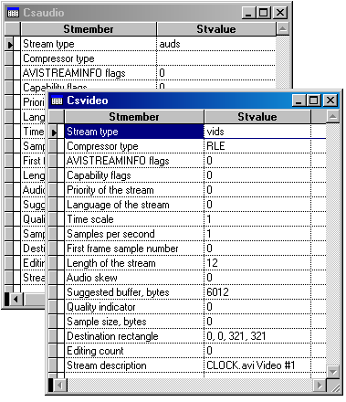

[ Home ](https://github.com/VFPX/Win32API)  

# Reading parameters of streams in AVI file

## Before you begin:
  
  
***  


## Code:
```foxpro  
#DEFINE OF_SHARE_DENY_WRITE        0x00000020
#DEFINE streamtypeVIDEO "vids"
#DEFINE streamtypeAUDIO "auds"
DO decl

= AVIFileInit()  && init library

LOCAL cFilename, hAviFile
cFilename = "c:\windows\clock.avi"
hAviFile = OpenAvi(m.cFilename)

IF hAviFile = 0
	? "Error opening AVI file"
ELSE
	= GetStreamInfo(hAviFile, streamtypeAUDIO, "csAudio", 1,1,30,120)
	= GetStreamInfo(hAviFile, streamtypeVIDEO, "csVideo", 7,7,30,120)
	= AVIFileRelease(hAviFile)
ENDIF

= AVIFileExit()  && release library
* end of main

FUNCTION OpenAvi(cFilename)
	LOCAL nResult, hFile
	hFile = 0
	nResult = AVIFileOpen(@hFile, cFilename, OF_SHARE_DENY_WRITE, 0)
RETURN Iif(nResult=0, hFile, 0)

PROCEDURE GetStreamInfo(hFile, fccType, cs,;
	nRow1, nColumn1, nRow2, nColumn2)

	LOCAL hStream
	hStream = 0

	= AVIFileGetStream(hFile, @hStream, buf2dword(fccType), 0)

	IF hStream = 0
		? "Could not open stream:", fccType
		RETURN
	ENDIF

*|typedef struct {
*|    DWORD fccType;         0:4
*|    DWORD fccHandler;      4:4
*|    DWORD dwFlags;         8:4
*|    DWORD dwCaps;          12:4
*|    WORD  wPriority;       16:2
*|    WORD  wLanguage;       18:2
*|    DWORD dwScale;         20:4
*|    DWORD dwRate;          24:4
*|    DWORD dwStart;         28:4
*|    DWORD dwLength;        32:4
*|    DWORD dwInitialFrames; 36:4
*|    DWORD dwSuggBufSize;   40:4
*|    DWORD dwQuality;       44:4
*|    DWORD dwSampleSize;    48:4
*|    RECT  rcFrame;         52:16
*|    DWORD dwEditCount;     68:4
*|    DWORD dwFormatChgCnt;  72:4
*|    char  szName[64];      76:64
*|} AVISTREAMINFO; Total bytes = 140
#DEFINE AVISTREAMINFO_SIZE 140

	LOCAL cBuffer, nScale, nRate, nX0, nY0, nX1, nY1

	cBuffer = Repli(Chr(0), AVISTREAMINFO_SIZE)
	= AVIStreamInfo(hStream, @cBuffer, AVISTREAMINFO_SIZE)

	CREATE CURSOR (cs) (stmember C(30), stvalue C(100))

	_add(cs, "Stream type", SUBSTR(cBuffer, 1,4))
	_add(cs, "Compressor type", SUBSTR(cBuffer, 5,4))
	_add(cs, "AVISTREAMINFO flags", buf2dword(SUBSTR(cBuffer, 9,4)))
	_add(cs, "Capability flags", buf2dword(SUBSTR(cBuffer, 13,4)))
	_add(cs, "Priority of the stream", buf2word(SUBSTR(cBuffer, 17,2)))
	_add(cs, "Language of the stream", buf2word(SUBSTR(cBuffer, 19,4)))
	
	nScale = buf2dword(SUBSTR(cBuffer, 21,4))
	nRate = buf2dword(SUBSTR(cBuffer, 25,4))
	_add(cs, "Time scale", nScale)
	_add(cs, "Samples per second", nRate/nScale)

	_add(cs, "First frame sample number", buf2dword(SUBSTR(cBuffer, 29,4)))
	_add(cs, "Length of the stream", buf2dword(SUBSTR(cBuffer, 33,4)))
	_add(cs, "Audio skew", buf2dword(SUBSTR(cBuffer, 37,4)))
	_add(cs, "Suggested buffer, bytes", buf2dword(SUBSTR(cBuffer, 41,4)))
	_add(cs, "Quality indicator", buf2dword(SUBSTR(cBuffer, 45,4)))
	_add(cs, "Sample size, bytes", buf2dword(SUBSTR(cBuffer, 49,4)))
	
	nX0 = buf2dword(SUBSTR(cBuffer, 53,4))
	nY0 = buf2dword(SUBSTR(cBuffer, 57,4))
	nX1 = buf2dword(SUBSTR(cBuffer, 61,4))
	nY1 = buf2dword(SUBSTR(cBuffer, 65,4))
	_add(cs, "Destination rectangle", LTRIM(STR(nX0))+", "+;
		LTRIM(STR(nY0))+", "+LTRIM(STR(nX1))+", "+LTRIM(STR(nY1)))

	_add(cs, "Editing count", buf2dword(SUBSTR(cBuffer, 69,4)))
	_add(cs, "Stream description", SUBSTR(cBuffer, 77))

	= AVIStreamRelease(hStream)

	GO TOP
	BROW NORMAL NOWAIT
	PosWindow(cs, nRow1, nColumn1, nRow2, nColumn2)

PROCEDURE _add(cCursor, cName, vValue)
	IF VARTYPE(vValue) = "N"
		vValue = LTRIM(STR(vValue))
	ENDIF
	INSERT INTO (cCursor) VALUES (cName, vValue)

PROCEDURE decl
	DECLARE AVIFileInit IN avifil32
	DECLARE AVIFileExit IN avifil32
	DECLARE INTEGER AVIFileRelease IN avifil32 INTEGER pfile
	DECLARE INTEGER AVIStreamRelease IN avifil32 INTEGER pavi
	DECLARE INTEGER AVIStreamLength IN avifil32 INTEGER pavi
	DECLARE INTEGER AVIStreamStart IN avifil32 INTEGER pavi

	DECLARE INTEGER AVIFileOpen IN avifil32;
		INTEGER @ppfile, STRING szFile,;
		INTEGER mode, INTEGER pclsidHandler

	DECLARE INTEGER AVIFileGetStream IN avifil32;
		INTEGER pfile, INTEGER @ppavi,;
		INTEGER fccType, INTEGER lParam

	DECLARE INTEGER AVIStreamInfo IN avifil32;
		INTEGER pavi, STRING @psi, INTEGER lSize

FUNCTION buf2dword(lcBuffer)
RETURN Asc(SUBSTR(lcBuffer, 1,1)) + ;
	BitLShift(Asc(SUBSTR(lcBuffer, 2,1)),  8) +;
	BitLShift(Asc(SUBSTR(lcBuffer, 3,1)), 16) +;
	BitLShift(Asc(SUBSTR(lcBuffer, 4,1)), 24)

FUNCTION buf2word(lcBuffer)
RETURN Asc(SUBSTR(lcBuffer, 1,1)) + ;
       Asc(SUBSTR(lcBuffer, 2,1)) * 256

PROCEDURE PosWindow(cWindow, nRow1, nColumn1, nRow2, nColumn2)
	MOVE WINDOW (cWindow) TO nRow1, nColumn1
	SIZE WINDOW (cWindow) TO nRow2, nColumn2  
```  
***  


## Listed functions:
[AVIFileExit](../libraries/avifil32/AVIFileExit.md)  
[AVIFileGetStream](../libraries/avifil32/AVIFileGetStream.md)  
[AVIFileInit](../libraries/avifil32/AVIFileInit.md)  
[AVIFileOpen](../libraries/avifil32/AVIFileOpen.md)  
[AVIFileRelease](../libraries/avifil32/AVIFileRelease.md)  
[AVIStreamInfo](../libraries/avifil32/AVIStreamInfo.md)  
[AVIStreamLength](../libraries/avifil32/AVIStreamLength.md)  
[AVIStreamRelease](../libraries/avifil32/AVIStreamRelease.md)  
[AVIStreamStart](../libraries/avifil32/AVIStreamStart.md)  
