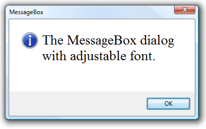
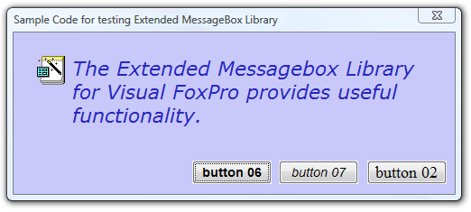
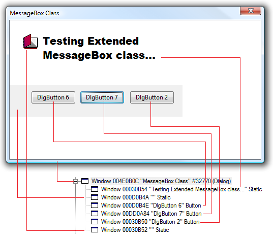

[ Home ](https://github.com/VFPX/Win32API)  

# How to change the name and the size of the font in the MessageBox dialog

## Note that this document contains some links to the old news2news website which does not work at the moment. This material will be available sometime in the future.

## Before you begin:
<!-- Anatoliy -->
<a href="?solution=3&src=x434" target=_blank></a>  
There is more advanced version of this code.   
Click to open the [Extended MessageBox Library (FLL)](?solution=3&src=x434) web page.  

* * *  
<a href="http://www.news2news.com/vfp/?solution=3"></a>  
This code sample demonstrates another hidden MessageBox capability that can be reached by FoxPro applications. See also [Using Extended MessageBox() Class](sample_424.md) example in this reference.   

See also:
* [How to position the GETPRINTER() dialog](sample_482.md)
* [How to display a user-defined icon in the MessageBox dialog](sample_500.md)  
* [Extended MessageBox Class](sample_418.md)  
* [Creating an Open dialog box to specify the drive, directory, and name of a file to open (Shell32 version)](sample_365.md)  
* [Creating the Open dialog box to specify the drive, directory, and name of a file to open](sample_363.md)  
* [Creating the Save dialog box to specify the drive, directory, and name of a file to save](sample_265.md)  
* [How to display a dialog box that enables the user to select a folder (an alternative to the GETDIR)](sample_364.md)  
  
***  


## Code:
```foxpro  
IF VARTYPE(_screen.msgboxtimer) <> "U"
	_SCREEN.RemoveObject("msgboxtimer")
ENDIF
_SCREEN.AddObject("msgboxtimer", "Tmsgbox")

WITH _SCREEN.msgboxtimer
	.FontName = "Times New Roman"
	.FontSize = 24

	* note carriage returns added to the end of the message
	* to increase its height
	.MsgBox("The MessageBox dialog with adjustable font.   " +;
		Repli(Chr(13),5), 64, "MessageBox")
ENDWITH
* end of main

DEFINE CLASS Tmsgbox As Timer
#DEFINE GW_HWNDFIRST    0
#DEFINE GW_HWNDLAST     1
#DEFINE GW_HWNDNEXT     2
#DEFINE GW_CHILD        5
#DEFINE GWL_ID         -12
	Interval=0
	hDialog=0      && dialog window handle
	DlgMessage=""
	DlgTitle=""
	DlgType=0
	DlgResult=0
	FontName="Arial"
	FontSize=16
	FontItalic=0
	FontWeight=400
	hFont=0

PROCEDURE Init
	DECLARE INTEGER GetActiveWindow IN user32
	DECLARE INTEGER GetWindow IN user32 INTEGER hwnd, INTEGER wFlag
	DECLARE INTEGER ReleaseDC IN user32 INTEGER hwnd, INTEGER hdc
	DECLARE INTEGER DeleteObject IN gdi32 INTEGER hObject
	DECLARE INTEGER SelectObject IN gdi32 INTEGER hdc, INTEGER hObject
	DECLARE INTEGER GetWindowDC IN user32 INTEGER hWnd

	DECLARE INTEGER CreateFont IN gdi32;
		INTEGER nHeight, INTEGER nWidth, INTEGER nEscapement,;
		INTEGER nOrientation, INTEGER fnWeight, INTEGER fdwItalic,;
		INTEGER fdwUnderline, INTEGER fdwStrikeOut, INTEGER fdwCharSet,;
		INTEGER fdwOutPrecis, INTEGER fdwClipPrecis, INTEGER fdwQuality,;
		INTEGER fdwPitchAndFamily, STRING lpszFace

	DECLARE INTEGER GetWindowText IN user32;
		INTEGER hwnd, STRING @lpString, INTEGER cch

	DECLARE INTEGER SendMessage IN user32;
		INTEGER hWnd, INTEGER Msg, INTEGER wParam, INTEGER lParam

PROCEDURE MsgBox(cMsg, nType, cTitle)
	WITH THIS
		.DlgMessage = cMsg
		.DlgType = m.nType
		.DlgTitle = Iif(VARTYPE(cTitle)="C", m.cTitle, VERSION())
		.Interval = 100
		.DlgResult = MessageB(THIS.DlgMessage, .DlgType, .DlgTitle)
		= DeleteObject(THIS.hFont) && only after the dialog is closed
		.hDialog = 0
	ENDWITH
RETURN THIS.DlgResult

PROCEDURE Timer
	IF THIS.hDialog = 0
		IF THIS.DialogFound()
			THIS.SetMessageFont
		ENDIF
		THIS.Interval = 0
	ENDIF

PROTECTED FUNCTION DialogFound
	LOCAL hWindow, cTitle
	hWindow = GetActiveWindow()
	cTitle = THIS.GetWinText(hWindow)
	THIS.hDialog = IIF(cTitle=THIS.DlgTitle, hWindow, 0)
RETURN (THIS.hDialog <> 0)

PROTECTED FUNCTION GetWinText(hWindow)
	LOCAL nBufsize, cBuffer
	nBufsize = 128
	cBuffer = Repli(Chr(0), nBufsize)
	nBufsize = GetWindowText(hWindow, @cBuffer, nBufsize)
RETURN Iif(nBufsize=0, "", Left(cBuffer, nBufsize))

PROTECTED FUNCTION GetTextWinHandle
* returns window handle for the dialog message
	LOCAL hFirst, hWindow, hLast, hTarget
	hFirst = GetWindow(THIS.hDialog, GW_CHILD)
	hWindow = GetWindow(hFirst, GW_HWNDFIRST)
	hLast = GetWindow(hFirst, GW_HWNDLAST)
	hTarget = 0

	DO WHILE .T.
		cText = THIS.GetWinText(m.hWindow)
		DO CASE
		CASE m.cText = THIS.DlgMessage
			hTarget = m.hWindow
			EXIT
		CASE hWindow = m.hLast
			EXIT
		ENDCASE
		hWindow = GetWindow(m.hWindow, GW_HWNDNEXT)
	ENDDO
RETURN hTarget

PROTECTED PROCEDURE SetMessageFont
#DEFINE OUT_OUTLINE_PRECIS  8
#DEFINE CLIP_STROKE_PRECIS  2
#DEFINE PROOF_QUALITY       2
#DEFINE WM_SETFONT          48

	LOCAL hTarget, hDC
	hTarget = THIS.GetTextWinHandle()

	IF hTarget <> 0
		hDC = GetWindowDC(m.hTarget)
		THIS.hFont = CreateFont(THIS.FontSize,;
			0, 0,0, THIS.FontWeight,THIS.FontItalic,0,0,;
			0, OUT_OUTLINE_PRECIS, CLIP_STROKE_PRECIS,;
			PROOF_QUALITY, 0, THIS.FontName)

		= SendMessage (m.hTarget, WM_SETFONT, THIS.hFont, 1)
		= ReleaseDC(m.hTarget, m.hDC)
	ENDIF
ENDDEFINE  
```  
***  


## Listed functions:
[CreateFont](../libraries/gdi32/CreateFont.md)  
[DeleteObject](../libraries/gdi32/DeleteObject.md)  
[GetActiveWindow](../libraries/user32/GetActiveWindow.md)  
[GetWindow](../libraries/user32/GetWindow.md)  
[GetWindowDC](../libraries/user32/GetWindowDC.md)  
[GetWindowText](../libraries/user32/GetWindowText.md)  
[MessageBox](../libraries/user32/MessageBox.md)  
[ReleaseDC](../libraries/user32/ReleaseDC.md)  
[SelectObject](../libraries/gdi32/SelectObject.md)  
[SendMessage](../libraries/user32/SendMessage.md)  

## Comment:
Setting  the font size to a larger value can cut part of the message off. This happens because of the MessageBox function calculating the size for the message rectangle based on the default font.  
  
By adding some extra CHR(13) characters (the carriage returns) the height of the message can be artificially increased. This solves the problem though only partially.   
  
Ideally the size of the message rectangle must be re-calculated by the calling application, which then also should resize the message window and resize and reposition all other windows accordingly.  
  
* * *  
Even better MessageBox customization can be achieved by creating an external library (ActiveX, DLL or FLL) and calling it from VFP application.   
<a href="http://www.news2news.com/vfp/?solution=3"></a>  
The background color, the message text font & color, button fonts and captions, not to mention other customizable parameters, can be controlled by the calling application.  
  
* * *  
The MessageBox dialog consists of several windows.  
  


The *Dialog Window* is the parent window, and all others are its children: the message window, the icon window and the buttons.  
  
The Tool window  (its Control ID 0x0000CAFE always makes me feel good) is an addition to the MessageBox child windows that came with the Vista.  
  
***  

