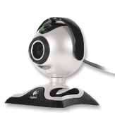
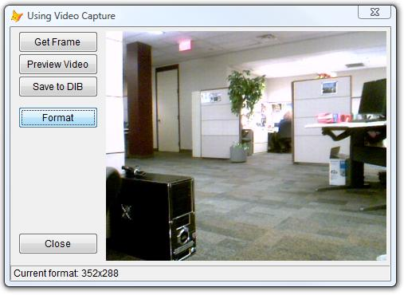
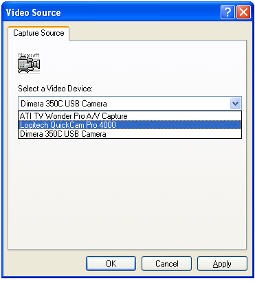

[ Home ](https://github.com/VFPX/Win32API)  

# Using Video Capture: displaying on FoxPro form frames and previewing video obtained from a digital camera

## Note that this document contains some links to the old news2news website which does not work at the moment. This material will be available sometime in the future.

## Short description:
The code sample shows how to display preview from a digital camera using Video Capture API. As well this API can display still frames and save frames to DIB files.  
***  


## Before you begin:
  
This code sample has been tested with Logitech QuickCam Pro 4000 and with Dimera 350C USB Camera (an ancient camera from the year 2000) both operating under Windows XP.   

Also I tested the code with Microsoft LifeCam VS-6000 on Vista Business 64-bit PC (the picture below).    

  

No ActiveX controls are required, actually not much of programming is required either. Two API functions, capCreateCaptureWindow and SendMessage do practically all the job. The FoxPro form hosts a child window (*the capture window*) connected to existing capturing driver.  

<!-- Anatoliy -->
See also:

* [FoxTalk article: Using the Video Capture API in Visual FoxPro](?article=8)   
  
***  


## Code:
```foxpro  
LOCAL oForm
oForm = CREATEOBJECT("Tform")
oForm.Visible=.T.
READ EVENTS
* end of main

DEFINE CLASS Tform As Form  && hosting form
	Width=760
	Height=500
	Autocenter=.T.
	Caption="Using Video Capture"
	MinButton=.F.
	MaxButton=.F.
	ShowWindow=2
	BorderStyle=2
	ShowTips=.T.
	
	ADD OBJECT cmdClose As CommandButton WITH Cancel=.T.,;
	Left=10, Top=150, Height=27, Width=100, Caption="Close"

	ADD OBJECT cmdGetFrame As CommandButton WITH;
	Left=10, Top=5, Height=27, Width=100, Caption="Get Frame",;
	Enabled=.F., ToolTipText="Updates the frame"

	ADD OBJECT cmdPreview As CommandButton WITH Default=.T.,;
	Left=10, Top=33, Height=27, Width=100, Caption="Preview Video",;
	Enabled=.F., ToolTipText="Turns preview mode on"

	ADD OBJECT cmdSave As CommandButton WITH Left=10, Top=61,;
	Height=27, Width=100, Caption="Save to DIB",;
	ToolTipText="Saves current frame to DIB file"

	ADD OBJECT cmdFormat As CommandButton WITH Left=10, Top=100,;
	Height=27, Width=100, Caption="Format",;
	ToolTipText="Displays available formats"
	
	ADD OBJECT capwindow As TCaptureWindow
	ADD OBJECT sbar As Tbar WITH Left=0, Height=21, Width=685

PROCEDURE Init
	= BINDEVENT(THIS.capwindow, "SendTipToParent",;
		THIS, "OnCaptureWindowTip")

	= BINDEVENT(THIS.capwindow, "ResizeCaptureWindow",;
		THIS, "OnCaptureWindowResized", 1)

PROCEDURE Activate
	IF THIS.capwindow.hWindow = 0
		IF THIS.capwindow.InitCaptureWindow(THIS.HWnd, 120, 5)
			STORE .T. TO THIS.cmdGetFrame.Enabled,;
				THIS.cmdPreview.Enabled
		ENDIF
	ENDIF

PROCEDURE Destroy
	CLEAR EVENTS

PROCEDURE cmdClose.Click
	ThisForm.Release

PROCEDURE cmdGetFrame.Click
	ThisForm.capwindow.GetFrame

PROCEDURE cmdPreview.Click
	ThisForm.capwindow.StartPreview

PROCEDURE cmdFormat.Click
	ThisForm.capwindow.FormatDlg

PROCEDURE cmdSave.Click
	ThisForm.capwindow.SaveToDib

PROCEDURE OnCaptureWindowResized
	WITH THIS.capwindow
		IF .capWidth=0 OR .capHeight=0
			RETURN
		ENDIF
		THIS.Width = MAX(320, .capLeft+.capWidth+5)
		THIS.Height = MAX(240, .capTop+.capHeight+25)
		THIS.cmdClose.Top = THIS.Height-60
	ENDWITH

PROCEDURE OnCaptureWindowTip(cTip)
	THIS.sbar.Panels(1).Text = m.cTip

ENDDEFINE

DEFINE CLASS TCaptureWindow As Custom  && capture window control
#DEFINE WM_CAP_START  0x0400
#DEFINE WM_CAP_DRIVER_CONNECT    (WM_CAP_START+10)
#DEFINE WM_CAP_DRIVER_DISCONNECT (WM_CAP_START+11)
#DEFINE WM_CAP_DRIVER_GET_CAPS   (WM_CAP_START+14)
#DEFINE WM_CAP_FILE_SAVEDIB      (WM_CAP_START+25)
#DEFINE WM_CAP_DLG_VIDEOFORMAT   (WM_CAP_START+41)
#DEFINE WM_CAP_GET_VIDEOFORMAT   (WM_CAP_START+44)
#DEFINE WM_CAP_SET_VIDEOFORMAT   (WM_CAP_START+45)
#DEFINE WM_CAP_SET_PREVIEW       (WM_CAP_START+50)
#DEFINE WM_CAP_SET_OVERLAY       (WM_CAP_START+51)
#DEFINE WM_CAP_SET_PREVIEWRATE   (WM_CAP_START+52)
#DEFINE WM_CAP_SET_SCALE         (WM_CAP_START+53)
#DEFINE WM_CAP_GET_STATUS        (WM_CAP_START+54)
#DEFINE WM_CAP_GRAB_FRAME        (WM_CAP_START+60)

#DEFINE WS_CHILD 0x40000000
#DEFINE WS_VISIBLE 0x10000000
#DEFINE SWP_SHOWWINDOW 0x40
#DEFINE BITMAPINFOHEADER_SIZE 40
#DEFINE CAPDRIVERCAPS_SIZE 44

	hWindow=0
	hCapture=0
	capWidth=0
	capHeight=0
	capOverlay=0
	capLeft=0
	capTop=0

PROCEDURE Init
	THIS.declare

PROCEDURE Destroy
	THIS.ReleaseCaptureWindow

PROCEDURE InitCaptureWindow(hParent, nLeft, nTop)
	WITH THIS
		.hWindow = m.hParent
		.capLeft = m.nLeft
		.capTop = m.nTop
		STORE 0 TO .capWidth, .capHeight

		.hCapture = capCreateCaptureWindow("",;
			BITOR(WS_CHILD,WS_VISIBLE), .capLeft, .capTop,;
			1,1, .hWindow, 1)

		IF .DriverConnect()
			.msg(WM_CAP_SET_SCALE, 1, 0)
			.ResizeCaptureWindow
			.SendTipToParent("Capture window created: " +;
				TRANSFORM(.hCapture))
		ENDIF
	ENDWITH
RETURN THIS.IsCaptureConnected()

PROCEDURE msg(msg, wParam, lParam, nMode)
	DO CASE
	CASE THIS.hCapture = 0
	CASE VARTYPE(nMode) <> "N" Or nMode=0
		= SendMsgInt(THIS.hCapture, msg, wParam, lParam)
	OTHERWISE
		= SendMsgStr(THIS.hCapture, msg, wParam, @lParam)
	ENDCASE

PROCEDURE ResizeCaptureWindow
	THIS.GetVideoFormat
	= SetWindowPos(THIS.hCapture, 0, THIS.capLeft,THIS.capTop,;
		THIS.capWidth, THIS.capHeight, SWP_SHOWWINDOW)

PROCEDURE DriverConnect
	THIS.msg(WM_CAP_DRIVER_CONNECT, 0,0)
	IF THIS.IsCaptureConnected()
		RETURN .T.
	ELSe
		THIS.SendTipToParent("Connection to video input device failed.")
		RETURN .F.
	ENDIF

PROCEDURE DriverDisconnect
	THIS.msg(WM_CAP_DRIVER_DISCONNECT, 0,0)

PROCEDURE ReleaseCaptureWindow
	IF THIS.hCapture <> 0
		THIS.DriverDisconnect
		= DestroyWindow(THIS.hCapture)
		THIS.hCapture = 0
	ENDIF

PROCEDURE GetFrame
	THIS.msg(WM_CAP_GRAB_FRAME, 0,0)
	THIS.SendTipToParent("Frame grabbed.")

PROCEDURE GetVideoFormat
	LOCAL cBuffer, nBufsize
	nBufsize=4096
	cBuffer = PADR(num2dword(BITMAPINFOHEADER_SIZE), nBufsize, CHR(0))
	THIS.msg(WM_CAP_GET_VIDEOFORMAT, nBufsize, @cBuffer, 1)
	THIS.capWidth = buf2dword(SUBSTR(cBuffer, 5,4))
	THIS.capHeight = buf2dword(SUBSTR(cBuffer, 9,4))

PROCEDURE FormatDlg
	THIS.msg(WM_CAP_DLG_VIDEOFORMAT, 0,0)
	THIS.ResizeCaptureWindow
	THIS.SendTipToParent("Current format: " +;
		TRANSFORM(THIS.capWidth) + "x" + TRANSFORM(THIS.capHeight))

FUNCTION IsCaptureConnected
* checks CAPDRIVERCAPS.fCaptureInitialized member
	LOCAL cBuffer, nResult
	cBuffer = Repli(Chr(0),CAPDRIVERCAPS_SIZE)
	THIS.msg(WM_CAP_DRIVER_GET_CAPS, LEN(cBuffer), @cBuffer, 1)
	THIS.capOverlay = buf2dword(SUBSTR(cBuffer,5,4))
	nResult = Asc(SUBSTR(cBuffer, 21,1))
RETURN (nResult <> 0)

PROCEDURE StartPreview
	THIS.msg(WM_CAP_SET_PREVIEWRATE,30,0)
	THIS.msg(WM_CAP_SET_PREVIEW, 1,0)
	IF THIS.capOverlay <> 0
		THIS.msg(WM_CAP_SET_OVERLAY,1,0)
	ENDIF
	THIS.SendTipToParent("Preview mode started.")

PROCEDURE StopPreview
	THIS.msg(WM_CAP_SET_PREVIEW, 0,0)
	THIS.SendTipToParent("Preview mode stopped.")

PROCEDURE SaveToDib
	LOCAL cFilename
	cFilename="grab_" + SUBSTR(SYS(2015), 3) + ".dib" + CHR(0)
	THIS.msg(WM_CAP_FILE_SAVEDIB, 0, @cFilename, 1)
	THIS.SendTipToParent("Frame saved to " + m.cFilename + ".")

PROCEDURE SendTipToParent(cTip)

PROCEDURE declare
	DECLARE INTEGER DestroyWindow IN user32 INTEGER hWindow

	DECLARE INTEGER capCreateCaptureWindow IN avicap32;
		STRING lpszWindowName, LONG dwStyle,;
		INTEGER x, INTEGER y, INTEGER nWidth,;
		INTEGER nHeight, INTEGER hParent, INTEGER nID

	DECLARE INTEGER SetWindowPos IN user32;
		INTEGER hWindow, INTEGER hWndInsertAfter,;
		INTEGER x, INTEGER y, INTEGER cx, INTEGER cy,;
		INTEGER wFlags

	DECLARE INTEGER SendMessage IN user32 As SendMsgInt;
		INTEGER hWindow, INTEGER Msg,;
		INTEGER wParam, INTEGER lParam

	DECLARE INTEGER SendMessage IN user32 As SendMsgStr;
		INTEGER hWindow, INTEGER Msg,;
		INTEGER wParam, STRING @lParam

ENDDEFINE

DEFINE CLASS Tbar As OleControl
	OleClass="MSComctlLib.SBarCtrl.2"
PROCEDURE Init
	THIS.Height=21
	THIS.Panels(1).Width = 800
ENDDEFINE

FUNCTION buf2dword(lcBuffer)
RETURN Asc(SUBSTR(lcBuffer, 1,1)) + ;
	BitLShift(Asc(SUBSTR(lcBuffer, 2,1)),  8) +;
	BitLShift(Asc(SUBSTR(lcBuffer, 3,1)), 16) +;
	BitLShift(Asc(SUBSTR(lcBuffer, 4,1)), 24)

FUNCTION num2dword(lnValue)
#DEFINE m0 0x100
#DEFINE m1 0x10000
#DEFINE m2 0x1000000
	IF lnValue < 0
		lnValue = 0x100000000 + lnValue
	ENDIF
	LOCAL b0, b1, b2, b3
	b3 = Int(lnValue/m2)
	b2 = Int((lnValue - b3*m2)/m1)
	b1 = Int((lnValue - b3*m2 - b2*m1)/m0)
	b0 = Mod(lnValue, m0)
RETURN Chr(b0)+Chr(b1)+Chr(b2)+Chr(b3)  
```  
***  


## Listed functions:
[DestroyWindow](../libraries/user32/DestroyWindow.md)  
[SendMessage](../libraries/user32/SendMessage.md)  
[SetWindowPos](../libraries/user32/SetWindowPos.md)  
[capCreateCaptureWindow](../libraries/avicap32/capCreateCaptureWindow.md)  

## Comment:
Apr.15, 2008: C++ version added  
May 27, 2007: all capWindow functionality moved to Custom control  
Oct.12, 2004: SaveToDib method captures and saves a single image as a device-independent bitmap (DIB).   
  
[Windows Image Acquisition Automation Layer](https://msdn.microsoft.com/en-us/library/windows/desktop/ms630827(v=vs.85).aspx)  
  
The Microsoft Windows Image Acquisition (WIA) Automation Layer 2.0 is a full-featured image manipulation component that provides end-to-end image processing capabilities. The WIA Automation Layer makes it easy to acquire images on digital cameras, scanners, or Web cameras, and to rotate, scale, and annotate your image files.   
  
Applications that use the WIA Automation LayerAPI require Windows XPService Pack 1 (SP1) or later. Earlier versions of Windows are not supported. You will need WIAAut.dll to use the WIA Automation Layer.  
  
* * *  
You may have several capture windows created and fed from different Video Sources. You can not feed two capture windows from same source.  
  
For example, now I have two digital cameras connected through USB -- Dimera 350C and Logitech QuickCam -- and one more video source, ATI TV Wonder Pro card that receives TV channels through coaxial cable.   
  
  

With slightly modified code I can create three capture windows, one for each video source. All three windows simultaneously display preview from their sources.  
  
* * *  
Window styles WS_SYSMENU, WS_CAPTION and WS_THICKFRAME applied to the capture window make it movable and resizable. WS_CHILD must be present in any combination of window styles.  
  
***  

