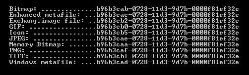

[ Home ](https://github.com/VFPX/Win32API)  

# GDI+: retrieving list of available image encoders and image decoders

## Before you begin:
The code is based on [custom GDI+ class](sample_450.md). Download the class module first and save it in **gdiplus.prg** file.   

```txt
{557CF400-1A04-11D3-9A73-0000F81EF32E}  
{B96B3CAB-0728-11D3-9D7B-0000F81EF32E}  
Built-in BMP Codec  
BMP *.BMP;*.DIB;*.RLE image/bmp  

{557CF401-1A04-11D3-9A73-0000F81EF32E}  
{B96B3CAE-0728-11D3-9D7B-0000F81EF32E}  
Built-in JPEG Codec  
JPEG *.JPG;*.JPEG;*.JPE;*.JFIF image/jpeg  

{557CF402-1A04-11D3-9A73-0000F81EF32E}  
{B96B3CB0-0728-11D3-9D7B-0000F81EF32E}  
Built-in GIF Codec GIF *.GIF image/gif
...
```
  
***  


## Code:
```foxpro  
SET PROCEDURE TO gdiplus ADDITIVE

PRIVATE gdiplus, coder As ImageCodecInfo
gdiplus = CREATEOBJECT("gdiplusinit_")

CREATE CURSOR coders (codertype C(1), clsid C(38), formatid C(38),;
	codecname C(30), description C(10), extension C(30), mimetype C(16))

FOR EACH coder IN gdiplus.decoders
	WITH coder
		INSERT INTO coders VALUES("D", .clsid, .formatid,;
			.codecname, .formatdescription,;
			.filenameextension, .mimetype)
	ENDWITH
NEXT

FOR EACH coder IN gdiplus.encoders
	WITH coder
		INSERT INTO coders VALUES("E", .clsid, .formatid,;
			.codecname, .formatdescription,;
			.filenameextension, .mimetype)
	ENDWITH
NEXT

SELECT coders
GO TOP
BROWSE NORMAL NOWAIT
* end of main

DEFINE CLASS gdiplusinit_ As gdiplusinit
#DEFINE EMPTY_GUID "{00000000-0000-0000-0000-000000000000}"
	encoders=0
	decoders=0

PROCEDURE Init
	DODEFAULT()
	THIS.GetEncoders
	THIS.GetDecoders

FUNCTION GetEncoderCount
RETURN THIS.encoders.count

FUNCTION GetDecoderCount
RETURN THIS.decoders.count

PROCEDURE GetEncoder(vKey)
RETURN THIS.GetCoder(0, vKey)

PROCEDURE GetDecoder(vKey)
RETURN THIS.GetCoder(1, vKey)

PROTECTED PROCEDURE GetCoder(nMode, vKey)
	LOCAL coders
	coders = IIF(nMode=0, THIS.encoders, THIS.decoders)
	
	DO CASE
	CASE VARTYPE(vKey) = "N" AND BETWEEN(vKey, 1, coders.Count)
		RETURN coders.Item(vKey)
	CASE VARTYPE(vKey) = "C" AND NOT EMPTY(vKey)
		LOCAL encoder As ImageCodecInfo
		vKey = UPPER(ALLTRIM(vKey))
		FOR EACH encoder IN coders
			IF vKey = UPPER(encoder.formatdescription);
				Or vKey = UPPER(encoder.codecname);
				Or vKey $ UPPER(encoder.filenameextension);
				Or vKey = UPPER(encoder.mimetype)
				RETURN m.encoder
			ENDIF
		NEXT
		RETURN CREATEOBJECT("ImageCodecInfo")  && empty encoder
	OTHERWISE
		RETURN CREATEOBJECT("ImageCodecInfo")  && empty encoder
	ENDCASE

PROTECTED PROCEDURE GetEncoders
	DECLARE INTEGER GdipGetImageEncodersSize IN gdiplus As GetCodersSize;
		INTEGER @numEncoders, INTEGER @sze

	DECLARE INTEGER GdipGetImageEncoders IN gdiplus As GetCoders;
		INTEGER numEncoders, INTEGER sze, STRING @encoders

	THIS.encoders = THIS.GetCoders()
	
PROTECTED PROCEDURE GetDecoders
	DECLARE INTEGER GdipGetImageDecodersSize IN gdiplus As GetCodersSize;
		INTEGER @numDecoders, INTEGER @sze

	DECLARE INTEGER GdipGetImageDecoders IN gdiplus As GetCoders;
		INTEGER numDecoders, INTEGER sze, STRING @decoders

	THIS.decoders = THIS.GetCoders()

PROTECTED PROCEDURE GetCoders
#DEFINE ImageCodecInfo_SIZE 76
	LOCAL coders
	coders = CREATEOBJECT("Collection")

	LOCAL nIndex, nCount, nBufsize, cBuffer, cCodec, nBias
	STORE 0 TO nCount, nBufsize
	IF GetCodersSize(@nCount, @nBufsize) <> 0
		RETURN .F.
	ENDIF

	cBuffer = REPLICATE(CHR(0), nBufsize)
	IF GetCoders(nCount, nBufsize, @cBuffer) <> 0
		RETURN .F.
	ENDIF

	nBias=buf2dword(SUBSTR(cBuffer, 33,4)) - (ImageCodecInfo_SIZE*nCount+1)
	FOR nIndex=1 TO nCount
		cCodec = SUBSTR(cBuffer, (nIndex-1)*ImageCodecInfo_SIZE+1,;
				ImageCodecInfo_SIZE)

		LOCAL encoder As ImageCodecInfo
		encoder = CREATEOBJECT("ImageCodecInfo")
		WITH encoder
			.clsid = GUIDToString(SUBSTR(cCodec, 1,16))
			.formatid = GUIDToString(SUBSTR(cCodec, 17,16))

			.codecname = GetWideStr(@cBuffer,;
				buf2dword(SUBSTR(cCodec, 33,4))-m.nBias)

			.dllname = GetWideStr(@cBuffer,;
				buf2dword(SUBSTR(cCodec, 37,4))-m.nBias)

			.formatdescription = GetWideStr(@cBuffer,;
				buf2dword(SUBSTR(cCodec, 41,4))-m.nBias)

			.filenameextension = GetWideStr(@cBuffer,;
				buf2dword(SUBSTR(cCodec, 45,4))-m.nBias)

			.mimetype = GetWideStr(@cBuffer,;
				buf2dword(SUBSTR(cCodec, 49,4))-m.nBias)

			.flags = buf2dword(SUBSTR(cCodec, 53, 4))
			.version = buf2dword(SUBSTR(cCodec, 57, 4))
			.sigcount = buf2dword(SUBSTR(cCodec, 61, 4))
			.sigsize = buf2dword(SUBSTR(cCodec, 65, 4))
		ENDWITH
		coders.Add(m.encoder, m.encoder.codecname)
		RELEASE m.encoder
	ENDFOR
RETURN m.coders
ENDDEFINE

DEFINE CLASS ImageCodecInfo As Custom
	clsid=EMPTY_GUID
	formatid=EMPTY_GUID
	codecname=""
	dllname=""
	formatdescription=""
	filenameextension=""
	mimetype=""
	flags=0
	version=0
	sigcount=0
	sigsize=0
	sigpattern=""
	sigmask=""
ENDDEFINE

PROCEDURE GetWideStr(cBuffer, nOffs)
	IF NOT BETWEEN(nOffs, 1, LEN(cBuffer))
		RETURN ""
	ENDIF
	LOCAL cResult, ch
	cResult=""
	DO WHILE .T.
		ch = SUBSTR(m.cBuffer, m.nOffs, 2)
		IF m.ch = CHR(0)+CHR(0)
			EXIT
		ELSE
			cResult = m.cResult + m.ch
			nOffs = m.nOffs + 2
		ENDIF
	ENDDO
RETURN STRCONV(m.cResult, 6)  
```  
***  


## Listed functions:
[GdipGetImageDecoders](../libraries/gdiplus/GdipGetImageDecoders.md)  
[GdipGetImageDecodersSize](../libraries/gdiplus/GdipGetImageDecodersSize.md)  
[GdipGetImageEncoders](../libraries/gdiplus/GdipGetImageEncoders.md)  
[GdipGetImageEncodersSize](../libraries/gdiplus/GdipGetImageEncodersSize.md)  

## Comment:
The members of the Encoders/Decoderes Collection are instances of ImageCodecInfo class with properties:  
* clsid  
* formatid  
* codecname  
* dllname  
* formatdescription  
* filenameextension  
* mimetype  
* flags  
* version  
* sigcount  
* sigsize  
* sigpattern  
* sigmask  
  
On WinXP system (gdiplus.dll, Mar.29,2004) collection of Encoders includes 5 members: BMP, GIF, JPEG, PNG and TIFF.  
  
  
  
***  

