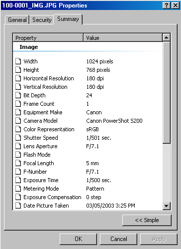
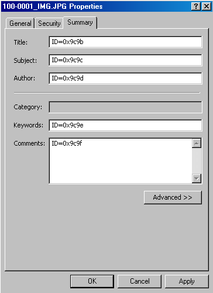

[ Home ](https://github.com/VFPX/Win32API)  

# GDI+: reading and writing metadata in JPEG and TIFF files

## Short description:
The code shows how to store and retrieve metadata in image files. **Metadata** is defined as *"Data about data, or information known about the image in order to provide access to the image"*. It may be, for example, a shatter speed value for your digital camera or description to a birthday party picture.  
***  


## Before you begin:
Most of JPEG files contain some metadata, especially files created with digital cameras.   
Here is an example:  

  

Microsoft SDK includes [GdiPlusImaging.h](../downloads/GdiPlusImaging.h) header file with definitions of many (not all) PropertyItem IDs. For example:

```foxpro
#define PropertyTagImageDescription    0x010E  
#define PropertyTagEquipMake           0x010F  
#define PropertyTagEquipModel          0x0110  
...  
#define PropertyTagExifShutterSpeed   0x9201  
#define PropertyTagExifAperture       0x9202  
#define PropertyTagExifBrightness     0x9203  
#define PropertyTagExifExposureBias   0x9204  
#define PropertyTagExifMaxAperture    0x9205
```

The following code shows how to read this data from JPEG and TIFF image files. PNG files have limited support of this functionality. BMP and GIF files, afaik, do not support metadata storage.  

The code is based on [custom GDI+ class](sample_450.md). Download the class module first and save it in **gdiplus.prg** file.   
  
***  


## Code:
```foxpro  
#DEFINE PropertyTagPropComments     0x9C9C
#DEFINE PropertyTagImageDescription 0x010E

#DEFINE PropertyTagTypeByte  1
#DEFINE PropertyTagTypeASCII 2
#DEFINE PropertyTagTypeShort 3
#DEFINE PropertyTagTypeLong 4
#DEFINE PropertyTagTypeRational 5
#DEFINE PropertyTagTypeUndefined 7
#DEFINE PropertyTagTypeSLONG 9
#DEFINE PropertyTagTypeSRational 10

SET PROCEDURE TO gdiplus ADDITIVE

PRIVATE gdip, src
gdip = CREATEOBJECT("gdiplusinit_")

* load source file into memory
src = CREATEOBJECT("gdiimage_", "c:\temp\img001.jpg")
IF src.errorcode <> 0
	? "Could not load source image file"
	RETURN
ENDIF

DO ListPropertItems
*= AddMemo("White and Black on Green", "c:\temp\temp.jpg")
* end of main

PROCEDURE ListPropertItems
	LOCAL propertyitem As ImagePropertyItem

	src.GetPropertyItems
	IF src.propertyitems.Count = 0
		? "The file contains no property items."
	ELSE
		CREATE CURSOR cs (propid C(10), proptype I,;
			proplen I, propvalue M)

		FOR EACH propertyitem IN src.propertyitems
			WITH propertyitem
				INSERT INTO cs VALUES (TRANSFORM(.propid,"@0"),;
					.proptype, LEN(.propvalue), .propvalue)
			ENDWITH
		ENDFOR
		GO TOP
		BROWSE NORMAL NOWAIT
	ENDIF

PROCEDURE AddMemo(cMemo, cNewFilename)
* adds description to the image object
* and saves it to another file
	LOCAL nPropertyTag, nPropertyType
*	nPropertyTag = PropertyTagImageDescription
	nPropertyTag = PropertyTagPropComments

	nPropertyType = PropertyTagTypeByte
*	nPropertyType = PropertyTagTypeASCII

	* convert to Unicode if PropertyTagTypeByte used
	* no convertion is required for PropertyTagTypeASCII
	IF nPropertyType = PropertyTagTypeByte
		cMemo = STRCONV(cMemo+CHR(0), 5)
	ENDIF

	WITH src
		IF NOT .SetPropertyItem(nPropertyTag, nPropertyType, m.cMemo)
			? "SetPropertyItem error:", .errorcode
			RETURN .F.
		ENDIF
		IF NOT .SaveToFile(cNewFilename)
			? "SaveToFile error:", .errorcode
			RETURN .F.
		ENDIF
	ENDWITH
RETURN .T.

DEFINE CLASS gdiplusinit_ As gdiplusinit
* subclassed to add few more DECLARE statements
PROCEDURE declare
	DODEFAULT()
	DECLARE INTEGER GlobalAlloc IN kernel32 INTEGER wFlags, INTEGER dwBytes
	DECLARE INTEGER GlobalFree IN kernel32 INTEGER hMem

	DECLARE INTEGER GdipGetPropertyIdList IN gdiplus;
		INTEGER img, LONG numOfProperty, STRING @lst

	DECLARE INTEGER GdipGetPropertyCount IN gdiplus;
		INTEGER img, LONG @numOfProperty

	DECLARE INTEGER GdipGetPropertyItemSize IN gdiplus;
		INTEGER img, INTEGER propId, LONG @sze

	DECLARE INTEGER GdipGetPropertyItem IN gdiplus;
		INTEGER img, INTEGER propId, LONG propSize, STRING @buffer

	DECLARE INTEGER GdipSetPropertyItem IN gdiplus;
		INTEGER img, STRING @itm

	DECLARE INTEGER GdipRemovePropertyItem IN gdiplus;
		INTEGER img, INTEGER propId
ENDDEFINE

DEFINE CLASS gdiimage_ As gdiimage
* subsclassed to add reading PropertyItems functionality
	propertyitems=0

PROCEDURE RemovePropertyItem(propId)
	IF VARTYPE(m.propId)="O"
		THIS.errorcode =;
			GdipRemovePropertyItem(THIS.himage, propId.propId)
	ELSE
		THIS.errorcode =;
			GdipRemovePropertyItem(THIS.himage, m.propId)
	ENDIF
RETURN (THIS.errorcode=0)

PROCEDURE SetPropertyItem(p1, p2, p3)
	LOCAL propertyitem, cBuffer
	IF VARTYPE(m.p1)="O"
		propertyitem=m.p1
	ELSE
		propertyitem = CREATEOBJECT("ImagePropertyItem", m.p1, m.p2, m.p3)
	ENDIF
	
	cBuffer = propertyitem.ToString()
	THIS.errorcode = GdipSetPropertyItem(THIS.himage, @cBuffer)
	IF THIS.errorcode=0
		THIS.GetPropertyItems
	ENDIF
RETURN (THIS.errorcode=0)

PROCEDURE GetPropertyItems
* populates collection with existing property items
	THIS.propertyitems = CREATEOBJECT("Collection")

	LOCAL nCount, nIndex, cIDs, nId, nItemSize, cItemBuffer
	STORE 0 TO nCount
	= GdipGetPropertyCount(THIS.himage, @nCount)
	
	cIDs = REPLICATE(CHR(0), nCount*4)
	= GdipGetPropertyIdList(THIS.himage, nCount, @cIDs)
	
	FOR nIndex=0 TO nCount-1
		nId = buf2dword(SUBSTR(cIDs, nIndex*4+1, 4))
		nItemSize=0
		= GdipGetPropertyItemSize(THIS.himage, nId, @nItemSize)
		cItemBuffer = REPLICATE(CHR(0), nItemSize)
		= GdipGetPropertyItem(THIS.himage, nId, nItemSize, @cItemBuffer)
		
		LOCAL nProplen, PropertyItem As ImagePropertyItem
		nProplen = buf2dword(SUBSTR(cItemBuffer, 5,4))

		PropertyItem = CREATEOBJECT("ImagePropertyItem",;
			buf2dword(SUBSTR(cItemBuffer, 1,4)),;
			buf2dword(SUBSTR(cItemBuffer, 9,4)),;
			SUBSTR(cItemBuffer, 17, nProplen))

		THIS.propertyitems.Add(PropertyItem,;
			TRANSFORM(PropertyItem.propid))
	ENDFOR
ENDDEFINE

DEFINE CLASS ImagePropertyItem As Session
PROTECTED hData
	propid=0
	proptype=0
	propvalue=""

PROCEDURE Init(p1, p2, p3)  && id, type, buffer
	THIS.propid=m.p1
	THIS.proptype=m.p2
	THIS.propvalue=m.p3
	THIS.hData=0

FUNCTION GetPropertyValue
* converts the buffer to appropriate FoxPro data type
	LOCAL vtype
	vtype = VARTYPE(THIS.propvalue)

	DO CASE
	CASE m.vtype <> "C"
		RETURN THIS.propvalue
	CASE m.vtype=PropertyTagTypeShort AND LEN(THIS.propvalue)=2
		RETURN buf2word(THIS.propvalue)
	CASE m.vtype=PropertyTagTypeLong AND LEN(THIS.propvalue)=4
		RETURN buf2dword(THIS.propvalue)
	CASE m.vtype=PropertyTagTypeRational AND LEN(THIS.propvalue)=4
		RETURN float2int(buf2dword(THIS.propvalue))
	CASE m.vtype=PropertyTagTypeSLONG AND LEN(THIS.propvalue)=4
		RETURN buf2dword(THIS.propvalue)
	CASE m.vtype=PropertyTagTypeSRational AND LEN(THIS.propvalue)=4
		RETURN float2int(buf2dword(THIS.propvalue))
	OTHERWISE
	* the value stays in form of string (array of bytes)
		RETURN THIS.propvalue
	ENDCASE

PROCEDURE Destroy
	THIS.ReleaseData

PROTECTED PROCEDURE ReleaseData
	IF THIS.hData <> 0
		= GlobalFree(THIS.hData)
		THIS.hData=0
	ENDIF

PROCEDURE ToString
	THIS.ReleaseData

	LOCAL propvalue, proplen
	propvalue = THIS.propvalue

	IF VARTYPE(m.propvalue) = "N"
		DO CASE
		CASE INLIST(THIS.proptype,;
			PropertyTagTypeRational, PropertyTagTypeSRational)
			propvalue = num2dword(int2float(m.propvalue))
		CASE THIS.proptype = PropertyTagTypeShort
			propvalue = num2word(m.propvalue)
		CASE THIS.proptype = PropertyTagTypeByte
			propvalue = CHR(BITAND(m.propvalue, 0x00ff))
		OTHERWISE
			propvalue = num2dword(m.propvalue)
		ENDCASE
	ENDIF
	proplen = LEN(THIS.propvalue)

	DECLARE RtlMoveMemory IN kernel32 As StrToMem;
		INTEGER Dest, STRING Src, INTEGER nLength

	THIS.hData = GlobalAlloc(0, m.proplen)
	= StrToMem(THIS.hData, m.propvalue, m.proplen)

RETURN num2dword(THIS.propid) + num2dword(m.proplen) +;
		num2dword(THIS.proptype) + num2dword(THIS.hData)
ENDDEFINE  
```  
***  


## Listed functions:
[GdipGetPropertyCount](../libraries/gdiplus/GdipGetPropertyCount.md)  
[GdipRemovePropertyItem](../libraries/gdiplus/GdipRemovePropertyItem.md)  
[GdipSetPropertyItem](../libraries/gdiplus/GdipSetPropertyItem.md)  
[GlobalAlloc](../libraries/kernel32/GlobalAlloc.md)  
[GlobalFree](../libraries/kernel32/GlobalFree.md)  

## Comment:
There are several PropertyTag IDs not included in GdiplusImaging.h header file:  

```foxpro
#DEFINE PropertyTagPropTitle    0x9c9b  
#DEFINE PropertyTagPropComments 0x9c9c  
#DEFINE PropertyTagPropAuthor   0x9c9d  
#DEFINE PropertyTagPropKeywords 0x9c9e  
#DEFINE PropertyTagPropSubject  0x9c9f
```

This picture shows corresponding properties:  
  


So with GDI+ you can scan JPEG and TIFF image files and check, for example, keywords or author name included. As you can see from this particular example, it is possible to add or modify metadata in image files.  
  

And how do you like that:

```txt
/* Olympus specific tags */
#define TAG_OLYMPUS_SPECIALMODE         0x0200  
#define TAG_OLYMPUS_JPEGQUAL            0x0201  
#define TAG_OLYMPUS_MACRO               0x0202  
#define TAG_OLYMPUS_DIGIZOOM            0x0204  
#define TAG_OLYMPUS_SOFTWARERELEASE     0x0207  
#define TAG_OLYMPUS_PICTINFO            0x0208  
#define TAG_OLYMPUS_CAMERAID            0x0209
/* end Olympus specific tags */
```

  
* * *  
Naturally you would like to open image file, add or change property, then close the file saving the updates. It does not work this way for current GDI+ version.  
  
You may create gdiplus image object from a disk file and add new or change existing property item for this object. But you have to save it to *another image file* to keep this new property. The original file can not be rewritten until this inherited image object is released.  
  
Save comments and descriptions using either *PropertyTagPropComments* or *PropertyTagImageDescription* property ids (some other ids may suit too). For saving Unicode strings use *PropertyTagTypeByte* type, for regular ASCII the *PropertyTagTypeASCII* is Ok.  

***  

