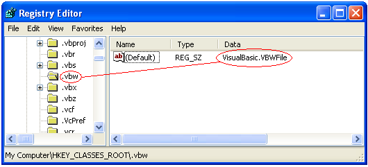
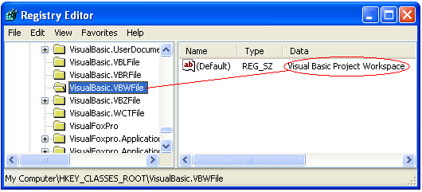

[ Home ](https://github.com/VFPX/Win32API)  

# How to obtain Content-Type value for a file type from the System Registry

## Short description:
The code shows how to read the list of content-type values registered on local computer and how to obtain content-type value for a particular file extension. Content-type values can be used when creating HTTP and SMTP headers.  
***  


## Before you begin:
The code below retrieves list of content-type values with corresponding file extensions from HKEY_CLASSES_ROOT\MIME\Database\Content Type. It links, for example, *text/html* to *.htm* file type.  

Content-type value for a particular file type (reversed lookup) can be obtained from corresponding sub-key of HKEY_CLASSES_ROOT. For example, for *.html* read values of HKEY_CLASSES_ROOT\.html key.  

See also:

* [How to find an application associated with the file name](sample_138.md)  
* [Displaying the associated icons and descriptions for files and folders](sample_530.md)  
* [How to view system icons for the classes installed on the local machine](sample_544.md)  

  
***  


## Code:
```foxpro  
DO decl

#DEFINE HKEY_CLASSES_ROOT  0x80000000
#DEFINE HKEY_CURRENT_USER  0x80000001
#DEFINE HKEY_LOCAL_MACHINE 0x80000002
#DEFINE ERROR_SUCCESS 0
#DEFINE KEY_ALL_ACCESS 0xf003f
#DEFINE KEY_READ 0x20019
#DEFINE KeyMIME "MIME\Database\Content Type"
#DEFINE KeyClasses "SOFTWARE\Classes"
#DEFINE KeyExtension "Extension"
#DEFINE KeyCLSID "CLSID"

CREATE CURSOR cs (ext C(10), CLSID C(50), contenttype C(50),;
	checktype C(50), filetype1 C(100), filetype2 C(100))

LOCAL hKey, nResult, nIndex, cBuffer, nResult, hSubkey,;
	cExtension, cCLSID, cContentType, cFiletype, cFiletype2

hKey=0
nResult = RegOpenKeyEx(HKEY_CLASSES_ROOT, KeyMIME, 0,;
	KEY_READ, @hKey)

IF nResult <> ERROR_SUCCESS
	? "RegOpenKeyEx failed with error code: " + nResult
	RETURN
ENDIF

* enumerating subkeys of
* HKEY_CLASSES_ROOT\MIME\Database\Content Type
nIndex=0
DO WHILE .T.
	cBuffer = REPLICATE(CHR(0), 512)
	nResult = RegEnumKey(hKey, nIndex, @cBuffer, Len(cBuffer))
	IF nResult <> ERROR_SUCCESS
		EXIT
	ENDIF

	cBuffer = SUBSTR(cBuffer, 1, AT(Chr(0),cBuffer)-1)
	INSERT INTO cs (contenttype) VALUES (m.cBuffer)

	hSubkey = 0
	IF RegOpenKeyEx(hKey, cBuffer, 0,;
		KEY_READ, @hSubkey) = ERROR_SUCCESS

		cExtension = GetKeyValue(hSubkey, KeyExtension)
		cCLSID = GetKeyValue(hSubkey, KeyCLSID)

		REPLACE cs.ext WITH cExtension, cs.CLSID WITH m.cCLSID
		= RegCloseKey(hSubkey)
	ENDIF
	nIndex = nIndex + 1
ENDDO
= RegCloseKey(hKey)

* retrieving content type and file type values
SELECT cs
SCAN ALL FOR NOT EMPTY(cs.ext)
	cExtension = ALLTRIM(cs.ext)

	cContentType = GetContentType(m.cExtension)
	REPLACE checktype WITH m.cContentType
	
	cFiletype1 = GetDefaultKeyValue(HKEY_CLASSES_ROOT,;
		m.cExtension)

	IF EMPTY(cFiletype1)
		cFiletype2 = ""
	ELSE
		cFiletype2 = GetDefaultKeyValue(HKEY_LOCAL_MACHINE,;
			KeyClasses + "\" + m.cFiletype1)
	ENDIF

	REPLACE filetype1 WITH m.cFiletype1,;
		filetype2 WITH m.cFiletype2
ENDSCAN

SELECT cs
GO TOP
BROWSE NORMAL NOWAIT
* end of main

FUNCTION GetKeyValue(hKey, cValueName)
	LOCAL nIndex, cName, nNameSize, nType,;
		cBuffer, nBufsize, nResult

	STORE 0 TO nIndex, nType
	DO WHILE .T.
		STORE 4096 TO nNameSize, nBufsize
		STORE REPLICATE(CHR(0), nBufsize) TO cName, cBuffer

		nResult = RegEnumValue(hKey, nIndex, @cName, @nNameSize,;
			0, @nType, @cBuffer, @nBufsize)
			
		IF nResult = ERROR_SUCCESS
			cName = SUBSTR(cName, 1, AT(CHR(0), cName)-1)
			IF UPPER(ALLTRIM(cValueName)) == UPPER(ALLTRIM(cName))
				RETURN SUBSTR(cBuffer, 1, AT(CHR(0), cBuffer)-1)
			ENDIF
		ELSE
			RETURN ""
		ENDIF
		nIndex = nIndex + 1
	ENDDO
RETURN ""

FUNCTION GetDefaultKeyValue(hParent, cSubkey)
	LOCAL nResult, hKey, cValue

	IF RegOpenKeyEx(hParent,;
		m.cSubkey, 0, KEY_READ, @hKey) = 0
		cValue = GetKeyValue(hKey, "")
		= RegCloseKey(m.hKey)
	ELSE
		cValue = ""
	ENDIF
RETURN m.cValue

FUNCTION GetContentType(cExt)
	LOCAL hKey, cContentType, nResult
	nResult = RegOpenKeyEx(HKEY_CLASSES_ROOT,;
		m.cExt, 0, KEY_READ, @hKey)
	IF nResult <> 0
		RETURN ""
	ENDIF
	cContentType = GetKeyValue(hKey, "Content Type")
	= RegCloseKey(hKey)
RETURN m.cContentType

PROCEDURE decl
	DECLARE INTEGER RegCloseKey IN advapi32 INTEGER hKey

	DECLARE INTEGER RegOpenKeyEx IN advapi32;
		INTEGER hKey, STRING lpSubKey, INTEGER ulOptions,;
		INTEGER samDesired, INTEGER @phkResult

	DECLARE INTEGER RegEnumValue IN advapi32;
		INTEGER hKey, INTEGER dwIndex, STRING @lpValueName,;
		INTEGER @lpcValueName, INTEGER lpReserved, INTEGER @lpType,;
		STRING @lpData, INTEGER @lpcbData

	DECLARE INTEGER RegEnumKey IN advapi32;
		INTEGER hKey, INTEGER dwIndex, STRING @lpName,;
		INTEGER cchName  
```  
***  


## Listed functions:
[RegCloseKey](../libraries/advapi32/RegCloseKey.md)  
[RegEnumKey](../libraries/advapi32/RegEnumKey.md)  
[RegEnumValue](../libraries/advapi32/RegEnumValue.md)  
[RegOpenKeyEx](../libraries/advapi32/RegOpenKeyEx.md)  

## Comment:
Code similar to the above I used in FoxPro SendEmail class. To assemble multi-part email message, you need to know content-type value for each file attachment to encode the file as well as to add this value as SMTP header.  
  
Same should be true for files transferred to remote server through HTTP POST requests.  
  
* * *  
**Question:** how to obtain file type, the one Explorer displays in Type column, for a given extension?  
  


**Solution:**  
  
**Step 1.** Read default value for *HKEY_CLASSES_ROOT\.vbw*  
  


**Step 2.** Read default value for *HKEY_CLASSES_ROOT\VisualBasic.VBWFile* or for *HKEY_LOCAL_MACHINE\SOFTWARE\Classes\VisualBasic.VBWFile*  
  


***  

