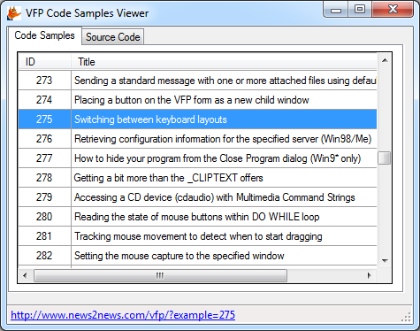
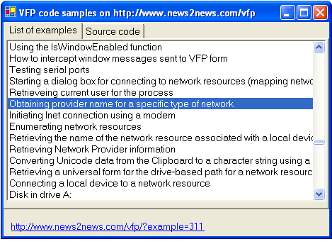

[ Home ](https://github.com/VFPX/Win32API)  

# Accessing examples contained in this reference through Web Services

## Note that this document contains some links to the old news2news website which does not work at the moment. This material will be available sometime in the future.

<!-- Anatoliy --> 

## Note that the samples in this document is designed to connect to a data source that is no longer available, so the code itself will not work as described. However, it can be useful to get ideas, so we have kept it.

This code uses GetListOfExamples  and GetExample  functions wrapped in XML Web Service. Requires VFP versions 8 or 9.   
***  


## Before you begin:
<!-- Anatoliy -->
Get WSDL and description of exposed functions in this <a href="http://www.news2news.com/vfp/?article=5">article</a>. 

Use at least VFP8 to test this example.  

  

<!-- Anatoliy -->
See also:

* [ApiViewer for Visual FoxPro](http://www.news2news.com/vfp/?article=12)  

  
***  

## Code:
```foxpro  
PUBLIC objForm
objForm = CreateObject("Tform")
IF VARTYPE(objForm)="O"
	objForm.Visible = .T.
ENDIF
* end of main

DEFINE CLASS Tform As Form
#DEFINE ccBaseAddr "http://www.news2news.com/vfp/"
#DEFINE ccWSDL  "http://www.news2news.com/cgi-bin/w32/services/ws.php?wsdl"
#DEFINE ccUsrname "guest"
#DEFINE ccPwd ""
	Caption=" VFP code samples on " + ccBaseAddr
	Width=760
	Height=500
	MaxButton=.F.
	MinButton=.F.
	Autocenter=.T.
	ShowTips=.T.
	csList="cs" + SUBSTR(SYS(2015),3,10)
	ws=0
	
	ADD OBJECT pframe As Tframe WITH Left=6, Top=5, Width=748, Height=440
	ADD OBJECT lblUrl As Label WITH Left=12, Top=460, Autosize=.T.,;
		ForeColor=Rgb(0,0,192), FontUnderline=.T.,;
		TooltipText="Click to open"

PROCEDURE Init
	LOCAL ex As Exception, lError
	lError=.F.
	TRY
		THIS.ws = CREATEOBJECT("mssoap.soapclient")
		THIS.ws.mssoapinit(ccWSDL)
	CATCH TO ex
		THIS.ws_error(ex, "Could not initialize SOAP Client.")
		lError=.T.
	ENDTRY
	
	IF m.lError
		RETURN .F.
	ENDIF
	
	DECLARE INTEGER ShellExecute IN shell32;
    	INTEGER, STRING, STRING, STRING, STRING, INTEGER
	THIS.pframe.Resize
	THIS.PopulateList

PROTECTED PROCEDURE ws_error(ex, cCaption)
	= MESSAGEBOX(TRANSFORM(ex.ErrorNo) + ". " +;
		ex.Message + "     " + CHR(13) + CHR(13) +;
		"detail: " + TRANSFORM(THIS.ws.detail) + "     " + CHR(13)+CHR(13) +;
		"faultfactor: " + TRANSFORM(THIS.ws.faultactor) + "     " + CHR(13) +;
		"faultcode: " + TRANSFORM(THIS.ws.faultcode) + "     " + CHR(13) +;
		"faultstring: " + TRANSFORM(THIS.ws.faultstring) + "     ",;
		48, m.cCaption)

PROCEDURE Destroy
	THIS.ws=Null
	THIS.pframe.pgList.lst.RowsourceType = 0
	IF USED(THIS.csList)
		USE IN (THIS.csList)
	ENDIF

PROCEDURE pframe.pgList.lst.InteractiveChange
	ThisForm.lblUrl.Caption = ThisForm.GetUrl()

PROCEDURE lblUrl.MouseDown
LPARAMETERS nButton, nShift, nXCoord, nYCoord
	= ShellExecute(0, "open", ThisForm.GetUrl(), "", "", 3)

PROCEDURE pframe.pgExample.Activate
	ThisForm.DisplayExample

PROCEDURE pframe.pglist.lst.DblClick
	ThisForm.pframe.ActivePage = 2

FUNCTION GetUrl
RETURN ccBaseAddr + "?example=" + ALLT(THIS.pframe.pgList.lst.Value)

PROCEDURE PopulateList
	LOCAL cResult, ex As Exception
	TRY
		WAIT WINDOW NOWAIT "Retrieving list of examples..."
		cResult = THIS.ws.GetListOfExamples()
		XMLTOCURSOR(m.cResult, THIS.csList, 0)
	CATCH TO ex
		cResult=""
		THIS.ws_error(ex, "SOAP error")
	FINALLY
		WAIT CLEAR
	ENDTRY
	IF USED(THIS.csList)
		WITH THIS.pframe.pgList.lst
			.RowsourceType = 2
			.Rowsource = THIS.csList
			.ColumnWidths="60,700"
			IF .listCount > 0
				.listIndex = 1
			ENDIF
			.InteractiveChange
		ENDWITH
	ENDIF

PROCEDURE DisplayExample
	LOCAL nId, cResult, ex As Exception
	nId = VAL(ThisForm.pframe.pgList.lst.Value)
	TRY
		WAIT WINDOW NOWAIT "Retrieving requested example..."
		cResult = THIS.ws.GetExample(nId, ccUsrname, ccPwd)
		XMLTOCURSOR(m.cResult, "csExample", 0)
	CATCH TO ex
		cResult=""
		THIS.ws_error(ex, "SOAP error")
	FINALLY
		WAIT CLEAR
	ENDTRY
	IF USED("csExample")
		WITH ThisForm.pframe.pgExample.txtSource
			.Value = csExample.body
			.Refresh
		ENDWITH
		USE IN csExample
	ENDIF
ENDDEFINE

DEFINE CLASS Tframe As PageFrame
	ADD OBJECT pgList As TpageList WITH Caption="List of examples"
	ADD OBJECT pgExample As TpageExample WITH Caption="Source Code"

PROCEDURE Resize
	WITH THIS.pgList
		.lst.Width = THIS.Width - 14
		.lst.Height = THIS.height - .lst.Top - 50
	ENDWITH
	WITH THIS.pgExample
		.txtSource.Width = THIS.Width - 14
		.txtSource.Height = THIS.height - .txtSource.Top - 50
	ENDWITH
ENDDEFINE

DEFINE CLASS TpageList As Page  && Page object
	ADD OBJECT lst As ListBox WITH Left=5, Top=5, FontName="Arial",;
		FontSize=10, ColumnCount=2, BoundColumn=1
ENDDEFINE

DEFINE CLASS TpageExample As Page  && Page object
	ADD OBJECT txtSource As EditBox WITH Left=5, Top=5,;
		FontName="Courier New", FontSize=9, ForeColor = RGB(0,96,128)
ENDDEFINE  
```  
***  


## Listed functions:
[ShellExecute](../libraries/shell32/ShellExecute.md)  

<!-- Anatoliy -->
## Comment:
C# version of this code sample. Click on the image below to [download VS2008 C# project](../site/downloads/Win32_ExampleViewer_VS2008_prj.zip).   

[](http://www.news2news.com/vfp/downloads/Win32_ExampleViewer_VS2008_prj.zi)  

VB.Net version of this code sample.  

  

Start new Windows Application project. Place on the form TabControl, ListBox, TextBox and LinkLabel controls.  
  
Add to the project new Web Reference pointing at <a href="http://www.news2news.com/vfp/wsdl/webservices.WSDL">http://www.news2news.com/vfp/wsdl/webservices.WSDL</a>.   
  
***  


