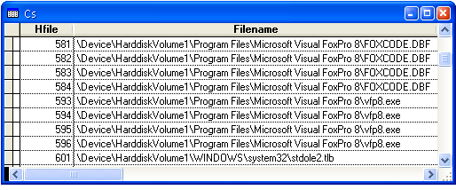

[ Home ](https://github.com/VFPX/Win32API)  

# Using File Mapping for enumerating files opened by Visual FoxPro

## Short description:
*File mapping* is the association of the contents of a file with a portion of the virtual address space of a process. API function GetMappedFileName called in combination with CreateFileMapping and MapViewOfFile functions is able to retrieve the name for a given file handle.  
***  


## Before you begin:
*File mapping* is the association of the contents of a file with a portion of the virtual address space of a process.  

API function GetMappedFileName called in combination with CreateFileMapping and MapViewOfFile functions is able to retrieve the name for a given file handle.  

The following code scans range of possible file handles from 1 to 1024 trying to obtain a file name from each of them.  
  
  
***  


## Code:
```foxpro  
#DEFINE PAGE_READONLY 2
#DEFINE PAGE_READWRITE 4
#DEFINE PAGE_WRITECOPY 8
#DEFINE PAGE_EXECUTE_READ 0x20
#DEFINE PAGE_EXECUTE_READWRITE 0x40

#DEFINE SECTION_QUERY 1
#DEFINE SECTION_MAP_WRITE 2
#DEFINE SECTION_MAP_READ 4
#DEFINE SECTION_MAP_EXECUTE 8
#DEFINE SECTION_EXTEND_SIZE 0x10
#DEFINE STANDARD_RIGHTS_REQUIRED 0xF0000

#DEFINE SECTION_ALL_ACCESS BITOR(STANDARD_RIGHTS_REQUIRED,;
	SECTION_QUERY, SECTION_MAP_WRITE, SECTION_MAP_READ,;
	SECTION_MAP_EXECUTE, SECTION_EXTEND_SIZE)

#DEFINE FILE_MAP_WRITE SECTION_MAP_WRITE
#DEFINE FILE_MAP_READ SECTION_MAP_READ
#DEFINE FILE_MAP_ALL_ACCESS SECTION_ALL_ACCESS

#DEFINE INVALID_HANDLE_VALUE -1
#DEFINE MAX_PATH 260

DO declare
DO ScanDevices

PRIVATE cFilename, nError, nFileSize, nFileType, hFileIndex, hProcess
cFilename=""
STORE 0 TO nError
* obtain (pseudo) handle for the current process
hProcess=GetCurrentProcess()

* try to open a file using FoxPro low-level file functions
LOCAL hFile1
hFile1 = FOPEN("MYFILE.TXT", 2)
? "hFile1:", hFile1

CREATE CURSOR cs (hfile I, errorcode I, filename C(250),;
	filesize I, filetype I)

FOR hFileIndex=1 TO 4096
	nError=0
	cFilename=""
	nFileSize = GetFileSize(hFileIndex)
	nFileType = GetFileType(hFileIndex)

	* both modes should match, for example:
	* PAGE_READONLY, SECTION_MAP_READ
	* PAGE_READWRITE, SECTION_MAP_WRITE
	= GetName(hFileIndex, PAGE_READONLY, SECTION_MAP_READ)

	INSERT INTO cs VALUES (m.hFileIndex, m.nError,;
		m.cFilename, m.nFilesize, m.nFileType)
NEXT

IF hFile1 <> INVALID_HANDLE_VALUE
	= FCLOSE(hFile1)
ENDIF

BROWSE NORMAL FOR errorcode=0 NOWAIT
* end of main

PROCEDURE GetName(hFile, nCreateFlag, nMapFlag)
	LOCAL hFileMap, hMem, cBuffer, nBufsize

	hFileMap = CreateFileMapping(hFile, 0, nCreateFlag, 0,1, Null)
	IF hFileMap <= 0
		nError=GetLastError()
		RETURN
	ENDIF

	hMem = MapViewOfFile(hFileMap, nMapFlag, 0,0,1)
	IF hMem = 0
		nError=GetLastError()
		cBuffer=""
	ELSE
		cBuffer = REPLICATE(CHR(0), MAX_PATH)
		nBufsize = GetMappedFileName(hProcess, hMem,;
			@cBuffer, MAX_PATH)

		IF nBufsize=0
			nError=GetLastError()
			cBuffer=""
		ELSE
			cBuffer = SUBSTR(cBuffer, 1, nBufsize)
		ENDIF
		= UnmapViewOfFile(hMem)
	ENDIF
	CloseHandle(hFileMap)
	cFilename=cBuffer

FUNCTION GetFileSize(hFile)
#DEFINE MAX_DWORD 0xffffffff
	LOCAL cBuffer
	cBuffer = REPLICATE(CHR(0), 8)
	IF GetFileSizeEx(hFile, @cBuffer) = 0
		RETURN 0
	ELSE
		RETURN buf2dword(SUBSTR(cBuffer,1,4)) +;
				buf2dword(SUBSTR(cBuffer,5,4)) * (MAX_DWORD+1)
	ENDIF

PROCEDURE ScanDevices
	CREATE CURSOR csDosDevices (drvletter C(2), targetpath C(250))

	LOCAL cDrives, nBufsize, cDrvLetter, ch, cTargetPath
	cDrives = REPLICATE(CHR(0), 250)
	nBufsize = GetLogicalDriveStrings(LEN(cDrives), @cDrives)
	cDrives = PADR(cDrives, nBufsize)
	
	cDrvLetter=""
	FOR nBufsize=1 TO LEN(cDrives)
		ch = SUBSTR(cDrives, nBufsize,1)
		IF ch = Chr(0)
			cDrvLetter=PADR(cDrvLetter,2)
			cTargetPath = REPLICATE(CHR(0), MAX_PATH)

			= QueryDosDevice(cDrvLetter, @cTargetPath,;
				LEN(cTargetPath))

			cTargetPath = STRTRAN(cTargetPath, CHR(0), "")
			INSERT INTO csDosDevices VALUES (;
				cDrvLetter, cTargetPath)

			cDrvLetter = ""
		ELSE
			cDrvLetter = cDrvLetter + m.ch
		ENDIF
	NEXT

PROCEDURE declare
	DECLARE INTEGER CloseHandle IN kernel32 INTEGER hObject
	DECLARE INTEGER GetLastError IN kernel32
	DECLARE INTEGER GetFileType IN kernel32 INTEGER hFile
	DECLARE INTEGER GetFileSizeEx IN kernel32;
		INTEGER hFile, STRING @lpFileSize

	DECLARE INTEGER CreateFileMapping IN kernel32;
		INTEGER hFile, INTEGER lpAttributes, INTEGER flProtect,;
		LONG dwMaximumSizeHi, LONG dwMaximumSizeLo, STRING lpName

	DECLARE LONG MapViewOfFile IN kernel32;
		INTEGER hFileMappingObject, INTEGER dwDesiredAccess,;
		LONG dwFileOffsetHi, LONG dwFileOffsetLo,;
		LONG dwNumberOfBytesToMap

	DECLARE INTEGER UnmapViewOfFile IN kernel32 LONG lpBaseAddress
	DECLARE INTEGER GetCurrentProcess IN kernel32

	DECLARE INTEGER GetMappedFileName IN psapi;
		INTEGER hProcess, INTEGER lpv,;
		STRING @lpFilename, INTEGER nSize

	DECLARE INTEGER OpenFile IN kernel32;
		STRING lpFileName, STRING @lpReOpenBuff, INTEGER wStyle

	DECLARE INTEGER GetLogicalDriveStrings IN kernel32;
		INTEGER nBufferLength, STRING @lpBuffer

	DECLARE INTEGER QueryDosDevice IN kernel32;
		STRING lpDeviceName, STRING @lpTargetPath, LONG ucchMax

FUNCTION buf2dword(lcBuffer)
RETURN Asc(SUBSTR(lcBuffer, 1,1)) + ;
	BitLShift(Asc(SUBSTR(lcBuffer, 2,1)),  8) +;
	BitLShift(Asc(SUBSTR(lcBuffer, 3,1)), 16) +;
	BitLShift(Asc(SUBSTR(lcBuffer, 4,1)), 24)  
```  
***  


## Listed functions:
[CloseHandle](../libraries/kernel32/CloseHandle.md)  
[CreateFileMapping](../libraries/kernel32/CreateFileMapping.md)  
[GetCurrentProcess](../libraries/kernel32/GetCurrentProcess.md)  
[GetFileSizeEx](../libraries/kernel32/GetFileSizeEx.md)  
[GetFileType](../libraries/kernel32/GetFileType.md)  
[GetLastError](../libraries/kernel32/GetLastError.md)  
[GetLogicalDriveStrings](../libraries/kernel32/GetLogicalDriveStrings.md)  
[GetMappedFileName](../libraries/kernel32/GetMappedFileName.md)  
[MapViewOfFile](../libraries/kernel32/MapViewOfFile.md)  
[OpenFile](../libraries/kernel32/OpenFile.md)  
[QueryDosDevice](../libraries/kernel32/QueryDosDevice.md)  
[UnmapViewOfFile](../libraries/kernel32/UnmapViewOfFile.md)  

## Comment:
The file handles are scanned in the context of current FoxPro application -- GetCurrentProcess API function is used to obtain the process handle.  
  
Some file handles can not be accessed -- browse records with errorcode=5 (ERROR_ACCESS_DENIED).  
  
Filenames are returned in \Device\HarddiskVolume..\ format.  
  
As you can see, there are four handles per each open file. In Visual FoxPro, SYS(2010) always returns 255 -- these two values may be logically linked.   
  
Visual FoxPro hides real file handle values. The FOPEN() returns the value from internal FoxPro table, not the value assigned by the OS.  
  
Technically you may try to call the CloseHandle API for some handles on this list.  
  
* * *  


\Device\HarddiskVolume1 is the name of an object in the Windows kernel object hierarchy. It represents a device with the name HarddiskVolume1, which is the first volume of the hard disk. This device is normally mounted under the file-system name "c:", so the path is equivalent to c:\...   
  
In the code sample above, the QueryDosDevice function is used to find the drive letters corresponding to the names like \Device\HarddiskVolume1 -- open cursor csDosDevices to see all.  
  
* * *  
Some links:
* [File Mapping](https://msdn.microsoft.com/en-us/library/windows/desktop/aa366556(v=vs.85).aspx), an article on MSDN 
* [Obtaining a File Name From a File Handle](https://msdn.microsoft.com/en-us/library/windows/desktop/aa366789(v=vs.85).aspx), an article on MSDN  
* <a href="http://www.freevbcode.com/ShowCode.asp?ID=3370">File Mapping Class Module</a> on FreeVBcode.com  
* <a href="http://www.flipcode.com/articles/article_filemapping.shtml">Faster File Access With File Mapping</a>, an article written by *Hern�n Moraldo*  
* <a href="http://fox.wikis.com/wc.dll?Wiki~LowLevelFileFunctions">Low Level File Functions</a> on FoxPro Wiki  
  
***  

