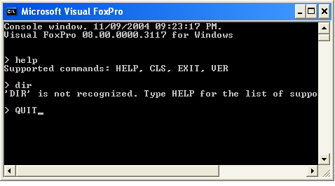

[ Home ](https://github.com/VFPX/Win32API)  

# Creating a console window for Visual FoxPro application

## Short description:
The code explains how to create and use console (DOS-like) window with Visual FoxPro application.  
***  


## Before you begin:
The following code explains how to create and use console (DOS-like) window with Visual FoxPro application.  

  

See also:

* [Running MSDOS Shell as a child process with redirected input and output (smarter RUN command)](sample_477.md)  
* [Running external applications from VFP using WinExec](sample_002.md)  
* [Using ShellExecute for performing operations on files](sample_093.md)  
* [Running external applications from VFP using CreateProcess](sample_003.md)  
* [Running an external program from FoxPro and waiting for its termination](sample_377.md)  
  
***  


## Code:
```foxpro  
#DEFINE CRLF CHR(13)+CHR(10)

LOCAL oConsole
oConsole = CREATEOBJECT("TConsole")

WITH oConsole
	.Writeln("Console window. " + TTOC(DATETIME()) +;
		". " + CRLF + VERSION())
	.Writeln()
	
	DO WHILE .T.
		.Write(CRLF+"> ")
		cCommand = STRTRAN(UPPER(ALLTRIM(.ReadLn())), CRLF, "")
		
		DO CASE
		CASE EMPTY(cCommand)

		CASE INLIST(cCommand, "QUIT", "EXIT", "BYE")
			EXIT

		CASE INLIST(cCommand, "CLS", "CLEAR")
			.ClearConsole

		CASE cCommand="HELP"
			.Writeln("Supported commands: HELP, CLS, EXIT, VER")

		CASE INLIST(cCommand, "VER", "VERSION")
			.Writeln(VERSION())

		OTHERWISE
			.Writeln(["] + cCommand + [" is not recognized. ] +;
				"Type HELP for the list of supported commands.")
		ENDCASE
	ENDDO
ENDWITH

DEFINE CLASS TConsole As Custom
#DEFINE STD_INPUT_HANDLE  -10
#DEFINE STD_OUTPUT_HANDLE -11
#DEFINE CRLF CHR(13)+CHR(10)
#DEFINE SW_SHOWNORMAL 1

PROTECTED hWindow, hStdout, hStdin
	errorcode=0
	hWindow=0
	hStdout=0
	hStdin=0

PROCEDURE Init
	THIS.declare
	IF AllocConsole() = 0
		THIS.errorcode = GetLastError()
		RETURN
	ENDIF
	
	_screen.WindowState=1

	THIS.hStdout = GetStdHandle(STD_OUTPUT_HANDLE)
	THIS.hStdin = GetStdHandle(STD_INPUT_HANDLE)
	THIS.hWindow = GetConsoleWindow()

	= SetConsoleTextAttribute(THIS.hStdout, 0x07)
	= SetConsoleTitle(_screen.Caption)
	THIS.ClearConsole

	= ShowWindowA(THIS.hWindow, SW_SHOWNORMAL)
	= SetForegroundWindow(THIS.hWindow)

PROCEDURE Destroy
	= FreeConsole()
	= CloseHandle(THIS.hStdout)
	= CloseHandle(THIS.hStdin)
	_screen.WindowState=2

PROCEDURE Writeln(cOutput)
	THIS.Write(cOutput)
	THIS.Write(CRLF)

FUNCTION Write(cOutput)
	IF VARTYPE(cOutput) <> "C"
		cOutput=""
	ENDIF

	LOCAL nBytesWritten
	nBytesWritten=0
	IF WriteConsole(THIS.hStdout, @cOutput,;
		LEN(cOutput), @nBytesWritten, 0) = 0
		THIS.errorcode = GetLastError()
	ENDIF
RETURN nBytesWritten

FUNCTION ReadLn(nBufsize)
	LOCAL cBuffer, nBytesRead
	IF VARTYPE(nBufsize) <> "N"
		nBufsize=1024
	ENDIF
	cBuffer = REPLICATE(CHR(0), nBufsize)
	nBytesRead=0
	IF ReadConsole(THIS.hStdin, @cBuffer, nBufsize, @nBytesRead, 0) = 0
		THIS.errorcode = GetLastError()
		RETURN ""
	ENDIF
RETURN SUBSTR(cBuffer, 1, nBytesRead)

PROCEDURE ClearConsole
#DEFINE BUFFER_INFO_SIZE 22
	LOCAL cBuffer, nWidth, nHeight, nBufsize, nAttr

	cBuffer = REPLICATE(CHR(0), BUFFER_INFO_SIZE)
	= GetConsoleScreenBufferInfo(THIS.hStdout, @cBuffer)

	nWidth = buf2word(SUBSTR(cBuffer, 1,2))
	nHeight = buf2word(SUBSTR(cBuffer, 3,2))
	nBufsize = nWidth * nHeight
	nAttr = buf2word(SUBSTR(cBuffer, 9,2))

	= FillConsoleOutputCharacter(THIS.hStdout, 32,;
		nBufsize, 0,0,0)

	= FillConsoleOutputAttribute(THIS.hStdout, nAttr,;
		nBufsize, 0,0,0)

	THIS.SetCursorPos(0, 0)

PROCEDURE SetCursorPos(X,Y)
	= SetConsoleCursorPosition(THIS.hStdout, X, Y)

PROCEDURE declare
	DECLARE INTEGER GetLastError IN kernel32
	DECLARE INTEGER SetForegroundWindow IN user32 INTEGER hWindow
	DECLARE INTEGER GetStdHandle IN kernel32 LONG nStdHandle
	DECLARE INTEGER AllocConsole IN kernel32
	DECLARE INTEGER FreeConsole IN kernel32
	DECLARE INTEGER CloseHandle IN kernel32 INTEGER hObject
	DECLARE INTEGER SetConsoleTitle IN kernel32 STRING lpConsoleTitle
	DECLARE INTEGER GetConsoleWindow IN kernel32

	DECLARE INTEGER ShowWindow IN user32 AS ShowWindowA;
		INTEGER hWindow, INTEGER nCmdShow

	DECLARE INTEGER WriteConsole IN kernel32;
		INTEGER hConsoleOutput, STRING @lpBuffer,;
		INTEGER nNumberOfCharsToWrite,;
		INTEGER @lpNumberOfCharsWritten,;
		INTEGER lpReserved

	DECLARE INTEGER ReadConsole IN kernel32;
		INTEGER hConsoleInput, STRING @lpBuffer,;
		INTEGER nNumberOfCharsToRead,;
		INTEGER @lpNumberOfCharsRead, INTEGER lpReserved

	DECLARE INTEGER FillConsoleOutputCharacter IN kernel32;
		INTEGER hConsoleOutput, SHORT cCharacter, INTEGER nLength,;
		SHORT x, SHORT y, INTEGER lpNumberOfCharsWritten

	DECLARE INTEGER FillConsoleOutputAttribute IN kernel32;
		INTEGER hConsoleOutput, SHORT wAttribute, INTEGER nLength,;
		SHORT x, SHORT y, INTEGER lpNumberOfAttrsWritten

	DECLARE INTEGER SetConsoleTextAttribute IN kernel32;
		INTEGER hConsoleOutput, SHORT wAttributes

	DECLARE INTEGER GetConsoleScreenBufferInfo IN kernel32;
		INTEGER hConsoleOutput, STRING @lpConsoleScreenBufferInfo

	DECLARE INTEGER SetConsoleCursorPosition IN kernel32;
		INTEGER hConsoleOutput, SHORT x, SHORT y

ENDDEFINE

FUNCTION buf2word(lcBuffer)
RETURN Asc(SUBSTR(lcBuffer, 1,1)) + ;
       Asc(SUBSTR(lcBuffer, 2,1)) * 256  
```  
***  


## Listed functions:
[AllocConsole](../libraries/kernel32/AllocConsole.md)  
[CloseHandle](../libraries/kernel32/CloseHandle.md)  
[FillConsoleOutputAttribute](../libraries/kernel32/FillConsoleOutputAttribute.md)  
[FillConsoleOutputCharacter](../libraries/kernel32/FillConsoleOutputCharacter.md)  
[FreeConsole](../libraries/kernel32/FreeConsole.md)  
[GetConsoleScreenBufferInfo](../libraries/kernel32/GetConsoleScreenBufferInfo.md)  
[GetConsoleWindow](../libraries/kernel32/GetConsoleWindow.md)  
[GetLastError](../libraries/kernel32/GetLastError.md)  
[GetStdHandle](../libraries/kernel32/GetStdHandle.md)  
[ReadConsole](../libraries/kernel32/ReadConsole.md)  
[SetConsoleCursorPosition](../libraries/kernel32/SetConsoleCursorPosition.md)  
[SetConsoleTextAttribute](../libraries/kernel32/SetConsoleTextAttribute.md)  
[SetConsoleTitle](../libraries/kernel32/SetConsoleTitle.md)  
[SetForegroundWindow](../libraries/user32/SetForegroundWindow.md)  
[ShowWindow](../libraries/user32/ShowWindow.md)  
[WriteConsole](../libraries/kernel32/WriteConsole.md)  

## Comment:
Unsolved issues:  
  
* the closing of opened console window automatically closes the whole FoxPro session; the SetWindowLong can not change attributes for the console window (error=5, access denied);  
  
* main FoxPro window stops redrawing itself after a console window is created.  
  
And of course, the main unsolved issue is finding a practicality in console windows.  
  
* * *  
I noticed that in VFP6 the code works a bit different -- methods ClearScreen and SetCursorPos. You may try to declare and call SetConsoleCursorPosition with just two parameters -- INTEGER and @STRING -- instead of INTEGER, SHORT, SHORT.  
  
***  

