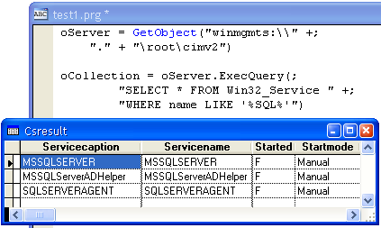

[ Home ](https://github.com/VFPX/Win32API)  

# Encapsulating access to the Windows Services in a class

## Short description:
The winservices class, subclassed from the Collection class, enumerates Windows Services found in the default service control manager database on local computer. Each item in the collection is an instance of the winservice class that wraps the members of ENUM_SERVICE_STATUS structure for a given service. The winservice object exposes methods StartService, StopService and PauseService.  
***  


## Before you begin:
The *winservices* class, subclassed from the *Collection* class, enumerates Windows Services found in the default service control manager database on local computer.   

Each item in the collection is an instance of the *winservice* class that wraps the members of ENUM_SERVICE_STATUS structure for a given service. The *winservice* object exposes methods *StartService*, *StopService* and *PauseService*.  

Here is an example of how these classes can be used to start/stop the MSSQLSERVER service on local computer:  

```foxpro
#DEFINE SERVICE_WIN32 0x30  
#DEFINE SERVICE_RUNNING 4  

LOCAL ws As winservices, srv As winservice  
ws = CREATEOBJECT("winservices", Null, Null, SERVICE_WIN32)  

srv = ws.GetService("MSSQLSERVER")  
IF ISNULL(srv)  
	? "MSSQLSERVER service is not found on this computer"  
ELSE  
	? "MSSQLSERVER service is " +;  
		IIF(srv.currentstate=SERVICE_RUNNING,;  
		"running", "stopped") + "."  
ENDIF  

srv.StartService()  
*srv.PauseService()  
*srv.StopService()
```

***  


## Code:
```foxpro  
DEFINE CLASS winservices As Collection
#DEFINE SC_MANAGER_CONNECT 1
#DEFINE SC_MANAGER_LOCK 8
#DEFINE SC_MANAGER_ENUMERATE_SERVICE 4

#DEFINE SERVICE_ACTIVE 1
#DEFINE SERVICE_INACTIVE 2
#DEFINE SERVICE_DRIVER 0x0b
#DEFINE SERVICE_WIN32 0x30

#DEFINE SERVICE_STOPPED 1
#DEFINE SERVICE_RUNNING 4
#DEFINE SERVICE_PAUSED 7

#DEFINE SERVICE_START 0x10
#DEFINE SERVICE_STOP 0x20
#DEFINE SERVICE_PAUSE_CONTINUE 0x40
#DEFINE SERVICE_INTERROGATE 0x80

#DEFINE SERVICE_CONTROL_STOP 1
#DEFINE SERVICE_CONTROL_PAUSE 2
#DEFINE SERVICE_CONTROL_INTERROGATE 4

PROTECTED hManager, hLock
	hManager=0
	hLock=0
	errorcode=0

PROCEDURE Init(cComputerName, cDatabaseName, nServiceType)
	THIS.declare
	IF VARTYPE(m.cComputerName) <> "C"
		cComputerName=Null
	ENDIF
	IF VARTYPE(m.cDatabaseName) <> "C"
		cDatabaseName=Null
	ENDIF

	THIS.hManager = OpenSCManager(m.cComputerName, m.cDatabaseName,;
		BITOR(SC_MANAGER_CONNECT, SC_MANAGER_LOCK,;
			SC_MANAGER_ENUMERATE_SERVICE))

	THIS.errorcode = IIF(THIS.hManager=0, GetLastError(), 0)

	IF VARTYPE(m.nServiceType)="N"
		THIS.EnumServices(m.nServiceType)
	ENDIF

PROCEDURE EnumServices(nServiceType)
#DEFINE ENUM_SERVICE_STATUS_SIZE 36
#DEFINE SERVICE_STATUS_SIZE 28

	THIS.ClearEnum

	LOCAL nBufsize, nBytesNeeded, nCount, hResume, nServiceStatus
	STORE 0 TO nBytesNeeded, nCount, hResume
	nServiceStatus = BITOR(SERVICE_ACTIVE, SERVICE_INACTIVE)

	= EnumServicesStatus(THIS.hManager, nServiceType,;
		nServiceStatus, 0, 0,;
		@nBytesNeeded, @nCount, @hResume)

	nBufsize = nBytesNeeded
	hBuffer = LocalAlloc(0, nBufsize)
	hResume = 0

	= EnumServicesStatus(THIS.hManager, nServiceType,;
		nServiceStatus, hBuffer, nBufsize,;
		@nBytesNeeded, @nCount, @hResume)

	LOCAL cBuffer, cService, nIndex, hPtr, hServiceName
	cBuffer = REPLICATE(CHR(0), nBufsize)
	= MemToStr(@cBuffer, hBuffer, nBufsize)

	FOR nIndex=0 TO nCount-1
		LOCAL oService As winservice
		oService = CREATEOBJECT("winservice",;
			THIS, m.hBuffer, @cBuffer, nIndex)

		THIS.Add(oService, oService.servicename)
		oService=Null
	NEXT
	= LocalFree(hBuffer)
RETURN .T.

PROCEDURE Destroy
	IF THIS.hManager <> 0
		THIS.ClearEnum
		THIS.UnlockDatabase
		= CloseServiceHandle(THIS.hManager)
		THIS.hManager=0
	ENDIF

FUNCTION GetService(vService) As winservice
	LOCAL oService As winservice, ex As Exception
	TRY
		oService = THIS.Item(vService)
	CATCH TO ex
		THIS.errorcode = ex.Message
		oService = Null
	ENDTRY
RETURN oService

PROTECTED PROCEDURE ClearEnum
	DO WHILE THIS.Count > 0
		LOCAL itm As winservice
		itm = THIS.Item(1)
		itm = Null
		THIS.Remove(1)
	ENDDO

FUNCTION GetHManager()
RETURN THIS.hManager

FUNCTION IsDatabaseLocked
RETURN (THIS.hLock <> 0)

FUNCTION LockDatabase
	IF THIS.hLock = 0
		THIS.hLock = LockServiceDatabase(THIS.hManager)
	ENDIF
	THIS.errorcode = IIF(THIS.hLock=0, GetLastError(), 0)
RETURN (THIS.hLock <> 0)

FUNCTION UnlockDatabase
	IF THIS.hLock <> 0
		= UnlockServiceDatabase(THIS.hLock)
		THIS.hLock = 0
	ENDIF
RETURN (THIS.hLock = 0)

PROTECTED PROCEDURE declare
	DECLARE INTEGER GetLastError IN kernel32
	DECLARE INTEGER LockServiceDatabase IN advapi32 INTEGER hSCManager
	DECLARE INTEGER CloseServiceHandle IN advapi32 INTEGER hSCObject
	DECLARE INTEGER UnlockServiceDatabase IN advapi32 INTEGER ScLock
	DECLARE INTEGER LocalFree IN kernel32 INTEGER hMem

	DECLARE RtlMoveMemory IN kernel32 As StrToMem;
		INTEGER Dest, STRING @Src, INTEGER nLength

	DECLARE RtlMoveMemory IN kernel32 As MemToStr;
		STRING @dest, INTEGER src, INTEGER nLength

	DECLARE INTEGER LocalAlloc IN kernel32;
		INTEGER uFlags, INTEGER uBytes

	DECLARE INTEGER OpenSCManager IN advapi32;
		STRING lpMachineName, STRING lpDatabaseName,;
		LONG dwDesiredAccess

	DECLARE INTEGER OpenService IN advapi32;
		INTEGER hSCManager, STRING lpServiceName,;
		LONG dwDesiredAccess

	DECLARE INTEGER EnumServicesStatus IN advapi32;
		INTEGER hSCManager, LONG dwServiceType, LONG dwServiceState,;
		INTEGER lpServices, LONG cbBufSize, LONG @pcbBytesNeeded,;
		LONG @lpServicesReturned, LONG @lpResumeHandle

	DECLARE INTEGER StartService IN advapi32;
		INTEGER hService, LONG dwNumServiceArgs,;
		INTEGER lpServiceArgVectors

	DECLARE INTEGER ControlService IN advapi32;
		INTEGER hService, LONG dwControl,;
		STRING @lpServiceStatus
ENDDEFINE

DEFINE CLASS winservice As Session
PROTECTED oWinServices, hService
	hService=0
	errorcode=0
	servicename=""
	displayname=""
	servicetype=0
	currentstate=0
	controlsaccepted=0
	win32exitcode=0
	serviceexitcode=0
	checkpoint=0
	waithint=0

PROCEDURE Init(oWinServices, hBuffer, cBuffer, nIndex)
	THIS.oWinServices = m.oWinServices

	LOCAL cService, hPtr
	cService = SUBSTR(cBuffer,;
		(nIndex*ENUM_SERVICE_STATUS_SIZE)+1,;
		ENUM_SERVICE_STATUS_SIZE)

	THIS.ConvertStatusInfo(SUBSTR(cService, 9))

	hPtr = buf2dword(SUBSTR(cService, 1,4)) - hBuffer + 1
	THIS.servicename = THIS.GetName(@cBuffer, hPtr)

	hPtr = buf2dword(SUBSTR(cService, 5,4)) - hBuffer + 1
	THIS.displayname = THIS.GetName(@cBuffer, hPtr)

PROCEDURE Destroy
	THIS.CloseServiceHandle

PROTECTED FUNCTION GetName(cBuffer, hPtr)
	IF (hPtr <= 0) OR hPtr >= LEN(cBuffer)
		RETURN ""
	ENDIF

	LOCAL cName, ch
	cName = ""
	DO WHILE hPtr < LEN(cBuffer)
		ch = SUBSTR(cBuffer, m.hPtr, 1)
		IF m.ch = CHR(0)
			EXIT
		ENDIF
		cName = cName + m.ch
		hPtr = hPtr + 1
	ENDDO
RETURN cName

FUNCTION StartService
* 1055=ERROR_SERVICE_DATABASE_LOCKED
* A call to the StartService function to start a service
* in a locked database fails. No other service control manager
* functions are affected by a lock.
	THIS.errorcode = 0
	IF NOT THIS.OpenServiceHandle(0x90)
		RETURN .F.
	ENDIF
	
	LOCAL LockStatus
	LockStatus = THIS.oWinServices.IsDatabaseLocked()

	IF THIS.oWinServices.UnlockDatabase()
		IF StartService(THIS.hService, 0,0) = 0
			THIS.errorcode = GetLastError()
		ENDIF
		IF m.LockStatus
			THIS.oWinServices.LockDatabase
		ENDIF
	ENDIF
	THIS.CloseServiceHandle
RETURN (THIS.errorcode <> 0)

PROCEDURE StopService
	THIS.ControlService(SERVICE_STOP, SERVICE_CONTROL_STOP)

PROCEDURE PauseService
	THIS.ControlService(SERVICE_PAUSE_CONTINUE, SERVICE_CONTROL_PAUSE)

PROTECTED PROCEDURE CloseServiceHandle
	IF THIS.hService <> 0
		= CloseServiceHandle(THIS.hService)
		THIS.hService = 0
	ENDIF

PROTECTED FUNCTION OpenServiceHandle(nAccess)
	THIS.CloseServiceHandle
	THIS.hService = OpenService(THIS.oWinServices.GetHManager(),;
		THIS.servicename, nAccess)
	THIS.errorcode = IIF(THIS.hService=0, 0, GetLastError())
RETURN (THIS.hService <> 0)

PROTECTED FUNCTION ControlService(nOpenFlag, nCtrlFlag)
	THIS.errorcode = 0
	IF NOT THIS.OpenServiceHandle(nOpenFlag)
		RETURN .F.
	ENDIF

	LOCAL cStatusInfo
	cStatusInfo = REPLICATE(CHR(0), SERVICE_STATUS_SIZE)
	IF ControlService(THIS.hService, nCtrlFlag, @cStatusInfo) = 0
		THIS.errorcode = GetLastError()
	ENDIF
	THIS.CloseServiceHandle
RETURN .T.

FUNCTION UpdateStatusInfo
	THIS.errorcode = 0
	IF NOT THIS.OpenServiceHandle(SERVICE_INTERROGATE)
		RETURN .F.
	ENDIF
	
	LOCAL cStatusInfo
	cStatusInfo = REPLICATE(CHR(0), SERVICE_STATUS_SIZE)
	
	IF ControlService(THIS.hService,;
		SERVICE_CONTROL_INTERROGATE, @cStatusInfo) = 0
		THIS.errorcode = GetLastError()
	ELSE
		THIS.ConvertStatusInfo(cStatusInfo)
	ENDIF
	THIS.CloseServiceHandle
RETURN .T.

PROTECTED PROCEDURE ConvertStatusInfo(cStatusInfo)
	THIS.servicetype = buf2dword(SUBSTR(cStatusInfo, 1,4))
	THIS.currentstate = buf2dword(SUBSTR(cStatusInfo, 5,4))
	THIS.controlsaccepted = buf2dword(SUBSTR(cStatusInfo, 9,4))
	THIS.win32exitcode = buf2dword(SUBSTR(cStatusInfo, 13,4))
	THIS.serviceexitcode = buf2dword(SUBSTR(cStatusInfo, 17,4))
	THIS.checkpoint = buf2dword(SUBSTR(cStatusInfo, 21,4))
	THIS.waithint = buf2dword(SUBSTR(cStatusInfo, 25,4))

ENDDEFINE

FUNCTION buf2dword(lcBuffer)
RETURN Asc(SUBSTR(lcBuffer, 1,1)) + ;
	BitLShift(Asc(SUBSTR(lcBuffer, 2,1)),  8) +;
	BitLShift(Asc(SUBSTR(lcBuffer, 3,1)), 16) +;
	BitLShift(Asc(SUBSTR(lcBuffer, 4,1)), 24)  
```  
***  


## Listed functions:
[CloseServiceHandle](../libraries/advapi32/CloseServiceHandle.md)  
[ControlService](../libraries/advapi32/ControlService.md)  
[EnumServicesStatus](../libraries/advapi32/EnumServicesStatus.md)  
[GetLastError](../libraries/kernel32/GetLastError.md)  
[LocalAlloc](../libraries/kernel32/LocalAlloc.md)  
[LocalFree](../libraries/kernel32/LocalFree.md)  
[LockServiceDatabase](../libraries/advapi32/LockServiceDatabase.md)  
[OpenSCManager](../libraries/advapi32/OpenSCManager.md)  
[OpenService](../libraries/advapi32/OpenService.md)  
[StartService](../libraries/advapi32/StartService.md)  
[UnlockServiceDatabase](../libraries/advapi32/UnlockServiceDatabase.md)  

## Comment:
When starting a service you may encounter error code 1058 (<a href="http://support.microsoft.com/kb/175155">The Specified Service is Disabled and Cannot Be Started</a>).  
  
* * *  
WMI approach:  
  


This is how to to start-restart the Messenger service using WMI objects:  
  
```foxpro
oWmi = GetObject("winmgmts:\\" +;  
	"." + "\root\cimv2")  
  
oServices = oWmi.ExecQuery([SELECT * FROM ] +;  
	[Win32_Service WHERE name="Messenger"])  
  
FOR EACH oService IN oServices  
	IF oService.StartMode = "Disabled"  
		oService.ChangeStartMode("Manual")  
	ENDIF  
	IF NOT oService.Started()  
		oService.StartService  
	ENDIF  
	RETURN  
NEXT
```
Note that the Messenger service usually takes a few seconds to start. It does not happen immediately. Also the changing the start mode for this service from Disabled to Manual may pose security risk.  
  
Win32_Service inherits the ChangeStartMode method from the <a href="http://msdn2.microsoft.com/en-US/library/aa394073.aspx">Win32_BaseService</a> class.  
  
* * *  
SC is a command line program used for communicating with the Service Control Manager and services.    
  
USAGE:  
`sc <server> [command] [service name] < option 1 > < option 2 > ...`  
EXAMPLE: 
```foxpro
sc start MyService  
sc query type= interact
```

***  

