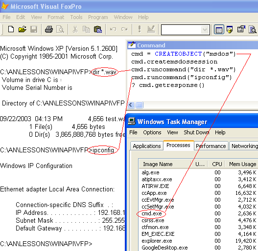

[ Home ](https://github.com/VFPX/Win32API)  

# Running MSDOS Shell as a child process with redirected input and output (smarter RUN command)

## Short description:
The msdos class allows issuing a set of MSDOS commands and getting back a response as a string. The MSDOS window is present but not visible. The code creates a child process running an msdos session and redirects its standard input and output handles to anonymous pipes.  
***  


## Before you begin:
The following class allows to run a set of MSDOS commands and get back a response as a string. The MSDOS window is present but not visible.  

This is how the class can be tested from the VFP Command Window:  

  

If *CreateMsdosSession* method returns *True*, then *RunCommand* method can be used to launch msdos commands. An output of the command processor is collected in a buffer. *GetResponse* method returns the content and clears the buffer.   

Use this program code to test the class:  

```foxpro
LOCAL cmd As msdos, cResponse  
cmd = CREATEOBJECT("msdos")  

IF NOT cmd.createmsdossession()  
	? "CreateMsdosSession call failed."  
	RETURN  
ENDIF  

cmd.runcommand("dir *.bmp")  
cmd.runcommand("ipconfig")  
= INKEY(2) && gives MSDOS some time to return

cResponse = cmd.getresponse()  
STORE cResponse TO _cliptext  && for reviewing later  

SET MEMOWIDTH TO 120  
? cResponse
```

The INKEY() is here to provide some time for the command processor to generate an output. The WaitForSingleObject API, which could be an ideal solution, does not wait for a console output. May be the Timer object can do better than the INKEY() does.  

See also:

* [Running external applications from VFP using WinExec](sample_002.md)  
* [Using ShellExecute for performing operations on files](sample_093.md)  
* [Running external applications from VFP using CreateProcess](sample_003.md)  
* [Running an external program from FoxPro and waiting for its termination](sample_377.md)  
* [Creating a console window for Visual FoxPro application](sample_474.md)  
  
***  


## Code:
```foxpro  
DEFINE CLASS msdos As Custom
#DEFINE SW_HIDE 0
#DEFINE DUPLICATE_SAME_ACCESS 2
#DEFINE STARTF_USESTDHANDLES 0x0100
#DEFINE STARTF_USESHOWWINDOW 1

#DEFINE SECURITYATTR_SIZE 12
#DEFINE STARTUPINFO_SIZE 68
#DEFINE FILEINFO_SIZE 52
#DEFINE crlf CHR(13)+CHR(10)
#DEFINE MsdosShell "cmd.exe"

PROTECTED hChildStdinWrdup, hChildStdoutRddup,;
	hMsdosProcess, hMsdosThread
	hChildStdinWrdup=0
	hChildStdoutRddup=0
	hMsdosProcess=0
	hMsdosThread=0
	
PROCEDURE Init
	THIS.declare

PROCEDURE Destroy
	THIS.ReleaseMsdosSession

PROCEDURE RunCommand(cCommand)
	IF NOT THIS.ValidMsdosSession()
		IF NOT THIS.CreateMsdosSession()
			RETURN ""
		ENDIF
	ENDIF
	THIS.WriteToPipe(cCommand + crlf)

PROCEDURE GetResponse
	LOCAL cResponse
	cResponse = THIS.ReadFromPipe()
	cResponse = STRTRAN(cResponse, CHR(13)+CHR(13), CHR(13))
RETURN m.cResponse

FUNCTION CreateMsdosSession
	THIS.ReleaseMsdosSession

	LOCAL hChildStdinRd, hChildStdinWr, hChildStdinWrdup,;
	hChildStdoutRd, hChildStdoutWr, hChildStdoutRddup,;
	cSecurityAttributes, hProcess, cProcInfo, cStartupInfo, hThread

	STORE 0 TO hChildStdinRd, hChildStdinWr, hChildStdinWrdup,;
	hChildStdoutRd, hChildStdoutWr, hChildStdoutRddup

	hProcess = GetCurrentProcess()
	
	* allocate and populate SECURITY_ATTRIBUTES structure
	* note that bInheritHandle is set to True
	cSecurityAttributes = num2dword(SECURITYATTR_SIZE) +;
		num2dword(0) + num2dword(1)

	* create STDOUT pipe and noninheritable read handle
	* to be used with ReadFromPipe method
	= CreatePipe(@m.hChildStdoutRd, @m.hChildStdoutWr,;
		@cSecurityAttributes, 0)
	= DuplicateHandle(m.hProcess, hChildStdoutRd, m.hProcess,;
		@hChildStdoutRddup, 0, 0, DUPLICATE_SAME_ACCESS)

	* create STDIN pipe and noninheritable write handle
	* to be used with WriteToPipe method
	= CreatePipe(@hChildStdinRd, @hChildStdinWr,;
		@cSecurityAttributes, 0)
	= DuplicateHandle(m.hProcess, hChildStdinWr, m.hProcess,;
		@hChildStdinWrdup, 0, 0, DUPLICATE_SAME_ACCESS)

	* allocate space for STARTUPINFO structure
	cStartupInfo = PADR(Chr(STARTUPINFO_SIZE), STARTUPINFO_SIZE, Chr(0))

	* set dwFlags member of STARTUPINFO
	* using STARTF_USESHOWWINDOW flag with wShowWindow=0
	* will create hidden msdos shell window
	cStartupInfo = STUFF(cStartupInfo, 45, 4,;
		num2dword(STARTF_USESTDHANDLES+STARTF_USESHOWWINDOW))

	* set hStdInput member to the read handle of STDIN pipe
	cStartupInfo = STUFF(cStartupInfo, 57, 4,;
		num2dword(m.hChildStdinRd)) && IN

	* set hStdOutput member to the write handle of STDOUT pipe
	cStartupInfo = STUFF(cStartupInfo, 61, 4,;
		num2dword(m.hChildStdoutWr)) && OUT

	* set hStdError member to the write handle of STDOUT pipe
	cStartupInfo = STUFF(cStartupInfo, 65, 4,;
		num2dword(m.hChildStdoutWr)) && ERR

	* allocate space for PROCESS_INFORMATION structure
	cProcInfo = REPLICATE(Chr(0), 16)
	
	* create child process -- msdos shell window
	* note that bInheritHandles input parameter is set to True
	= CreateProcess(THIS.GetSysDir() + "\" + MsdosShell, "",;
		0,0, 1, 0,0, SYS(5)+SYS(2003), @cStartupInfo, @cProcInfo)

	* retrieve process and thread handles for the created msdos shell
	* from the PROCESS_INFORMATION structure
	hProcess = buf2dword(SUBSTR(cProcInfo, 1,4))
	hThread = buf2dword(SUBSTR(cProcInfo, 5,4))
	
	THIS.hChildStdoutRddup = m.hChildStdoutRddup
	THIS.hChildStdinWrdup = m.hChildStdinWrdup

	* close inheritable handles
	= CloseHandle(m.hChildStdinRd)
	= CloseHandle(m.hChildStdinWr)
	= CloseHandle(m.hChildStdoutRd)
	= CloseHandle(m.hChildStdoutWr)

	IF THIS.ValidMsdosSession()
		* store process and thread handles in class properties;
		* on exit you will need them to terminate the msdos shell process
		THIS.hMsdosProcess = m.hProcess
		THIS.hMsdosThread = m.hThread
		RETURN .T.
	ELSE
	* failed to start msdos shell as a child process
		THIS.ReleaseMsdosSession
		RETURN .F.
	ENDIF

FUNCTION ValidMsdosSession
RETURN (THIS.hChildStdoutRddup <> 0);
	AND (THIS.hChildStdinWrdup <> 0)

PROTECTED PROCEDURE ReleaseMsdosSession
	= CloseHandle(THIS.hChildStdinWrdup)
	= CloseHandle(THIS.hChildStdoutRddup)
	STORE 0 TO THIS.hChildStdinWrdup, THIS.hChildStdoutRddup
	IF THIS.hMsdosProcess <> 0
		= TerminateProcess(THIS.hMsdosProcess, 0)
		= CloseHandle(THIS.hMsdosProcess)
		= CloseHandle(THIS.hMsdosThread)
		STORE 0 TO THIS.hMsdosProcess, THIS.hMsdosThread
	ENDIF

PROTECTED PROCEDURE WriteToPipe(cWrite)
	LOCAL nWritten
	nWritten=0
	IF WriteFile(THIS.hChildStdinWrdup, @cWrite,;
		LEN(cWrite), @nWritten, 0) = 0
		RETURN 0
	ENDIF
RETURN m.nWritten

PROTECTED PROCEDURE ReadFromPipe
	LOCAL cBuffer, nBytes, cRead, nRead
	cBuffer = REPLICATE(CHR(0), FILEINFO_SIZE)

	= GetFileInformationByHandle(;
		THIS.hChildStdoutRddup, @cBuffer)
	nBytes = buf2dword(SUBSTR(cBuffer, 37,4))

	IF nBytes = 0  && nothing to read
		RETURN ""
	ENDIF

	cRead = REPLICATE(CHR(0), 16384)
	nRead = 0
	IF ReadFile(THIS.hChildStdoutRddup, @cRead,;
		LEN(cRead), @nRead, 0) = 0
		RETURN ""
	ENDIF
RETURN SUBSTR(cRead, 1, nRead)

PROTECTED PROCEDURE GetSysDir
	LOCAL cBuffer, nBufsize
	cBuffer = REPLICATE(CHR(0), 260)
	nBufsize = GetSystemDirectory(@cBuffer, LEN(cBuffer))
RETURN SUBSTR(cBuffer, 1, nBufsize)

PROTECTED PROCEDURE declare
	DECLARE INTEGER CloseHandle IN kernel32 INTEGER hObject
	DECLARE INTEGER GetCurrentProcess IN kernel32

	DECLARE INTEGER CreatePipe IN kernel32;
		INTEGER @hReadPipe, INTEGER @hWritePipe,;
		STRING @lpPipeAttributes, LONG nSize

	DECLARE INTEGER ReadFile IN kernel32;
		INTEGER hFile, STRING @lpBuffer, INTEGER nBytesToRead,;
		INTEGER @lpBytesRead, INTEGER lpOverlapped

	DECLARE INTEGER WriteFile IN kernel32;
		INTEGER hFile, STRING @lpBuffer, INTEGER nBt2Write,;
		INTEGER @lpBtWritten, INTEGER lpOverlapped

	DECLARE INTEGER GetFileInformationByHandle IN kernel32;
		INTEGER hFile, STRING @lpFileInformation

	DECLARE INTEGER DuplicateHandle IN kernel32;
		INTEGER hSourceProcessHandle, INTEGER hSourceHandle,;
		INTEGER hTargetProcessHandle, INTEGER @lpTargetHandle,;
		LONG dwDesiredAccess, INTEGER bInheritHandle, INTEGER dwOptions

	DECLARE INTEGER CreateProcess IN kernel32;
		STRING lpApplicationName, STRING lpCommandLine,;
		INTEGER lpProcessAttr, INTEGER lpThreadAttr,;
		INTEGER bInheritHandles, INTEGER dwCreationFlags,;
		INTEGER lpEnvironment, STRING lpCurrentDirectory,;
		STRING @lpStartupInfo, STRING @lpProcessInformation

	DECLARE INTEGER GetSystemDirectory IN kernel32;
		STRING @lpBuffer, INTEGER nSize

	DECLARE INTEGER TerminateProcess IN kernel32;
		INTEGER hProcess, INTEGER uExitCode
ENDDEFINE

FUNCTION buf2dword(lcBuffer)
RETURN Asc(SUBSTR(lcBuffer, 1,1)) + ;
	BitLShift(Asc(SUBSTR(lcBuffer, 2,1)),  8) +;
	BitLShift(Asc(SUBSTR(lcBuffer, 3,1)), 16) +;
	BitLShift(Asc(SUBSTR(lcBuffer, 4,1)), 24)

FUNCTION num2dword(lnValue)
#DEFINE m0  256
#DEFINE m1  65536
#DEFINE m2  16777216
	IF lnValue < 0
		lnValue = 0x100000000 + lnValue
	ENDIF
	LOCAL b0, b1, b2, b3
	b3 = Int(lnValue/m2)
	b2 = Int((lnValue - b3*m2)/m1)
	b1 = Int((lnValue - b3*m2 - b2*m1)/m0)
	b0 = Mod(lnValue, m0)
RETURN Chr(b0)+Chr(b1)+Chr(b2)+Chr(b3)  
```  
***  


## Listed functions:
[CloseHandle](../libraries/kernel32/CloseHandle.md)  
[CreatePipe](../libraries/kernel32/CreatePipe.md)  
[CreateProcess](../libraries/kernel32/CreateProcess.md)  
[DuplicateHandle](../libraries/kernel32/DuplicateHandle.md)  
[GetCurrentProcess](../libraries/kernel32/GetCurrentProcess.md)  
[GetFileInformationByHandle](../libraries/kernel32/GetFileInformationByHandle.md)  
[GetSystemDirectory](../libraries/kernel32/GetSystemDirectory.md)  
[ReadFile](../libraries/kernel32/ReadFile.md)  
[TerminateProcess](../libraries/kernel32/TerminateProcess.md)  
[WriteFile](../libraries/kernel32/WriteFile.md)  

## Comment:
The VFP class starts the command processor (cmd.exe) as a child process using the CreateProcess. Through input parameters for this call the standard input and output handles of the child process are redirected to two anonymous pipes.   
  
The msdos window is put in a hidden state by placing STARTF_USESHOWWINDOW  in STARTUPINFO structure. So the usual black msdos window does not blink and does not appear in the Task Bar.   
  
Though it has an unexpected effect:
  
`cmd.RunCommand("C:\myprog.exe")`
  
The code line above will start myprog.exe and place it in a hidden state. Only after the *cmd* object is released, the myprog.exe becomes visible and appears in the Task Bar.   
  
* * *  
Through one pipe the command processor receives commands (RunCommand method). The other pipe is used to get an output generated by the command processor (GetResponse method).  
  
*An anonymous pipe is an unnamed, one-way pipe that typically transfers data between a parent process and a child process. *  
  
This is like a temporary file that is shared by two processes. One of these processes can write to the pipe, and the other one can read from the pipe, which is what "one-way" means.  
  
MSDN links:  

* [Creating a Child Process with Redirected Input and Output ](https://msdn.microsoft.com/en-us/library/windows/desktop/ms682499(v=vs.85).aspx) -- *the FoxPro class above actually uses a translation of a large part of this C code*   

* <a href="http://support.microsoft.com/default.aspx?scid=kb;en-us;190351">How To Spawn Console Processes with Redirected Standard Handles</a>  
  
***  

