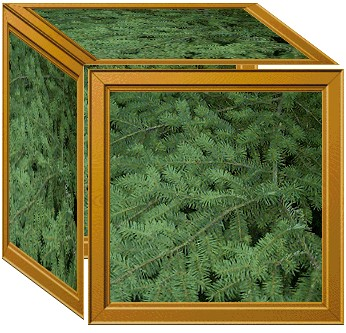

[ Home ](https://github.com/VFPX/Win32API)  

# GDI+: Using Scale and Shear transformations

## Note that this document contains some links to the old news2news website which does not work at the moment. This material will be available sometime in the future.

## Short description:
A transformation is a process that changes graphics objects from one state to another. Rotation, scaling, reflection, translation, and shearing are some examples of transformation. Transformations can be applied to graphics shapes, curves, images and to image colors.
  
***  


## Before you begin:
The code is based on [custom GDI+ class](sample_450.md). Download the class module first and save it in **gdiplus.prg** file.   

See also:

* [extending user interface: controls that shake](sample_526.md)  
* [scaling images](sample_460.md)  
* [cropping images](sample_515.md)  
* [rotating images](sample_525.md)  

<!-- Anatoliy -->
   

A transformation is a process that changes graphics objects from one state to another.   

Rotation, scaling, reflection, translation, and shearing are some examples of transformation.   

Transformations can be applied to graphics shapes, curves, images and to image colors.  

  
***  


## Code:
```foxpro  
SET PROCEDURE TO gdiplus ADDITIVE

DO declare

PRIVATE gdiplus As gdiplusinit
gdiplus = CREATEOBJECT("gdiplusinit")

LOCAL img As gdiimage
img = CREATEOBJECT("gdiimage", "c:\windows\forest.bmp")

LOCAL matrix1, matrix2, xFactor, yFactor
xFactor=0.32
yFactor=0.24
STORE 0 TO matrix1, matrix2

* create two Matrix objects
* and apply scale and shear transformations
= GdipCreateMatrix(@matrix1)
= GdipScaleMatrix(matrix1, 1, yFactor, 0)
= GdipShearMatrix(matrix1, xFactor, 0, 0)

= GdipCreateMatrix(@matrix2)
= GdipScaleMatrix(matrix2, xFactor, 1, 0)
= GdipShearMatrix(matrix2, 0, yFactor, 0)

* create a virtual bitmap object and draw the image on it
* with several transformations applied
LOCAL memorybitmap As gdibitmap
memorybitmap = CREATEOBJECT("gdibitmap", 500,500)
WITH memorybitmap.graphics
	.drawimage(img, 0, 0)

	= GdipSetWorldTransform(.graphics, matrix1)
	.drawimage(img, 0, 0)

	= GdipSetWorldTransform(.graphics, matrix2)
	.drawimage(img, 0, 0)

	= GdipResetWorldTransform(.graphics)
	.drawimage(img, img.imgwidth*xFactor+5, img.imgheight*yFactor+5)
ENDWITH

= GdipDeleteMatrix(matrix1)
= GdipDeleteMatrix(matrix2)

* draw the virtual bitmap on FoxPro main window
WITH CREATEOBJECT("graphics", _screen.HWnd)
	.drawimage(memorybitmap, 100, 100)
ENDWITH
* end of main

PROCEDURE declare
	DECLARE INTEGER GdipCreateMatrix IN gdiplus INTEGER @matrix
	DECLARE INTEGER GdipDeleteMatrix IN gdiplus INTEGER matrix
	DECLARE INTEGER GdipResetWorldTransform IN gdiplus INTEGER graphics

	DECLARE INTEGER GdipTranslateWorldTransform IN gdiplus;
		INTEGER graphics, SINGLE dx, SINGLE dy, INTEGER ord

	DECLARE INTEGER GdipRotateWorldTransform IN gdiplus;
		INTEGER graphics, SINGLE angle, INTEGER ord

	DECLARE INTEGER GdipShearMatrix IN gdiplus;
		INTEGER matrix, SINGLE shearX, SINGLE shearY, INTEGER ord

	DECLARE INTEGER GdipScaleMatrix IN gdiplus;
		INTEGER matrix, SINGLE scaleX, SINGLE scaleY, INTEGER ord

	DECLARE INTEGER GdipTranslateMatrix IN gdiplus;
		INTEGER matrix, SINGLE offsetX, SINGLE offsetY, INTEGER ord

	DECLARE INTEGER GdipSetWorldTransform IN gdiplus;
		INTEGER graphics, INTEGER matrix  
```  
***  


## Listed functions:
[GdipCreateMatrix](../libraries/gdiplus/GdipCreateMatrix.md)  
[GdipDeleteMatrix](../libraries/gdiplus/GdipDeleteMatrix.md)  
[GdipResetWorldTransform](../libraries/gdiplus/GdipResetWorldTransform.md)  
[GdipRotateWorldTransform](../libraries/gdiplus/GdipRotateWorldTransform.md)  
[GdipScaleMatrix](../libraries/gdiplus/GdipScaleMatrix.md)  
[GdipShearMatrix](../libraries/gdiplus/GdipShearMatrix.md)  
[GdipTranslateMatrix](../libraries/gdiplus/GdipTranslateMatrix.md)  
