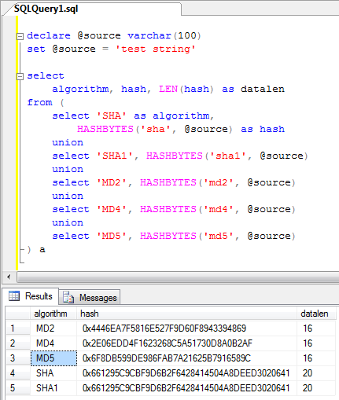

[ Home ](https://github.com/VFPX/Win32API)  

# How to create MD-5 and SHA-1 hash values from a string

## Short description:
MD-5 is a one-way message-digest hash function. The algorithm processes input text and creates a 128-bit message digest which is unique to the message and can be used to verify data integrity. The example shows how to create an MD-5 hash for a string using CryptoAPI calls.  
***  


## Before you begin:
Test the presented class as follows:
```foxpro
obj = CREATEOBJECT("TheHash")

? obj.CreateSHA1("test string") && returns 661295C9CBF9D6B2F6428414504A8DEED3020641</font>  

? obj.CreateMD5("test string") && returns 6F8DB599DE986FAB7A21625B7916589C
```
See also:

* [Simple class that encrypts and decrypts files using Cryptography API Functions ](sample_511.md)  
* [CryptoAPI: Collection of Providers class](sample_463.md)  
* [WinINet function CreateMD5SSOHash](../wininet/CreateMD5SSOHash.md)  
  
***  


## Code:
```foxpro  
DEFINE CLASS TheHash As Session
#DEFINE CRYPT_VERIFYCONTEXT 0xf0000000
#DEFINE PROV_RSA_FULL 1
#DEFINE ALG_CLASS_HASH BITLSHIFT(4,13)
#DEFINE ALG_SID_MD2 1
#DEFINE ALG_SID_MD4 2
#DEFINE ALG_SID_MD5 3
#DEFINE ALG_SID_SHA1 4
#DEFINE HP_ALGID 0x0001
#DEFINE HP_HASHVAL 0x0002
#DEFINE HP_HASHSIZE 0x0004
#DEFINE HP_HMAC_INFO 0x0005

PROTECTED hProv, hHash
	hProv=0
	hHash=0
	algid=0
	hashsize=0
	hashvalue=""
	errorcode=0
	errormessage=""

PROCEDURE Init
	THIS.declare
	IF NOT THIS.GetContext()
		RETURN .F.
	ENDIF

PROCEDURE Destroy
	THIS.DestroyHash
	= CryptReleaseContext(THIS.hProv, 0)
	THIS.hProv = 0

PROCEDURE CreateMD2(cString)
RETURN THIS.GetHashValue(cString, ALG_SID_MD2)

PROCEDURE CreateMD4(cString)
RETURN THIS.GetHashValue(cString, ALG_SID_MD4)

PROCEDURE CreateMD5(cString)
RETURN THIS.GetHashValue(cString, ALG_SID_MD5)

PROCEDURE CreateSHA1(cString)
RETURN THIS.GetHashValue(cString, ALG_SID_SHA1)

PROTECTED PROCEDURE GetContext
* get handle to the crypto provider
	LOCAL hProv
	hProv = 0
	IF CryptAcquireContext(@hProv, NULL, NULL,;
		PROV_RSA_FULL, CRYPT_VERIFYCONTEXT) = 0
		RETURN .F.
	ENDIF
	THIS.hProv = m.hProv
RETURN .T.

PROTECTED PROCEDURE GetHashValue(cString, nSID)
	THIS.errorcode=0
	THIS.errormessage=""

	IF THIS.CreateHash(nSID)
		IF CryptHashData(THIS.hHash, @cString, LEN(cString), 0) = 0
			THIS.errorcode = GetLastError()
			THIS.errormessage = "CryptHashData failed."
		ELSE
			THIS.hashvalue = THIS.GetHashParam(HP_HASHVAL)
			THIS.algid = THIS.buf2num(THIS.GetHashParam(HP_ALGID))
			THIS.hashsize = THIS.buf2num(THIS.GetHashParam(HP_HASHSIZE))
		ENDIF
		THIS.DestroyHash
	ENDIF
RETURN STRCONV(THIS.hashvalue,15)

PROTECTED PROCEDURE GetHashParam(nHP)
	LOCAL nBufsize, cBuffer

	nBufsize = 0
	= CryptGetHashParam(THIS.hHash, m.nHP,;
		Null, @nBufsize, 0)

	cBuffer = REPLICATE(CHR(0), m.nBufsize)

	IF CryptGetHashParam(THIS.hHash, m.nHP,;
		@cBuffer, @nBufsize, 0) = 0
		THIS.errorcode = GetLastError()
		THIS.errormessage = "CryptGetHashParam failed."
		RETURN ""
	ENDIF
RETURN m.cBuffer

PROTECTED PROCEDURE CreateHash(nSID)
	THIS.DestroyHash

	LOCAL hHash, nAlgId
	hHash = 0
	nAlgId = BITOR(ALG_CLASS_HASH, nSID)

	IF CryptCreateHash(THIS.hProv, nAlgId, 0, 0, @m.hHash) = 0
		THIS.errorcode = GetLastError()
		THIS.errormessage = "CryptCreateHash failed."
		RETURN .F.
	ENDIF
	THIS.hHash = m.hHash
RETURN .T.

PROTECTED PROCEDURE DestroyHash
	IF THIS.hHash <> 0
		= CryptDestroyHash(THIS.hHash)
		THIS.hHash = 0
	ENDIF

PROTECTED PROCEDURE declare
	DECLARE INTEGER GetLastError IN kernel32
	DECLARE INTEGER CryptDestroyHash IN advapi32 INTEGER hHash

	DECLARE INTEGER CryptAcquireContext IN advapi32;
		INTEGER @hProvHandle, STRING cContainer, ;
		STRING cProvider, INTEGER nProvType, INTEGER nFlags

	DECLARE INTEGER CryptReleaseContext IN advapi32;
		INTEGER hProvHandle, INTEGER nReserved

	DECLARE INTEGER CryptCreateHash IN advapi32;
		INTEGER hProv, INTEGER Algid, INTEGER hKey,;
		INTEGER dwFlags, INTEGER @phHash

	DECLARE INTEGER CryptHashData IN advapi32;
		INTEGER hHash, STRING @pbData,;
		LONG dwDataLen, LONG dwFlags

	DECLARE INTEGER CryptGetHashParam IN advapi32;
		INTEGER hHash, LONG dwParam, STRING @pbData,;
		LONG @pdwDataLen, LONG dwFlags

FUNCTION buf2num(cBuffer)
RETURN Asc(SUBSTR(cBuffer,1,1)) + ;
	BitLShift(Asc(SUBSTR(cBuffer, 2,1)),8) +;
	BitLShift(Asc(SUBSTR(cBuffer, 3,1)),16) +;
	BitLShift(Asc(SUBSTR(cBuffer, 4,1)),24)

ENDDEFINE  
```  
***  


## Listed functions:
[CryptAcquireContext](../libraries/advapi32/CryptAcquireContext.md)  
[CryptCreateHash](../libraries/advapi32/CryptCreateHash.md)  
[CryptDestroyHash](../libraries/advapi32/CryptDestroyHash.md)  
[CryptGetHashParam](../libraries/advapi32/CryptGetHashParam.md)  
[CryptHashData](../libraries/advapi32/CryptHashData.md)  
[CryptReleaseContext](../libraries/advapi32/CryptReleaseContext.md)  
[GetLastError](../libraries/kernel32/GetLastError.md)  

## Comment:
Transact-SQL HASHBYTES() function computes MD5 and SHA1 hashes identical to those produced by VFP and C# code samples above.  
  


* * *  
One-way hash functions can be used for creating a fingerprint for a block of data.   
  
Also hash functions can be used to evaluate passwords. In Users table of your FoxPro application you store not passwords but their hash values.   
  
It is extremely difficult, if ever possible, to find the original string for a given hash value -- depends on the hash algorithm as well as computer power and methodology you have.  
  
* * *  
Message Digest: *The representation of text in the form of a single string of digits, created using a formula called a one-way hash function.*  
  
One-Way Hash Function: *An algorithm that turns messages or text into a fixed string of digits, usually for security or data management purposes. The "one way" means that it is nearly impossible to derive the original text from the string.*  
  
*Hash Collision*: More than one input message producing identical hash output.  
  
* * *  
Secure Hash Algorithm, a hash function developed by the NSA for use with NIST Digital Signature Standard (DSS). NSA almost immediately developed a minor change known as SHA-1. Both SHA and SHA-1 produce a 160-bit digest. SHA-1 is used in SSL.  
  
* * *  
MD-5 is a one-way message-digest hash function. The algorithm processes input text and creates a 128-bit message digest which is unique to the message and can be used to verify data integrity.   
  
MD-5 was developed by <a href="http://theory.lcs.mit.edu/~rivest/">Ron Rivest</a> and is intended to be used in digital signatures applications. Earlier message digest algorithms include obsolete MD-2 and MD-4.  
  
See also:   
* [RFC 1321 - The MD5 Message-Digest Algorithm](http://www.faqs.org/rfcs/rfc1321.html)  
* [What are MD2, MD4, and MD5?](http://x5.net/faqs/crypto/q99.html)  
* [Example C Program: Creating an MD-5 Hash From File Content.](https://msdn.microsoft.com/en-us/library/windows/desktop/aa382380(v=vs.85).aspx)
* [MD5 Online Cracking using Rainbow Tables.](https://www.go4expert.com/articles/cracking-md5-hashes-using-rainbow-tables-t17240/)
* [RFC 3174 - US Secure Hash Algorithm 1 (SHA1)](http://www.faqs.org/rfcs/rfc3174)  

***  

