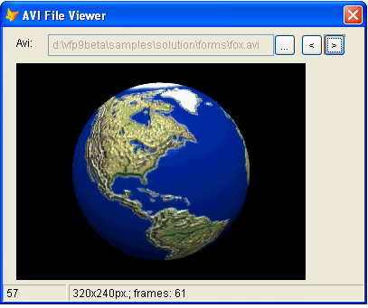

[ Home ](https://github.com/VFPX/Win32API)  

# How to extract frames from AVI files

## Short description:
The example presents the AviBrowser class. This class can open AVI file and convert its frames into bitmap files. The AviBrowser object is shown used as a control on FoxPro form. For that reason, it is subclassed from the Image control.  
***  


## Before you begin:
This example presents the *AviBrowser* class. This class can open AVI file and convert its frames into bitmap files. The AviBrowser object is shown used as a control on FoxPro form. For that reason, it is subclassed from the Image control.  

  
  
***  


## Code:
```foxpro  
LOCAL oForm
oForm = CREATEOBJECT("tform")
oForm.Show(1)
* end of main

DEFINE CLASS tform As Form
	Width=400
	Height=200
	Autocenter=.T.
	MinButton=.F.
	MaxButton=.F.
	BorderStyle=2
	frameno=0
	Caption="AVI File Viewer"

	ADD OBJECT lbl As Label WITH Caption="Avi:", Left=15, Top=10
	ADD OBJECT txt As TextBox WITH Left=50, Top=8,;
		Height=24, Width=250, Enabled=.F.
	ADD OBJECT cmdFile As CommandButton WITH Caption="...",;
		Top=8, Left=300, Width=24, Height=24

	ADD OBJECT cmdBackward As CommandButton WITH;
	Left=330, Width=24, Top=8, Height=24, Caption="<", Enabled=.F.

	ADD OBJECT cmdForward As CommandButton WITH;
	Left=355, Width=24, Top=8, Height=24, Caption=">", Enabled=.F.

	ADD OBJECT avi As AviBrowser WITH Left=15, Top=40, Visible=.F.
	ADD OBJECT sbar As Tbar WITH Left=0, Height=21

PROCEDURE Resize
	LOCAL nAviWidth, nAviHeight, nWidth, nHeight
	nAviWidth = THIS.avi.GetWidth()
	nAviHeight = THIS.avi.GetHeight()
	
	nWidth = nAviWidth+30
	THIS.Width = MAX(400, nWidth)

	nHeight = nAviHeight+64
	THIS.Height = MAX(200, nHeight)

PROCEDURE cmdFile.Click
	ThisForm.SelectFile

PROCEDURE cmdBackward.Click
	ThisForm.ShowFrame(ThisForm.frameno - 1)

PROCEDURE cmdForward.Click
	ThisForm.ShowFrame(ThisForm.frameno + 1)

PROCEDURE ShowFrame(nFrameno)
	IF VARTYPE(nFrameno) <> "N"
		nFrameno=THIS.frameno
	ELSE
		nFrameno = MAX(0, m.nFrameno)
		nFrameno = MIN(THIS.avi.GetLength()-1, m.nFrameno)
		THIS.frameno = m.nFrameno
	ENDIF
	WITH THIS.avi
		.FrameToDib(THIS.frameno)
		.Visible=.T.
	ENDWITH
	THIS.sbar.Panels(1).Text = TRANSFORM(ThisForm.frameno)
	THIS.Refresh

PROCEDURE ShowFileInfo
	LOCAL nAviWidth, nAviHeight, nFrameCount
	nAviWidth = THIS.avi.GetWidth()
	nAviHeight = THIS.avi.GetHeight()
	nFrameCount = THIS.avi.GetLength()

	THIS.sbar.Panels(2).Text = TRANSFORM(nAviWidth) +;
		"x" + TRANSFORM(nAviHeight) +;
		"px.; frames: " + TRANSFORM(nFrameCount)

PROCEDURE SelectFile
	LOCAL cFile
	cFile = THIS.GetAviFile()

	IF Len(cFile) <> 0
		THIS.txt.Value = cFile
		THIS.frameno=0

		IF THIS.avi.OpenFile(THIS.txt.Value)
			THIS.ShowFileInfo
			STORE .T. TO THIS.cmdBackward.Enabled,;
				THIS.cmdForward.Enabled
			THIS.Resize
			THIS.ShowFrame
		ELSE
			STORE .F. TO THIS.cmdBackward.Enabled,;
				THIS.cmdForward.Enabled
			THIS.sbar.Panels(1).Text = ""
			THIS.sbar.Panels(2).Text = ""
			WAIT WINDOW NOWAIT "Error: " +;
				TRANSFORM(THIS.avi.errorno) + "     "
		ENDIF
	ENDIF

PROTECTED FUNCTION GetAviFile
	LOCAL cResult, cPath, cStoredPath
	cPath = SYS(5) + SYS(2003)
	cStoredPath = FULLPATH(THIS.txt.Value)
	cStoredPath = SUBSTR(cStoredPath, 1, RAT("\",cStoredPath)-1)
	
	SET DEFAULT TO (cStoredPath)
	cResult = GETFILE("avi", "AVI File:", "Open", 0, "Open AVI file")
	SET DEFAULT TO (cPath)
RETURN LOWER(cResult)

ENDDEFINE

DEFINE CLASS Tbar As OleControl
	OleClass="MSComctlLib.SBarCtrl.2"
PROCEDURE Init
	THIS.Height=21
	THIS.Panels.Add
	THIS.Panels(1).Width = 70
	THIS.Panels(2).Width = 800
ENDDEFINE

DEFINE CLASS AviBrowser As Image
#DEFINE BITMAPFILEHEADER_SIZE 14
#DEFINE BITMAPINFOHEADER_SIZE 40  && BITMAPINFOHEADER
#DEFINE OF_SHARE_DENY_WRITE 0x00000020
#DEFINE STREAMTYPE_VIDEO "vids"
#DEFINE AVIGETFRAMEF_BESTDISPLAYFMT 1
#DEFINE AVIFILEINFO_SIZE 108
PROTECTED filename, hfile, srcwidth, srcheight, srcscale, srcrate,;
	srclength, hvstream, hgetframe
	filename=""
	hfile=0
	errorno=0
	srcwidth=0  && width, pixels
	srcheight=0 && height, pixels
	srcscale=0  && entire file time scale
	srcrate=0   && samples rate
	srclength=0 && length of the file, frames
	dibname=""

PROCEDURE Init(cAviFile)
*	THIS.dibname = "_"+SUBSTR(SYS(2015), 4) + ".dib"
	THIS.dibname = "aviframe.dib"
	THIS.declare
	= AVIFileInit()  && AVI library initialized
	THIS.OpenFile(cAviFile)

PROCEDURE Destroy
	THIS.CloseFile
	= AVIFileExit()  && AVI library released
*	THIS.RemoveDib

PROTECTED PROCEDURE RemoveDib
	IF FILE(THIS.dibname)
		TRY
			DELETE FILE (THIS.dibname)
		CATCH
		ENDTRY
	ENDIF

PROCEDURE GetWidth
RETURN THIS.srcwidth

PROCEDURE GetHeight
RETURN THIS.srcheight

PROCEDURE GetLength
RETURN THIS.srclength

PROTECTED PROCEDURE SetError(nErrorno, cMessage)
	IF VARTYPE(nErrorno)="N"
		THIS.errorno = m.nErrorno
	ELSE
		THIS.errorno = GetLastError()
	ENDIF

PROCEDURE FrameToDib(nFrameNo)
#DEFINE GENERIC_WRITE 0x40000000
#DEFINE FILE_SHARE_WRITE 2
#DEFINE CREATE_ALWAYS 2
#DEFINE FILE_ATTRIBUTE_NORMAL 128
#DEFINE INVALID_HANDLE_VALUE -1
	LOCAL hFrame, nDibSize, nFileSize, hFile,;
		cHeader, cBuffer, ex As Exception

	hFrame = AVIStreamGetFrame(THIS.hgetframe, nFrameNo)
	IF hFrame = 0
		THIS.SetError
		RETURN .F.
	ENDIF

	nDibSize = GlobalSize(hFrame)
	nFileSize = BITMAPFILEHEADER_SIZE + nDibSize
	cHeader = "BM" +;
		num2dword(nFileSize) +;
		num2dword(0) +;
		num2dword(BITMAPINFOHEADER_SIZE+BITMAPFILEHEADER_SIZE)

	cBuffer = REPLICATE(CHR(0), nDibSize)
	= MemToStr(@cBuffer, hFrame, nDibSize)
	
	SET SAFETY OFF
	TRY
		= STRTOFILE(cHeader+cBuffer, THIS.dibname)
		THIS.Picture = THIS.dibname
	CATCH TO ex
	FINALLY
		SET SAFETY ON
	ENDTRY
RETURN (VARTYPE(m.ex) <> "O")
	
PROCEDURE OpenFile(cAviFile)
	THIS.CloseFile
	IF VARTYPE(m.cAviFile) <> "C" OR EMPTY(m.cAviFile)
		RETURN .F.
	ENDIF

	LOCAL hFile
	hFile=0
	THIS.filename = m.cAviFile

	THIS.SetError(AVIFileOpen(@hFile, m.cAviFile,;
		OF_SHARE_DENY_WRITE, 0))

	IF THIS.errorno <> 0
		RETURN .F.
	ENDIF

	THIS.hfile = m.hFile
	THIS.GetFileInfo
	THIS.OpenVStream
RETURN (THIS.errorno=0)

PROTECTED PROCEDURE CloseFile
	IF Not EMPTY(THIS.hgetframe)
		= AVIStreamGetFrameClose(THIS.hgetframe)
		THIS.hgetframe=0
	ENDIF
	IF NOT EMPTY(THIS.hvstream)
		= AVIStreamRelease(THIS.hvstream)  && AVI stream released
		THIS.hvstream=0
	ENDIF
	IF THIS.hfile <> 0
		= AVIFileRelease(THIS.hfile)  && AVI file released
		THIS.hfile=0
	ENDIF

PROTECTED PROCEDURE GetFileInfo  && obtains AVI file parameters
	LOCAL cBuffer
	cBuffer = Repli(Chr(0), AVIFILEINFO_SIZE)
	= AVIFileInfo(THIS.hfile, @cBuffer, AVIFILEINFO_SIZE)
	THIS.srcwidth = buf2dword(SUBSTR(cBuffer, 21,4))
	THIS.srcheight = buf2dword(SUBSTR(cBuffer, 25,4))
	THIS.srcscale = buf2dword(SUBSTR(cBuffer, 29,4))
	THIS.srcrate = buf2dword(SUBSTR(cBuffer, 33,4))
	IF THIS.srcrate = 0
		THIS.srcrate = MAX(THIS.srcscale, 1)
	ENDIF
	THIS.srclength = buf2dword(SUBSTR(cBuffer, 37,4))

PROTECTED FUNCTION OpenVStream
	LOCAL hStream, nFormatFlag
	hStream = 0

	THIS.SetError(AVIFileGetStream(THIS.hfile,;
		@hStream, buf2dword(STREAMTYPE_VIDEO), 0))

	IF THIS.errorno = 0
		THIS.hvstream = m.hStream
		nFormatFlag = 0  && or AVIGETFRAMEF_BESTDISPLAYFMT
		
		THIS.hgetframe = AVIStreamGetFrameOpen(THIS.hvstream,;
			AVIGETFRAMEF_BESTDISPLAYFMT)

		IF THIS.hgetframe <> 0
			RETURN .T.
		ELSE
			THIS.SetError(-1, "Can not find a decompressor.")
		ENDIF
	ENDIF
RETURN .F.

PROTECTED PROCEDURE declare
	DECLARE AVIFileInit IN avifil32
	DECLARE AVIFileExit IN avifil32
	DECLARE INTEGER AVIFileRelease IN avifil32 INTEGER pfile
	DECLARE INTEGER AVIStreamRelease IN avifil32 INTEGER pavi
	DECLARE INTEGER AVIStreamGetFrameClose IN avifil32 INTEGER pget
	DECLARE INTEGER AVIStreamGetFrame IN avifil32 INTEGER pgf, LONG lPos
	DECLARE INTEGER GlobalSize IN kernel32 INTEGER hMem
	DECLARE INTEGER GetLastError IN kernel32

	DECLARE RtlMoveMemory IN kernel32 As MemToStr;
		STRING @dst, INTEGER src, INTEGER nLength

	DECLARE INTEGER AVIFileOpen IN avifil32;
		INTEGER @ppfile, STRING szFile,;
		INTEGER mode, INTEGER pclsidHandler

	DECLARE INTEGER AVIFileInfo IN avifil32;
		INTEGER pfile, STRING @pfi, INTEGER lSize

	DECLARE INTEGER AVIFileGetStream IN avifil32;
		INTEGER pfile, INTEGER @ppavi,;
		INTEGER fccType, INTEGER lParam

	DECLARE INTEGER AVIStreamGetFrameOpen IN avifil32;
		INTEGER pavi, INTEGER lpbiWanted
ENDDEFINE

FUNCTION buf2dword(lcBuffer)
RETURN Asc(SUBSTR(lcBuffer, 1,1)) + ;
	BitLShift(Asc(SUBSTR(lcBuffer, 2,1)),  8) +;
	BitLShift(Asc(SUBSTR(lcBuffer, 3,1)), 16) +;
	BitLShift(Asc(SUBSTR(lcBuffer, 4,1)), 24)

FUNCTION num2dword(lnValue)
#DEFINE m0  256
#DEFINE m1  65536
#DEFINE m2  16777216
	IF lnValue < 0
		lnValue = 0x100000000 + lnValue
	ENDIF
	LOCAL b0, b1, b2, b3
	b3 = Int(lnValue/m2)
	b2 = Int((lnValue - b3*m2)/m1)
	b1 = Int((lnValue - b3*m2 - b2*m1)/m0)
	b0 = Mod(lnValue, m0)
RETURN Chr(b0)+Chr(b1)+Chr(b2)+Chr(b3)  
```  
***  


## Listed functions:
[AVIFileExit](../libraries/avifil32/AVIFileExit.md)  
[AVIFileGetStream](../libraries/avifil32/AVIFileGetStream.md)  
[AVIFileInfo](../libraries/avifil32/AVIFileInfo.md)  
[AVIFileInit](../libraries/avifil32/AVIFileInit.md)  
[AVIFileOpen](../libraries/avifil32/AVIFileOpen.md)  
[AVIFileRelease](../libraries/avifil32/AVIFileRelease.md)  
[AVIStreamGetFrame](../libraries/avifil32/AVIStreamGetFrame.md)  
[AVIStreamGetFrameClose](../libraries/avifil32/AVIStreamGetFrameClose.md)  
[AVIStreamGetFrameOpen](../libraries/avifil32/AVIStreamGetFrameOpen.md)  
[AVIStreamRelease](../libraries/avifil32/AVIStreamRelease.md)  
[GetLastError](../libraries/kernel32/GetLastError.md)  
[GlobalSize](../libraries/kernel32/GlobalSize.md)  

## Comment:
The AVIStreamGetFrame returns the address of a decompressed video frame. It points to a *globally allocated* memory block. The block contains already populated BITMAPINFOHEADER structure followed by optional color table and the binary data.   
  
Practically, this is a bitmap file. All you have to do is to populate the BITMAPFILEHEADER structure and add it on top of the block. Then save the result to a file with "DIB" or "BMP" extension.  
  
* * *  
There is an issue not answered yet: the AVIStreamGetFrameOpen returns an error for some AVI files. Otherwise these are normal AVI files. I'm looking what can be done...  
  

***  

