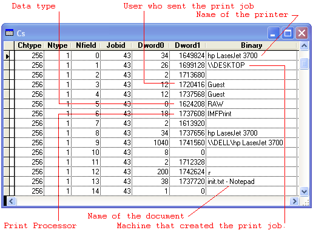

[ Home ](https://github.com/VFPX/Win32API)  

# Using Change Notification Objects to monitor changes to the printer or print server

## Short description:
The code explains how to use FindFirstPrinterChangeNotification and FindNextPrinterChangeNotification API calls to monitor changes in jobs for a specified local or network printer. Not an easy job for Visual FoxPro, considering its unique attitude to API structures and pointers. This functionality can be used to build a print monitor, though in a way limited by the single-thread nature of Visual FoxPro.  
***  


## Before you begin:
Set *cPrinter* variable to the name of a local or network printer. For at least 60 seconds the program will be recording any changes in printer jobs for the printer: jobs added, deleted, suspended etc.  

Note that once started, the program gets into a waiting state (appears to stop responding) for at least one minute. This is caused by the WaitForSingleObject call. Every change in a print job resets this one-minute interval. So in case of intensive print traffic the program may stay frozen indefinitely long.  

This is a log similar to what this program creates:  

  

As you can see, the log stores a wide set of parameters. It includes the name of the printer, the name of the machine that created the job, the number of pages to be printed and already printed, the size of the job in bytes and more.  
  
***  


## Code:
```foxpro  
#DEFINE PRINTER_NOTIFY_TYPE 0
#DEFINE JOB_NOTIFY_TYPE 1

#DEFINE PRINTER_CHANGE_ADD_JOB 0x00000100
#DEFINE PRINTER_CHANGE_DELETE_JOB 0x00000400
#DEFINE PRINTER_CHANGE_SET_JOB 0x00000200
#DEFINE PRINTER_CHANGE_WRITE_JOB 0x00000800
#DEFINE PRINTER_CHANGE_JOB 0x0000FF00
#DEFINE PRINTER_NOTIFY_OPTIONS_REFRESH 1

#DEFINE JOB_NOTIFY_FIELD_MACHINE_NAME 1
#DEFINE JOB_NOTIFY_FIELD_USER_NAME 3
#DEFINE JOB_NOTIFY_FIELD_TOTAL_PAGES 14
#DEFINE JOB_NOTIFY_FIELD_TOTAL_BYTES 16

#DEFINE INVALID_HANDLE_VALUE -1
#DEFINE WAIT_OBJECT_0 0

DO declare

* retrieve a handle to a printer;
* use valid name of a local or network printer
LOCAL nError, cPrinter, hPrinter, nIndex, nCount
*cPrinter = "\\MYPRINTSERVER\HPLaserJet3700"
cPrinter = "hp LaserJet 1000"

hPrinter=0
IF OpenPrinter(cPrinter, @hPrinter, 0) = 0
* 1801=ERROR_INVALID_PRINTER_NAME
	nError = GetLastError()
	= MESSAGEBOX("The OpenPrinter call falied " +;
		"with error code " + TRANSFORM(nError) +;
		".     ", 48, "Printer error")
	RETURN
ENDIF

LOCAL cInfoData, oInfoData, cNotifyOptionsType,;
	oNotifyOptionsType, cNotifyOptions

* assemble PRINTER_NOTIFY_OPTIONS_TYPE structure
nCount = 23 && max field value for JOB_NOTIFY_TYPE
cInfoData = ""
FOR nIndex=0 TO 23
	cInfoData = cInfoData + num2word(nIndex)
NEXT
oInfoData = CREATEOBJECT("PChar", cInfoData)
cNotifyOptionsType = num2word(JOB_NOTIFY_TYPE) +;
	num2word(0) + num2dword(0) + num2dword(0) +;
	num2dword(LEN(cInfoData)/2) +;
	num2dword(oInfoData.GetAddr())
oNotifyOptionsType = CREATEOBJECT("PChar", cNotifyOptionsType)

* assemble PRINTER_NOTIFY_OPTIONS structure
cNotifyOptions = num2dword(2) + num2dword(0) + num2dword(1) +;
	num2dword(oNotifyOptionsType.GetAddr())

* call FindFirstPrinterChangeNotification
hNotify = findfirst(hPrinter, PRINTER_CHANGE_JOB,;
	0, @cNotifyOptions)

IF hNotify = INVALID_HANDLE_VALUE
	nError = GetLastError()
	= MESSAGEBOX("The FindFirstPrinterChangeNotification " +;
		"failed with error code " + TRANSFORM(nError) +;
		".     ", 48, "FirstNotification error")
	= ClosePrinter(hPrinter)
ENDIF

* This cursor is used to record changes in jobs
* for the printer
* Note that on any change, the records for every printer job
* are added to the cursor, not just for the job with changes
* that triggered the event
CREATE CURSOR cs (dt T, chtype I, ntype I, nfield I,;
	jobid I, dword0 I, dword1 I, binary C(100))
* dt -- recording datetime
* chtype - type of event, combination of PRINTER_CHANGE_ constants
* ntype - for this example always JOB_NOTIFY_TYPE
* nfield - field value for JOB_NOTIFY_TYPE, 0..23
* jobid -- printer job ID
* dword0 -- string length or numeric parameter
* dword1 -- memory address or numeric parameter
* binary -- string or binary value

* time-out interval, milliseconds, for the WaitForSingleObject
* can be set up to INFINITE (0xFFFFFFFF)
#DEFINE TIMEOUT_INTERVAL 60000  && currently set to 1 minute

LOCAL tNow, nChanged, hNotifyInfo, cNotifyOptions1,;
	nNotifyInfoSize, cNotifyInfo, cInfoData,;
	nNotifyType, nNotifyField, nJobId, nDword0, nDword1, cBinary

DO WHILE .T.

	* Note that FoxPro application is always single-threaded;
	* that is why it is virtually frozen
	* until either the object is in signaled state (a printer job changed)
	* or the time-out interval elapses
	nResult = WaitForSingleObject(m.hNotify, TIMEOUT_INTERVAL)

	IF nResult = WAIT_OBJECT_0
	* the change notification object is in the signalled state
		tNow = DATETIME()
		nChanged=0

		hNotifyInfo=0
		cNotifyOptions1 = num2dword(2) +;
			num2dword(PRINTER_NOTIFY_OPTIONS_REFRESH) +;
			num2dword(0) +;
			num2word(0)
		
		* call the FindNextPrinterChangeNotification
		* to retrieve information about the change
		= findnext(m.hNotify, @nChanged,;
			@cNotifyOptions1, @hNotifyInfo)
			
		* if a change in the status of the change notification object
		* is detected
		IF hNotifyInfo <> 0

			* copy PRINTER_NOTIFY_INFO structure from
			* memory address to FoxPro string
			nNotifyInfoSize = GlobalSize(hNotifyInfo)
			cNotifyInfo = REPLICATE(CHR(0), nNotifyInfoSize)
			= MemToStr(@cNotifyInfo, hNotifyInfo, nNotifyInfoSize)
			
			* number of PRINTER_NOTIFY_INFO_DATA units
			* returned with the PRINTER_NOTIFY_INFO structure
			nCount = buf2dword(SUBSTR(cNotifyInfo, 9,4))

			FOR nIndex=1 TO nCount
				* size of PRINTER_NOTIFY_INFO_DATA
				cInfoData = SUBSTR(cNotifyInfo, 13 + (nIndex-1)*20)

				* parse the PRINTER_NOTIFY_INFO_DATA structure
				nNotifyType = buf2word(SUBSTR(cInfoData, 1,2))
				nNotifyField = buf2word(SUBSTR(cInfoData, 3,2))
				nJobId = buf2dword(SUBSTR(cInfoData, 9,4))
				nDword0 = buf2dword(SUBSTR(cInfoData, 13,4))
				nDword1 = buf2dword(SUBSTR(cInfoData, 17,4))
				
				* retrieve the string parameter where applicable
				IF nDword0 > 0 AND nDword1 > 0
					cBinary = REPLICATE(CHR(0), nDword0)
					= MemToStr(@cBinary, nDword1, nDword0)
					cBinary = SUBSTR(cBinary, 1, AT(CHR(0), cBinary)-1)
				ELSE
					cBinary=""
				ENDIF
				
				* record the event data to cursor
				INSERT INTO cs VALUES (m.tNow, m.nChanged,;
					nNotifyType, nNotifyField, nJobId,;
					nDword0, nDword1, cBinary)
			NEXT

			* release the buffer automatically allocated by
			* the FindNextPrinterChangeNotification
			IF hNotifyInfo <> 0
				= FreePrinterNotifyInfo(hNotifyInfo)
			ENDIF
		ENDIF
	ELSE
	* the time-out interval has elapsed
		EXIT
	ENDIF
ENDDO

* call FindClosePrinterChangeNotification
* to close the change notification object
= findclose(m.hNotify)

* release the printer handle
= ClosePrinter(hPrinter)
* end of main

PROCEDURE declare
	DECLARE INTEGER ClosePrinter IN winspool.drv INTEGER hPrinter
	DECLARE INTEGER GlobalSize IN kernel32 INTEGER hMem
	DECLARE INTEGER GetLastError IN kernel32

	DECLARE INTEGER OpenPrinter IN winspool.drv;
		STRING pPrinterName, INTEGER @phPrinter, INTEGER pDefault

	DECLARE INTEGER FindFirstPrinterChangeNotification ;
	IN winspool.drv AS findfirst;
		INTEGER hPrinter, LONG fdwFlags,;
		LONG fdwOptions, STRING @pPrinterNotifyOptions

	DECLARE INTEGER FindNextPrinterChangeNotification ;
	IN winspool.drv AS findnext;
		INTEGER hChange, INTEGER @pdwChange,;
		STRING @pPrinterNotifyOptions, INTEGER @ppPrinterNotifyInfo

	DECLARE INTEGER FindClosePrinterChangeNotification ;
	IN winspool.drv AS findclose;
		INTEGER hChange

	DECLARE INTEGER FreePrinterNotifyInfo IN winspool.drv;
		INTEGER pPrinterNotifyInfo

	DECLARE INTEGER WaitForSingleObject IN kernel32;
		INTEGER hHandle, INTEGER dwMilliseconds

	DECLARE RtlMoveMemory IN kernel32 As MemToStr;
		STRING @dst, INTEGER src, INTEGER nLength

* as usual, a few home-made functions;
* the price we have to pay for the lack of support
* for structures and pointers in Visual FoxPro

FUNCTION buf2dword(lcBuffer)
RETURN Asc(SUBSTR(lcBuffer, 1,1)) + ;
	BitLShift(Asc(SUBSTR(lcBuffer, 2,1)),  8) +;
	BitLShift(Asc(SUBSTR(lcBuffer, 3,1)), 16) +;
	BitLShift(Asc(SUBSTR(lcBuffer, 4,1)), 24)

FUNCTION buf2word(lcBuffer)
RETURN Asc(SUBSTR(lcBuffer, 1,1)) + ;
       Asc(SUBSTR(lcBuffer, 2,1)) * 256

FUNCTION num2dword(lnValue)
#DEFINE m0  0x100
#DEFINE m1  0x10000
#DEFINE m2  0x1000000
#DEFINE m3  0x100000000
	IF lnValue < 0
		lnValue = m3 + lnValue
	ENDIF
	LOCAL b0, b1, b2, b3
	b3 = Int(lnValue/m2)
	b2 = Int((lnValue - b3*m2)/m1)
	b1 = Int((lnValue - b3*m2 - b2*m1)/m0)
	b0 = Mod(lnValue, m0)
RETURN Chr(b0)+Chr(b1)+Chr(b2)+Chr(b3)

FUNCTION num2word(lnValue)
RETURN Chr(MOD(m.lnValue,256)) + CHR(INT(m.lnValue/256))

DEFINE CLASS PChar As Custom
PROTECTED hMem

PROCEDURE Init(lcString)
	THIS.hMem = 0
	THIS.setValue (lcString)

PROCEDURE Destroy
	THIS.ReleaseString

FUNCTION GetAddr  && returns a pointer to the string
RETURN THIS.hMem

FUNCTION GetValue && returns string value
	LOCAL lnSize, lcBuffer
	lnSize = THIS.getAllocSize()
	lcBuffer = SPACE(lnSize)

	IF THIS.hMem <> 0
		DECLARE RtlMoveMemory IN kernel32 As MemToStr;
			STRING @, INTEGER, INTEGER
		= MemToStr(@lcBuffer, THIS.hMem, lnSize)
	ENDIF
RETURN lcBuffer

FUNCTION GetAllocSize  && returns allocated memory size (string length)
	DECLARE INTEGER GlobalSize IN kernel32 INTEGER hMem
RETURN Iif(THIS.hMem=0, 0, GlobalSize(THIS.hMem))

PROCEDURE SetValue (lcString) && assigns new string value
#DEFINE GMEM_FIXED   0
	THIS.ReleaseString

	DECLARE INTEGER GlobalAlloc IN kernel32 INTEGER, INTEGER
	DECLARE RtlMoveMemory IN kernel32 As StrToMem;
		INTEGER, STRING @, INTEGER

	LOCAL lnSize
	lcString = lcString + Chr(0)
	lnSize = Len(lcString)
	THIS.hMem = GlobalAlloc(GMEM_FIXED, lnSize)
	IF THIS.hMem <> 0
		= StrToMem(THIS.hMem, @lcString, lnSize)
	ENDIF

PROCEDURE ReleaseString  && releases allocated memory
	IF THIS.hMem <> 0
		DECLARE INTEGER GlobalFree IN kernel32 INTEGER
		= GlobalFree (THIS.hMem)
		THIS.hMem = 0
	ENDIF
ENDDEFINE  && pchar  
```  
***  


## Listed functions:
[ClosePrinter](../libraries/winspool.drv/ClosePrinter.md)  
[FindClosePrinterChangeNotification](../libraries/winspool.drv/FindClosePrinterChangeNotification.md)  
[FindFirstPrinterChangeNotification](../libraries/winspool.drv/FindFirstPrinterChangeNotification.md)  
[FindNextPrinterChangeNotification](../libraries/winspool.drv/FindNextPrinterChangeNotification.md)  
[FreePrinterNotifyInfo](../libraries/winspool.drv/FreePrinterNotifyInfo.md)  
[GetLastError](../libraries/kernel32/GetLastError.md)  
[GlobalAlloc](../libraries/kernel32/GlobalAlloc.md)  
[GlobalFree](../libraries/kernel32/GlobalFree.md)  
[GlobalSize](../libraries/kernel32/GlobalSize.md)  
[OpenPrinter](../libraries/winspool.drv/OpenPrinter.md)  
[WaitForSingleObject](../libraries/kernel32/WaitForSingleObject.md)  

## Comment:
The Visual FoxPro is a *single-thread* environment. That means, once you have started to monitor printer jobs, the application is virtually frozen until a change happens or the time-out  interval elapses.  
  
On any change, the FindNextPrinterChangeNotification returns a set of PRINTER_NOTIFY_INFO_DATA structures for each and every print job, not just for the job that triggered the change. For example, on adding a job, you have information for this job and all other jobs returned. But on deleting a job you do not have its information returned.  
  
***  

