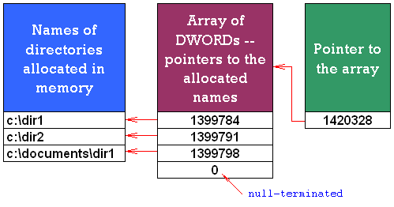

[ Home ](https://github.com/VFPX/Win32API)  

# How to assemble an array of strings and pass it to external function

## Short description:
The PathFindOnPath function is anything but special. Whatever it does, can be accomplished by using FILE() and GETENV() FoxPro functions. Though it gives me a chance to demonstrate a technique of assembling an array of strings for being passed to external function.  
***  


## Before you begin:
The PathFindOnPath function is anything but special. Whatever it does, can be accomplished by using FILE() and GETENV() FoxPro functions. Though it gives me a chance to demonstrate a technique of assembling an array of strings for being passed to external function.  

More comments below the source code.  
  
***  


## Code:
```foxpro  
#DEFINE MAX_PATH 260

DECLARE INTEGER PathFindOnPath IN shlwapi;
	STRING @pszFile, STRING @ppszOtherDirs

LOCAL cFile, oPath1, oPath2, oPath3, cPathArray

* The first parameter is not just a file name to search;
* If the search is successful, this parameter is used
* to return the fully qualified path name.
*
* For that reason it must be long enough to accomodate
* a path of maximum length
cFile = PADR("wininet.dll", MAX_PATH, CHR(0))

* PChar class wraps GlobalAlloc and GlobalFree calls
oPath1 = CREATEOBJECT("PChar", "c:\dir1" + CHR(0))
oPath2 = CREATEOBJECT("PChar", "c:\dir2" + CHR(0))
oPath3 = CREATEOBJECT("PChar", "c:\documents\dir1" + CHR(0))

* the null-terminated array contains three memory addresses
* padded with zero bytes
cPathArray = num2dword(oPath1.GetAddr()) +;
	num2dword(oPath2.GetAddr()) +;
	num2dword(oPath3.GetAddr()) +;
	num2dword(0) + CHR(0)

IF PathFindOnPath(@cFile, @cPathArray) = 0
	? "File not found..."
ELSE
	* at this point cFile contains the fully qualified path
	* padded to MAX_PATH length with zero bytes
	cFile = STRTRAN(cFile, CHR(0), "")
	? cFile
ENDIF
* end of main

FUNCTION num2dword(lnValue)
#DEFINE m0  256
#DEFINE m1  65536
#DEFINE m2  16777216
	IF lnValue < 0
		lnValue = 0x100000000 + lnValue
	ENDIF
	LOCAL b0, b1, b2, b3
	b3 = Int(lnValue/m2)
	b2 = Int((lnValue - b3*m2)/m1)
	b1 = Int((lnValue - b3*m2 - b2*m1)/m0)
	b0 = Mod(lnValue, m0)
RETURN Chr(b0)+Chr(b1)+Chr(b2)+Chr(b3)

DEFINE CLASS PChar As Custom
PROTECTED hMem

PROCEDURE Init(lcString)
	THIS.hMem = 0
	THIS.setValue (lcString)

PROCEDURE Destroy
	THIS.ReleaseString

FUNCTION GetAddr  && returns a pointer to the string
RETURN THIS.hMem

FUNCTION GetValue && returns string value
	LOCAL lnSize, lcBuffer
	lnSize = THIS.getAllocSize()
	lcBuffer = SPACE(lnSize)

	IF THIS.hMem <> 0
		DECLARE RtlMoveMemory IN kernel32 As MemToStr;
			STRING @, INTEGER, INTEGER
		= MemToStr(@lcBuffer, THIS.hMem, lnSize)
	ENDIF
RETURN lcBuffer

FUNCTION GetAllocSize  && returns allocated memory size (string length)
	DECLARE INTEGER GlobalSize IN kernel32 INTEGER hMem
RETURN Iif(THIS.hMem=0, 0, GlobalSize(THIS.hMem))

PROCEDURE SetValue (lcString) && assigns new string value
#DEFINE GMEM_FIXED   0
	THIS.ReleaseString

	DECLARE INTEGER GlobalAlloc IN kernel32 INTEGER, INTEGER
	DECLARE RtlMoveMemory IN kernel32 As StrToMem;
		INTEGER, STRING @, INTEGER

	LOCAL lnSize
	lcString = lcString + Chr(0)
	lnSize = Len(lcString)
	THIS.hMem = GlobalAlloc(GMEM_FIXED, lnSize)
	IF THIS.hMem <> 0
		= StrToMem(THIS.hMem, @lcString, lnSize)
	ENDIF

PROCEDURE ReleaseString  && releases allocated memory
	IF THIS.hMem <> 0
		DECLARE INTEGER GlobalFree IN kernel32 INTEGER
		= GlobalFree (THIS.hMem)
		THIS.hMem = 0
	ENDIF
ENDDEFINE  && pchar  
```  
***  


## Listed functions:
[GlobalAlloc](../libraries/kernel32/GlobalAlloc.md)  
[GlobalFree](../libraries/kernel32/GlobalFree.md)  
[GlobalSize](../libraries/kernel32/GlobalSize.md)  
[PathFindOnPath](../libraries/netapi32/PathFindOnPath.md)  

## Comment:
The second parameter of the PathFindOnPath is a memory address of null-terminated array of pointers to strings. Members of such array must be 4-byte numbers, format called *UINT* or *DWORD*. Each array member is an address of allocated in memory string that contains a directory name.  
  
In this code sample, I want to make this function search for the file in three directories:*<font color=#0000a0>  
c:\dir1  
c:\dir2  
c:\documents\dir1</font>*  
  


As the first step, I use the GlobalAlloc to allocate each directory name in memory. Three GlobalAlloc calls return three memory addresses.  
  
To become a null-terminated array, these memory addresses must be put one after another to a memory buffer and padded by some null characters. As I said, each address must occupy four bytes.  
  
So far these numbers are in FoxPro numeric format. This is something similar to *managed objects* in .Net. Technically I can not say how many bytes each numeric value takes and where exactly it resides in memory.  
  
Somehow I need to convert them to 4-byte DWORDs. Three addresses, as three directories are searched, and five zero bytes, produce the total length of 17 bytes. I use num2dword() function to convert each number to 4-character string, which is the binary character representation of the DWORD format. In VFP9 you probably can use BINTOC() for this conversion.  
  
So now I have created the binary character representation for the array -- a string 17 characters long. I could use the GlobalAlloc again to allocate this string in memory and obtain its address.   
  
But more elegant solution is declaring this parameter as *STRING @* -- a reference to a string, *cPathArray* in the code above. That makes the FoxPro to take care about all memory operations: memory allocation, passing the pointer to the PathFindOnPath and releasing the memory in the end.  
  
*PChar* class hides certain complexity of memory API calls. In particular, it calls the GlobalFree, whenever a PChar instance is destroyed or re-allocated, preventing memory leaks.  
  
***  

