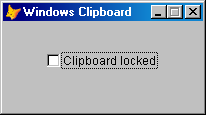

[ Home ](https://github.com/VFPX/Win32API)  

# How to disable the Windows Clipboard (VFP9)

## Short description:
The Windows OS has a mechanism that allows to notify a window when the content of the clipboard changes. Any FoxPro window can be registered as a clipboard viewer. The notifications are actually window messages. And VFP9 handles window messages really good due to extended BINDEVENT() function.  
***  


## Before you begin:

  

This FoxPro form is set to be notified when anything is copied to the clipboard -- text, images etc. And it clears the clipboard content on each notification.   

Neither timers nor ON KEY handlers are involved.  

See also:

* [How to block the PrintScreen key](sample_489.md)  
* [Preventing users from accessing the Windows Desktop and from switching to other applications](sample_492.md)  
* [Capturing keyboard activity of another application using the Raw Input API](sample_572.md)  
* [Monitoring clipboard content changes](sample_601.md)  
* [Enumerating data formats currently available on the clipboard](sample_032.md)  

  
***  


## Code:
```foxpro  
LOCAL obj As Tform
	obj = CREATEOBJECT("Tform")
	obj.Show(1)
* end of main

DEFINE CLASS Tform As Form
	Width=200
	Height=90
	Caption="Windows Clipboard"
	MaxButton=.F.
	BorderStyle=2
	AutoCenter=.T.

	ADD OBJECT ch As CheckBox WITH Left=44, Top=30,;
	AutoSize=.T., BackStyle=0, Caption="Clipboard locked",;
	Value=.F.
	
	ADD OBJECT watch As ClipboardWatch
	
PROCEDURE ch.InteractiveChange
	LOCAL ex As Exception
	
	TRY
		IF THIS.Value
			ThisForm.watch.RegisterWindow(ThisForm.HWnd)
		ELSE
			ThisForm.watch.UnregisterWindow
		ENDIF
	CATCH TO ex
		WAIT WINDOW "Clipboard Chain API call failed " +;
			"with error " + TRANSFORM(ex.ErrorNo) + ": ";
			+ CHR(13) + ex.Message
	ENDTRY

ENDDEFINE

DEFINE CLASS ClipboardWatch As Custom
#DEFINE GWL_WNDPROC -4
#DEFINE WM_CHANGECBCHAIN 0x030D
#DEFINE WM_DRAWCLIPBOARD 0x0308

PROTECTED hWindow, hNextViewer, hOrigProc
	hWindow=0  && target window
	hNextViewer=0  && next window in Clipboard chain
	hOrigProc=0  && ptr to hWindow original window proc

PROCEDURE Init
	THIS.declare

PROCEDURE Destroy
	THIS.UnregisterWindow

PROCEDURE RegisterWindow(hWindow)
	THIS.UnregisterWindow

	THIS.hWindow = m.hWindow
	THIS.ClearClipboard

	* add THIS.hWindow to the chain of clipboard viewers
	THIS.hNextViewer = SetClipboardViewer(THIS.hWindow)
	
	* store the address of the original window procedure
	* for THIS.hWindow
	THIS.hOrigProc = GetWindowLong(THIS.hWindow, GWL_WNDPROC)

	* link two types of window messages received by THIS.hWindow
	* to a method of the ClipboardWatch class
	= BINDEVENT(THIS.hWindow, WM_CHANGECBCHAIN, THIS, "OnMessage")
	= BINDEVENT(THIS.hWindow, WM_DRAWCLIPBOARD, THIS, "OnMessage")

PROCEDURE UnregisterWindow
	IF THIS.hWindow <> 0
		= ChangeClipboardChain(THIS.hWindow, THIS.hNextViewer)
		THIS.hWindow=0
	ENDIF

PROTECTED PROCEDURE ClearClipboard
	_cliptext=""  && that simple

PROTECTED PROCEDURE OnMessage(hWindow as Integer, nMsgID as Integer,;
	wParam as Integer, lParam as Integer)

	* IMHO: m.hWindow and THIS.hWindow at this point
	* must be identical
	
	LOCAL nReturn
	nReturn=0
	
	DO CASE
	CASE nMsgID=WM_CHANGECBCHAIN
	* hWindow receives this notification when a window
	* is being removed from the chain of clipboard viewers
		IF THIS.hNextViewer = m.wParam
			THIS.hNextViewer = m.lParam
		ELSE
			= SendMessage(THIS.hNextViewer,;
				m.nMsgID, m.wParam, m.lParam)
		ENDIF

	CASE nMsgID=WM_DRAWCLIPBOARD
	* hWindow receives this notification when
	* the content of the clipboard changes
		THIS.ClearClipboard

	OTHERWISE
	* pass control to the original window procedure
	* just a precaution; the execution is not supposed to get there
	* unless you add more BINDEVENTS...
		nReturn = CallWindowProc(THIS.hOrigProc, THIS.hWindow,;
			m.nMsgID, m.wParam, m.lParam)
	ENDCASE
RETURN nReturn

PROTECTED PROCEDURE declare

	DECLARE INTEGER SetClipboardViewer IN user32;
		INTEGER hWndNewViewer

	DECLARE INTEGER ChangeClipboardChain IN user32;
		INTEGER hWndRemove, INTEGER hWndNewNext

	DECLARE INTEGER SendMessage IN user32;
		INTEGER hWnd, INTEGER Msg,;
		INTEGER wParam, INTEGER lParam

	DECLARE INTEGER CallWindowProc IN user32;
		INTEGER lpPrevWndFunc, INTEGER hWindow, LONG Msg,;
		INTEGER wParam, INTEGER lParam

	DECLARE INTEGER GetWindowLong IN user32;
		INTEGER hWnd, INTEGER nIndex

ENDDEFINE  
```  
***  


## Listed functions:
[CallWindowProc](../libraries/user32/CallWindowProc.md)  
[ChangeClipboardChain](../libraries/user32/ChangeClipboardChain.md)  
[GetWindowLong](../libraries/user32/GetWindowLong.md)  
[SendMessage](../libraries/user32/SendMessage.md)  
[SetClipboardViewer](../libraries/user32/SetClipboardViewer.md)  

## Comment:
The Windows OS has a mechanism that allows to notify a window when the content of the clipboard changes.   
  
Not just one window can be notified but many. They are organized in a chain. The first window in this chain receives a notification and passes it to the next one, so the notification goes down to the last window registered in this chain.   
  
Any FoxPro window, *the _screen* or a form, can be registered as a Clipboard viewer -- this is how it is called. The notifications are actually window messages. And VFP9 handles window messages really good due to extended BINDEVENT() function.  
  
WM_CHANGECBCHAIN -- this notification is sent after a registered window has been removed from the chain of clipboard viewers.  
  
WM_DRAWCLIPBOARD -- this notification is sent after the content of the clipboard has changed.  
  
***  

