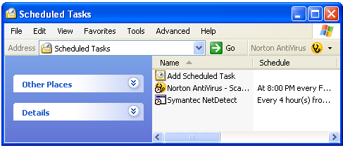
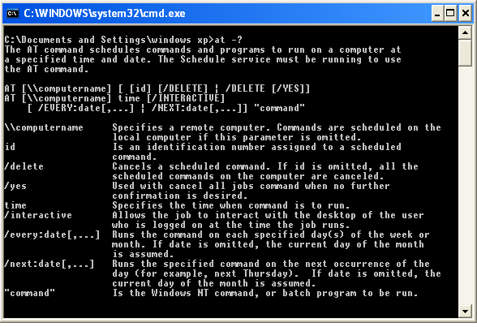

[ Home ](https://github.com/VFPX/Win32API)  

# Adding and deleting Scheduled Tasks using NetScheduleJob API functions

## Short description:
With Scheduled Tasks, you can schedule any script, program, or document to run at a time that is most convenient for you. Scheduled Tasks starts each time you start Windows XP and runs in the background.  
***  


## Before you begin:
With Scheduled Tasks, you can schedule any script, program, or document to run at a time that is most convenient for you. This service starts each time you start Windows and runs in the background.  

  

Four *NetScheduleJob* API calls implement functionality similar to what OS command **AT** gives:  
* Function NetScheduleJobAdd  
* Function NetScheduleJobDel  
* Function NetScheduleJobEnum  
* Function NetScheduleJobGetInfo  

  

  
***  


## Code:
```foxpro  
#DEFINE MAX_PREFERRED_LENGTH -1
#DEFINE JOB_RUN_PERIODICALLY 1
#DEFINE JOB_EXEC_ERROR 2
#DEFINE JOB_RUNS_TODAY 4
#DEFINE JOB_ADD_CURRENT_DATE 8
#DEFINE JOB_NONINTERACTIVE 0x10

DEFINE CLASS NetScheduleJob As Session
PROTECTED collector
	jobid=0
	jobtime=0
	daysofmonth=0
	daysofweek=0
	jobflags=0
	jobcommand=""

PROCEDURE Init(oCollector)
	THIS.collector = m.oCollector
	
PROCEDURE FromString(hBuffer, cBuffer, nIndex)
*!*	typedef struct _AT_ENUM {
*!*	  DWORD JobId;        0:4
*!*	  DWORD_PTR JobTime;  4:4
*!*	  DWORD DaysOfMonth;  8:4
*!*	  UCHAR DaysOfWeek;  12:2 ? 12:1
*!*	  UCHAR Flags;       14:2 ? 13:1
*!*	  LPWSTR Command;    16:4
*!*	} AT_ENUM, *PAT_ENUM, *LPAT_ENUM; 20 bytes
#DEFINE AT_ENUM_SIZE 20

	LOCAL nOffset, nCmdOffset, cCommand, ch
	nOffset = (nIndex-1)*AT_ENUM_SIZE

	THIS.jobid = buf2dword(SUBSTR(cBuffer,nOffset+1,4))
	THIS.jobtime = buf2dword(SUBSTR(cBuffer,nOffset+5,4))
	THIS.daysofmonth = buf2dword(SUBSTR(cBuffer,nOffset+9,4))
	THIS.daysofweek = ASC(SUBSTR(cBuffer,nOffset+13,1))
	THIS.jobflags = ASC(SUBSTR(cBuffer,nOffset+14,2))
	
	cCommand=""
	nCmdOffset = buf2dword(SUBSTR(cBuffer,nOffset+17,4))
	nCmdOffset = nCmdOffset - hBuffer + 1
	
	DO WHILE nCmdOffset <= LEN(cBuffer)
		ch = SUBSTR(cBuffer, nCmdOffset, 2)  && unicode
		IF ch = CHR(0) + CHR(0)
			EXIT
		ENDIF
		cCommand = m.cCommand + m.ch
		nCmdOffset = nCmdOffset + 2
	ENDDO
	THIS.jobcommand = STRCONV(m.cCommand,6)

PROCEDURE SetDOW(nDayMin, nDayMax) && monday=0
	IF VARTYPE(m.nDayMax) <> "N"
		nDayMax = nDayMin
	ENDIF
	LOCAL nIndex
	FOR nIndex=nDayMin TO nDayMax
		THIS.daysofweek = BITSET(THIS.daysofweek, nIndex)
	NEXT

PROCEDURE SetDOM(nDayMin, nDayMax)  && 1..31
	IF VARTYPE(m.nDayMax) <> "N"
		nDayMax = nDayMin
	ENDIF
	LOCAL nIndex
	FOR nIndex=nDayMin-1 TO nDayMax-1  && 0-based
		THIS.daysofmonth = BITSET(THIS.daysofmonth, nIndex)
	NEXT

PROCEDURE SetRunNonInteractive(lSet)
	THIS.SetFlag(JOB_NONINTERACTIVE, m.lSet)

PROCEDURE SetRunPeriodically(lSet)
	THIS.SetFlag(JOB_RUN_PERIODICALLY, m.lSet)

PROCEDURE SetFlag(nFlag As Integer, lSet As Boolean)
	IF m.lSet
		THIS.jobflags = BITOR(THIS.jobflags, m.nFlag)
	ELSE
		THIS.jobflags = BITAND(THIS.jobflags, BITXOR(0xffff,m.nFlag))
	ENDIF
ENDDEFINE

DEFINE CLASS NetScheduleJobs As Collection
PROTECTED servername
	servername=""
	errorcode=0

PROCEDURE Init(cServer)
	IF VARTYPE(m.cServer)="C"
		THIS.servername = m.cServer
	ENDIF
	THIS.declare
	THIS.EnumJobs

PROCEDURE EnumJobs
	DO WHILE THIS.Count > 0
		THIS.Remove(1)
	ENDDO

	LOCAL cServer, hBuffer, nRead, nTotal,;
		nBufsize, cBuffer, nIndex
	STORE 0 TO hBuffer, nRead, nTotal, nBufsize
	cServer = Iif(EMPTY(THIS.servername), Null,;
		STRCONV(THIS.servername+Chr(0), 5))

	THIS.errorcode = NetScheduleJobEnum(cServer, @hBuffer,;
		MAX_PREFERRED_LENGTH, @nRead, @nTotal, 0)

	IF THIS.errorcode <> 0
	* 53=ERROR_BAD_NETPATH
	* 1702=RPC_S_INVALID_BINDING
		RETURN .F.
	ENDIF
	
	= NetApiBufferSize(hBuffer, @nBufsize)
	cBuffer = Repli(Chr(0), nBufsize)
	= CopyMemory(@cBuffer, hBuffer, nBufsize)
	
	FOR nIndex=1 TO nRead
		LOCAL oJob As NetScheduleJob
		oJob = CREATEOBJECT("NetScheduleJob", THIS)
		oJob.FromString(hBuffer, cBuffer, nIndex)
		THIS.Add(m.oJob)
		oJob=Null
	NEXT

	= NetApiBufferFree(hBuffer)

PROCEDURE ZapJobs  && deletes all jobs
	THIS.DeleteJobs(0, -1)

PROCEDURE DeleteJob(oJob As NetScheduleJob)
	THIS.DeleteJobs(oJob.jobid, oJob.jobid)

PROCEDURE DeleteJobs(nJobIdMin, nJobIdMax)
	LOCAL cServer
	cServer = Iif(EMPTY(THIS.servername), Null,;
		STRCONV(THIS.servername+Chr(0), 5))
	THIS.errorcode = NetScheduleJobDel(m.cServer, m.nJobIdMin, m.nJobIdMax)
	IF THIS.errorcode = 0
		THIS.EnumJobs
	ENDIF

PROCEDURE AddJob(oJob As NetScheduleJob) As Boolean
*!*	typedef struct _AT_INFO {
*!*	  DWORD_PTR JobTime; 0:4
*!*	  DWORD DaysOfMonth; 4:4
*!*	  UCHAR DaysOfWeek;  8:2
*!*	  UCHAR Flags;      10:2
*!*	  LPWSTR Command;   12:4
*!*	} AT_INFO, *PAT_INFO, *LPAT_INFO; 16 bytes + command

	LOCAL cServer, oCommand As PChar, cBuffer, nJobId
	cServer = Iif(EMPTY(THIS.servername), Null,;
		STRCONV(THIS.servername+Chr(0), 5))

	WITH oJob
		.jobid=0
		oCommand = CREATEOBJECT("PChar",;
			STRCONV(.jobcommand+CHR(0),5))

		cBuffer = num2dword(.jobtime) +;
			num2dword(.daysofmonth) +;
			Chr(.daysofweek) +;
			Chr(.jobflags) +;
			num2word(0) +;
			num2dword(oCommand.GetAddr())
	ENDWITH
	
	nJobId=0
	THIS.errorcode = NetScheduleJobAdd(m.cServer,;
		@cBuffer, @nJobId)
	
	IF THIS.errorcode <> 0
		RETURN .F.
	ENDIF

	oJob.jobid = m.nJobId
	THIS.EnumJobs
RETURN .T.

PROTECTED PROCEDURE declare
	DECLARE INTEGER NetApiBufferFree IN netapi32 INTEGER Buffer

	DECLARE RtlMoveMemory IN kernel32 As CopyMemory;
		STRING @dst, INTEGER src, INTEGER nLen

	DECLARE INTEGER NetApiBufferSize IN netapi32;
		INTEGER Buffer, INTEGER @ByteCount

	DECLARE SHORT NetScheduleJobEnum IN netapi32;
		STRING Servername, INTEGER @PointerToBuffer,;
		INTEGER PreferredMaximumLength, INTEGER @EntriesRead,;
		INTEGER @TotalEntries, INTEGER ResumeHandle

	DECLARE SHORT NetScheduleJobAdd IN netapi32;
		STRING Servername, STRING @Buffer, INTEGER @JobId

	DECLARE SHORT NetScheduleJobDel IN netapi32;
		STRING Servername, INTEGER MinJobId, INTEGER MaxJobId

ENDDEFINE

**************** library functions ********************
FUNCTION buf2dword(lcBuffer)
RETURN Asc(SUBSTR(lcBuffer, 1,1)) + ;
	BitLShift(Asc(SUBSTR(lcBuffer, 2,1)),  8) +;
	BitLShift(Asc(SUBSTR(lcBuffer, 3,1)), 16) +;
	BitLShift(Asc(SUBSTR(lcBuffer, 4,1)), 24)

FUNCTION buf2word(lcBuffer)
RETURN Asc(SUBSTR(lcBuffer, 1,1)) + ;
       Asc(SUBSTR(lcBuffer, 2,1)) * 256

FUNCTION num2dword(lnValue)
#DEFINE m0  256
#DEFINE m1  65536
#DEFINE m2  16777216
	IF lnValue < 0
		lnValue = 0x100000000 + lnValue
	ENDIF
	LOCAL b0, b1, b2, b3
	b3 = Int(lnValue/m2)
	b2 = Int((lnValue - b3*m2)/m1)
	b1 = Int((lnValue - b3*m2 - b2*m1)/m0)
	b0 = Mod(lnValue, m0)
RETURN Chr(b0)+Chr(b1)+Chr(b2)+Chr(b3)

FUNCTION num2word(lnValue)
RETURN Chr(MOD(m.lnValue,256)) + CHR(INT(m.lnValue/256))

DEFINE CLASS PChar As Custom
PROTECTED hMem

PROCEDURE Init(lcString)
	THIS.hMem = 0
	THIS.setValue (lcString)

PROCEDURE Destroy
	THIS.ReleaseString

FUNCTION GetAddr  && returns a pointer to the string
RETURN THIS.hMem

FUNCTION GetValue && returns string value
	LOCAL lnSize, lcBuffer
	lnSize = THIS.getAllocSize()
	lcBuffer = SPACE(lnSize)

	IF THIS.hMem <> 0
		DECLARE RtlMoveMemory IN kernel32 As MemToStr;
			STRING @, INTEGER, INTEGER
		= MemToStr(@lcBuffer, THIS.hMem, lnSize)
	ENDIF
RETURN lcBuffer

FUNCTION GetAllocSize  && returns allocated memory size (string length)
	DECLARE INTEGER GlobalSize IN kernel32 INTEGER hMem
RETURN Iif(THIS.hMem=0, 0, GlobalSize(THIS.hMem))

PROCEDURE SetValue (lcString) && assigns new string value
#DEFINE GMEM_FIXED   0
	THIS.ReleaseString

	DECLARE INTEGER GlobalAlloc IN kernel32 INTEGER, INTEGER
	DECLARE RtlMoveMemory IN kernel32 As StrToMem;
		INTEGER, STRING @, INTEGER

	LOCAL lnSize
	lcString = lcString + Chr(0)
	lnSize = Len(lcString)
	THIS.hMem = GlobalAlloc(GMEM_FIXED, lnSize)
	IF THIS.hMem <> 0
		= StrToMem(THIS.hMem, @lcString, lnSize)
	ENDIF

PROCEDURE ReleaseString  && releases allocated memory
	IF THIS.hMem <> 0
		DECLARE INTEGER GlobalFree IN kernel32 INTEGER
		= GlobalFree (THIS.hMem)
		THIS.hMem = 0
	ENDIF
ENDDEFINE  && pchar  
```  
***  


## Listed functions:
[GlobalAlloc](../libraries/kernel32/GlobalAlloc.md)  
[GlobalFree](../libraries/kernel32/GlobalFree.md)  
[GlobalSize](../libraries/kernel32/GlobalSize.md)  
[NetApiBufferFree](../libraries/netapi32/NetApiBufferFree.md)  
[NetApiBufferSize](../libraries/netapi32/NetApiBufferSize.md)  
[NetScheduleJobAdd](../libraries/netapi32/NetScheduleJobAdd.md)  
[NetScheduleJobDel](../libraries/netapi32/NetScheduleJobDel.md)  
[NetScheduleJobEnum](../libraries/netapi32/NetScheduleJobEnum.md)  

## Comment:
Use the following code to test NetScheduleJobs and NetScheduleJob classes:  
  
```foxpro
LOCAL oJobs As NetScheduleJobs, oJob As NetScheduleJob  
oJobs = CREATEOBJECT("NetScheduleJobs")  
  
oJob = CREATEOBJECT("NetScheduleJob")  
WITH oJob
*	.jobtime = 9.5 * 3600 * 1000  && 09:30 AM  
*	.SetDOM(5, 20)  && payroll days :)  
*	.SetDOW(0, 3)  && Monday to Thursday<font color=#0000a0>  
	.jobtime = (60 + VAL(SYS(2))) * 1000 && now + 1 minute  
	.jobcommand = "notepad.exe"  
ENDWITH  
  
IF NOT oJobs.AddJob(oJob)  
	? "Error:", oJobs.errorcode  
ENDIF  
  
FOR EACH oJob IN oJobs  
	WITH oJob  
		? "ID=" + TRANSFORM(.jobid) + ", " +;  
			.jobcommand  
	ENDWITH  
NEXT
```

***  

