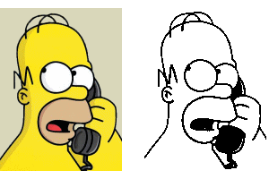

[ Home ](https://github.com/VFPX/Win32API)  

# How to convert a bitmap file to monochrome format (1 bpp)

## Short description:
It all started with a question I have noticed in the Universal Thread Visual FoxPro forum:*Does anyone know how to create a monochrome bitmap or monochrome tiff file from a VFP report? *
  
***  


## Before you begin:
It all started with a question a developer posted in the Universal Thread Visual FoxPro forum:

<*Does anyone know how to create a monochrome bitmap or monochrome tiff file from a VFP report?   
<...  
<I need to automate the process. We are using this for a faxing application and it must work in a multi-user environment*

Well, there is ReportListener object in VFP9 that can solve at least a part of this task. Its *OutputPage* method can render the output of a report to a bitmap file. The code is very simple (requires VFP9):  

```foxpro
LOCAL oListener As ReportListener, nPageIndex  
oListener = CREATEOBJECT("ReportListener")  
oListener.ListenerType=3  && renders all pages at once  

* make sure the report can load and run  
REPORT FORM MyReport PREVIEW OBJECT oListener  

FOR nPageIndex=1 TO oListener.PageTotal  
	cOutputFile = "tmp"+TRANS(nPageIndex)+".bmp"  
	oListener.OutputPage(nPageIndex,;  
		cOutputFile, 105, 0,0,768,1024)  && 105=bitmap
NEXT
```

I run the code and voila! It created one bitmap file for each page of my report. But the output files were nothing but small: 32 bits per pixel, 3.28 MB each. Still I was half way through.  

Then I spent some time in Visual FoxPro trying in vain to convert bitmaps to monochromes using GDI+ API along with several GDI calls like CreateCompatibleBitmap, BitBlt and so on. The GdipGetImageGraphicsContext absolutely refused to accept monochrome HBITMAP handles.  

After that I tried to find a solution using C# .NET, any solution at all. The *Bitmap* object did not help either. It failed to Clone to the PixelFormat.Format1bppIndexed, each time producing the System.OutOfMemoryException. That appeared consistent with GpStatus=3 returned by the GdipGetImageGraphicsContext function in my VFP tests.  

Finally I gave up on GDI+ and switched to good old GDI API calls. And they worked perfectly, credits to the LoadImage for doing the actual conversion.  
  
  
***  


## Code:
```foxpro  
PROCEDURE SaveBitmapAsMonochrome
PARAMETERS cSrcFile, cDstFile

	DO declare

	PRIVATE hBitmap, nWidth, nHeight, hMemDC
	STORE 0 TO hBitmap, nWidth, nHeight

	IF LoadSourceBitmap()
		hMemDC = CreateCompatibleDC(0)
		= SelectObject(hMemDC, hBitmap)

		DO SaveBitmapToFile

		= DeleteObject(hBitmap)
		= DeleteDC(hMemDC)
	ENDIF

PROCEDURE LoadSourceBitmap
#DEFINE IMAGE_BITMAP 0
#DEFINE LR_LOADFROMFILE 16
#DEFINE LR_MONOCHROME 1
#DEFINE BITMAP_STRU_SIZE 24

	hBitmap = LoadImage(0, cSrcFile, IMAGE_BITMAP,;
		0,0, LR_LOADFROMFILE+LR_MONOCHROME)

	IF hBitmap = 0
		RETURN .F.
	ELSE
		LOCAL cBuffer
		cBuffer = REPLICATE(CHR(0), BITMAP_STRU_SIZE)
		= GetObjectA(hBitmap, BITMAP_STRU_SIZE, @cBuffer)
		nWidth  = buf2dword(SUBSTR(cBuffer, 5,4))
		nHeight = buf2dword(SUBSTR(cBuffer, 9,4))
	ENDIF

PROCEDURE SaveBitmapToFile
* saves memory bitmap to monochrome file
#DEFINE BITMAPFILE_PREFIX "BM"
#DEFINE BITMAPFILEHEADER_SIZE 14
#DEFINE BITMAPINFOHEADER_SIZE 40
#DEFINE MCHR_PLANES 1
#DEFINE MCHR_BITSPERPIXEL 1
#DEFINE MCHR_COMPRESSION 0
#DEFINE MCHR_XYRES 0
#DEFINE MCHR_CLRUSED 0
#DEFINE MCHR_CLRIMPORTANT 0
#DEFINE MCHR_PALETTE REPLICATE(CHR(0),4) +;
		REPLICATE(CHR(255),3) + CHR(0)
#DEFINE MCHR_OFFSETTODATA BITMAPFILEHEADER_SIZE +;
		BITMAPINFOHEADER_SIZE + LEN(MCHR_PALETTE)
#DEFINE GENERIC_WRITE 0x40000000
#DEFINE FILE_SHARE_WRITE 2
#DEFINE CREATE_ALWAYS 2
#DEFINE FILE_ATTRIBUTE_NORMAL 0x0080

	LOCAL nBytesPerScan, nBitmapDataSize, cBIHeader,;
		nFileSize, cBFHeader, nResult

	* calculate bytes per scan line value
	nBytesPerScan = nWidth * MCHR_BITSPERPIXEL/8
	IF INT(nBytesPerScan) < nBytesPerScan
		nBytesPerScan = INT(nBytesPerScan) + 1
	ENDIF

	* round to the next 4-byte boundary
	IF MOD(nBytesPerScan, 4) <> 0
		nBytesPerScan = nBytesPerScan + 4 - MOD(nBytesPerScan, 4)
	ENDIF
	
	* calculate bitmap binary data size
	nBitmapDataSize = nHeight * nBytesPerScan

	* populate BITMAPINFOHEADER structure
	cBIHeader = num2dword(BITMAPINFOHEADER_SIZE) +;
		num2dword(nWidth) + num2dword(nHeight) +;
		num2word(MCHR_PLANES) + num2word(MCHR_BITSPERPIXEL) +;
		num2dword(MCHR_COMPRESSION) +;
		num2dword(nBitmapDataSize) +;
		num2dword(MCHR_XYRES) + num2dword(MCHR_XYRES) +;
		num2dword(MCHR_CLRUSED) + num2dword(MCHR_CLRIMPORTANT)

	* retrieve bitmap binary data
	hBitmapData = GlobalAlloc(0, nBitmapDataSize)
	= ZeroMemory(hBitmapData, nBitmapDataSize)
	nResult = GetDIBits(hMemDC, hBitmap, 0, nHeight,;
		hBitmapData, @cBIHeader, 1)

	nFileSize = MCHR_OFFSETTODATA + nBitmapDataSize
	
	* populate BITMAPFILEHEADER structure
	cBFHeader = BITMAPFILE_PREFIX + num2dword(nFileSize) +;
		num2dword(0) + num2dword(MCHR_OFFSETTODATA)

	hFile = CreateFile(m.cDstFile, GENERIC_WRITE, FILE_SHARE_WRITE,;
		0, CREATE_ALWAYS, FILE_ATTRIBUTE_NORMAL, 0)

	IF hFile <> -1
		TRY
			DECLARE INTEGER WriteFile IN kernel32;
				INTEGER hFile, STRING @lpBuffer, INTEGER nBt2Write,;
				INTEGER @lpBtWritten, INTEGER lpOverlapped

			= WriteFile(hFile, cBFHeader, LEN(cBFHeader), 0,0)
			= WriteFile(hFile, cBIHeader, LEN(cBIHeader), 0,0)
			= WriteFile(hFile, MCHR_PALETTE, LEN(MCHR_PALETTE), 0,0)

			DECLARE INTEGER WriteFile IN kernel32;
				INTEGER hFile, INTEGER lpBuffer, INTEGER nBt2Write,;
				INTEGER @lpBtWritten, INTEGER lpOverlapped

			= WriteFile(hFile, hBitmapData, nBitmapDataSize, 0,0)
		CATCH
		FINALLY
			= CloseHandle(hFile)
		ENDTRY
	ENDIF
	= GlobalFree(hBitmapData)

PROCEDURE declare
	DECLARE INTEGER CreateCompatibleDC IN gdi32 INTEGER hdc
	DECLARE INTEGER DeleteDC IN gdi32 INTEGER hdc
	DECLARE INTEGER DeleteObject IN gdi32 INTEGER hObject
	DECLARE INTEGER SelectObject IN gdi32 INTEGER hdc, INTEGER hObject
	DECLARE INTEGER GlobalAlloc IN kernel32 INTEGER wFlags, INTEGER dwBytes
	DECLARE RtlZeroMemory IN kernel32 As ZeroMemory INTEGER dst, INTEGER nBytes
	DECLARE INTEGER GlobalFree IN kernel32 INTEGER hMem
	DECLARE INTEGER CloseHandle IN kernel32 INTEGER hObject

	DECLARE INTEGER LoadImage IN user32;
		INTEGER hinst, STRING lpszName, INTEGER uType,;
		INTEGER cxDesired, INTEGER cyDesired, INTEGER fuLoad

	DECLARE INTEGER GetDIBits IN gdi32;
		INTEGER hdc, INTEGER hbmp, INTEGER uStartScan,;
		INTEGER cScanLines, INTEGER lpvBits, STRING @lpbi, INTEGER uUsage

	DECLARE INTEGER CreateFile IN kernel32;
		STRING lpFileName, INTEGER dwDesAccess, INTEGER dwShareMode,;
		INTEGER lpSecurAttr, INTEGER dwCreatDisp, INTEGER dwFlagsAndAttrs,;
		INTEGER hTemplateFile

	DECLARE INTEGER GetObject IN gdi32 AS GetObjectA;
		INTEGER hgdiobj, INTEGER cbBuffer, STRING @lpvObject

FUNCTION buf2dword(lcBuffer)
RETURN Asc(SUBSTR(lcBuffer, 1,1)) + ;
	BitLShift(Asc(SUBSTR(lcBuffer, 2,1)),  8) +;
	BitLShift(Asc(SUBSTR(lcBuffer, 3,1)), 16) +;
	BitLShift(Asc(SUBSTR(lcBuffer, 4,1)), 24)

FUNCTION num2dword(lnValue)
#DEFINE m0  256
#DEFINE m1  65536
#DEFINE m2  16777216
	IF lnValue < 0
		lnValue = 0x100000000 + lnValue
	ENDIF
	LOCAL b0, b1, b2, b3
	b3 = Int(lnValue/m2)
	b2 = Int((lnValue - b3*m2)/m1)
	b1 = Int((lnValue - b3*m2 - b2*m1)/m0)
	b0 = Mod(lnValue, m0)
RETURN Chr(b0)+Chr(b1)+Chr(b2)+Chr(b3)

FUNCTION num2word(lnValue)
RETURN Chr(MOD(m.lnValue,256)) + CHR(INT(m.lnValue/256))  
```  
***  


## Listed functions:
[CloseHandle](../libraries/kernel32/CloseHandle.md)  
[CreateCompatibleDC](../libraries/gdi32/CreateCompatibleDC.md)  
[CreateFile](../libraries/kernel32/CreateFile.md)  
[DeleteDC](../libraries/gdi32/DeleteDC.md)  
[DeleteObject](../libraries/gdi32/DeleteObject.md)  
[GetDIBits](../libraries/gdi32/GetDIBits.md)  
[GetObject](../libraries/gdi32/GetObject.md)  
[GlobalAlloc](../libraries/kernel32/GlobalAlloc.md)  
[GlobalFree](../libraries/kernel32/GlobalFree.md)  
[LoadImage](../libraries/user32/LoadImage.md)  
[SelectObject](../libraries/gdi32/SelectObject.md)  
[WriteFile](../libraries/kernel32/WriteFile.md)  
[ZeroMemory](../libraries/kernel32/ZeroMemory.md)  

## Comment:
The code above implements:  

```foxpro
PROCEDURE SaveBitmapAsMonochrome(srcfile As String, dstfile As String)
```

To create HBITMAP from a bitmap file I use the LoadImage with LR_LOADFROMFILE and LR_MONOCHROME flags. This way, it takes care of all color-to-monochrome mumbo-jumbos, which fact I am very happy with.  
  
The source HBITMAP is selected into a memory device context. Then both of them are passed to the SaveBitmapToFile procedure.  
  
The procedure is a bit hard-coded, which means it produces monochrome bitmap files only. It creates BITMAPINFOHEADER and BITMAPFILEHEADER structures, extracts bitmap binary data using the GetDIBits function and then saves everything to a file.  
  
* * *  
The writing and reading from temporary file makes the C# code noticeably slow on large files, which appears to be an unavoidable pay-off for the utter simplicity of this approach.  
  
***  

